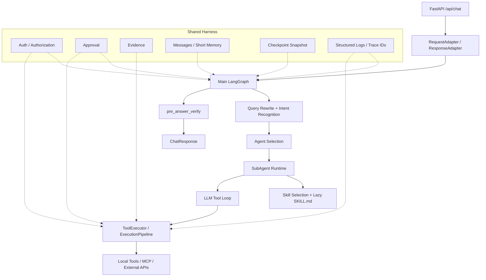
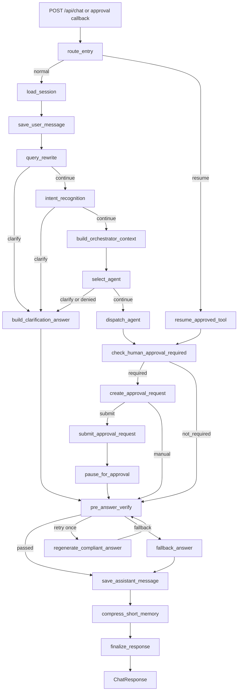
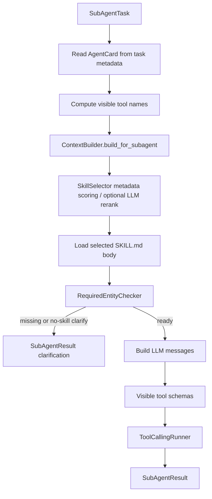
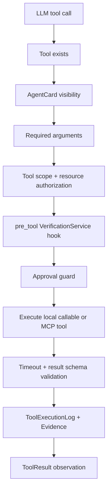

# 健康险个险 Multi-Agent Agent Harness

本项目是面向健康险个险业务的 Multi-Agent / Agent Harness 平台。它可以本地运行、测试和继续向生产演进，但它不是单纯聊天机器人：系统通过确定性主流程、专业子 Agent、动态工具调用、安全校验和状态持久化来完成业务任务。

当前主场景包括问题排查和保全实时查询。业务能力由 `AgentCard`、`Skill`、`ToolDefinition` 和配置化 taxonomy 共同约束，LLM 负责语义判断和自然语言推理，代码负责权限、工具执行、审批、验证和持久化边界。

## 项目要解决的问题

健康险个险业务里，简单单 Prompt 或单 LLM 很容易失控：

| 问题 | 本项目的处理方式 |
| --- | --- |
| 不同业务需要不同知识、工具和权限 | MainGraph 先理解任务，再把任务交给专业子 Agent |
| 用户会追问、补充实体或引用历史上下文 | Query Rewrite 使用实体抽取、会话窗口和 LLM/规则把问题改写为自包含请求 |
| 复杂任务需要多轮查询和工具调用 | 子 Agent 内部使用 ToolCallingRunner 做 LLM tool loop |
| 写操作不能由 LLM 直接执行 | ToolExecutor 在真正执行前做参数、权限、验证和审批检查 |
| 最终回答要脱敏、可验证、可追溯 | pre_answer_verify、MessageStore、ToolExecutionLog、Evidence、Checkpoint 共同记录运行过程 |

项目的核心分工是：

```text
MainGraph 控制请求生命周期
SubAgent 负责专业业务执行
Skill 提供业务 SOP 和工具使用指导
Tool 提供真实查询或操作能力
Authorization / Approval / Verification 构成安全边界
```

## 核心设计思想

### 1. 确定性 Workflow + 动态 Agent Tool Loop

外层 `MainGraph` 是固定的 LangGraph StateGraph，保证请求必须经过会话加载、查询改写、意图识别、Agent 路由、执行、审批判断、最终验证和落库。

子 Agent 内部不是写死流程，而是让 LLM 在受限工具集合里决定下一步。这样既保留业务系统必须有的确定性边界，又允许 Agent 在工具结果不足时继续查询、补充判断或停止。

### 2. Agent 是执行边界

`AgentCard` 描述一个子 Agent 能做什么、能看到什么和被谁调用。当前卡片位于 `app/agents/cards/*.yaml`，主要字段包括：

| 字段 | 作用 |
| --- | --- |
| `supported_routes` | 声明可处理的 intent/sub_intent |
| `capabilities` | 语义能力画像，辅助匹配和打分 |
| `required_entities` / `optional_entities` | Agent 级实体信号 |
| `private_tools` / `public_tools_allowed` / `mcp_tools` | 工具可见性边界 |
| `skills` | 该 Agent 可使用的 Skill 列表 |
| `rag_namespaces` | 子 Agent 检索知识时可用的 namespace |
| `memory_policy` | 子 Agent 接收多少历史摘要和最近消息 |
| `access_policy` | Agent 级角色、scope、机构和数据权限约束 |

AgentCard 不是 Prompt 文本，它是主流程选择和安全控制的结构化契约。

### 3. Skill 是业务 SOP

Skill 不是工具，也不是独立 Agent。它是一个业务处理 SOP，当前以 `app/skills/<agent>/<skill>/SKILL.md` 保存。

系统启动和选择阶段只读取 Skill frontmatter metadata，例如 `intent`、`sub_intents`、`required_entities`、`private_tools`、`routing_keywords`。只有选中某个 Skill 后，才加载完整 `SKILL.md` 内容放进子 Agent 上下文。

这样做是渐进式披露：避免把所有 Skill 正文一次性塞给 LLM，同时仍让选中的业务 SOP 能指导工具调用和回答结构。

### 4. Tool 是可执行能力

Tool 是真实 API、查询、通知或受限本地能力。LLM 只能提出工具调用请求，不能直接执行工具。

`ToolExecutor` 才是执行边界。它会检查工具是否存在、当前 Agent 是否可见、参数是否满足 schema、用户是否有权限、是否需要审批、调用是否超时、结果是否满足契约，然后才返回标准 `ToolResult`。

### 5. LLM 与规则的职责边界

LLM 适合做：

- 查询改写和指代理解；
- 意图、Agent、Skill 候选中的语义判断；
- Tool Loop 中判断下一步是否需要调用工具；
- 根据工具 observation 生成自然语言答案。

确定性代码负责做：

- intent taxonomy 和 sub_intent 值域约束；
- 实体正则提取、别名归一、冲突处理；
- AgentCard、Skill、ToolDefinition schema 校验；
- Agent 和 Tool 权限；
- 工具参数校验、超时、结果 schema 校验；
- 写操作审批和审批恢复；
- 幂等重放保护；
- 敏感信息处理、最终 Verification；
- SQLite 持久化和运行时日志。

规则不是只在 LLM 失败时才出现。实体抽取、taxonomy 校验、工具授权、审批和 Verification 都是主流程必须执行的代码边界；Query Rewrite、Intent、Agent/Skill 选择里也有 LLM 不可用或输出非法时的 fallback。

## 系统架构总览



| 层次 | 主要职责 | 代表模块 |
| --- | --- | --- |
| API / Adapter | 接收请求、提取身份、生成 request_id/trace_id/session_key、返回精简响应 | `app/main.py`, `app/adapters/` |
| Main LangGraph | 固定请求生命周期和分支控制 | `app/runtime/graph.py`, `app/runtime/orchestrator.py` |
| Query Understanding | 会话加载、查询改写、实体解析、意图识别 | `app/query/`, `app/schemas/entities.py` |
| Agent Routing | 根据 taxonomy、AgentCard 和实体选择子 Agent | `app/agents/` |
| SubAgent Runtime | 构建子 Agent 上下文、选择 Skill、执行 Tool Loop | `app/subagents/`, `app/runtime/context_builder.py` |
| Tool Harness | 工具注册、可见性、参数、权限、审批、执行、日志 | `app/tools/` |
| Safety Harness | 授权、审批、最终验证、证据、状态持久化和日志 | `app/auth/`, `app/approval/`, `app/verification/`, `app/evidence/`, `app/storage/` |

## 一次请求的完整调用链

当前 `StateGraph` 入口是 `route_entry`。普通请求和审批恢复请求走不同入口，但最终都会进入审批判断和最终验证。



主要路径如下：

| 路径 | 发生条件 | 当前行为 |
| --- | --- | --- |
| 正常业务请求 | Query Rewrite、Intent、Agent 选择均可继续 | 进入 `dispatch_agent`，子 Agent 执行 Tool Loop，再进入审批判断和最终验证 |
| Query Rewrite 澄清 | 当前轮是模糊追问、历史候选冲突或缺少待补实体 | `build_clarification_answer` 生成澄清问题，并继续走 `pre_answer_verify` |
| Intent 澄清 | intent 为 unknown 或置信度不足 | 同样进入澄清回答和最终验证 |
| Agent 无法选择或无权限 | AgentCard 候选不足、低分，或 `AuthorizationService` 拒绝 | 返回澄清或权限说明，不进入子 Agent 执行 |
| 写工具审批 | ToolExecutor 返回 `human_approval_required` | 主图创建审批记录、提交审批、返回 pending 答案 |
| 审批回调恢复 | `/api/approval/callback` 收到 approved | 从 ApprovalStore 的 resume state 恢复，执行已批准工具，再继续 Tool Loop |
| Verification retry/fallback | 最终回答被 verifier 标记 retry/block | retry 时生成固定安全摘要再验证一次；失败则使用固定 fallback 文案 |

当前实现没有使用 LangGraph 原生 `interrupt()`。审批中断是通过 ToolCallingRunner 的 pending 信息、ApprovalStore 的 `resume_state` 和 `AgentOrchestrator.resume_after_approval()` 实现的 callback 恢复。

## MainGraph 分阶段说明

| 阶段 | 节点 | 做什么 | 为什么需要 | 主要输出 |
| --- | --- | --- | --- | --- |
| 请求接入与恢复 | `route_entry` | 判断普通请求还是审批恢复 | 恢复请求不能重复从头保存用户消息和重做理解 | `graph_path` |
| 会话上下文 | `load_session` | 读取最近消息和 short summary | Query Rewrite 需要历史上下文判断追问和补参 | `recent_messages`, `short_summary` |
| 消息落库 | `save_user_message` | 保存当前用户消息 | 保留完整会话历史，供后续轮次使用 | messages 表新增 user |
| 问题理解 | `query_rewrite` | 实体抽取、上下文继承、问题改写 | 把依赖上下文的问题变成自包含请求 | `rewritten_query`, `entities`, `entity_bag`, `conversation_window` |
| 意图识别 | `intent_recognition` | 识别 intent/sub_intent | 只判断业务意图，不选择 Agent 或工具 | `intent`, `sub_intent`, `confidence` |
| 澄清回答 | `build_clarification_answer` | 生成澄清问题 | 任何上游阶段都能统一进入澄清出口 | `answer` |
| 主上下文 | `build_orchestrator_context` | 构建结构化父级上下文 | 后续路由和子 Agent 不再重复读库和拼上下文 | `orchestrator_context` |
| Agent 路由 | `select_agent` | 从 AgentCard 候选中选子 Agent | Agent 是业务执行边界 | `selected_agent`, `agent_selection_summary` |
| 子 Agent 执行 | `dispatch_agent` | 封装任务并调用子 Agent | 主流程与子 Agent 之间需要稳定任务协议 | `subagent_result`, `answer` |
| 审批判断 | `check_human_approval_required` | 判断 Tool Loop 是否触发写审批 | 写操作不能直接对外宣称已执行 | `approval_required`, `approval_payloads` |
| 审批创建 | `create_approval_request` | 创建审批台账和 resume state | callback 后需要知道从哪里继续 | `approval_id`, `approval_status` |
| 审批提交 | `submit_approval_request` | 提交外部审批系统或本地 accepted pending | 审批系统是外部边界 | `approval_submit_result` |
| 审批等待 | `pause_for_approval` | 返回 pending 文案 | 告诉用户操作尚未执行 | `answer`, `approval_status` |
| 最终验证 | `pre_answer_verify` | 出口前合规和数据权限验证 | 所有回答必须经过服务端检查 | `pre_answer_verification_result`, `answer` |
| 安全重写 | `regenerate_compliant_answer` | 生成固定安全摘要后重试验证 | 当前不是语义修复，只是保守安全文案 | `answer`, `retry_count` |
| 安全兜底 | `fallback_answer` | 最终拦截文案 | Verification 无法通过时 fail closed | `answer` |
| 回答落库 | `save_assistant_message` | 保存最终 assistant 消息及元数据 | 支持后续上下文和审计 | messages 表新增 assistant |
| 记忆压缩 | `compress_short_memory` | 更新 short summary | 长会话不能只依赖最近消息 | `short_term_memory` |
| 响应完成 | `finalize_response` | 写最终日志并结束图 | 标记完整 graph_path | `ChatResponse` |

### 请求入口与 RequestAdapter

职责：把外部 `ChatRequest` 转换成内部 `InboundMessage`。

为什么这样设计：用户请求体里的 `tenant_id/user_id` 不能直接等同可信身份，可信身份应该来自网关、JWT 或开发可信 header。RequestAdapter 把业务消息和可信身份拆开处理。

具体机制：

- `/api/chat` 接收 `ChatRequest`，取最后一条 user 消息作为 `original_query`。
- `get_current_principal()` 从开发 header 构造 `Principal`，支持 `X-Tenant-Id`、`X-User-Id`、`X-User-Scopes` 等。
- 本地开发默认允许 body fallback；关闭后必须提供可信 principal。
- 生成 `request_id=req_*`、`trace_id=trace_*`。
- 生成 `session_key={tenant_id}:{channel}:{user_id}:{session_id}`，用于消息、记忆和 checkpoint 隔离。

主要输出：`InboundMessage`，包含身份、会话、原始问题和 `auth_context`。

### route_entry 与恢复路由

职责：区分普通请求和审批恢复请求。

为什么这样设计：审批 callback 恢复时，不能重新保存用户消息、重新做 Query Rewrite、重新选择 Agent，否则会重复执行前半段流程。

具体机制：

- `RoutePolicy.route_entry()` 判断 `approval_resume`。
- 普通请求进入 `load_session`。
- 审批恢复进入 `resume_approved_tool`。
- 当前恢复不是 LangGraph 原生 interrupt，而是由 ApprovalStore 保存的 resume state 重建 Graph state。

### load_session 和消息保存

职责：加载最近消息、短期摘要，并保存当前用户消息。

为什么这样设计：Query Rewrite 需要知道上一轮是否是澄清、用户是否在追问、历史中是否有唯一高置信实体。

具体机制：

- `SessionManager.load_session()` 从 SQLite `messages` 表读取最近 60 条消息。
- `message_metadata_sanitizer` 会清理运行时不需要的大字段元数据。
- `ShortTermMemoryManager.get_summary()` 读取 `short_term_memory.summary`。
- `save_user_message` 只保存当前原始用户问题和基础 metadata。

用户消息和 Graph checkpoint 不是一回事：messages 是会话历史，checkpoint snapshot 是请求级最终状态快照。

### query_rewrite

职责：把依赖上下文的用户输入改写成明确、自包含的业务请求。

为什么这样设计：后续意图识别、Agent 选择和工具调用不能依赖“这个”“继续”“刚才那个”等模糊指代。

具体机制：

- 使用 `EntityExtractor` 从当前 query 抽取确定性实体。
- 从 short summary 和最近消息中抽取历史实体候选。
- 使用 `EntityResolver` 归一别名、过滤低质实体、处理覆盖和冲突。
- 构造 `ConversationWindow`，包含 summary、recent_turns 和实体候选。
- 优先尝试 LLM JSON 改写；Internal provider 未配置 base_url 时不会走 LLM JSON。
- LLM 输出必须满足 `QueryRewriteLLMOutput`，非法时进入规则 fallback。
- 规则 fallback 能识别 `direct`、`contextual_follow_up`、`clarification_reply`、`new_request` 和 `clarification_required`。
- 历史实体只有唯一且高置信时才继承；多个候选且需要继承时触发澄清。

主要输入：`original_query`、`recent_messages`、`short_summary`、`session_key`。

主要输出：

| 字段 | 含义 |
| --- | --- |
| `rewritten_query` | 给后续节点使用的自包含问题 |
| `entity_bag` | canonical 内部实体状态 |
| `entities` | `entity_bag.to_compact_dict()` 的兼容投影 |
| `conversation_window` | 本轮查询理解使用的会话窗口 |
| `inherited_entities` | 本轮从历史继承的实体 |
| `need_clarification` | 是否需要先问用户补充 |

`entities` 不是另一份独立事实来源。当前 Graph 通过 `build_entity_state_updates()` 同步更新 `entity_bag` 和 `entities`。

### intent_recognition

职责：识别业务 intent 和 sub_intent，但不选择 Agent、Skill 或工具。

为什么这样设计：意图分类是业务语义判断，Agent 路由是执行边界判断，两者分开后更容易约束合法值和排查错误。

具体机制：

- 主要使用 `rewritten_query` 和 resolved `entities/entity_bag`。
- `original_query` 只作为辅助审计和原始表达参考。
- 合法 intent/sub_intent 来自 `app/config/intent_taxonomy.yaml`。
- prompt 会传入 taxonomy、allowed intents、candidate sub intents 和 AgentCard 摘要。
- LLM 输出必须满足 `IntentRecognitionLLMOutput`。
- LLM 给出的 `entities` 只是候选 echo，当前节点不会把它写入 canonical `entity_bag`。
- LLM 不可用或输出非法时，使用 `app/query/intent_fallback_policy.yaml` 做规则 fallback。

当前边界：Intent Recognition 不负责实体新增、继承、覆盖或工具选择。

### build_orchestrator_context

职责：形成主 Agent 后续运行所需的结构化父级上下文。

为什么这样设计：后续 Agent 选择和子 Agent 执行都需要同一份经过理解后的上下文，避免每个节点各自重新读库、重新拼 Prompt 或重新解析实体。

当前真实字段包括：

- `original_query`
- `rewritten_query`
- `intent`
- `sub_intent`
- `entities`
- `entity_bag`
- `conversation_window`
- `session_key`
- 最近 10 条 runtime message
- `short_summary`
- `available_subagents`
- `lightweight_knowledge_hints`
- `auth_context`

当前 `orchestrator_context` 不包含完整工具列表。工具可见性在子 Agent 内根据 AgentCard 和 ToolRegistry 再计算。

### discover、select、assemble、dispatch 的当前关系

当前 `StateGraph` 没有独立的 `discover_agents` 和 `assemble_task` 节点，但这两个概念仍能在代码中找到对应职责：

| 概念 | 当前实现位置 | 说明 |
| --- | --- | --- |
| Agent discovery | `build_orchestrator_context` + `SubAgentManager.list_agents()` + `AgentCardLoader.list_available_agents()` | 记录代码中注册的子 Agent，并让 AgentSelectionNode 从 enabled AgentCard 中召回候选 |
| Agent selection | `select_agent` 节点 | 规则 Top-K 召回，必要时 LLM router rerank，再做 Agent access check |
| Task assembly | `dispatch_agent` 节点内部调用 `AgentTaskAssembler.assemble()` | 把父级上下文、实体、selected AgentCard 封装为 `AgentTaskEnvelope` |
| Dispatch | `DispatchAgentNode.dispatch()` | 把 envelope 转为 `SubAgentTask`，通过 `SubAgentManager.call_subagent()` 调用具体子 Agent |

`select_agent` 只决定“交给谁”。`dispatch_agent` 才开始“让谁执行”。

### select_agent

职责：从 AgentCard 候选中选择本次任务的子 Agent。

为什么这样设计：子 Agent 是执行边界。选择 Agent 之前，系统只是在理解业务问题；选择后才进入某个专业 Agent 的 Skill 和工具空间。

具体机制：

- `AgentCardLoader.match_candidates()` 根据 intent、sub_intent、entities、capabilities、examples、keywords 和 enabled 状态打分。
- 规则高置信且分差足够时直接选择。
- 候选模糊、intent 置信度低、追问或 query 较长时，可调用 `LLMRouter` 在 Top-K 中 rerank。
- LLM 只能从候选 `agent_name` 中选，不能发明 Agent。
- 选择后再通过 `AuthorizationService.check_agent_access()` 检查 AgentCard access policy。

失败处理：低置信、需要澄清或权限不足时，进入 `build_clarification_answer`。

### dispatch_agent

职责：把主流程选择结果交给子 Agent 执行。

为什么这样设计：主 Agent 和子 Agent 之间需要稳定协议，否则子 Agent 会依赖杂乱的 Graph state。

具体机制：

- 从 `orchestrator_context` 还原 `OrchestratorContext`。
- 从 `selected_agent` 读取 AgentCard。
- 调用 `AgentTaskAssembler.assemble()` 生成 `AgentTaskEnvelope`。
- `DispatchAgentNode` 转为 `SubAgentTask`，注入 `agent_card` 和 `auth_context`。
- `SubAgentManager.call_subagent()` 按名称调用已注册子 Agent。

主要输出：`subagent_result` 和 `answer`。如果子 Agent 因缺少 Skill 或必需实体返回澄清，主图会设置 `need_clarification` 并进入统一澄清出口。

## 子 Agent 内部执行流程



### BaseSubAgent

`BaseSubAgent` 统一了子 Agent 的执行模板：

- 从 task metadata 读取 `AgentCard`；
- 计算当前 Agent 可见工具；
- 通过 `ContextBuilder.build_for_subagent()` 构建子 Agent 上下文；
- 做 Skill 选择、Skill 内容加载和 required entities 检查；
- 构造 `subagent_reasoning` prompt；
- 将允许的 tool schemas 交给 `ToolCallingRunner`；
- 将运行结果统一转换为 `SubAgentResult`。

当前具体子 Agent 包括：

| Agent | 文件 | 主要场景 |
| --- | --- | --- |
| `troubleshooting_agent` | `app/subagents/troubleshooting_agent.py` | 退保失败、保全完成后异常排查 |
| `pos_query_agent` | `app/subagents/pos_query_agent.py` | 保全实时查询 |

### Skill 筛选和内容加载

`SkillCatalog` 启动时只扫描 metadata。`SkillSelector` 根据 intent、sub_intent、query、entities、required_context、routing_keywords 等对候选 Skill 打分；必要时 `SkillLLMReranker` 只看 metadata summary 做 rerank。

选中 Skill 后，`SkillLoader` 才读取完整 `SKILL.md`。随后 `RequiredEntityChecker` 基于 resolved `EntityBag` 检查必需实体，缺失或多候选时返回澄清。

当前 no-skill 默认策略是 `NO_SKILL_POLICY=clarify`。只有本地开发显式设置 `NO_SKILL_POLICY=generic_dev_only` 时，才允许没有匹配 Skill 也进入泛化执行。

### 子 Agent Context

`SubAgentContext` 当前包含：

- `task`
- `rewritten_query`
- `intent`
- `allowed_tools`
- `skill_content`
- `selected_skill_id`
- Skill 选择得分、原因、fallback 信息
- `missing_required_entities`
- `need_clarification`
- `clarification_question`
- `knowledge_hint`
- `auth_context`

注意：Skill 是在构建子 Agent context 时选择和加载的。主 Agent 的 `OrchestratorContext` 只是父级上下文，不是子 Agent 最终 prompt。

### ToolCallingRunner

ToolCallingRunner 控制循环，不直接执行工具：

```text
调用 LLM
→ LLM 返回 tool_calls
→ normalize tool call
→ 调用 ToolExecutor.execute(...)
→ 把 ToolResult 作为 tool observation 放回 messages
→ 再调用 LLM
→ 直到 final answer、审批中断或触发保护
```

当前保护包括：

| 保护 | 配置项 |
| --- | --- |
| 最大循环次数 | `TOOL_LOOP_MAX_ITERATIONS` |
| 连续工具失败上限 | `TOOL_LOOP_MAX_CONSECUTIVE_FAILURES` |
| 同一工具失败上限 | `TOOL_LOOP_MAX_SAME_TOOL_FAILURES` |
| 重复相同工具调用上限 | `TOOL_LOOP_MAX_DUPLICATE_CALLS` |

一个 LLM 响应可以包含多个 tool call，Runner 会顺序执行并把每个结果作为 observation 返回给后续 LLM 调用。

## Tool 执行安全流水线



| 检查 | 解决的风险 | 失败时如何处理 |
| --- | --- | --- |
| 工具存在性 | LLM 发明工具名 | 返回 `tool_not_found` |
| Agent 可见性 | Agent 调用未授权工具 | 返回 `tool_not_available_for_agent` |
| 必填参数 | 缺参导致错误执行 | 返回 `missing_required_argument:*`，作为 observation 给 LLM |
| Tool scope 授权 | 用户没有工具所需 scope | 返回 `permission_denied:*` |
| Resource access | 用户访问不属于自己的资源 | 返回 `permission_denied:resource_access` |
| pre_tool Verification | 预留工具前策略检查 | 当前默认注册 verifier 主要在 `pre_answer`，新增 pre_tool verifier 后会在这里生效 |
| Approval guard | 写操作或高风险策略需要人工审批 | 返回 `human_approval_required`，不执行工具 |
| 执行超时 | 外部系统卡死 | 返回 `tool_timeout` 或 MCP timeout |
| 结果 schema | 工具实现和契约不一致 | 返回 `tool_result_schema_invalid` |
| 执行日志和 Evidence | 审计与答案依据 | 写入 `tool_execution_logs`，必要时生成 `evidence` |

当前 `ToolDefinition.precondition_id` 是元数据字段，但还没有独立的 precondition engine。当前幂等主要体现在审批恢复阶段：同一个 `approval_id` 已成功执行过时，`execute_approved_tool()` 会返回 idempotent replay。

## 审批中断与恢复

可能触发审批的工具包括：

- `ToolDefinition.is_write=True`；
- `operation` 为 `write` 或 `notify`；
- `ToolContract.approval_policy_id` 不为空。

当前 `TROUBLESHOOTING_TOOL_MODE=real` 时，`notice_policy_update`、`notice_customer_update`、`notice_period_update`、`policy_suspendOrRecovery`、`notice_finance` 等通知或恢复类工具会按写操作注册。mock 模式下这些工具用于本地验证 LLM 能力，不默认触发审批。

审批链路分工：

| 组件 | 负责什么 |
| --- | --- |
| `ToolExecutor` | 识别需要审批的工具调用，返回 pending `ToolResult` |
| `ToolCallingRunner` | 停止 tool loop，保留 pending messages/tools/tool_call |
| `check_human_approval_required` | 把子 Agent 结果中的 approval payload 转成主图分支 |
| `ApprovalService` | 创建审批请求、提交外部审批系统、处理 callback |
| `ApprovalStore` | 保存审批台账、pending tool、resume state 和事件 |
| `AgentOrchestrator.resume_after_approval()` | 根据 approval resume state 恢复图执行 |

审批回调：

- `POST /api/approval/callback` 收到 `approved` 后，执行已批准的工具；
- 工具执行成功后，把结果追加为 tool message，再继续 ToolCallingRunner；
- 如果继续触发新的写审批，会创建下一条审批；
- `rejected` 会保存“审批未通过，相关操作未执行。”的最终回答；
- 已完成、已拒绝或人工介入的 callback 会被识别为 already processed。

`CheckpointSnapshot` 和 `ApprovalStore` 不是同一个东西。Checkpoint 保存请求最终状态摘要；ApprovalStore 保存审批业务台账和恢复执行所需的 pending 状态。

## 最终 Verification

所有正常业务答案、澄清答案和审批等待答案在返回前都会进入 `pre_answer_verify`。Verification 和 Authorization 分工不同：

| 概念 | 位置 | 解决什么 |
| --- | --- | --- |
| Authorization | Agent 选择、Tool 执行前 | 当前用户是否有权进入某个 Agent 或调用某个工具 |
| Verification | Tool 前 hook、最终回答前 | 输出内容是否适合外发，是否泄露敏感信息或内部细节 |

当前启动时注册的 verifier：

| Verifier | stage | 行为 |
| --- | --- | --- |
| `DataPermissionVerifier` | `pre_answer` | 根据字段可见性策略对手机号、身份证等敏感内容做 patch |
| `ComplianceVerifier` | `pre_answer` | 调用合规 prompt 但当前不使用 LLM 判断结果；代码侧会过滤 credential/internal field/raw tool output 标记 |

真实行为：

- `action=allow` 或 `patch` 且 passed 时进入 `save_assistant_message`；
- `action=retry` 且未重试过时进入 `regenerate_compliant_answer`；
- `action=block/manual` 或重试后仍失败时进入 `fallback_answer`。

当前实现边界：`regenerate_compliant_answer` 不是基于违规内容的智能语义修复，它返回固定安全摘要后再验证一次。

## Evidence、Memory、Checkpoint、Observability

### Evidence

Evidence 是答案或工具结论的依据索引。当前 ToolExecutor 会根据工具结果生成 evidence，并写入 `evidence` 表。它补充审计，但不替代工具执行日志。

### Memory

Memory 是会话记忆。`messages` 保存完整用户和 assistant 消息；`short_term_memory` 保存压缩摘要。Query Rewrite 使用最近消息和摘要判断追问、澄清和实体继承。

### Checkpoint

项目有两层 checkpoint：

- LangGraph checkpointer：默认 `MemorySaver`，`CHECKPOINT_BACKEND=sqlite` 时尝试使用可选 LangGraph SQLite saver。
- 项目级 `SQLiteCheckpointStore`：每次请求结束后保存 compact `CheckpointSnapshot`，不是完整 `AgentGraphState`。

审批恢复使用的是 `AgentResumeState`，它保存在 ApprovalStore 的 resume payload 中。

### Observability

Observability 由 `request_id`、`trace_id`、`session_key`、`graph_path`、结构化 JSON 日志、tool execution logs 和 approval events 共同构成。当前不是完整 OpenTelemetry 接入。

## 配置驱动设计

项目把稳定业务元数据放在配置，把通用执行机制放在代码，把运行时状态放在 State 和 Store。

| 配置 | 作用 |
| --- | --- |
| `app/config/intent_taxonomy.yaml` | 系统认识的合法 intent/sub_intent |
| `app/query/entity_patterns.yaml` | 公共实体正则抽取规则 |
| `app/query/context_reference_policy.yaml` | 追问、澄清和上下文引用规则 |
| `app/query/intent_fallback_policy.yaml` | LLM 不可用时的意图规则 fallback |
| `app/agents/cards/*.yaml` | 子 Agent 能力、路由、工具、Skill、权限边界 |
| `app/skills/**/SKILL.md` | Skill metadata 和业务 SOP |
| `app/tools/tool_contracts.yaml` | 工具超时、结果 schema、审批策略、数据分类 |
| `app/prompts/manifest.yaml` | LLM prompt scene、版本、输出 schema 和 eval suite |
| `.env` / `.env.example` | 本地运行、LLM、工具模式、审批、MCP、日志等环境配置 |

## 核心数据协议

| 对象 | 作用 |
| --- | --- |
| `ChatRequest` | `/api/chat` 外部请求体 |
| `InboundMessage` | RequestAdapter 产出的内部请求协议 |
| `AgentGraphState` | MainGraph 节点共享状态 |
| `ConversationWindow` | Query Rewrite 的会话窗口 |
| `EntityBag` | canonical 内部实体状态 |
| `OrchestratorContext` | 主流程给后续路由和子 Agent 派生上下文使用的父级上下文 |
| `AgentCard` | 子 Agent 能力和边界 |
| `AgentTaskEnvelope` | 主流程到子 Agent 的任务封装 |
| `SubAgentTask` | 子 Agent 执行协议 |
| `SubAgentContext` | Skill 选完后给子 Agent 执行的上下文 |
| `SubAgentResult` | 子 Agent 统一返回协议 |
| `ToolDefinition` | 工具元数据、参数、权限、风险和契约 |
| `ToolResult` | 工具执行标准结果 |
| `VerificationInput` / `VerificationResult` | 验证服务输入输出 |
| `ApprovalRequest` | 审批台账和恢复状态 |
| `CheckpointSnapshot` | 请求级最终状态摘要 |
| `AgentResumeState` | 审批恢复所需的最小执行状态 |
| `Evidence` | 工具或知识依据的审计引用 |

## 当前目录结构

```text
app/
  main.py                         FastAPI 入口、依赖装配、API 路由
  adapters/                       ChatRequest / ChatResponse 适配
  runtime/                        LangGraph、orchestrator、route policy、state contracts
  runtime/context/                knowledge hint 和 skill context resolver
  runtime/handlers/               审批、消息、记忆、验证等节点内部处理器
  query/                          Query Rewrite、Intent Recognition、实体抽取和规则策略
  agents/                         AgentCard 加载、Agent 选择、任务封装、分派
  agents/cards/                   当前 enabled AgentCard YAML
  subagents/                      BaseSubAgent、具体子 Agent、ToolCallingRunner
  skills/                         SkillCatalog、SkillSelector、SKILL.md
  tools/                          ToolRegistry、ToolExecutor、ExecutionPipeline、contracts
  tools/guards/                   工具执行前的存在性、参数、权限、验证、审批 guard
  tools/handlers/                 POS 和 troubleshooting 工具 handler
  auth/                           Principal、FastAPI header 身份、授权服务
  approval/                       审批服务、外部审批 client、SQLite store
  verification/                   VerificationService 和 pre_answer verifiers
  evidence/                       Evidence schema、builder、store
  knowledge/                      KnowledgeService 协议、disabled/external 实现
  memory/                         short-term memory manager
  session/                        message store、session manager、metadata sanitizer
  storage/                        SQLite 初始化和 async wrapper
  observability/                  结构化日志和脱敏预览
  config/                         settings 和 intent taxonomy
tests/                            主流程、实体、路由、审批、工具、Skill、持久化测试
docs/                             详细设计和源码走读文档
tasks/                            架构演进任务文档
opt/                              优化报告和方案文档
sql/                              持久化表说明
```

## 如何扩展项目

### 新增 Agent

需要同步：

- 新增或修改 `app/agents/cards/<agent>.yaml`；
- 实现子 Agent 类，或复用 `BaseSubAgent` 模板；
- 在 `app/bootstrap/agents.py` 注册到 `SubAgentManager`；
- 在 `intent_taxonomy.yaml` 中保证 route 合法；
- 为 Agent 配置可见 tools、skills、memory policy 和 access policy；
- 添加 AgentCard、路由和端到端测试。

### 新增 Skill

需要：

- 创建 `app/skills/<agent>/<skill>/SKILL.md`；
- 编写完整 frontmatter，包含 `skill_id`、`agent`、`intent`、`sub_intents`、`required_entities`、`private_tools` 等；
- 把 `skill_id` 加入对应 AgentCard 的 `skills`；
- 确认 Skill 的 intent/sub_intents 在 taxonomy 内；
- 补充 Skill selection、required entities 和业务工具调用测试。

### 新增 Tool

需要：

- 编写 handler 或外部 API client；
- 在 `ToolRegistry` 注册为 public、private 或 MCP tool；
- 在 `app/tools/tool_contracts.yaml` 增加 timeout、result_schema、审批策略和数据分类；
- 在 AgentCard 中声明可见性；
- 配置 required scopes、resource type、risk level；
- 增加 tool schema、执行流水线、授权、审批和结果契约测试。

### 新增 Intent/Sub-intent

需要同步：

- `app/config/intent_taxonomy.yaml`；
- 对应 AgentCard 的 `supported_routes`；
- 对应 Skill frontmatter 的 `intent/sub_intents`；
- 必要时补充 `intent_fallback_policy.yaml` 和示例；
- 添加 Intent Recognition、Agent Routing、Skill Routing 测试。

## 快速开始和配置

项目要求 Python 3.12。仓库包含 `.python-version`，`pyproject.toml` 要求 `>=3.12,<3.13`。

```bash
cd /Users/ygj/ygjAll/multi-agent/agent-development
cp .env.example .env
uv sync
uv run pytest
uv run uvicorn app.main:app --reload
```

默认服务地址：

```text
http://127.0.0.1:8000
```

默认 SQLite 文件：

```text
.data/agent_mvp.sqlite3
```

### 常用环境变量

| 变量 | 说明 |
| --- | --- |
| `ENABLE_OPENSDK_LLM` | 为 true 时使用 OpenAI-compatible SDK provider |
| `OPENAI_API_KEY` / `OPENAI_BASE_URL` / `OPENAI_MODEL` | OpenSDK provider 参数，可接 DeepSeek 等兼容接口 |
| `INTERNAL_LLM_API_URL` / `INTERNAL_LLM_MODEL` | Internal provider 参数；未配置 URL 时走本地 deterministic fallback |
| `POS_TOOL_MODE` | `mock` 或 `real` |
| `TROUBLESHOOTING_TOOL_MODE` | `mock` 或 `real` |
| `POS_API_BASE_URL` | POS real 模式接口地址 |
| `TROUBLESHOOTING_API_BASE_URL` | troubleshooting real 模式接口地址 |
| `ENABLE_KNOWLEDGE_API` / `KNOWLEDGE_API_URL` | 外部知识库开关和地址 |
| `ENABLE_MCP_CLIENT` / `MCP_SERVERS_JSON` | MCP client 开关和 server 配置 |
| `ENABLE_EXTERNAL_APPROVAL` | 是否提交外部审批系统；false 时本地 accepted pending |
| `AUTH_MODE` | 本地默认 `dev_header`，可设置 required/jwt 约束身份 |
| `NO_SKILL_POLICY` | 默认 `clarify`，本地可用 `generic_dev_only` |

OpenAI-compatible provider 示例：

```dotenv
ENABLE_OPENSDK_LLM=true
OPENAI_API_KEY=your_api_key
OPENAI_BASE_URL=https://api.deepseek.com
OPENAI_MODEL=deepseek-v4-pro
```

### 示例请求

本地开发可不传 auth headers，RequestAdapter 会使用 body identity fallback。接近真实联调时建议传可信 header：

```bash
curl -X POST http://127.0.0.1:8000/api/chat \
  -H "Content-Type: application/json" \
  -H "X-Tenant-Id: pingan_health" \
  -H "X-User-Id: u001" \
  -H "X-User-Scopes: agent:use,policy:read,claim:read,troubleshooting:read" \
  -d '{
    "tenant_id": "pingan_health",
    "channel": "web",
    "user_id": "u001",
    "session_id": "s001",
    "messages": [
      {
        "role": "user",
        "content": "保全任务完成，保单9200100000458846，受理号930021042875719，保全项001028没有更新？"
      }
    ]
  }'
```

`ChatResponse` 当前只暴露核心字段：

```json
{
  "request_id": "req_xxx",
  "session_key": "pingan_health:web:u001:s001",
  "original_query": "...",
  "rewritten_query": "...",
  "intent": "troubleshooting",
  "answer": "...",
  "approval_required": false,
  "approval_id": null,
  "approval_status": null
}
```

内部 `entities` 和 `entity_bag` 会进入 Graph state、上下文、消息 metadata 和 checkpoint snapshot，但当前不直接作为 `/api/chat` 响应字段返回。

## 当前实现边界

| 分类 | 当前状态 |
| --- | --- |
| 已实现 | FastAPI `/api/chat`、LangGraph 主流程、实体解析、Query Rewrite、taxonomy-backed Intent、AgentCard 路由、Skill 延迟加载、Tool Loop、ToolExecutor 安全流水线、审批台账和 callback 恢复、pre_answer Verification、SQLite 持久化、结构化日志 |
| 部分实现 | LangGraph checkpointer 默认内存，项目级 SQLite 只保存 compact final snapshot；审批是 callback 恢复而非原生 interrupt；Answer repair 是固定安全文案；MCP 取决于外部 server 配置；pre_tool verification hook 存在但默认 verifier 主要是 pre_answer |
| 本地或测试替身 | InternalLLMProvider 未配置 URL 时有 deterministic fallback；Knowledge API 默认 disabled；POS 和 troubleshooting tools 默认 mock |
| 未来可演进 | FAQ/direct-answer fast path、语义级 Answer Repair、完整 OpenTelemetry、生产 JWT/网关鉴权、独立 precondition engine、运行时 retry 策略、Postgres/Redis/Queue、LangGraph subgraph 化子 Agent |

当前没有 FAQ Fast Path，也没有把知识检索结果作为进入子 Agent 前的直接回答 gate。当前也没有使用嵌套 SubGraph，子 Agent 是类模板加 ToolCallingRunner。
