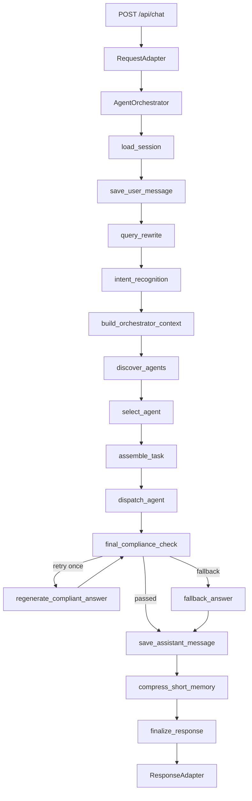

# 健康险个险业务对接 Multi-Agent MVP

本项目是一个可本地运行、可测试的企业级健康险个险业务对接 Agent 平台 MVP。当前版本已经从旧的固定 intent 路由升级为 **AgentCard 驱动的任务级编排架构**：主 Agent 负责任务理解、Agent 发现与选择、上下文组装、子 Agent 分派、最终合规检查；子 Agent 负责具体业务任务执行，并通过自己的 AgentCard、Skill 和可用工具完成任务。

当前默认使用本地 MVP 能力与测试替身：

- Python 3.12 + uv
- FastAPI / uvicorn
- LangGraph StateGraph
- Pydantic
- SQLite 本地持久化
- FakeLLMProvider 默认启用
- InMemoryKnowledgeService 作为 RAG fallback
- MCPClientManager 作为 MCP Client / Consumer 入口

## 快速开始

```bash
uv sync
uv run pytest
uv run uvicorn app.main:app --reload
```

默认 SQLite 文件：

```text
.data/agent_mvp.sqlite3
```

可通过环境变量覆盖：

```powershell
$env:SQLITE_DB_PATH="D:\tmp\agent_mvp.sqlite3"
```

## 一次完整调用链

用户请求从 `/api/chat` 进入后，会经历下面的完整链路：

```text
POST /api/chat
-> RequestAdapter.adapt()
-> AgentOrchestrator.run()
   -> LangGraph StateGraph
      -> load_session
      -> save_user_message
      -> query_rewrite
      -> intent_recognition
      -> build_orchestrator_context
      -> discover_agents
      -> select_agent
      -> assemble_task
      -> dispatch_agent
      -> final_compliance_check
         -> passed: save_assistant_message
         -> retry: regenerate_compliant_answer -> final_compliance_check
         -> fallback: fallback_answer
      -> compress_short_memory
      -> finalize_response
-> ResponseAdapter.adapt()
-> ChatResponse
```

Mermaid 视图：



### select_agent 和 dispatch_agent 的区别

`select_agent` 只做“选谁”：根据 intent、entities、query 和 AgentCard 打分，输出 `selected_agent`、候选列表、置信度和原因。

`dispatch_agent` 才做“调用谁执行”：把 `assemble_task` 生成的任务交给对应子 Agent，子 Agent 再选择 skill、读取 SKILL.md、拿到允许的工具并执行任务，最后返回统一的 `SubAgentResult`。

## 示例请求

```bash
curl -X POST http://127.0.0.1:8000/api/chat \
  -H "Content-Type: application/json" \
  -d '{
    "tenant_id": "pingan_health",
    "channel": "web",
    "user_id": "u001",
    "session_id": "s001",
    "messages": [
      {
        "role": "user",
        "content": "保单9201344266为什么退保没有成功"
      }
    ]
  }'
```

典型链路结果：

```text
intent_recognition -> intent=troubleshooting, entities.policy_no=9201344266
discover_agents    -> 加载 enabled=true 的 AgentCard
select_agent       -> troubleshooting_agent
assemble_task      -> 生成 AgentTaskEnvelope
dispatch_agent     -> TroubleshootingAgent.run()
tool_executor      -> 只允许 troubleshooting_agent 的私有工具和允许的公用工具
final_compliance   -> 返回 sanitized_answer
messages           -> 写入 user / assistant 消息
short_memory       -> 更新 short_summary
tool_execution_logs-> 写入工具执行日志
```

响应包含核心字段：

```text
request_id
session_key
original_query
rewritten_query
intent
answer
```

`session_key` 格式：

```text
{tenant_id}:{channel}:{user_id}:{session_id}
```

## 当前目录结构

```text
app/
  main.py                         FastAPI 入口和依赖装配
  runtime/
    graph.py                      LangGraph StateGraph 主链路
    orchestrator.py               图执行入口，使用 session_key 作为 thread_id
    context_builder.py            主 Agent / 子 Agent 上下文构造
  agents/
    card_loader.py                AgentCard 加载、匹配、一致性校验
    selection.py                  Agent 选择节点
    task_assembler.py             任务上下文组装
    dispatcher.py                 子 Agent 分派节点
    cards/*.yaml                  结构化 AgentCard
  subagents/
    base.py                       BaseSubAgent 统一执行模板
    troubleshooting_agent.py      问题排查子 Agent
    claim_agent.py                理赔查询子 Agent
    policy_query_agent.py         保单查询子 Agent
    compliance_security_agent.py  合规子 Agent，AgentCard 名称为 compliance_agent
  skills/
    {agent_name}/{skill_name}/SKILL.md
  tools/
    registry.py                   公用工具 / 私有工具注册表
    executor.py                   AgentCard 驱动的工具执行器
    public_tools.py               公用工具注册
    agent_tools.py                子 Agent 私有工具注册
    audit_store.py                tool_execution_logs 持久化
  compliance/
    final_checker.py              最终返回前合规检查
  storage/
    sqlite.py                     SQLite 表初始化
docs/
  current_architecture.md
  target_architecture.md
  architecture_acceptance_checklist.md
tests/
  test_agent_card_loader.py
  test_tool_executor_authorization.py
  test_final_compliance_check.py
  test_architecture_acceptance.py
```

## AgentCard

每个可被主 Agent 发现和选择的子 Agent 都有自己的 AgentCard：

```text
app/agents/cards/troubleshooting_agent.yaml
app/agents/cards/claim_agent.yaml
app/agents/cards/policy_query_agent.yaml
app/agents/cards/compliance_agent.yaml
```

AgentCard 核心 schema：

```python
class AgentCard(BaseModel):
    agent_name: str
    display_name: str
    description: str
    capabilities: list[str]
    supported_intents: list[str]
    required_entities: list[str]
    output_schema: str
    private_tools: list[str]
    public_tools_allowed: bool = False
    skills: list[str]
    rag_namespaces: list[str]
    memory_policy: MemoryPolicy = MemoryPolicy()
    examples: list[dict[str, Any]] = []
    enabled: bool = True
    version: str
```

AgentCardLoader 提供：

```python
loader = AgentCardLoader(cards_root=Path("app/agents/cards"))

cards = loader.list_available_agents()          # 只返回 enabled=true
card = loader.get_agent_card("claim_agent")
candidates = loader.match_candidates(
    intent="troubleshooting",
    entities={"policy_no": "9201344266"},
    query="保单9201344266为什么退保没有成功",
)
loader.validate_with_skill_catalog(skill_catalog)
```

匹配逻辑当前是规则打分，后续可替换为 LLM JSON 选择：

```python
score = 0.0
if intent in card.supported_intents:
    score += 5
score += matched_required_entities * 2
score += capability_keyword_hits * 1.5
score += query_keyword_hits
if card.enabled:
    score += 0.5
```

## LangGraph 主链路关键代码

`app/runtime/graph.py` 中使用真实 `StateGraph`：

```python
graph = StateGraph(AgentGraphState)
graph.add_node("load_session", self.load_session)
graph.add_node("save_user_message", self.save_user_message)
graph.add_node("query_rewrite", self.query_rewrite)
graph.add_node("intent_recognition", self.intent_recognition)
graph.add_node("build_orchestrator_context", self.build_orchestrator_context)
graph.add_node("discover_agents", self.discover_agents)
graph.add_node("select_agent", self.select_agent)
graph.add_node("assemble_task", self.assemble_task)
graph.add_node("dispatch_agent", self.dispatch_agent)
graph.add_node("final_compliance_check", self.final_compliance_check)
graph.add_node("regenerate_compliant_answer", self.regenerate_compliant_answer)
graph.add_node("fallback_answer", self.fallback_answer)
graph.add_node("save_assistant_message", self.save_assistant_message)
graph.add_node("compress_short_memory", self.compress_short_memory)
graph.add_node("finalize_response", self.finalize_response)

graph.set_entry_point("load_session")
graph.add_edge("load_session", "save_user_message")
graph.add_edge("save_user_message", "query_rewrite")
graph.add_edge("query_rewrite", "intent_recognition")
graph.add_edge("intent_recognition", "build_orchestrator_context")
graph.add_edge("build_orchestrator_context", "discover_agents")
graph.add_edge("discover_agents", "select_agent")
graph.add_edge("select_agent", "assemble_task")
graph.add_edge("assemble_task", "dispatch_agent")
graph.add_edge("dispatch_agent", "final_compliance_check")
graph.add_conditional_edges(
    "final_compliance_check",
    self.compliance_route,
    {
        "passed": "save_assistant_message",
        "retry": "regenerate_compliant_answer",
        "fallback": "fallback_answer",
    },
)
```

Orchestrator 执行时使用 `session_key` 作为 LangGraph `thread_id`，保证多用户、多会话隔离：

```python
state = await graph.ainvoke(
    inbound_state,
    config={"configurable": {"thread_id": inbound_state["session_key"]}},
)
```

## FastAPI 依赖装配关键代码

`app/main.py` 中把 AgentCard、工具、SkillCatalog、子 Agent、LangGraph 组装起来：

```python
tool_registry = ToolRegistry()
register_public_tools(tool_registry, knowledge_service)
register_agent_private_tools(tool_registry, mcp_connector)

tool_executor = ToolExecutor(
    registry=tool_registry,
    log_store=tool_execution_log_store,
)

skill_catalog = SkillCatalog(skills_root=skills_root)
context_builder = ContextBuilder(
    skills_root=skills_root,
    knowledge_service=knowledge_service,
    skill_catalog=skill_catalog,
    skill_selector=SkillSelector(),
)

subagent_manager = SubAgentManager(skill_catalog=skill_catalog)
subagent_manager.register(
    "troubleshooting_agent",
    TroubleshootingAgent(context_builder=context_builder, tool_executor=tool_executor),
)
subagent_manager.register(
    "policy_query_agent",
    PolicyQueryAgent(context_builder=context_builder, tool_executor=tool_executor),
)
subagent_manager.register(
    "claim_agent",
    ClaimAgent(context_builder=context_builder, tool_executor=tool_executor),
)
subagent_manager.register(
    "compliance_agent",
    ComplianceSecurityAgent(context_builder=context_builder, tool_executor=tool_executor),
)

agent_card_loader = AgentCardLoader(cards_root=cards_root)
agent_card_loader.validate_with_skill_catalog(skill_catalog)
```

## 子 Agent 统一执行模板

`BaseSubAgent` 统一处理 AgentCard、Skill、工具可见性和上下文构造，子类只实现 `do_run()`：

```python
class BaseSubAgent(ABC):
    async def run(
        self,
        task: SubAgentTask,
        parent_context: OrchestratorContext,
    ) -> SubAgentResult:
        agent_card = self.get_agent_card(task)
        allowed_tools = self.get_available_tools(agent_card)
        sub_context = await self.context_builder.build_for_subagent(
            task=task,
            parent_context=parent_context,
            allowed_tools=allowed_tools,
        )
        result = await self.do_run(
            task=task,
            parent_context=parent_context,
            sub_context=sub_context,
            agent_card=agent_card,
        )
        result.agent_name = result.agent_name or self.name
        result.task_id = result.task_id or task.task_id
        return result
```

统一返回协议：

```python
class SubAgentResult(BaseModel):
    agent_name: str
    task_id: str
    answer: str
    evidence: list[dict[str, Any]]
    tool_calls: list[dict[str, Any]]
    confidence: float
    needs_human_approval: bool = False
    risk_level: Literal["low", "medium", "high"] = "low"
    metadata: dict[str, Any] = {}
```

## 工具系统

当前主链路不再使用旧的 `ToolBroker / PolicyGate` 作为核心链路。旧文件保留用于兼容和迁移观察，新工具系统由两层组成：

- `ToolRegistry`：注册公用工具和子 Agent 私有工具
- `ToolExecutor`：执行工具、做 AgentCard 可用性校验、写入工具执行日志

工具分层：

```text
公用工具：
  rag_search_tool
  log_search_tool
  calculator_tool
  current_time_tool

troubleshooting_agent 私有工具：
  query_task_status
  query_node_status
  query_internal_log
  mcp.workflow.query_refund_task
  mcp.logs.query_trace

policy_query_agent 私有工具：
  query_policy_info
  query_policy_status

claim_agent 私有工具：
  query_claim_case
  query_claim_progress
```

工具越权会被 `ToolExecutor` 直接拒绝：

```python
if not self.registry.is_tool_available_for_agent(agent_name, tool_name, agent_card):
    result = ToolResult(
        name=tool_name,
        agent_name=agent_name,
        allowed=False,
        success=False,
        error="tool_not_available_for_agent",
    )
    await self._log(result, arguments, request_id, trace_id, session_key, started_at, started_perf)
    return result
```

写操作工具当前不会直接执行，而是返回人工审批扩展点：

```python
if definition.is_write:
    result = ToolResult(
        name=tool_name,
        agent_name=agent_name,
        allowed=False,
        success=False,
        error="human_approval_required",
    )
```

SQLite 表 `tool_execution_logs` 记录：

```text
request_id
trace_id
session_key
agent_name
tool_name
arguments_json
success
result_json
error
started_at
finished_at
duration_ms
```

## final_compliance_check

所有子 Agent 返回用户前必须经过主 Agent 的 `final_compliance_check`。

当前 `FinalComplianceChecker` 会处理：

- 手机号脱敏
- 身份证号脱敏
- 银行卡号脱敏
- token / secret / password / api_key / authorization 脱敏
- 内部日志字段隐藏
- 原始工具返回拦截
- 健康隐私内容风险标记
- 不通过时最多重试 1 次，仍不通过则返回兜底回复

关键代码：

```python
async def final_compliance_check(self, state: AgentGraphState) -> dict[str, Any]:
    result = await self.final_compliance_checker.check(state.get("answer", ""))
    updates = {"final_compliance_result": result.model_dump()}
    if result.passed:
        updates["answer"] = result.sanitized_answer
    return updates

def compliance_route(self, state: AgentGraphState) -> str:
    result = FinalComplianceResult(**state["final_compliance_result"])
    if result.passed:
        return "passed"
    if result.retry_required and state.get("retry_count", 0) < 1:
        return "retry"
    return "fallback"
```

输出 schema：

```python
class FinalComplianceResult(BaseModel):
    passed: bool
    sanitized_answer: str
    violations: list[ComplianceViolation]
    risk_level: Literal["low", "medium", "high"]
    retry_required: bool
    fallback_answer: str
```

## Skills

Skill 目录只扫描统一格式：

```text
app/skills/{agent_name}/{skill_name}/SKILL.md
```

示例 frontmatter：

```markdown
---
skill_id: troubleshooting_agent.signature_error
name: 签名错误排查
description: 用于排查接口签名校验失败、E102、验签失败等问题
agent: troubleshooting_agent
intent_tags:
  - troubleshooting
required_entities:
  - policy_no
private_tools:
  - query_internal_log
enabled: true
is_default: true
---

这里写该 skill 的执行步骤。
```

一致性校验在应用启动时执行：

```python
agent_card_loader.validate_with_skill_catalog(skill_catalog)
```

校验规则：

- `AgentCard.skills` 声明的 `skill_id` 必须存在
- `skill.agent` 必须对应真实 AgentCard
- `skill.private_tools` 必须是该 AgentCard 私有工具的子集
- 每个 Agent 至少有一个 enabled default skill
- disabled skill 不参与选择

## 记忆和持久化

主 Agent 构造上下文时只使用轻量信息：

- `short_summary`
- 最近 N 轮完整对话
- 当前 query 提取出的 entities
- AgentCard 候选摘要
- 轻量 knowledge hints

SQLite 表：

```text
messages
short_term_memory
graph_checkpoints
tool_execution_logs
tool_call_logs        # legacy 兼容表
```

`messages` 的 metadata 会保留：

```text
request_id
trace_id
original_query
rewritten_query
intent
entities
selected_agent
session_key
```

## 真实 LLM Provider

默认使用 `FakeLLMProvider`，无需网络和 API key。

OpenAI-compatible Provider 已保留在：

```text
app/llm/openai_provider.py
```

启用方式：

```powershell
$env:ENABLE_REAL_LLM="true"
$env:OPENAI_API_KEY="your_api_key"
$env:OPENAI_BASE_URL="https://your-compatible-endpoint/v1"
$env:OPENAI_MODEL="your-model"
```

默认测试不会启用真实 LLM。

## 架构验收测试

核心验收覆盖：

```text
tests/test_agent_card_loader.py              AgentCard 加载、校验、匹配、一致性
tests/test_tool_executor_authorization.py    工具越权拒绝、公用工具权限、执行日志
tests/test_final_compliance_check.py         脱敏、retry、fallback
tests/test_architecture_acceptance.py        完整主链路验收
```

运行：

```bash
uv run pytest
```

当前验收关注的完整场景：

```text
用户输入“保单9201344266为什么退保没有成功”
-> intent_recognition 输出 intent/entities/confidence
-> discover_agents 发现 AgentCard
-> select_agent 选择 troubleshooting_agent
-> assemble_task 生成任务
-> dispatch_agent 调用子 Agent
-> 子 Agent 只能看到自己的工具
-> 返回 SubAgentResult
-> final_compliance_check 必须执行
-> 最终返回 sanitized_answer
-> messages / short_term_memory / tool_execution_logs 正常写入
```

更多细节见：

```text
docs/current_architecture.md
docs/target_architecture.md
docs/architecture_acceptance_checklist.md
```
