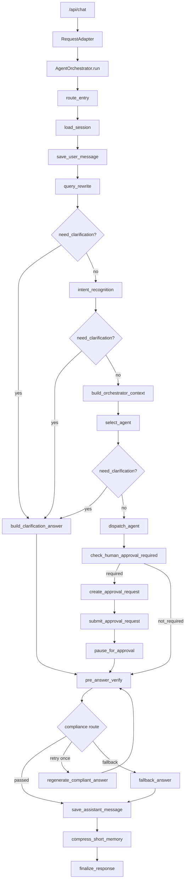
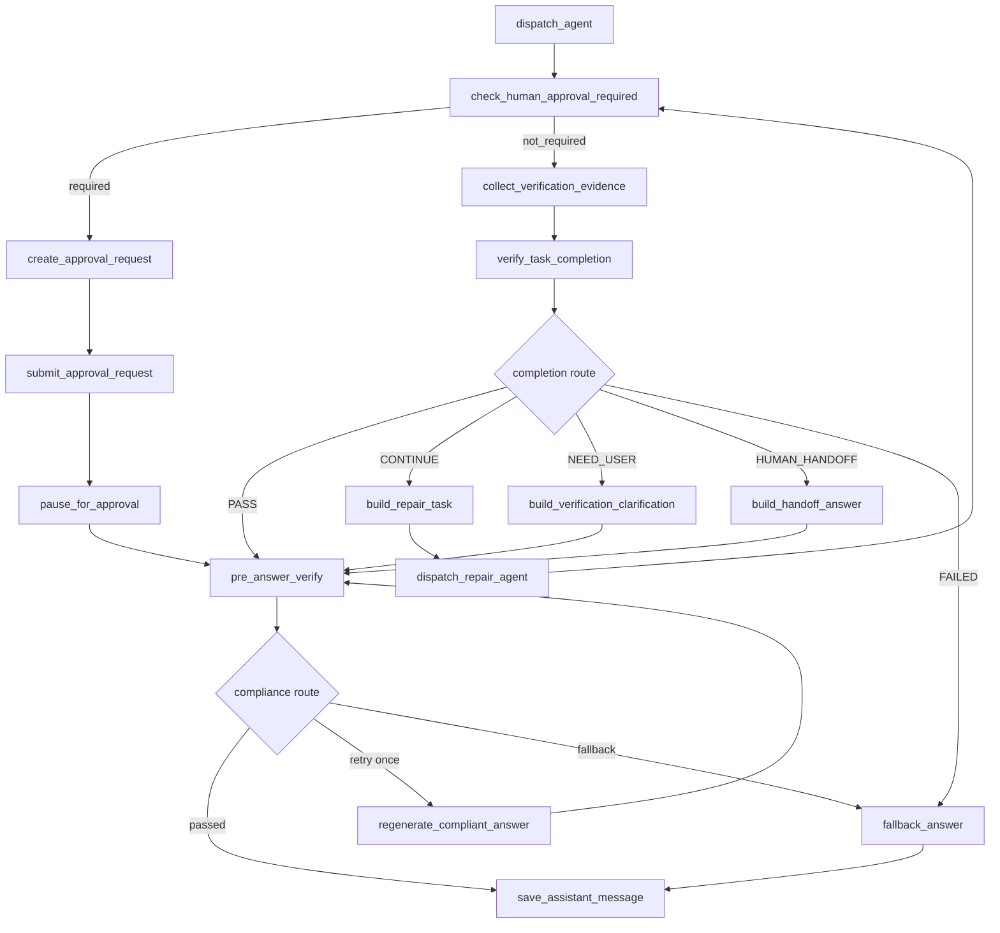

# Skill-aware Verify-Repair Loop 与端到端 Agent Eval 架构设计

## 1. 当前实现审查

本设计基于当前 `agent-development/` 真实源码，不以旧 README 或历史任务文档为事实来源。

### 1.1 当前主图入口和节点

当前 FastAPI 入口在 `app/main.py:create_app()`，`/api/chat` 通过 `RequestAdapter` 生成 `InboundMessage`，再调用 `AgentOrchestrator.run()`。Graph 由 `app/runtime/graph.py:AgentGraphFactory.build()` 注册，当前节点是：

```text
route_entry
load_session
resume_approved_tool
save_user_message
query_rewrite
intent_recognition
build_orchestrator_context
select_agent
dispatch_agent
build_clarification_answer
check_human_approval_required
create_approval_request
submit_approval_request
pause_for_approval
pre_answer_verify
regenerate_compliant_answer
fallback_answer
save_assistant_message
compress_short_memory
finalize_response
```

当前 `dispatch_agent` 之后的真实路径是：

```text
dispatch_agent
→ check_human_approval_required
  ├─ required → create_approval_request → submit_approval_request → pause_for_approval → pre_answer_verify
  └─ not_required → pre_answer_verify
→ save_assistant_message
→ compress_short_memory
→ finalize_response
```

当前没有任务完成度验收节点。`pre_answer_verify` 只做最终外发前合规和数据权限验证。

### 1.2 当前子 Agent 执行链路

当前子 Agent 入口是 `DispatchAgentNode.dispatch()`：

```text
SubAgentTask
→ SubAgentManager.call_subagent()
→ BaseSubAgent.run()
→ ContextBuilder.build_for_subagent()
→ SkillContextResolver.resolve()
→ SkillSelector metadata-only 选择
→ SkillLoader 加载唯一选中的 SKILL.md
→ ToolCallingRunner.run()
→ ToolExecutor.execute()
→ SubAgentResult
```

关键事实：

- `AgentTaskAssembler` 只组装 `SubAgentTask`，不选择 Skill，不加载 Skill。
- `ContextBuilder.build_for_subagent()` 在 Agent 已选定后才做 Skill 选择和 Skill 内容加载。
- `SkillSelector` 只读取 `SkillMetadata`，不会读取完整 `SKILL.md`。
- 只有选中 Skill 后才加载完整 `SKILL.md`。
- `BaseSubAgent` 把 `selected_skill_id`、`selected_skill_metadata`、`skill_selection_score`、`skill_selection_reason` 写入 `SubAgentResult`。
- 目前顶层 `AgentGraphState` 没有独立 `selected_skill_id` 字段，checkpoint/resume projector 会从 `subagent_result` 中投影。

### 1.3 当前 Verification 边界

现有 Verification 模块包括：

```text
app/verification/base.py
app/verification/schemas.py
app/verification/service.py
app/verification/verifiers/compliance_verifier.py
app/verification/verifiers/data_permission_verifier.py
```

当前 `VerificationInput.stage` 支持：

```text
request_access
agent_access
pre_skill
pre_tool
post_tool
pre_answer
```

真实主图只在 `pre_answer_verify` 使用 `pre_answer`。ToolExecutor 在工具前可调用 `pre_tool`。

当前 `VerificationResult` 语义偏合规和策略控制：

```text
passed
stage
verifier_name
severity
action: allow | patch | block | manual | retry
patched_output
redactions
```

它不适合直接承载任务完成度验收，因为任务完成度需要表达 `PASS / CONTINUE / NEED_USER / HUMAN_HANDOFF / FAILED`、缺失项、RepairPlan、证据缺口和下一步计划。

### 1.4 当前 Evidence 边界

当前 Evidence 由 `app/evidence/` 提供：

- `Evidence` 可保存 tool、knowledge、user、system、approval 来源。
- `ToolExecutor._log()` 在配置 `evidence_store` 时会把每次工具结果保存为 Evidence。
- `SubAgentResult.evidence` 当前由 `BaseSubAgent._tool_call_to_evidence()` 从 `ToolCallingRunResult.tool_calls` 生成摘要。
- `CheckpointSnapshot` 只保存 `evidence_refs`，不保存完整 evidence 内容。

当前没有 `VerificationEvidenceCollector`，也没有基于业务状态的 `BusinessStateProbe`。

### 1.5 当前 Approval 边界

当前审批不是 LangGraph 原生 `interrupt()`：

```text
ToolExecutor 返回 human_approval_required
→ ToolCallingRunner 返回 stopped_reason=human_approval_required
→ BaseSubAgent 写入 SubAgentResult.approval_payloads
→ check_human_approval_required
→ create_approval_request
→ ApprovalStore 保存 resume_state / pending_messages / pending_tools / pending_tool_call
→ pause_for_approval 返回 pending 答案
→ /api/approval/callback
→ AgentOrchestrator.resume_after_approval()
→ route_entry(resume)
→ resume_approved_tool
→ check_human_approval_required
```

审批 pending 时，任务本来没有完成。当前 pending 答案会进入 `pre_answer_verify`，不会进入任务完成度验收。

### 1.6 当前 Eval 边界

现有 `app/evaluation/runner.py` 是 Prompt Eval：

- fixture 模式只校验 case schema、manifest scene 和 expected 字段。
- real provider 模式会调用 LLM，但仍只评估单个 prompt scene。
- 不启动主图。
- 不执行 ToolExecutor。
- 不覆盖审批恢复。
- 不评估 Repair。
- 不产出端到端 Agent 行为指标。

因此新 Agent Eval 必须新增，不能替换 Prompt Eval。

### 1.7 当前冲突点和设计影响

| 位置 | 当前事实 | 对本设计的影响 |
| --- | --- | --- |
| `AgentGraphState` | 顶层没有 `selected_skill_id`，测试明确要求不作为 cache 字段 | Verify-Repair 需要 Skill pinning，应把 `selected_skill_id` 升级为受控运行字段，而不是继续隐藏在 metadata |
| `CheckpointSnapshot` / `AgentResumeState` | 已有 `selected_skill_id` 投影字段 | 新字段要同步 projector 和 resume state，避免状态来源分裂 |
| `node_contracts.py` | `intent_recognition` contract 仍列出 `entities` 输出，但真实节点不再写实体 | Phase 1 应修正静态契约，避免新状态治理基于错误契约 |
| `SubAgentTask` | 没有 `execution_mode`、`pinned_skill_id`、`repair_plan` | Repair 需要扩展显式 schema，避免继续扩大无类型 metadata |
| `SubAgentContext` | 有 selected skill 和 skill_content，但没有 repair context | Repair 上下文需要增加受控摘要，不把完整工具原文塞入 |
| `ToolCallingRunner` | 已有重复工具、连续失败、max iteration 保护 | Verify-Repair 只做跨轮 completion/no-progress 保护，不重复 runner 内部 guard |

## 2. As-Is 流程



## 3. To-Be 流程

新增 Completion Verify 与 Repair Loop 后，目标流程是：



审批恢复后：

```text
resume_approved_tool
→ check_human_approval_required
  ├─ 仍有下一个写工具 → create/submit/pause approval → pre_answer_verify
  └─ 无审批 required → collect_verification_evidence → verify_task_completion
```

pending 审批答案不进入 Completion Verify。只有工具真正执行并且 Tool Loop 再次完成后，才进入 Completion Verify。

## 4. 核心设计决策

### 4.1 不引入 TaskContract

本设计不新增 `TaskContract`、`TaskAcceptanceCriteria` 或另一套与 Skill SOP 重复的任务规则。

原因：

1. 当前 Skill 已经是业务 SOP。再维护一套任务验收规则会导致 Skill 与 TaskContract 漂移。
2. 项目当前只有少量 Skill，最有价值的是让 Verifier 直接理解本次选中的完整 `SKILL.md`。
3. 业务验收逻辑应该和执行依据一致：同一份 Skill 文本既指导子 Agent 执行，也指导 Verifier 验收。
4. Eval case 可以有 expected 字段，但运行时不需要开发人员为每个业务维护 TaskContract。

### 4.2 新增独立 Task Completion Verification 体系

选择方案 A：

```text
app/verification/task_completion/
  schemas.py
  service.py
  llm_verifier.py
  evidence_collector.py
  repair_task_builder.py
  no_progress_guard.py
  state_probes/
```

不扩展现有 `VerificationService` 作为主方案。

理由：

- 现有 `VerificationResult.action` 是外发/策略语义，不适合表达任务完成状态。
- Completion Verify 需要 `RepairPlan`，不能和合规 patch/block 混在一起。
- Compliance Verify 继续保留为最终外发安全边界。
- 两者可以复用 LLM provider、PromptLoader、EvidenceStore，但 schema 和 service 分开。

### 4.3 Verifier 只验收和规划，不执行工具

Verifier 输入包含用户任务、改写任务、实体、原 Agent、固定 Skill、回答、工具结果摘要、Evidence、runner 停止原因、历史 repair、业务状态证据。

Verifier 输出结构化 `RepairPlan`。

Verifier 禁止：

- 直接调用业务工具；
- 直接修改工具参数；
- 重新选择 Agent；
- 重新选择 Skill；
- 绕过审批或权限；
- 基于“回答看起来合理”判定任务完成。

### 4.4 Repair 回到原 Agent，固定原 Skill

第一版只支持同 Agent、同 Skill 的继续执行：

```text
target_agent == selected_agent
repair_plan.selected_skill_id == selected_skill_id
SubAgentTask.pinned_skill_id == selected_skill_id
```

Skill pinning 优先使用显式 schema：

```text
SubAgentTask.execution_mode: initial | repair
SubAgentTask.pinned_skill_id: str | None
SubAgentTask.repair_plan: dict | None
SubAgentTask.previous_answer: str | None
SubAgentTask.previous_evidence_refs: list[dict]
SubAgentTask.previous_tool_call_refs: list[dict]
SubAgentTask.repair_round: int
```

不建议继续把 pinning 放在无类型 metadata。metadata 可以保留兼容摘要，但不能作为唯一事实来源。

### 4.5 Repair 是继续执行，不是从头重跑

Repair task 必须携带：

- 原始用户任务；
- 改写后的任务；
- 当前实体；
- 完整 Skill SOP；
- 上次回答；
- 已完成项；
- 已有证据引用和摘要；
- 已执行工具及结果摘要；
- Verifier 指出的缺失项；
- 下一步建议；
- 不应重复执行的动作；
- 修复轮次和历史修复摘要。

子 Agent 仍走 `BaseSubAgent`、`ContextBuilder`、`ToolCallingRunner`、`ToolExecutor`。

### 4.6 Evidence Collector 与 BusinessStateProbe 分工

`VerificationEvidenceCollector` 负责把已有运行结果整理成 verifier 可消费的安全上下文：

```text
selected_skill_id
skill_hash/version
subagent answer
tool calls summary
tool execution refs
Evidence IDs
runner stopped_reason
repair history
state probe results
```

`BusinessStateProbe` 负责只读采集最终业务状态证据：

```text
supports(context) -> bool
collect(context) -> list[VerificationEvidence]
```

Probe 不执行原业务任务，不直接暴露数据库表结构给 LLM。第一阶段只接一个代表性场景，例如 `troubleshooting_agent.endo_completion_aftercare` 的保全任务状态复查，其他场景返回 `evidence_unavailable`。

### 4.7 Completion Verify 与 Compliance Verify 分离

| 验证层 | 位置 | 判断内容 | 输出 |
| --- | --- | --- | --- |
| Task Completion Verify | 子 Agent 执行完成且无审批 pending 后 | 任务是否真正完成、Skill SOP 是否有证据、是否需要继续执行 | `TaskCompletionVerificationResult` |
| Pre-answer Compliance Verify | 最终回答外发前 | 回答是否可外发、是否暴露敏感字段、是否需要 patch/block/retry | `VerificationResult` |

澄清答案、审批 pending 答案、handoff 答案、最终业务答案仍全部经过 `pre_answer_verify`。

### 4.8 Repair 终止条件

新增配置：

```text
TASK_COMPLETION_MAX_REPAIR_ROUNDS=2
TASK_COMPLETION_MIN_VERIFIER_CONFIDENCE=0.55
TASK_COMPLETION_ENABLE_LLM=true
TASK_COMPLETION_ENABLE_STATE_PROBES=true
```

终止条件：

- 达到最大修复次数；
- 连续两次 RepairPlan 指纹相同；
- 连续两轮没有新增 Evidence；
- 重复调用相同工具和相同参数；
- Verifier 输出非法且格式修复失败；
- Verifier 置信度低于阈值；
- 子 Agent 再次返回相同未完成结果；
- RepairPlan 要求换 Agent 或换 Skill；
- RepairPlan 要求重复高风险写操作且没有新证据。

终止后进入：

```text
NEED_USER
HUMAN_HANDOFF
FAILED
```

不得无限循环。

## 5. 数据模型设计

### 5.1 TaskCompletionStatus

```text
PASS
CONTINUE
NEED_USER
HUMAN_HANDOFF
FAILED
```

语义：

| 状态 | 含义 | 路由 |
| --- | --- | --- |
| `PASS` | 任务目标已完成，证据足够 | `pre_answer_verify` |
| `CONTINUE` | 任务未完成，但可由原 Agent/Skill 继续处理 | `build_repair_task` |
| `NEED_USER` | 缺少用户必须补充的信息，无法自动继续 | `build_verification_clarification` |
| `HUMAN_HANDOFF` | 需要人工接管或系统状态不可自动判断 | `build_handoff_answer` |
| `FAILED` | 验收或执行失败，无法安全继续 | `fallback_answer` 或 handoff |

### 5.2 RepairPlan

字段建议：

```text
reason: str
completed_items: list[str]
missing_items: list[str]
next_steps: list[str]
do_not_repeat: list[str]
reuse_evidence_ids: list[str]
expected_new_evidence: list[str]
target_agent: str
selected_skill_id: str
confidence: float
fingerprint: str | None
```

约束：

- `target_agent` 默认且必须等于原 `selected_agent`。
- `selected_skill_id` 默认且必须等于原 `selected_skill_id`。
- sanitizer 必须拒绝换 Agent、换 Skill、重复危险写操作和空 `next_steps` 的 `CONTINUE`。

### 5.3 TaskCompletionVerificationResult

字段建议：

```text
status: TaskCompletionStatus
completed: bool
summary: str
completed_items: list[str]
missing_items: list[str]
repair_plan: RepairPlan | None
confidence: float
reasoning_summary: str
evidence_ids: list[str]
verifier_name: str
llm_status: str | None
fallback_reason: str | None
```

不保存私有思维链。`reasoning_summary` 只保存可审计的简短依据。

### 5.4 VerificationEvidence

字段建议：

```text
evidence_id: str
source_type: tool | state_probe | evidence_store | system
source_name: str
summary: str
status: available | unavailable | failed
tool_name: str | None
tool_arguments_summary: dict
result_summary: dict | str | None
created_at: str
metadata: dict
```

大字段和敏感原文不进 Graph State，通过 Evidence ID 或安全摘要引用。

## 6. Graph State 变化

建议新增字段：

| 字段 | owner | 产生节点 | kind | checkpoint | resume | message metadata | 说明 |
| --- | --- | --- | --- | --- | --- | --- | --- |
| `selected_skill_id` | `skill_pin` | `dispatch_agent` / `dispatch_repair_agent` | checkpoint | 是 | 是 | 是 | 从 `subagent_result` 升级为受控字段，支持 repair 固定 Skill |
| `selected_skill_version` | `skill_pin` | evidence collector 或 skill loader | checkpoint | 是 | 是 | 可选 | 可用 `source_path` hash 或 prompt version 表示 |
| `task_completion_verification_result` | `completion_verification` | `verify_task_completion` | runtime | 可投影摘要 | 是 | 可选摘要 | 不保存大 prompt 或原始工具结果 |
| `verification_evidence` | `completion_evidence` | `collect_verification_evidence` | runtime/reference | 只保存 refs | 是 | 可选 refs | verifier 输入证据摘要 |
| `repair_plan` | `repair_control` | `verify_task_completion` | checkpoint | 是 | 是 | 可选摘要 | 当前待执行 repair plan |
| `repair_round` | `repair_control` | `build_repair_task` | checkpoint | 是 | 是 | 是 | 当前修复轮次 |
| `repair_history` | `repair_audit` | `verify_task_completion` / `build_repair_task` | reference | refs/摘要 | 是 | 可选摘要 | 历史验收和 repair 摘要 |
| `last_repair_fingerprint` | `repair_guard` | `verify_task_completion` | checkpoint | 是 | 是 | 否 | 无进展保护 |
| `repair_no_progress_count` | `repair_guard` | `verify_task_completion` | checkpoint | 是 | 是 | 否 | 连续无新增证据次数 |
| `execution_mode` | `execution_control` | `dispatch_agent` / `build_repair_task` | checkpoint | 是 | 是 | 是 | `initial` 或 `repair` |
| `original_subagent_result` | `repair_audit` | 首轮 `dispatch_agent` | runtime/reference | refs | 是 | 否 | 首轮结果摘要，不存大对象 |
| `previous_subagent_results` | `repair_audit` | 每轮 repair 完成后 | runtime/reference | refs | 是 | 否 | 历史轮次摘要 |

注意：

- 完整 `SKILL.md` 不进入 Graph State，Verifier 根据 `selected_skill_id` 重新加载。
- 完整工具原始结果不进入 checkpoint。
- `pending_messages` / `pending_tools` 仍只用于审批恢复，不应被 completion verifier 长期保存。
- `state_contracts.py`、`state_projector.py`、`node_contracts.py`、`message_metadata_sanitizer.py` 必须同步。

## 7. LangGraph 节点和路由变化

新增节点建议：

```text
collect_verification_evidence
verify_task_completion
build_repair_task
dispatch_repair_agent
build_verification_clarification
build_handoff_answer
```

新增路由：

```text
task_completion_route:
  PASS -> pre_answer_verify
  CONTINUE -> build_repair_task
  NEED_USER -> build_verification_clarification
  HUMAN_HANDOFF -> build_handoff_answer
  FAILED -> fallback_answer
```

审批路由调整：

```text
check_human_approval_required:
  required -> create_approval_request
  not_required -> collect_verification_evidence
```

但 `pause_for_approval` 仍直接进入 `pre_answer_verify`，不能进入 Completion Verify。

## 8. Repair 子 Agent 输入协议

建议扩展 `SubAgentTask`：

```text
execution_mode: Literal["initial", "repair"] = "initial"
pinned_skill_id: str | None = None
repair_plan: dict[str, Any] | None = None
previous_answer: str | None = None
previous_evidence_refs: list[dict[str, Any]] = []
previous_tool_call_refs: list[dict[str, Any]] = []
repair_round: int = 0
do_not_repeat: list[str] = []
```

`SkillContextResolver.resolve()` 行为：

- `execution_mode=initial`：保持现有 SkillSelector 行为。
- `execution_mode=repair` 且 `pinned_skill_id` 存在：跳过自由 Skill 选择，只校验 pinned skill 属于当前 AgentCard.skills、metadata enabled、intent/sub_intent 不冲突，然后加载该 Skill 内容。
- pinned skill 不存在、禁用或不属于 AgentCard：返回 `HUMAN_HANDOFF` 或明确错误，不自动重新选择。

`BaseSubAgent.build_messages()` 应在 repair 模式注入：

- 上次回答；
- 已完成项；
- 已有 evidence 摘要；
- 已执行工具摘要；
- verifier missing items；
- next steps；
- do_not_repeat；
- repair_round。

## 9. Evidence Collector 和 StateProbe

### 9.1 VerificationEvidenceCollector

职责：

- 从 state 读取 `selected_agent`、`selected_skill_id`、`subagent_result`。
- 按 `selected_skill_id` 计算 Skill 内容 hash 或版本摘要。
- 提取 runner metadata：`stopped_reason`、`iterations`、`error`。
- 从 `SubAgentResult.tool_calls` 生成安全摘要。
- 从 `EvidenceStore.list_by_request(request_id)` 拉取 Evidence refs 和摘要。
- 调用可用 `BusinessStateProbe` 补充只读状态证据。
- 合并 repair history。

不做：

- 不调用写工具；
- 不执行子 Agent；
- 不做最终判定。

### 9.2 BusinessStateProbe

接口建议：

```python
class BusinessStateProbe(Protocol):
    async def supports(self, context: VerificationContext) -> bool: ...
    async def collect(self, context: VerificationContext) -> list[VerificationEvidence]: ...
```

第一阶段代表性 Probe：

```text
EndoAftercareStateProbe
```

输入：

- `selected_skill_id=troubleshooting_agent.endo_completion_aftercare`
- `entities.apply_seq`
- 工具结果中 task record 信息

输出：

- 9/10/11 节点当前状态摘要；
- 如果只读接口不可用，输出 `status=unavailable`，不能当作成功。

## 10. Verifier Prompt 设计

新增 prompt scene：

```text
app/prompts/task_completion_verifier/system.md
app/prompts/task_completion_verifier/user.md
```

新增 manifest：

```yaml
task_completion_verifier:
  version: "2026-06-25.1"
  system: task_completion_verifier/system.md
  user: task_completion_verifier/user.md
  output_schema: TaskCompletionLLMOutput
  eval_suite: task_completion_verifier_v1
  default_model: configured-default
  tools_allowed: false
```

Prompt 必须声明：

- Verifier 是验收者和修复规划者，不是执行者。
- 完整 Skill SOP 是主要业务依据。
- 只能根据提供的工具结果、Evidence 和状态证据认定事实。
- 不得因为回答像成功就判定 PASS。
- 等价且有证据的完成路径可以 PASS。
- 关键业务状态无法证明时，返回 `CONTINUE`、`NEED_USER` 或 `HUMAN_HANDOFF`。
- 输出严格 JSON。
- 不输出私有思维链。

非法输出降级：

```text
第一次解析失败 -> 同输入追加格式修复提示，再调用一次
第二次失败 -> HUMAN_HANDOFF
低置信度 -> HUMAN_HANDOFF 或 NEED_USER
```

## 11. Agent Eval 设计

新增行为级 Eval，不替换 Prompt Eval。

目录建议：

```text
app/evaluation/
  prompt/              # 可后续迁移现有 PromptEvalRunner，第一阶段不强制
  agent/
    schemas.py
    runner.py
    assertions.py
    report.py
    fixtures.py
    cases/
```

`AgentEvalCase` 至少支持：

```text
case_id
description
input
session_fixtures
llm_scripted_responses
tool_fixtures
approval_fixtures
business_state_fixtures
expected_initial_verifier_status
expected_repair_count
expected_final_verifier_status
expected_selected_agent
expected_selected_skill_id
expected_final_outcome
forbidden_duplicate_actions
max_iterations
tags
risk_level
```

`AgentEvalRunner`：

- 构建隔离 `AppContainer`。
- 注入 Fake LLM、Fake Tools、Fake Approval、Fake StateProbe。
- 调用真实 `AgentOrchestrator` 或编译主图。
- 收集 `graph_path`、Agent、Skill、Tool、Verifier、Repair 轨迹。
- 执行断言。
- 输出 JSON/Markdown report。
- 支持 baseline 比较和 CI 非零退出码。

第一批 case 覆盖 A-L：

```text
A 首轮直接完成
B 首轮未完成，修复后完成
C 缺少用户信息
D Repair 中触发审批
E 审批 pending 不执行 Completion Verify
F 审批 callback 后完成
G 写接口 success 但最终状态不一致
H 最大修复次数
I 无进展检测
J Verifier 非法 JSON
K Verifier 错误要求重复操作
L Completion PASS 但 Compliance block
```

## 12. Eval 指标

### Task Agent

```text
first_pass_completion_rate
first_pass_failure_rate
```

### Verifier

```text
verifier_pass_accuracy
verifier_incomplete_detection_rate
verifier_false_pass_rate
verifier_false_continue_rate
```

### Repair

```text
repair_attempt_rate
repair_success_rate
average_repair_rounds
no_progress_termination_rate
```

### 整体系统

```text
final_task_completion_rate
final_failure_rate
human_handoff_rate
need_user_rate
average_tool_calls
duplicate_tool_call_rate
average_llm_calls
average_latency
```

第一阶段 CI 硬门禁：

```text
高风险测试集 false pass = 0
无限循环 = 0
超过 max_repair_rounds = 0
Repair 更换 Agent = 0
Repair 更换 Skill = 0
绕过审批 = 0
```

## 13. 分阶段实施步骤

| Phase | 名称 | 目标 |
| --- | --- | --- |
| Phase 0 | 现状审查与设计确认 | 确认当前流程、边界、冲突点和文件清单 |
| Phase 1 | Schema 与状态模型 | 新增 completion schema、repair schema、state 字段和配置，不接主图 |
| Phase 2 | Skill-aware Verifier | 加载完整 Skill，组装 verifier 上下文，LLM 严格解析和降级 |
| Phase 3 | Evidence Collector 与一个 StateProbe | 整理证据摘要，接一个代表性只读状态探针 |
| Phase 4 | Repair Task 与原 Agent 续跑 | Skill pinning、RepairPlan 注入、同 Agent/Skill 续跑 |
| Phase 5 | 接入 MainGraph | 增加 completion verify/repair 节点和审批兼容路由 |
| Phase 6 | Agent Eval MVP | 新增行为级 Eval schema、runner、fixtures、核心案例 |
| Phase 7 | CI 与基线 | 报告、baseline、阈值、非零退出码 |

详细任务拆分见：

- `tasks/TASK_VERIFY_REPAIR_LOOP.md`
- `tasks/TASK_AGENT_BEHAVIOR_EVAL.md`

## 14. 风险与回滚方案

| 风险 | 说明 | 控制 |
| --- | --- | --- |
| Verifier 误判 PASS | LLM 可能把看似合理的回答当成完成 | 高风险 false pass CI 门禁；状态证据不足不得 PASS |
| Repair 重复执行 | repair 可能重复成功步骤 | `do_not_repeat`、tool fingerprint、Evidence 新增检测 |
| 重复写操作 | 高风险写工具可能被重复触发 | ToolExecutor 审批与幂等继续生效；RepairPlan sanitizer 拒绝无新证据重复写 |
| 审批恢复冲突 | pending 状态进入 completion verify 会误判失败 | `pause_for_approval -> pre_answer_verify` 保持不变 |
| Skill 重新选择漂移 | repair 重新选择 Skill 导致验收依据变化 | `pinned_skill_id` 显式字段和 resolver 校验 |
| 上下文过大 | 完整工具结果和 Skill 多轮堆积 | Skill 重新加载不存 state；证据用 ID/摘要 |
| 敏感数据泄露 | 工具原文或状态证据进入 prompt/metadata | EvidenceCollector 做摘要和脱敏；checkpoint 只存 refs |
| 无进展循环 | Verifier 一直 CONTINUE | max rounds、plan fingerprint、no evidence guard |
| Eval 过度依赖 Fake | Fake 太理想化无法代表真实模型 | 先做确定性 CI，再保留 real provider 可选 suite |

回滚策略：

- Phase 1-4 未接主图，可通过不启用新节点回滚。
- Phase 5 接入主图时增加配置开关，例如 `ENABLE_TASK_COMPLETION_VERIFY=false` 可回到当前 `dispatch_agent -> approval -> pre_answer_verify`。
- Prompt manifest 新 scene 可独立关闭，不影响现有 Prompt Eval。
- Agent Eval 新目录不影响生产运行。

## 15. 已确认决策与仍待确认问题

### 15.1 已确认决策

1. `selected_skill_id` 升级为顶层 `AgentGraphState` checkpoint 字段。
   - 解释：它不再是 cache，而是 Verify-Repair 的 Skill pinning 控制字段。
   - 实现影响：需要更新 `GRAPH_STATE_FIELD_AUTHORITY`、`AgentGraphState`、`node_contracts.py`、`state_projector.py`、`AgentResumeState` 和相关测试。

2. `TaskCompletionVerificationResult` 摘要写入 MessageStore metadata。
   - 只保存 `status`、`repair_round`、`evidence_ids`、`summary`、`selected_skill_id` 等轻量摘要。
   - 不保存完整 verifier 输入、完整 LLM 输出、完整 Skill 文本或原始工具结果。

3. 第一阶段 `BusinessStateProbe` 选择 `troubleshooting_agent.endo_completion_aftercare`。
   - 原因：该 Skill 同时包含只读查询 `query_endo_task_record` 和写/通知类处理工具，适合验证“写接口成功但最终状态不一致”等闭环。

4. Verifier 连续非法输出时统一转 `HUMAN_HANDOFF`。
   - 第一次非法输出允许格式修复重试一次。
   - 第二次仍非法时 fail closed，不再进入 Repair。

5. `ENABLE_TASK_COMPLETION_VERIFY` 在本地和测试环境默认开启。
   - 生产上线前仍建议通过 Agent Eval 基线和灰度配置确认。

### 15.2 仍待确认问题

1. Agent Eval 是否需要保存报告到文件。
   - 推荐：CLI 默认 stdout JSON，CI 可选 `--report-dir` 输出 Markdown/JSON。

2. 高风险 Agent Eval suite 是否第一阶段就进入 CI 硬门禁。

3. Agent Eval baseline 文件是否提交到仓库。
