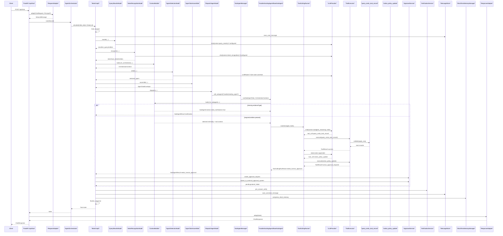

# Endo Aftercare Full Request Debug Trace

本文基于当前源码生成一次“保全任务完成后异常处理请求”的静态 Debug Trace。它覆盖从 `/api/chat` 入口到最终 `ChatResponse` 的主链路，并单独展开子 Agent 内部的 `ToolCallingRunner -> ToolExecutor` 循环。

当前源码的关键结论：

- 当前 API 的 `ChatRequest` 不是 `message/session_key` 结构，而是 `tenant_id/channel/user_id/session_id/messages`；`session_key` 由 `RequestAdapter` 生成。
- 当前主图节点已经是 `pre_answer_verify -> VerificationService`，不是旧的 `final_compliance_check -> FinalComplianceChecker`。
- 示例 query 静态规则抽取结果为 `apply_seq=APPLY_POLICY_UPDATE_FAIL`、`policy_no=P001`，但没有抽出 `endorseType=退保`。
- `troubleshooting_agent.endo_completion_aftercare` skill 的必需实体是 `apply_seq / policy_no / endorseType`。如果 LLM 没有补出 `endorseType`，真实链路会在子 Agent 执行前返回澄清问题。
- 如果实体完整，子 Agent 会进入 tool loop。`query_endo_task_record` 是读工具，会执行；`notice_policy_update` 是 `is_write=True` 写工具，会触发人工审批 pending，不会直接执行。

## 1. 总览

业务请求：

```text
保全任务完成了，但是保单信息没有更新，受理号 APPLY_POLICY_UPDATE_FAIL，保单号 P001，保全项退保
```

目标链路：

```text
/api/chat
-> RequestAdapter
-> AgentOrchestrator
-> MainGraph
-> query_rewrite
-> intent_recognition
-> select_agent(troubleshooting_agent)
-> assemble_task
-> dispatch_agent
-> BaseSubAgent.run
-> select skill(troubleshooting_agent.endo_completion_aftercare)
-> ToolCallingRunner.run
-> query_endo_task_record
-> notice_policy_update
-> human_approval_required
-> create_approval_request
-> submit_approval_request
-> pause_for_approval
-> pre_answer_verify
-> save_assistant_message
-> compress_short_memory
-> finalize_response
-> ResponseAdapter
```

当前真实分支：

| 分支 | 触发条件 | 结果 |
|---|---|---|
| 澄清分支 | `endorseType` 未被抽取或补齐 | `RequiredEntityChecker` 设置 `need_clarification=True`，`BaseSubAgent.run` 不进入 tool loop |
| 工具 + 审批分支 | `entities` 包含 `apply_seq / policy_no / endorseType` | 先执行 `query_endo_task_record`，再因 `notice_policy_update.is_write=True` 创建审批单并返回 pending |

## 2. Mermaid 全链路时序图



## 3. 请求入口入参/出参

用户给出的简化请求：

```json
{
  "message": "保全任务完成了，但是保单信息没有更新，受理号 APPLY_POLICY_UPDATE_FAIL，保单号 P001，保全项退保",
  "session_key": "debug_endo_aftercare_session"
}
```

当前真实 `ChatRequest` 示例：

```json
{
  "tenant_id": "debug_tenant",
  "channel": "web",
  "user_id": "debug_user",
  "session_id": "debug_endo_aftercare_session",
  "messages": [
    {
      "role": "user",
      "content": "保全任务完成了，但是保单信息没有更新，受理号 APPLY_POLICY_UPDATE_FAIL，保单号 P001，保全项退保",
      "metadata": {}
    }
  ]
}
```

代码位置：

- `/api/chat`: `app/main.py::create_app`
- `ChatRequest`: `app/schemas/message.py::ChatRequest`
- `RequestAdapter`: `app/adapters/request_adapter.py::RequestAdapter.adapt`
- `ChatResponse`: `app/schemas/message.py::ChatResponse`
- `ResponseAdapter`: `app/adapters/response_adapter.py::ResponseAdapter.adapt`

`RequestAdapter` 生成：

```json
{
  "request_id": "req_<uuid>",
  "trace_id": "trace_<uuid>",
  "session_key": "debug_tenant:web:debug_user:debug_endo_aftercare_session",
  "original_query": "保全任务完成了，但是保单信息没有更新，受理号 APPLY_POLICY_UPDATE_FAIL，保单号 P001，保全项退保",
  "principal": null,
  "auth_context": {
    "auth_source": "body_fallback"
  }
}
```

如果 Header 带身份，`app/auth/dependencies.py::get_current_principal` 从 `X-Tenant-Id / X-User-Id / X-Subject / X-User-Scopes / X-Data-Permissions` 等 Header 构造 `Principal`；如果没有 Header 且配置允许，则走 body fallback。

## 4. Graph 初始 state 示例

代码位置：`app/runtime/orchestrator.py::AgentOrchestrator.run`

```json
{
  "request_id": "req_<uuid>",
  "trace_id": "trace_<uuid>",
  "tenant_id": "debug_tenant",
  "channel": "web",
  "user_id": "debug_user",
  "session_id": "debug_endo_aftercare_session",
  "session_key": "debug_tenant:web:debug_user:debug_endo_aftercare_session",
  "thread_id": "debug_tenant:web:debug_user:debug_endo_aftercare_session:req_<uuid>",
  "principal": null,
  "auth_context": {
    "auth_source": "body_fallback"
  },
  "original_query": "保全任务完成了，但是保单信息没有更新，受理号 APPLY_POLICY_UPDATE_FAIL，保单号 P001，保全项退保",
  "error": null,
  "graph_path": []
}
```

`AgentOrchestrator.run` 调用 compiled graph：

```python
await graph.ainvoke(
    initial_state,
    config={"configurable": {"thread_id": thread_id}},
)
```

## 5. MainGraph 节点表

代码位置：`app/runtime/graph.py::AgentGraphFactory.build`

| 顺序 | 节点 | 代码位置 | 输入 state 关键字段 | 输出/新增 state 字段 | 说明 |
|---|---|---|---|---|---|
| 0 | `route_entry` | `app/runtime/graph.py::route_entry` | `approval_resume` | `graph_path` | 普通请求进 `load_session`；审批恢复进 `resume_approved_tool` |
| 1 | `load_session` | `app/runtime/graph.py::load_session` | `session_key` | `recent_messages`, `short_summary` | 通过 `SessionManager` 读历史 |
| 2 | `save_user_message` | `app/runtime/graph.py::save_user_message` | `original_query`, `request_id`, `trace_id` | `graph_path` | 写入 `messages` |
| 3 | `query_rewrite` | `app/runtime/graph.py::query_rewrite` | query/history/summary | `rewritten_query`, `entities`, `entity_bag`, `conversation_window`, `need_clarification` | 查询改写和通用实体抽取 |
| 4 | `intent_recognition` | `app/runtime/graph.py::intent_recognition` | query/entities/AgentCard summaries | `intent`, `sub_intent`, `confidence`, merged `entities` | 意图识别，不选工具 |
| 5 | `build_orchestrator_context` | `app/runtime/graph.py::build_orchestrator_context` | query/intent/entities/history | `orchestrator_context` | 构建主编排上下文，可能轻量知识预检索 |
| 6 | `discover_agents` | `app/runtime/graph.py::discover_agents` | AgentCardLoader | `available_agents` | 列出 enabled AgentCard |
| 7 | `select_agent` | `app/runtime/graph.py::select_agent` | intent/entities/query | `selected_agent`, `selected_agent_card`, `agent_selection` | hybrid AgentCard router |
| 8 | `assemble_task` | `app/runtime/graph.py::assemble_task` | selected card/context/entities | `assembled_task` | 构造 `AgentTaskEnvelope` |
| 9 | `dispatch_agent` | `app/runtime/graph.py::dispatch_agent` | `assembled_task`, `orchestrator_context` | `subagent_result`, `answer`, skill fields | 调用子 Agent |
| 10 | `check_human_approval_required` | `app/runtime/graph.py::check_human_approval_required` | `subagent_result` | `approval_required`, `approval_payloads` | 检查写工具审批 |
| 11 | `create_approval_request` | `app/runtime/graph.py::create_approval_request` | approval payload/pending messages/tools | `approval_id`, `approval_request`, `approval_status` | 创建 SQLite 审批单 |
| 12 | `submit_approval_request` | `app/runtime/graph.py::submit_approval_request` | `approval_request` | `approval_submit_result` | 调外部审批 client |
| 13 | `pause_for_approval` | `app/runtime/graph.py::pause_for_approval` | `approval_id`, submit result | `answer`, `approval_status` | 返回 pending，不阻塞 |
| 14 | `build_clarification_answer` | `app/runtime/graph.py::build_clarification_answer` | `clarification_question` | `answer`, `approval_required=false` | 澄清出口 |
| 15 | `pre_answer_verify` | `app/runtime/graph.py::pre_answer_verify` | `answer`, principal/auth/evidence | `pre_answer_verification_result`, possibly patched `answer` | 最终统一验证 |
| 16 | `regenerate_compliant_answer` | `app/runtime/graph.py::regenerate_compliant_answer` | verification action `retry` | safer answer, `retry_count+1` | 最多 retry 一次 |
| 17 | `fallback_answer` | `app/runtime/graph.py::fallback_answer` | verification block/manual/retry exhausted | safe fallback answer | 拦截原文 |
| 18 | `save_assistant_message` | `app/runtime/graph.py::save_assistant_message` | final `answer` | persisted assistant message | 保存 verify 后的 answer |
| 19 | `compress_short_memory` | `app/runtime/graph.py::compress_short_memory` | query/intent/answer/subagent_result | `short_summary` | LLM 滚动摘要，规则兜底 |
| 20 | `finalize_response` | `app/runtime/graph.py::finalize_response` | final state | `graph_path` | 记录日志 |

## 6. query_rewrite Debug

代码位置：`app/query/query_rewrite_node.py::QueryRewriteNode.rewrite`

输入：

```json
{
  "original_query": "保全任务完成了，但是保单信息没有更新，受理号 APPLY_POLICY_UPDATE_FAIL，保单号 P001，保全项退保",
  "recent_messages": [],
  "short_summary": null,
  "session_key": "debug_tenant:web:debug_user:debug_endo_aftercare_session"
}
```

当前实现：

1. 使用 `EntityExtractor` 从当前 query、summary、recent turns 抽取动态实体。
2. 构建 `ConversationWindow`，包含 `summary/recent_turns/entity_bag`。
3. 如果 LLM provider 可用且不是无 base_url 的 `InternalLLMProvider` fallback，调用 `LLMProvider.chat(scene="query_rewrite")`。
4. LLM JSON 不可用时走 EntityBag 规则 fallback。

静态运行当前 `EntityExtractor` 的样例结果：

```json
{
  "apply_seq": "APPLY_POLICY_UPDATE_FAIL",
  "policy_no": "P001"
}
```

期望 LLM 补齐后的输出：

```json
{
  "rewritten_query": "保全任务完成了，但是保单信息没有更新，受理号 APPLY_POLICY_UPDATE_FAIL，保单号 P001，保全项退保",
  "entities": {
    "apply_seq": "APPLY_POLICY_UPDATE_FAIL",
    "policy_no": "P001",
    "endorseType": "退保"
  },
  "need_clarification": false
}
```

无法从静态源码确认真实 LLM 一定会补出 `endorseType`，需要运行时日志验证。

## 7. intent_recognition Debug

代码位置：`app/query/intent_recognition_node.py::IntentRecognitionNode.recognize`

输入：

```json
{
  "original_query": "...",
  "rewritten_query": "...",
  "current_entities": {
    "apply_seq": "APPLY_POLICY_UPDATE_FAIL",
    "policy_no": "P001"
  },
  "conversation_window": {},
  "agent_card_summaries": [
    {
      "agent_name": "troubleshooting_agent",
      "supported_intents": ["troubleshooting", "refund_failure", "callback_failure", "endo_completion_aftercare"],
      "capabilities": ["endo_completion_aftercare"]
    }
  ]
}
```

当前实现：

- LLM 主路径：`LLMProvider.chat(scene="intent_recognition")`，prompt 提供候选 AgentCard 摘要。
- fallback：新架构规则分类，输出动态 `entities`，不输出 `required_tools`。

本示例期望：

```json
{
  "intent": "troubleshooting",
  "sub_intent": "endo_completion_aftercare",
  "confidence": 0.8,
  "entities": {
    "apply_seq": "APPLY_POLICY_UPDATE_FAIL",
    "policy_no": "P001",
    "endorseType": "退保"
  },
  "need_clarification": false
}
```

如果 `endorseType` 没有在 query rewrite 或 intent 节点补齐，后续会在 skill required entity check 阶段澄清。

## 8. build_orchestrator_context Debug

代码位置：`app/runtime/context_builder.py::ContextBuilder.build_for_orchestrator`

输出 `OrchestratorContext` 示例：

```json
{
  "original_query": "...",
  "rewritten_query": "...",
  "intent": "troubleshooting",
  "sub_intent": "endo_completion_aftercare",
  "entities": {
    "apply_seq": "APPLY_POLICY_UPDATE_FAIL",
    "policy_no": "P001",
    "endorseType": "退保"
  },
  "session_key": "debug_tenant:web:debug_user:debug_endo_aftercare_session",
  "recent_messages": [],
  "short_summary": null,
  "available_subagents": ["troubleshooting_agent", "policy_query_agent", "claim_agent"],
  "available_tools": ["query_endo_task_record", "notice_policy_update", "..."],
  "lightweight_knowledge_hints": []
}
```

知识服务预检索：

```text
ContextBuilder._build_lightweight_hints
-> knowledge_service.pre_search(query, intent, top_k=3)
```

默认情况下，`build_knowledge_service(settings)` 返回 `DisabledKnowledgeService`，知识 hints 为空；启用 Knowledge API 后才会返回真实 chunks。

## 9. discover_agents / select_agent Debug

代码位置：

- `app/agents/card_loader.py::AgentCardLoader`
- `app/agents/cards/troubleshooting_agent.yaml`
- `app/agents/selection.py::AgentSelectionNode.select`

静态验证当前样例的规则 Top1：

```json
{
  "agent_name": "troubleshooting_agent",
  "score": 12.9,
  "matched_entities": ["apply_seq", "policy_no"],
  "missing_entities": [],
  "reason": "intent matched: troubleshooting; sub_intent matched: endo_completion_aftercare; no required entities; optional entities matched: ['policy_no', 'apply_seq']; keyword matched: policy; enabled"
}
```

`AgentSelectionNode` 是 hybrid router：

```text
AgentCardLoader.match_candidates
-> rule Top-K
-> if uncertain, LLMRouter rerank Top-K only
-> selected_agent
```

本示例规则高分，预期直接选择：

```json
{
  "selected_agent": "troubleshooting_agent",
  "selection_method": "rule",
  "need_clarification": false
}
```

## 10. assemble_task Debug

代码位置：`app/agents/task_assembler.py::AgentTaskAssembler.assemble`

输出 `AgentTaskEnvelope`：

```json
{
  "task_id": "task_<uuid>",
  "agent_name": "troubleshooting_agent",
  "query": "保全任务完成了，但是保单信息没有更新，受理号 APPLY_POLICY_UPDATE_FAIL，保单号 P001，保全项退保",
  "original_query": "保全任务完成了，但是保单信息没有更新，受理号 APPLY_POLICY_UPDATE_FAIL，保单号 P001，保全项退保",
  "intent": "troubleshooting",
  "entities": {
    "apply_seq": "APPLY_POLICY_UPDATE_FAIL",
    "policy_no": "P001",
    "endorseType": "退保"
  },
  "session_key": "debug_tenant:web:debug_user:debug_endo_aftercare_session",
  "request_id": "req_<uuid>",
  "trace_id": "trace_<uuid>",
  "short_summary": null,
  "recent_messages": [],
  "lightweight_knowledge_hints": []
}
```

`recent_messages` 会按 `AgentCard.memory_policy.recent_turns * 2` 裁剪；`short_summary` 是否传给子 Agent 取决于 `memory_policy.use_short_summary`。

## 11. dispatch_agent Debug

调用链：

```text
app/runtime/graph.py::dispatch_agent
-> app/agents/dispatcher.py::DispatchAgentNode.dispatch
-> app/subagents/manager.py::SubAgentManager.call_subagent
-> app/subagents/troubleshooting_agent.py::TroubleshootingAgent.run
```

`TroubleshootingAgent` 没有重写 `run`，使用 `BaseSubAgent.run`。它的 `do_run` 只是未注入 `ToolCallingRunner` 时的 fallback。当前 `create_app` 注册该 Agent 时注入了 `ToolCallingRunner`，因此正常进入工具调用模板。

`DispatchAgentNode` 将 `AgentTaskEnvelope` 转成 `SubAgentTask`：

```json
{
  "name": "troubleshooting_agent",
  "query": "...",
  "intent": "troubleshooting",
  "session_key": "debug_tenant:web:debug_user:debug_endo_aftercare_session",
  "original_query": "...",
  "entities": {
    "apply_seq": "APPLY_POLICY_UPDATE_FAIL",
    "policy_no": "P001",
    "endorseType": "退保"
  },
  "task_id": "task_<uuid>",
  "metadata": {
    "request_id": "req_<uuid>",
    "trace_id": "trace_<uuid>",
    "agent_card": {
      "agent_name": "troubleshooting_agent",
      "private_tools": ["query_endo_task_record", "notice_policy_update", "..."],
      "skills": ["troubleshooting_agent.endo_completion_aftercare", "..."]
    }
  }
}
```

## 12. BaseSubAgent.run Debug

代码位置：`app/subagents/base.py::BaseSubAgent.run`

执行步骤：

1. 从 `task.metadata["agent_card"]` 还原 `AgentCard`。
2. 用 `ToolRegistry.list_available_tools_for_agent(...)` 计算 allowed tool names。
3. 调 `ContextBuilder.build_for_subagent(...)`。
4. `SkillCatalog.list_skills(agent_name)` 只加载 metadata。
5. `SkillSelector.select(...)` 只基于 metadata 打分，必要时 LLM rerank。
6. 只有 selected skill 确定后，才加载完整 `SKILL.md` body。
7. `RequiredEntityChecker` 检查 selected skill 的 `required_entities`。
8. 若缺实体，直接返回 clarification `SubAgentResult`，不进入 tool loop。

当前静态 skill 选择结果：

```json
{
  "selected_skill_id": "troubleshooting_agent.endo_completion_aftercare",
  "score": 13.0,
  "fallback": false,
  "selection_source": "rule",
  "reason": "intent tag matched: troubleshooting; ... required entity present: apply_seq; required entity present: policy_no"
}
```

若缺 `endorseType`：

```json
{
  "need_clarification": true,
  "missing_required_entities": ["endorseType"],
  "clarification_question": "执行 保全任务完成后异常处理 还缺少 保全项 endorseType，请补充后我再继续处理。"
}
```

若实体完整：

```json
{
  "selected_skill_id": "troubleshooting_agent.endo_completion_aftercare",
  "need_clarification": false,
  "allowed_tools": [
    "query_endo_task_record",
    "notice_policy_update",
    "notice_customer_update",
    "notice_period_update",
    "policy_suspendOrRecovery",
    "notice_finance"
  ],
  "skill_content": "<selected SKILL.md body only>",
  "knowledge_hint": ""
}
```

## 13. ToolCallingRunner.run Debug

代码位置：

- `app/subagents/base.py::BaseSubAgent.build_messages`
- `app/subagents/tool_calling_runner.py::ToolCallingRunner.run`
- `app/llm/factory.py::build_llm_provider`
- `app/llm/internal_provider.py::InternalLLMProvider`

初始 messages：

```json
[
  {
    "role": "system",
    "content": "You are troubleshooting_agent. ... Use only the provided tools. ... Skill body:\\n<endo_completion_aftercare SKILL.md body>"
  },
  {
    "role": "user",
    "content": "Original query: ...\\nRewritten query: ...\\nIntent: troubleshooting\\nEntities: {'apply_seq': 'APPLY_POLICY_UPDATE_FAIL', 'policy_no': 'P001', 'endorseType': '退保'}\\nShort summary: \\nLightweight hints: []"
  }
]
```

tools 来自：

```text
BaseSubAgent.get_available_tool_schemas
-> ToolRegistry.list_tools_for_agent(agent_card, principal, authorization_service)
-> ToolRegistry.get_tool_schema
```

示例 tool schema：

```json
{
  "type": "function",
  "function": {
    "name": "query_endo_task_record",
    "description": "查询保全任务记录表，获取任务详情和 9/10/11 节点状态。",
    "parameters": {
      "type": "object",
      "properties": {
        "apply_seq": {
          "type": "string",
          "description": "保全受理号 / 申请流水号，用于查询保全任务节点记录。"
        }
      },
      "required": ["apply_seq"]
    }
  }
}
```

LLM 选择：

```text
create_app
-> build_llm_provider(settings)
-> ENABLE_OPENSDK_LLM=true ? OpenSDKLLMProvider : InternalLLMProvider
```

tool loop 固定调用：

```python
await llm_provider.chat(
    messages=messages,
    tools=tools,
    scene="subagent_reasoning",
    request_id=request_id,
)
```

如果 `InternalLLMProvider` 未配置 `INTERNAL_LLM_API_URL`，会走 deterministic fallback。当前 fallback 没有内置 aftercare 两轮 tool-call 策略，所以完整 aftercare loop 需要真实 LLM 或测试 Fake LLM；无法从静态源码确认真实模型一定会按预期调用。

runner 安全控制：

| 控制 | 当前代码 |
|---|---|
| 最大轮数 | `max_iterations=settings.tool_loop_max_iterations` |
| 连续失败上限 | `max_consecutive_tool_failures` |
| 同工具失败上限 | `max_same_tool_failures` |
| 重复 tool+arguments 上限 | `max_duplicate_tool_calls` |
| 审批中断 | `human_approval_required` 时立即停止并返回 pending context |

### 第 1 轮 LLM

预期 tool call：

```json
{
  "id": "call_query_endo_task_record",
  "type": "function",
  "function": {
    "name": "query_endo_task_record",
    "arguments": "{\"apply_seq\":\"APPLY_POLICY_UPDATE_FAIL\"}"
  }
}
```

### ToolExecutor 执行 query_endo_task_record

代码位置：`app/tools/executor.py::ToolExecutor.execute`

输入：

```json
{
  "agent_name": "troubleshooting_agent",
  "tool_call": {
    "name": "query_endo_task_record",
    "arguments": {
      "apply_seq": "APPLY_POLICY_UPDATE_FAIL"
    },
    "request_id": "req_<uuid>",
    "trace_id": "trace_<uuid>",
    "session_key": "debug_tenant:web:debug_user:debug_endo_aftercare_session",
    "agent_name": "troubleshooting_agent"
  }
}
```

执行检查：

1. 工具存在。
2. AgentCard 允许 troubleshooting_agent 使用。
3. required 参数 `apply_seq` 已提供。
4. 权限校验通过。
5. `VerificationService(stage="pre_tool")` 通过。
6. `is_write=False`，执行本地 callable。

工具结果：

```json
{
  "apply_seq": "APPLY_POLICY_UPDATE_FAIL",
  "records": [
    {
      "task_type": "9",
      "task_status": "E",
      "response_body": "保单更新错误：mock policy update failed"
    },
    {
      "task_type": "10",
      "task_status": "S",
      "response_body": "财务创单成功"
    },
    {
      "task_type": "11",
      "task_status": "S",
      "response_body": "保单恢复成功，E08消息发送成功"
    }
  ]
}
```

`ToolResult`：

```json
{
  "name": "query_endo_task_record",
  "allowed": true,
  "success": true,
  "result": {
    "apply_seq": "APPLY_POLICY_UPDATE_FAIL",
    "records": [
      {
        "task_type": "9",
        "task_status": "E",
        "response_body": "保单更新错误：mock policy update failed"
      }
    ]
  },
  "error": null,
  "agent_name": "troubleshooting_agent",
  "needs_human_approval": false
}
```

### 第 2 轮 LLM

预期 tool call：

```json
{
  "id": "call_notice_policy_update",
  "type": "function",
  "function": {
    "name": "notice_policy_update",
    "arguments": "{\"apply_seq\":\"APPLY_POLICY_UPDATE_FAIL\",\"policyNo\":\"P001\",\"endorseType\":\"退保\"}"
  }
}
```

## 14. ToolExecutor.execute Debug：notice_policy_update

注册位置：`app/tools/agent_tools.py::register_agent_private_tools`

当前元数据：

```json
{
  "name": "notice_policy_update",
  "agent_name": "troubleshooting_agent",
  "scope": "private",
  "source": "local",
  "is_write": true,
  "required": ["apply_seq", "policyNo", "endorseType"]
}
```

执行输入：

```json
{
  "tool_name": "notice_policy_update",
  "arguments": {
    "apply_seq": "APPLY_POLICY_UPDATE_FAIL",
    "policyNo": "P001",
    "endorseType": "退保"
  }
}
```

`ToolExecutor.execute` 对写工具的行为：

```text
required args ok
-> authorization ok
-> pre_tool verification ok
-> is_write=True
-> do not execute callable
-> return ToolResult(error="human_approval_required", needs_human_approval=True)
```

返回：

```json
{
  "name": "notice_policy_update",
  "allowed": false,
  "success": false,
  "result": null,
  "error": "human_approval_required",
  "agent_name": "troubleshooting_agent",
  "needs_human_approval": true,
  "approval_payload": {
    "agent_name": "troubleshooting_agent",
    "tool_name": "notice_policy_update",
    "arguments": {
      "apply_seq": "APPLY_POLICY_UPDATE_FAIL",
      "policyNo": "P001",
      "endorseType": "退保"
    },
    "operation_type": "write",
    "risk_level": "high",
    "reason": "Tool notice_policy_update requires human approval before execution.",
    "session_key": "debug_tenant:web:debug_user:debug_endo_aftercare_session",
    "request_id": "req_<uuid>",
    "trace_id": "trace_<uuid>"
  },
  "pending_tool_call": {
    "name": "notice_policy_update",
    "arguments": {
      "apply_seq": "APPLY_POLICY_UPDATE_FAIL",
      "policyNo": "P001",
      "endorseType": "退保"
    }
  }
}
```

## 15. Approval Debug

`ToolCallingRunner` 遇到 approval 后立即停止：

```json
{
  "stopped_reason": "human_approval_required",
  "needs_human_approval": true,
  "approval_payload": {
    "tool_name": "notice_policy_update",
    "arguments": {
      "apply_seq": "APPLY_POLICY_UPDATE_FAIL",
      "policyNo": "P001",
      "endorseType": "退保"
    }
  },
  "pending_tool_call": {
    "name": "notice_policy_update",
    "arguments": {
      "apply_seq": "APPLY_POLICY_UPDATE_FAIL",
      "policyNo": "P001",
      "endorseType": "退保"
    }
  },
  "messages": ["<messages including query_endo_task_record observation>"],
  "tools": ["<OpenAI function schemas>"]
}
```

`BaseSubAgent.run` 包装为：

```json
{
  "agent_name": "troubleshooting_agent",
  "answer": "该操作需要人工审批，当前尚未执行。",
  "needs_human_approval": true,
  "approval_payloads": [
    {
      "agent_name": "troubleshooting_agent",
      "tool_name": "notice_policy_update",
      "arguments": {
        "apply_seq": "APPLY_POLICY_UPDATE_FAIL",
        "policyNo": "P001",
        "endorseType": "退保"
      }
    }
  ],
  "risk_level": "high",
  "selected_skill_id": "troubleshooting_agent.endo_completion_aftercare",
  "metadata": {
    "tool_calling_runner": {
      "stopped_reason": "human_approval_required",
      "pending_messages": ["..."],
      "pending_tools": ["..."],
      "pending_tool_call": {
        "name": "notice_policy_update",
        "arguments": {
          "apply_seq": "APPLY_POLICY_UPDATE_FAIL",
          "policyNo": "P001",
          "endorseType": "退保"
        }
      }
    }
  }
}
```

Graph 审批分支：

```text
check_human_approval_required
-> create_approval_request
-> submit_approval_request
-> pause_for_approval
-> pre_answer_verify
-> save_assistant_message
-> compress_short_memory
-> finalize_response
```

`ApprovalRequest` 示例：

```json
{
  "approval_id": "approval_<uuid>",
  "external_approval_id": "ext_approval_<uuid>",
  "request_id": "req_<uuid>",
  "trace_id": "trace_<uuid>",
  "session_key": "debug_tenant:web:debug_user:debug_endo_aftercare_session",
  "thread_id": "debug_tenant:web:debug_user:debug_endo_aftercare_session:req_<uuid>",
  "parent_approval_id": null,
  "root_approval_id": "approval_<uuid>",
  "approval_depth": 0,
  "agent_name": "troubleshooting_agent",
  "tool_name": "notice_policy_update",
  "operation_type": "write",
  "risk_level": "high",
  "arguments": {
    "apply_seq": "APPLY_POLICY_UPDATE_FAIL",
    "policyNo": "P001",
    "endorseType": "退保"
  },
  "status": "pending",
  "callback_url": "http://localhost:8000/api/approval/callback",
  "pending_messages": ["..."],
  "pending_tools": ["..."],
  "pending_tool_call": {
    "name": "notice_policy_update",
    "arguments": {
      "apply_seq": "APPLY_POLICY_UPDATE_FAIL",
      "policyNo": "P001",
      "endorseType": "退保"
    }
  }
}
```

`pause_for_approval` 设置：

```text
该操作需要人工审批，审批请求已提交，approval_id=approval_<uuid>。当前操作尚未执行。
```

## 16. pre_answer_verify / MessageStore / Memory Debug

当前最终验证出口：

```text
app/runtime/graph.py::pre_answer_verify
-> app/verification/service.py::VerificationService.verify(stage="pre_answer")
-> app/verification/verifiers/compliance_verifier.py::ComplianceVerifier
```

输入：

```json
{
  "stage": "pre_answer",
  "request_id": "req_<uuid>",
  "trace_id": "trace_<uuid>",
  "session_key": "debug_tenant:web:debug_user:debug_endo_aftercare_session",
  "agent_name": "troubleshooting_agent",
  "answer": "该操作需要人工审批，审批请求已提交，approval_id=approval_<uuid>。当前操作尚未执行。",
  "evidence": []
}
```

若通过：

```json
{
  "passed": true,
  "stage": "pre_answer",
  "verifier_name": "aggregate",
  "action": "allow",
  "redactions": []
}
```

然后：

```text
save_assistant_message -> messages
compress_short_memory -> short_term_memory
finalize_response -> log only
ResponseAdapter -> ChatResponse
```

## 17. 审批通过后的恢复链路

Callback API：`app/main.py::approval_callback`

请求：

```json
{
  "approval_id": "approval_<uuid>",
  "external_approval_id": "ext_approval_<uuid>",
  "status": "approved",
  "approver": "ops_user",
  "comment": "同意执行",
  "decided_at": "2026-06-02T10:00:00+08:00"
}
```

当前恢复链路：

```text
ApprovalService.handle_callback
-> status=approved
-> ApprovalService.resume_graph_after_approval
-> AgentOrchestrator.resume_after_approval
-> MainGraph(route_entry -> resume_approved_tool)
-> ToolExecutor.execute_approved_tool
-> ToolCallingRunner.run continues with pending messages/tools
-> check_human_approval_required
-> pre_answer_verify
-> save_assistant_message
-> compress_short_memory
-> finalize_response
```

如果恢复后的 LLM 又调用第二个 `is_write=True` 工具，`ToolExecutor` 仍会拦截；后续 Graph 节点会再次创建新的 ApprovalRequest，并保存 `parent_approval_id/root_approval_id/approval_depth/next_approval_id` 审批链字段。

## 18. 最终 ResponseAdapter Debug

代码位置：`app/adapters/response_adapter.py::ResponseAdapter.adapt`

pending approval 响应：

```json
{
  "request_id": "req_<uuid>",
  "session_key": "debug_tenant:web:debug_user:debug_endo_aftercare_session",
  "original_query": "保全任务完成了，但是保单信息没有更新，受理号 APPLY_POLICY_UPDATE_FAIL，保单号 P001，保全项退保",
  "rewritten_query": "保全任务完成了，但是保单信息没有更新，受理号 APPLY_POLICY_UPDATE_FAIL，保单号 P001，保全项退保",
  "intent": "troubleshooting",
  "answer": "该操作需要人工审批，审批请求已提交，approval_id=approval_<uuid>。当前操作尚未执行。",
  "approval_required": true,
  "approval_id": "approval_<uuid>",
  "approval_status": "pending"
}
```

clarification 响应：

```json
{
  "request_id": "req_<uuid>",
  "session_key": "debug_tenant:web:debug_user:debug_endo_aftercare_session",
  "original_query": "保全任务完成了，但是保单信息没有更新，受理号 APPLY_POLICY_UPDATE_FAIL，保单号 P001，保全项退保",
  "rewritten_query": "保全任务完成了，但是保单信息没有更新，受理号 APPLY_POLICY_UPDATE_FAIL，保单号 P001，保全项退保",
  "intent": "troubleshooting",
  "answer": "执行 保全任务完成后异常处理 还缺少 保全项 endorseType，请补充后我再继续处理。",
  "approval_required": false,
  "approval_id": null,
  "approval_status": null
}
```

## 19. 数据结构总览

| 结构 | 代码位置 | 关键字段 |
|---|---|---|
| `ChatRequest` | `app/schemas/message.py` | `tenant_id`, `channel`, `user_id`, `session_id`, `messages` |
| `InboundMessage` | `app/schemas/message.py` | `request_id`, `trace_id`, `session_key`, `original_query`, `principal`, `auth_context` |
| `AgentGraphState` | `app/runtime/graph_state.py` | `request_id`, `trace_id`, `thread_id`, `entities`, `selected_agent`, `subagent_result`, `approval_id`, `answer`, `graph_path` |
| `QueryRewriteResult` | `app/query/query_rewrite_node.py` | `rewritten_query`, `entities`, `entity_bag`, `conversation_window`, `need_clarification` |
| `IntentResult` | `app/query/intent_recognition_node.py` | `intent`, `sub_intent`, `confidence`, `entities`, `need_clarification` |
| `OrchestratorContext` | `app/schemas/runtime.py` | query, intent, entities, history, available agents/tools, knowledge hints |
| `AgentCard` | `app/schemas/agent_card.py` | `agent_name`, `supported_intents`, `private_tools`, `skills`, `rag_namespaces`, `memory_policy` |
| `AgentTaskEnvelope` | `app/schemas/agent_task.py` | `task_id`, `agent_name`, `query`, `entities`, `agent_card`, `recent_messages` |
| `SubAgentTask` | `app/schemas/subagent.py` | `name`, `query`, `intent`, `session_key`, `entities`, `metadata` |
| `SubAgentContext` | `app/schemas/runtime.py` | `allowed_tools`, `skill_content`, `selected_skill_id`, `need_clarification`, `knowledge_hint` |
| `ToolCall` | `app/schemas/tool.py` | `name`, `arguments`, `request_id`, `trace_id`, `session_key`, `agent_name` |
| `ToolResult` | `app/schemas/tool.py` | `name`, `allowed`, `success`, `result`, `error`, `needs_human_approval`, `approval_payload` |
| `ToolCallingRunResult` | `app/subagents/tool_calling_runner.py` | `final_answer`, `tool_calls`, `messages`, `tools`, `stopped_reason`, `pending_tool_call` |
| `SubAgentResult` | `app/schemas/subagent.py` | `answer`, `tool_calls`, `needs_human_approval`, `approval_payloads`, `selected_skill_id` |
| `ApprovalRequest` | `app/schemas/approval.py` | `approval_id`, `thread_id`, `agent_name`, `tool_name`, `arguments`, `status`, `pending_messages`, `pending_tools` |
| `VerificationResult` | `app/verification/schemas.py` | `passed`, `stage`, `verifier_name`, `action`, `patched_output`, `redactions` |
| `ChatResponse` | `app/schemas/message.py` | `request_id`, `session_key`, `original_query`, `rewritten_query`, `intent`, `answer`, `approval_required` |

## 20. 完整 Trace 表

| Step | Component | Input | Output | State Changes | Notes |
|---|---|---|---|---|---|
| 1 | `/api/chat` | `ChatRequest` | inbound request | none | FastAPI route |
| 2 | `RequestAdapter` | body + optional `Principal` | `InboundMessage` | `request_id`, `trace_id`, `session_key` | Header identity trusted |
| 3 | `AgentOrchestrator.run` | inbound | initial graph state | `thread_id=session_key:request_id` | LangGraph config |
| 4 | `load_session` | `session_key` | history | `recent_messages`, `short_summary` | SQLite |
| 5 | `save_user_message` | user query | persisted message | graph path | `messages` |
| 6 | `query_rewrite` | query/history | rewrite result | `rewritten_query`, `entities` | static extractor misses `endorseType` |
| 7 | `intent_recognition` | query/entities/cards | intent result | `intent`, `sub_intent`, merged entities | LLM may add `endorseType` |
| 8 | `build_orchestrator_context` | state | context | `orchestrator_context` | may pre-search knowledge |
| 9 | `discover_agents` | loader | cards | `available_agents` | enabled cards |
| 10 | `select_agent` | intent/entities/query | selection | `selected_agent=troubleshooting_agent` | rule Top1 strong |
| 11 | `assemble_task` | selected card/context | envelope | `assembled_task` | trims recent messages |
| 12 | `dispatch_agent` | envelope | subagent result | `subagent_result`, `answer` | enters BaseSubAgent |
| 13A | `ContextBuilder.build_for_subagent` | missing `endorseType` | clarification | `need_clarification=true` | no tool loop |
| 13B | `ContextBuilder.build_for_subagent` | full entities | selected skill | selected skill fields | loads selected body only |
| 14 | `ToolCallingRunner` | messages/tools | tool call | messages append | real/fake LLM needed |
| 15 | `ToolExecutor` | `query_endo_task_record` | success | tool observation | read tool executes |
| 16 | `ToolCallingRunner` | observation | `notice_policy_update` call | messages append | second LLM call |
| 17 | `ToolExecutor` | write tool | approval result | pending tool call | write tool not executed |
| 18 | `check_human_approval_required` | subagent result | required | `approval_required=true` | approval branch |
| 19 | `create_approval_request` | payload/context | approval row | `approval_id` | SQLite approval table |
| 20 | `submit_approval_request` | approval request | submit result | `approval_status` | external/mock approval |
| 21 | `pause_for_approval` | submit result | pending answer | `answer` | `/api/chat` returns |
| 22 | `pre_answer_verify` | answer | verification | maybe patched answer | final verification |
| 23 | `save_assistant_message` | final answer | persisted | none | `messages` |
| 24 | `compress_short_memory` | current turn | summary | `short_summary` | LLM summary/fallback |
| 25 | `finalize_response` | state | state | graph path | log only |
| 26 | `ResponseAdapter` | state | `ChatResponse` | none | public response |

## 21. Runtime Debug Log 建议

| Event | 推荐字段 |
|---|---|
| `request_received` | `request_id`, `trace_id`, `tenant_id`, `user_id`, `session_key`, `input_preview` |
| `request_adapted` | `principal.subject`, `auth_source`, `session_key` |
| `graph_node_enter` / `graph_node_exit` | `node`, `duration_ms`, `state_diff` |
| `query_rewrite_llm_called` | `scene`, `model`, `entities_before`, `entities_after` |
| `intent_recognition_llm_called` | `intent`, `sub_intent`, `confidence`, `missing_required_entities` |
| `agent_selected` | `selected_agent`, `selection_method`, `candidates`, `reason` |
| `task_assembled` | `task_id`, `entity_keys`, `recent_message_count` |
| `subagent_started` | `agent_name`, `task_id` |
| `skill_selected` | `skill_id`, `score`, `selection_source`, `missing_required_entities` |
| `tool_loop_iteration_started` | `iteration`, `message_count`, `tool_count` |
| `llm_tool_call_received` | `tool_name`, `tool_call_id`, `arguments_preview` |
| `tool_execution_started` / `tool_execution_finished` | `tool_name`, `success`, `error`, `duration_ms`, `approval_id`, `idempotency_key` |
| `approval_required` | `approval_id`, `tool_name`, `risk_level`, `pending_tool_call` |
| `approval_request_created` | `approval_id`, `parent_approval_id`, `root_approval_id`, `approval_depth` |
| `approval_submitted` | `approval_id`, `external_approval_id`, `status` |
| `pre_answer_verify` | `action`, `passed`, `verifier_name`, `redactions` |
| `message_saved` | `role`, `metadata.request_id`, `content_preview` |
| `short_memory_compressed` | `summary_source`, `summary_preview` |
| `response_finalized` | `approval_required`, `approval_id`, `answer_preview` |

## 22. 与旧文档的差异

旧 `docs/Tool Calling Runner Endo Aftercare Flow.md` 只覆盖子 Agent 内部 tool loop。本文修正和新增：

1. 展示从 `/api/chat` 到 `ChatResponse` 的完整链路。
2. 说明当前 `ChatRequest` 真实字段和 `session_key` 生成方式。
3. 说明当前最终出口为 `pre_answer_verify -> VerificationService`。
4. 标出当前静态实体抽取缺失 `endorseType`，完整 aftercare loop 依赖 LLM 补实体或用户补充。
5. 标出 `notice_policy_update` 当前是 `is_write=True`，因此进入审批 pending。
6. 标出审批通过后通过 `ApprovalService -> AgentOrchestrator.resume_after_approval -> Graph.resume_approved_tool` 回到 Graph。

## 23. 当前风险 / 需要运行时验证

| 点 | 说明 |
|---|---|
| `endorseType` 抽取 | 当前静态规则未抽出示例中的 `endorseType=退保` |
| aftercare tool calls | 无真实 LLM URL 时 `InternalLLMProvider` fallback 没有 aftercare tool-call 策略 |
| 中文编码显示 | 部分历史源码注释和字符串在终端输出中显示为 mojibake |
| 外部审批提交 | 是否 accepted 取决于 `ApprovalSystemClient` 配置或测试 mock |
| Knowledge hints | 默认知识服务 disabled，开启真实 API 后 hints 需运行时验证 |

