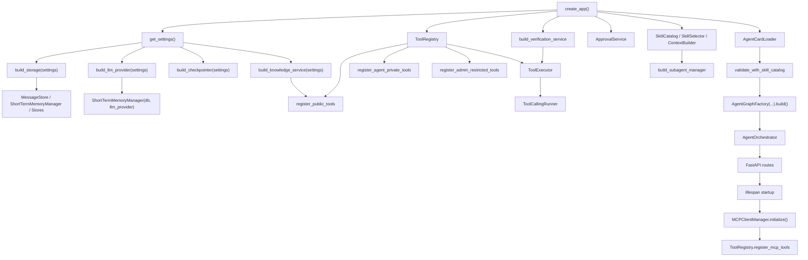
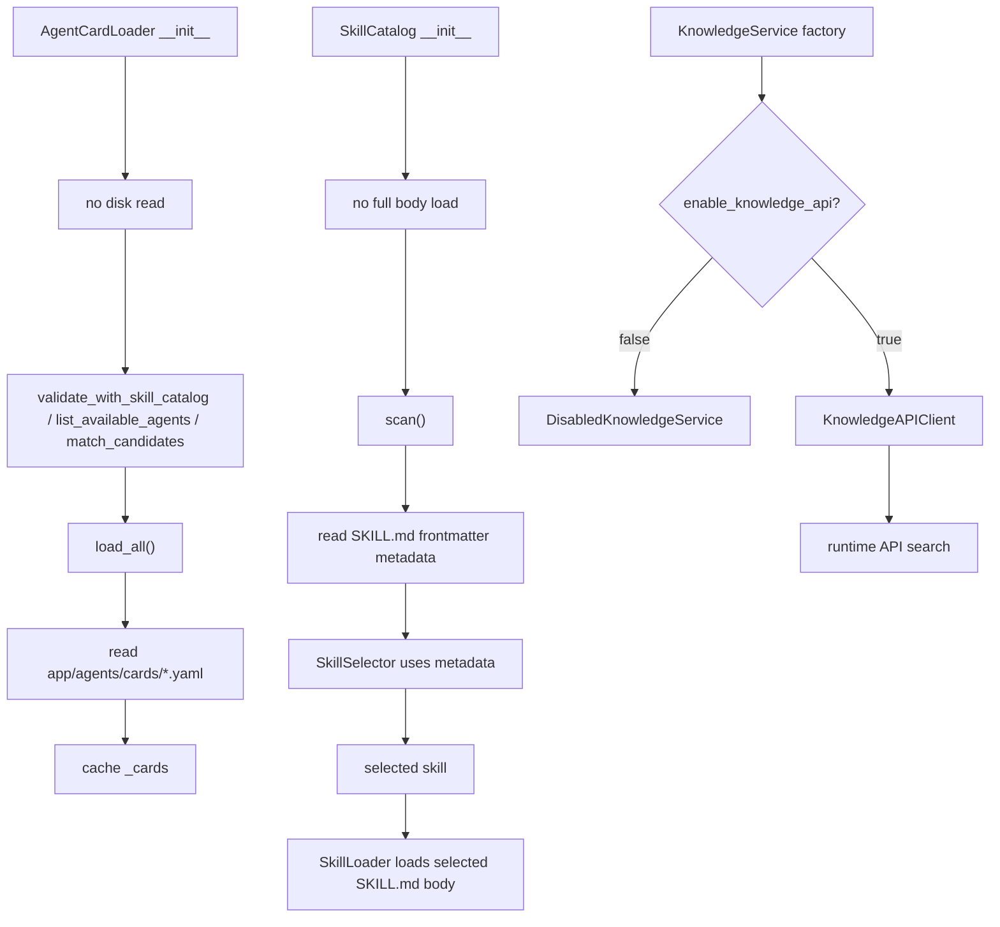

# Initialization Loading

本文基于当前源码说明应用启动时做了哪些初始化、加载、注册和校验动作。重点区分“对象创建”和“真正读取文件 / 访问外部资源”。

## 1. 启动初始化总览



## 2. create_app 中创建的对象

`app/main.py::create_app` 当前按真实代码顺序装配核心依赖：

| 初始化对象 | 代码位置 | 作用 | 是否立即加载外部资源 | 是否懒加载 | 备注 |
|---|---|---|---|---|---|
| `settings` | `app/config/settings.py::get_settings` | 读取环境配置 | 读取环境变量 / `.env` | 否 | 配置优先级由 settings 控制 |
| `storage` | `app/bootstrap/storage.py::build_storage` | 创建 SQLite DB 和各类 Store | 连接本地 SQLite | 否 | 聚合 message、approval、checkpoint、tool log、evidence 等 store |
| `llm_provider` | `app/llm/factory.py::build_llm_provider` | 统一模型调用入口 | 否 | 调用时访问模型 | Internal/OpenAI-compatible 按配置选择 |
| `ShortTermMemoryManager` | `app/memory/short_term_memory_manager.py` | 短期摘要读写和压缩 | 否 | 每次请求运行时读写 | 注入 `llm_provider` 做 LLM rolling summary |
| `langgraph_checkpointer` | `app/runtime/checkpoint.py::build_checkpointer` | LangGraph compile 使用的 checkpointer | 否 | graph 运行时使用 | 默认 `MemorySaver`，可配置尝试 SQLite checkpointer |
| `knowledge_service` | `app/knowledge/factory.py::build_knowledge_service` | 知识检索抽象 | 默认不访问外部 | 外部 API 调用时访问 | 默认 `DisabledKnowledgeService` |
| `MCPCapabilityRegistry` | `app/mcp/capability_registry.py` | 缓存 MCP tools 能力 | 否 | lifespan 初始化后填充 | 不在 create_app 期间 list_tools |
| `MCPClientManager` | `app/mcp/client_manager.py` | MCP client 消费方 | 否 | lifespan startup 初始化 | `ENABLE_MCP_CLIENT` 控制 |
| `SessionManager` | `app/session/session_manager.py` | 会话历史和摘要读取门面 | 否 | 请求时读取 | 包装 MessageStore / ShortTermMemory |
| `ToolRegistry` | `app/tools/registry.py` | 本地和 MCP 工具注册表 | 否 | 查询时过滤可见工具 | 保存内部 metadata，不直接暴露给 LLM |
| public tools | `app/tools/public_tools.py::register_public_tools` | 注册 `rag_search_tool` 等 public tools | 否 | 工具调用时执行 | 当前知识工具只有 `rag_search_tool` |
| private tools | `app/tools/agent_tools.py::register_agent_private_tools` | 注册 Agent 私有工具 | 否 | 工具调用时执行 | AgentCard 控制可见性 |
| admin tools | `app/bootstrap/tools.py::register_admin_restricted_tools` | 注册受限管理工具 | 否 | 工具调用时执行 | 受 auth/resource 校验控制 |
| `verification_service` | `app/bootstrap/verification.py::build_verification_service` | 统一 verification 框架 | 否 | 运行时执行 verifier | 包含 `DataPermissionVerifier` / `ComplianceVerifier` |
| `ToolExecutor` | `app/tools/executor.py` | 工具执行、鉴权、pre_tool verification、审批拦截、日志/evidence | 否 | 工具调用时执行 | 不把工具直接交给 LLM |
| `ToolCallingRunner` | `app/subagents/tool_calling_runner.py` | ReAct-style LLM + tools loop | 否 | 子 Agent 执行时运行 | 含 loop guardrails |
| `ApprovalService` | `app/approval/service.py` | 审批单创建、提交、callback、graph resume | 否 | 审批触发时运行 | callback 后走 Graph resume |
| `SkillCatalog` | `app/skills/catalog.py` | Skill metadata catalog | 创建时不加载 body | `scan` 时读 metadata，选中后读 body | validate 会触发 scan |
| `SkillSelector` | `app/skills/selector.py` | metadata-first skill 选择 | 否 | 子 Agent 执行时选择 | 支持 LLM rerank |
| `ContextBuilder` | `app/runtime/context_builder.py` | 主编排和子 Agent context 构建 | 否 | 请求时运行 | 委托 `KnowledgeHintBuilder` / `SkillContextResolver` |
| `SubAgentManager` | `app/bootstrap/agents.py::build_subagent_manager` | 注册子 Agent 实例 | 否 | dispatch 时调用 | 子 Agent 注入 ToolCallingRunner |
| `AgentCardLoader` | `app/agents/card_loader.py` | AgentCard YAML loader | `validate` 时读 YAML | 有缓存，可 force reload | Pydantic 校验 AgentCard |
| `AgentGraphFactory` | `app/runtime/graph.py` | 构建 LangGraph StateGraph | `.build()` 时编译 graph | graph 运行时执行节点 | 注入 checkpointer |
| `AgentOrchestrator` | `app/runtime/orchestrator.py` | 调用 compiled graph | 否 | 请求时 `ainvoke` | `thread_id = f"{session_key}:{request_id}"` |
| `RequestAdapter` / `ResponseAdapter` | `app/adapters` | API schema 与 graph state 适配 | 否 | 每次请求运行 | 入口/出口边界 |

## 3. create_app 期间立即发生的动作

这些动作在 `create_app()` 调用期间完成：

1. 读取 settings：`app/config/settings.py::get_settings`。
2. 创建 SQLite 相关 store：`app/bootstrap/storage.py::build_storage`。
3. 创建 LLMProvider：`app/llm/factory.py::build_llm_provider`。
4. 创建短期记忆管理器：`ShortTermMemoryManager(db=db, llm_provider=llm_provider)`。
5. 构建 LangGraph checkpointer：`app/runtime/checkpoint.py::build_checkpointer`。
6. 构建 KnowledgeService：`app/knowledge/factory.py::build_knowledge_service`。
7. 创建 MCP manager / capability registry，但不在此时发现 tools。
8. 创建 ToolRegistry 并注册 public/private/admin tools。
9. 创建 VerificationService。
10. 创建 ToolExecutor 和 ToolCallingRunner。
11. 创建 ApprovalService。
12. 创建 SkillCatalog、SkillSelector、ContextBuilder。
13. 构建并注册子 Agent：`app/bootstrap/agents.py::build_subagent_manager`。
14. 创建 AgentCardLoader，并调用 `validate_with_skill_catalog(skill_catalog)`；这会触发 AgentCard YAML 加载和 SkillCatalog metadata scan。
15. 调用 `AgentGraphFactory(...).build()` 创建、连边、编译 LangGraph。
16. 创建 AgentOrchestrator。
17. 注册 `/api/chat`、`/api/approval/callback`、`/api/approval/{approval_id}` routes。

## 4. 懒加载与缓存

### AgentCardLoader

`AgentCardLoader(cards_root=...)` 只是创建对象。真正读取 YAML 的入口包括：

- `load_all()`
- `list_available_agents()`
- `get_agent_card()`
- `match_candidates()`
- `validate_with_skill_catalog()`

当前 `create_app` 会调用 `validate_with_skill_catalog(skill_catalog)`，所以启动装配期间会读取 `app/agents/cards/*.yaml` 并做一次 AgentCard 与 SkillCatalog 的一致性校验。加载后通过 `_loaded` / `_cards` 缓存，`force_reload=True` 才重新读文件。

### SkillCatalog / SkillLoader

`SkillCatalog` 创建时不加载所有 skill body。`validate_with_skill_catalog` 会触发 catalog scan，读取 `app/skills/**/SKILL.md` frontmatter metadata 并校验 schema。完整 Skill body 由 `SkillLoader` 在选中具体 skill 后加载。

当前原则：

```text
启动/选择阶段：只使用 metadata
子 Agent 执行阶段：确定 selected_skill 后才读取完整 SKILL.md body
```

### Entity patterns

实体规则在 `app/query/entity_patterns.yaml`。`EntityExtractor` / `EntityPatternLoader` 负责读取 YAML、校验字段、编译 regex。它在 QueryRewrite / IntentRecognition 运行时使用；如果 YAML 格式错误，会在加载/抽取阶段暴露清晰错误。

## 5. 启动校验清单

| 校验 | 代码位置 | 说明 |
|---|---|---|
| AgentCard schema | `app/agents/card_loader.py`，`AgentCard(**raw)` | Pydantic 校验 YAML 字段 |
| AgentCard 与 SkillCatalog | `app/agents/card_loader.py::validate_with_skill_catalog` | 校验 AgentCard.skills 是否存在、agent 是否匹配、private tools 是否越权等 |
| Skill metadata schema | `app/skills/catalog.py` / `app/skills/metadata.py` | scan 时解析并校验 SKILL.md frontmatter |
| Tool 权限 | `app/tools/executor.py` | 启动只注册工具；真正的可见性、required args、auth/resource、审批等在运行时校验 |
| MCP capabilities | `app/main.py::lifespan` | lifespan startup 期间初始化 MCP client 并注册 MCP tools；未启用时不注册 |
| Verification | `app/bootstrap/verification.py` | 启动注册 verifier；真正校验在 graph `pre_answer_verify` 和 tool pre-check 阶段执行 |

## 6. ToolRegistry 初始化与工具注册

### 公有工具

代码位置：`app/tools/public_tools.py::register_public_tools`

当前注册：

- `rag_search_tool`
- `calculator_tool`
- `current_time_tool`

其中知识工具只有 `rag_search_tool`；旧 `get_knowledge` alias 已删除。

### Agent 私有工具

代码位置：`app/tools/agent_tools.py::register_agent_private_tools`

这些工具注册为 `scope="private"`，并绑定 agent_name。LLM 是否看得到由 AgentCard 的 `private_tools` 和 ToolRegistry 可见性过滤决定。

### admin restricted tools

代码位置：`app/bootstrap/tools.py::register_admin_restricted_tools`

这类工具用于管理/受限操作，仍必须经过 ToolExecutor 的 auth/resource 校验。

### MCP tools

MCP tools 不在 `create_app` 期间固定加载，而是在 FastAPI lifespan startup 中发现：

```text
MCPClientManager.initialize()
  -> MCP server list_tools
  -> MCPCapabilityRegistry 保存能力
  -> ToolRegistry.register_mcp_tools(...)
```

如果 `settings.enable_mcp_client=false`，不会初始化 MCP，也不会注册 MCP tools。

## 7. LangGraph 初始化

`AgentGraphFactory(...)` 只是创建工厂对象，`.build()` 才真正创建 StateGraph：

代码位置：`app/runtime/graph.py::AgentGraphFactory.build`

当前主图注册的核心节点包括：

```text
route_entry
load_session
resume_approved_tool
save_user_message
query_rewrite
intent_recognition
build_orchestrator_context
discover_agents
select_agent
assemble_task
dispatch_agent
build_clarification_answer
check_human_approval_required
create_approval_request
submit_approval_request
pause_for_approval
pre_answer_verify
regenerate_compliant_answer
fallback_answer
save_assistant_message
compress_short_memory
finalize_response
```

当前 compile 使用 `app/runtime/checkpoint.py::build_checkpointer(settings)` 返回的 checkpointer。默认是 LangGraph `MemorySaver`；如配置 SQLite 且当前依赖中存在官方 SQLite saver，会尝试使用官方 SQLite checkpointer，否则回退到 memory。

| 对象 | 用途 | 是否 LangGraph 原生 checkpointer |
|---|---|---|
| `MemorySaver` | 默认 LangGraph 运行时 checkpoint | 是 |
| 官方 SQLite saver（可选） | 配置可用时作为 durable checkpoint | 是 |
| `SQLiteCheckpointStore` | 项目自定义最终 state snapshot / 审计快照 | 否 |

`AgentOrchestrator.run` 调用 graph 时使用：

```text
thread_id = f"{session_key}:{request_id}"
config = {"configurable": {"thread_id": thread_id}}
```

这避免同一 session 下并发请求共享同一个 LangGraph thread。

## 8. FastAPI lifespan 启动时做了什么

`lifespan` 在 FastAPI 应用启动阶段执行，晚于 `create_app()` 对象装配。当前只负责 MCP：

1. 如果 `settings.enable_mcp_client=true`，调用 `MCPClientManager.initialize()`。
2. 从 `MCPCapabilityRegistry` 取 list_tools。
3. 调用 `ToolRegistry.register_mcp_tools(...)`。
4. 记录 `mcp_capabilities_registered` 日志。

如果没有启用 MCP client，则 lifespan 不注册 MCP tools。

## 9. /api/chat 请求前已经准备好什么

请求进入 `/api/chat` 前，系统已经完成：

- FastAPI routes 注册。
- compiled graph 创建。
- AgentOrchestrator 创建。
- ToolRegistry 中 public/private/admin tools 已注册。
- 子 Agent 实例已注册到 SubAgentManager。
- AgentCard 已加载并通过 SkillCatalog 校验。
- Skill metadata 已扫描并校验。
- SQLite stores 已创建。
- LLMProvider 已创建。
- VerificationService 已创建。
- MCP tools 已在 lifespan 中注册（仅当 MCP 启用）。

## 10. 运行时才发生的动作

这些动作不是启动时加载，而是每次请求或每次工具调用时发生：

- `load_session` 读取 messages / short_term_memory。
- `query_rewrite` 执行实体抽取、上下文改写和可选 LLM rewrite。
- `intent_recognition` 执行 LLM JSON 分类和 fallback。
- `AgentSelectionNode` 基于 intent/entities/query/AgentCard 做 hybrid routing。
- `ContextBuilder` 构建 orchestrator/subagent context，并按需调用 KnowledgeService。
- `SkillSelector` 基于 metadata 选择 skill；选中后才加载完整 Skill body。
- `ToolCallingRunner` 调用 LLM 并处理 tools loop。
- `ToolExecutor` 执行工具前做 required args、可见性、auth/resource、pre_tool verification、审批、幂等、日志/evidence。
- `human approval` 在写工具被调用时触发。
- `pre_answer_verify` 在返回用户前调用 `VerificationService(stage="pre_answer")`。
- `save_assistant_message` 保存最终或 pending answer。
- `compress_short_memory` 使用 previous summary + current turn 更新 short summary。

## 11. 懒加载与运行时加载图区分



## 12. 不一致点 / 待确认点

- `app/tools/public_tools.py` 中 `rag_search_tool` 参数描述存在中文 mojibake，建议后续单独清理代码文本。
- `SQLiteCheckpointStore` 仍是项目自定义 state snapshot，不等价于 LangGraph 官方 durable checkpointer。
- MCP client 当前是消费方预留和可选接入；是否实际注册到工具列表取决于运行时配置和 MCP server 可用性。

