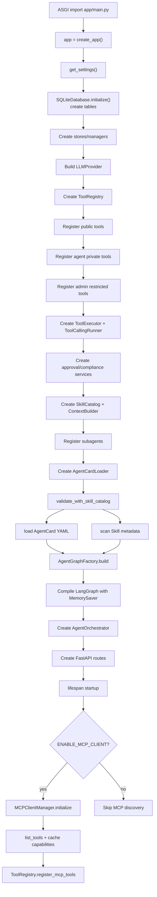
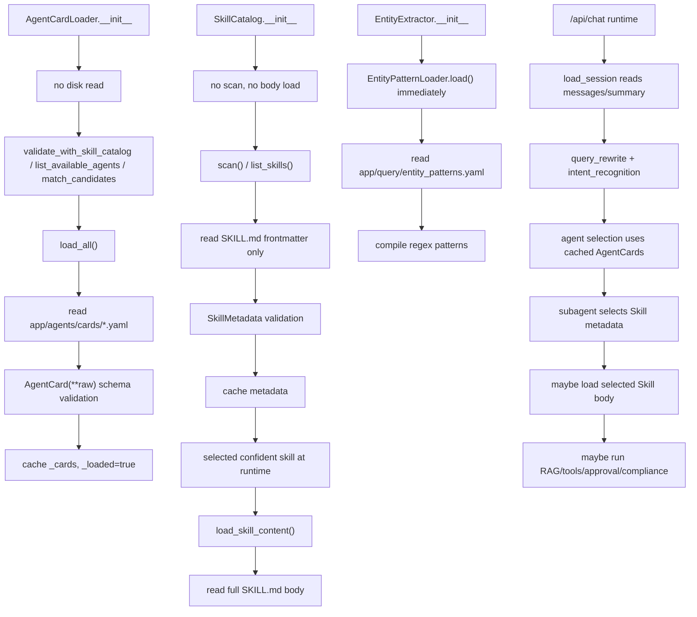

# Initialization Loading

本文基于当前真实代码说明项目启动时做了哪些对象创建、文件加载、工具注册、校验和运行时懒加载动作。重点区分：

- **对象创建**：Python 对象被实例化，但可能没有读磁盘、连外部系统或扫描目录。
- **立即加载/注册/校验**：`create_app()` 或 FastAPI lifespan startup 期间已经执行。
- **运行时加载**：每次 `/api/chat` 请求或工具调用时才执行。

## 1. 启动初始化总览

当前启动入口是 `app/main.py::create_app`，文件末尾还有 `app = create_app()`，所以模块被 ASGI server 导入时会创建默认应用实例。

```mermaid
flowchart TD
    A["create_app()"] --> B["get_settings()"]
    B --> C["SQLiteDatabase<br>初始化路径并 CREATE TABLE IF NOT EXISTS"]
    C --> D["MessageStore / ShortTermMemoryManager / SQLiteCheckpointStore"]
    D --> E["ToolExecutionLogStore / ApprovalStore"]
    E --> F["LongTermMemoryManager<br>预留空实现"]
    F --> G["build_llm_provider(settings)"]
    G --> H["build_knowledge_service()<br>DisabledKnowledgeService 或 KnowledgeAPIClient"]
    H --> I["MCPCapabilityRegistry"]
    I --> J["MCPClientManager<br>解析 MCP_SERVERS_JSON"]
    J --> K["SessionManager"]
    K --> L["ToolRegistry"]
    L --> M["register_public_tools()"]
    M --> N["register_agent_private_tools()"]
    N --> O["register admin restricted tools"]
    O --> P["ToolExecutor"]
    P --> Q["ToolCallingRunner"]
    Q --> R["FinalComplianceChecker"]
    R --> S["ApprovalSystemClient / ApprovalService"]
    S --> T["SkillCatalog / SkillSelector / ContextBuilder"]
    T --> U["SubAgentManager.register(...)"]
    U --> V["AgentCardLoader"]
    V --> W["validate_with_skill_catalog()<br>加载 AgentCard + 扫描 Skill metadata"]
    W --> X["AgentGraphFactory(...).build()<br>StateGraph compile"]
    X --> Y["AgentOrchestrator"]
    Y --> Z["FastAPI app + app.state + routes"]
    Z --> AA["lifespan startup"]
    AA --> AB["MCPClientManager.initialize()"]
    AB --> AC["ToolRegistry.register_mcp_tools()"]
```



注意：MCP 初始化不在 `create_app()` 主体中完成，而是在 FastAPI lifespan startup 中完成。AgentCardLoader 构造本身懒加载，但 `create_app()` 立即调用 `validate_with_skill_catalog()`，因此当前应用启动期间会触发一次 AgentCard YAML 读取和 Skill metadata 扫描。

## 2. create_app 中创建了哪些对象

| 初始化对象 | 代码位置 | 作用 | 是否立即加载外部资源 | 是否懒加载 | 备注 |
| ----- | ---- | -- | ---------- | ----- | -- |
| `settings` | `app/main.py::create_app`，`app/config/settings.py::get_settings` | 从环境变量构造不可变配置对象 | 否 | 否 | 每次调用 `get_settings()` 都新建 `Settings`，不是全局单例。 |
| `SQLiteDatabase` | `app/main.py::create_app`，`app/storage/sqlite.py::SQLiteDatabase.__init__` | 管理 SQLite 路径和连接 | 是，本地文件系统 | 否 | 构造时创建父目录并执行 `initialize()` 建表。 |
| `MessageStore` | `app/main.py::create_app`，`app/session/message_store.py::MessageStore.__init__` | 读写 `messages` | 否 | 运行时读写 | 复用已创建的 `SQLiteDatabase`。 |
| `ShortTermMemoryManager` | `app/main.py::create_app`，`app/memory/short_term_memory_manager.py::__init__` | 读写 `short_term_memory` | 否 | 运行时读写 | `load_session` 读摘要，`compress_short_memory` 更新摘要。 |
| `SQLiteCheckpointStore` | `app/main.py::create_app`，`app/runtime/checkpoint.py::SQLiteCheckpointStore.__init__` | 保存每次图执行后的最终 state snapshot | 否 | 运行时保存/读取 | 不是 LangGraph 原生 checkpointer。 |
| `ToolExecutionLogStore` | `app/main.py::create_app`，`app/tools/tool_execution_log_store.py::ToolExecutionLogStore` | `ToolExecutor` 工具执行日志 | 否 | 运行时写入 | 写 `tool_execution_logs`。 |
| `ApprovalStore` | `app/main.py::create_app`，`app/approval/store.py::SQLiteApprovalStore` | 审批请求和事件持久化 | 否 | 运行时读写 | 表结构由 `SQLiteDatabase.initialize()` 创建。 |
| `LongTermMemoryManager` | `app/main.py::create_app`，`app/memory/long_term_memory_manager.py` | 长期记忆接口预留 | 否 | 当前未实际使用 | MVP 返回空列表/不写入。 |
| `LLMProvider` | `app/main.py::create_app`，`app/llm/factory.py::build_llm_provider` | 统一模型调用层 | 否 | 请求时调用模型 | `ENABLE_OPENSDK_LLM=true` 时使用 OpenSDK，否则 `InternalLLMProvider`。 |
| `KnowledgeService` | `app/main.py::create_app`，`app/knowledge/factory.py::build_knowledge_service` | 知识检索抽象实现 | 否 | 运行时检索 | 默认 `DisabledKnowledgeService` 返回空结果；`ENABLE_KNOWLEDGE_API=true` 时使用 `KnowledgeAPIClient`。 |
| `MCPCapabilityRegistry` | `app/main.py::create_app`，`app/mcp/capability_registry.py` | 缓存 MCP tool 能力和 server 状态 | 否 | lifespan 写入 | 纯内存。 |
| `MCPClientManager` | `app/main.py::create_app`，`app/mcp/client_manager.py::MCPClientManager.__init__` | 管理上游 MCP client 和工具发现 | 只解析配置，不连 server | lifespan 初始化 | 构造时解析 `MCP_SERVERS_JSON`，真正 `initialize/list_tools` 在 lifespan。 |
| `SessionManager` | `app/main.py::create_app`，`app/session/session_manager.py` | 聚合消息和短期记忆读取 | 否 | 每次请求 `load_session` | 不在启动时读取会话。 |
| `ToolRegistry` | `app/main.py::create_app`，`app/tools/registry.py` | 工具注册和可见性计算 | 否 | 部分运行时计算 schema | 创建后立即注册本地工具。 |
| `ToolExecutor` | `app/main.py::create_app`，`app/tools/executor.py::ToolExecutor` | 工具执行、权限二次校验、MCP 分发、审批拦截 | 否 | 工具调用时执行 | 启动时不校验每个 Agent 的工具权限。 |
| `ToolCallingRunner` | `app/main.py::create_app`，`app/subagents/tool_calling_runner.py` | 子 Agent LLM tool loop | 否 | 子 Agent 执行时运行 | 依赖 LLMProvider 和 ToolExecutor。 |
| `FinalComplianceChecker` | `app/main.py::create_app`，`app/compliance/final_checker.py` | 最终合规检查 | 否 | 每次返回前运行 | 持有 LLMProvider。 |
| `ApprovalService` | `app/main.py::create_app`，`app/approval/service.py::ApprovalService` | 审批创建、提交、callback 恢复 | 否 | 工具触发审批后运行 | `ApprovalSystemClient` 只有提交时才发 HTTP。 |
| `SkillCatalog` | `app/main.py::create_app`，`app/skills/catalog.py::SkillCatalog.__init__` | Skill metadata 缓存和 body 按需加载 | 构造时否；校验时会扫描 metadata | 是 | `validate_with_skill_catalog()` 会触发 `scan(force_reload=True)`。 |
| `SkillSelector` | `app/main.py::create_app`，`app/skills/selector.py::SkillSelector` | 子 Agent 内选择 Skill | 否 | 子 Agent 执行时运行 | 只是规则选择器对象。 |
| `ContextBuilder` | `app/main.py::create_app`，`app/runtime/context_builder.py` | 构建主/子 Agent 上下文 | 否 | 请求运行时构建 | 内部创建 `SkillLoader`。 |
| `SubAgentManager` | `app/main.py::create_app`，`app/subagents/manager.py` | 子 Agent 注册表 | 否 | 运行时按名称调用 | `create_app()` 内立即注册 6 个子 Agent。 |
| `AgentCardLoader` | `app/main.py::create_app`，`app/agents/card_loader.py::AgentCardLoader.__init__` | AgentCard YAML 加载器和候选匹配 | 构造时否；校验时会加载 | 是 | `_loaded/_cards` 缓存已加载 AgentCard。 |
| `AgentSelectionNode` | `app/main.py::create_app`，`app/agents/selection.py` | Hybrid Agent router | 否 | 每次请求选择 Agent | 持有 `AgentCardLoader` 和可选 LLM router。 |
| `AgentTaskAssembler` | `app/main.py::create_app`，`app/agents/task_assembler.py` | 把选中 AgentCard 和上下文封装成任务 | 否 | 每次请求运行 | 无外部加载。 |
| `DispatchAgentNode` | `app/main.py::create_app`，`app/agents/dispatcher.py` | 派发任务到 SubAgentManager | 否 | 每次请求运行 | 无外部加载。 |
| `AgentGraphFactory` | `app/main.py::create_app`，`app/runtime/graph.py::AgentGraphFactory` | LangGraph 图工厂 | 否 | `.build()` 才建图 | 构造时如果未传 checkpointer，会创建 `MemorySaver`。 |
| compiled graph | `app/main.py::create_app`，`app/runtime/graph.py::AgentGraphFactory.build` | 编译 LangGraph StateGraph | 否 | 运行时执行节点 | `build()` 立即 add_node/add_edge/compile。 |
| `AgentOrchestrator` | `app/main.py::create_app`，`app/runtime/orchestrator.py` | 包装 compiled graph 和最终 snapshot store | 否 | 每次 `/api/chat` 调用 | 用 `session_key` 作为 LangGraph `thread_id`。 |
| `RequestAdapter` | `app/main.py::create_app`，`app/adapters/request_adapter.py` | 外部请求转内部消息 | 否 | 每次请求运行 | 无外部加载。 |
| `ResponseAdapter` | `app/main.py::create_app`，`app/adapters/response_adapter.py` | Graph state 转 API 响应 | 否 | 每次请求运行 | 无外部加载。 |

## 3. 启动时立即加载/注册/校验的动作

这些动作在 `create_app()` 调用期间就发生：

1. settings 读取：`app/main.py::create_app` 调 `app/config/settings.py::get_settings`。读取环境变量并构造 `Settings`。
2. SQLite 本地初始化：`app/storage/sqlite.py::SQLiteDatabase.__init__` 调 `initialize()`，创建 `.data` 目录并执行建表 SQL。表包括 `messages`、`short_term_memory`、`graph_checkpoints`、`tool_execution_logs`、`approval_requests`、`approval_events`。
3. Store 对象创建：`MessageStore`、`ShortTermMemoryManager`、`SQLiteCheckpointStore`、`ToolExecutionLogStore`、`SQLiteApprovalStore` 都在 `app/main.py::create_app` 创建，但不立即读写业务数据。
4. ToolRegistry 创建：`app/tools/registry.py::ToolRegistry.__init__` 初始化内存字典。
5. 公有工具注册：`app/tools/public_tools.py::register_public_tools` 立即注册 `rag_search_tool`、`get_knowledge`、`calculator_tool`、`current_time_tool`。
6. Agent 私有工具注册：`app/tools/agent_tools.py::register_agent_private_tools` 立即注册 troubleshooting、policy、claim 私有工具，其中 `update_policy_status` 标记 `is_write=True`。
7. admin restricted tools 注册：`app/main.py::create_app` 直接调用 `tool_registry.register_private(agent_name="admin_agent", ...)` 注册 `shell_exec`、`http_request`、`mcp_http.call_tool`。这些工具只有 AgentCard 显式授权给对应 agent 时才可见。
8. Entity patterns 加载：`QueryRewriteNode(llm_provider=llm_provider)` 和 `IntentRecognitionNode(llm_provider=llm_provider)` 构造时都会默认创建 `EntityExtractor()`；`EntityExtractor.__init__` 会立即调用 `EntityPatternLoader.load()` 读取并编译 `app/query/entity_patterns.yaml`。
9. SubAgentManager 注册子 Agent：`app/main.py::create_app` 调 `subagent_manager.register(...)` 注册 `troubleshooting_agent`、`compliance_agent`、`document_parse_agent`、`change_impact_analysis_agent`、`policy_query_agent`、`claim_agent`。
10. AgentCardLoader 创建：`AgentCardLoader(cards_root=cards_root)` 只保存路径，不读 YAML。
11. AgentCard 与 SkillCatalog 一致性校验：`app/main.py::create_app` 调 `agent_card_loader.validate_with_skill_catalog(skill_catalog)`，触发 AgentCard YAML 读取和 Skill metadata 扫描。
12. LangGraph 编译：`AgentGraphFactory(...).build()` 创建 `StateGraph`，注册节点、普通边、条件边，并 `compile(checkpointer=self.checkpointer)`。
13. FastAPI route 注册：`@app.post("/api/chat")`、`@app.post("/api/approval/callback")`、`@app.get("/api/approval/{approval_id}")` 在 `create_app()` 中注册。

## 4. 哪些东西是懒加载

### AgentCardLoader

`app/agents/card_loader.py::AgentCardLoader.__init__` 只保存 `cards_root`，初始化 `_cards={}` 和 `_loaded=False`。此时不会读取 `app/agents/cards/*.yaml`。

真正读取 AgentCard 的函数是 `load_all(force_reload=False)`：

- 遍历 `cards_root.glob("*.yaml")`
- 调 `_parse_card_yaml(...)`
- 用 `AgentCard(**raw)` 做 Pydantic schema 校验
- 写入 `_cards`
- 设置 `_loaded=True`

以下函数会间接调用 `load_all()`：

- `list_available_agents()`
- `get_agent_card()`
- `match_candidates()`
- `validate_with_skill_catalog()`

当前 `app/main.py::create_app` 调用了 `validate_with_skill_catalog()`，所以应用创建期间会触发一次 AgentCard 加载和校验。后续请求中 `list_available_agents()`、`match_candidates()` 使用 `_cards` 缓存，不重复读磁盘。`load_all(force_reload=True)` 会强制重新读取 YAML。

### SkillCatalog

`app/skills/catalog.py::SkillCatalog.__init__` 只保存 `skills_root`，初始化 `_metadata_by_id={}` 和 `_scanned=False`，不会立即扫描 `SKILL.md`。

`scan(force_reload=True)` 在 `AgentCardLoader.validate_with_skill_catalog(skill_catalog)` 中被调用，因此当前启动期间会扫描 Skill metadata。扫描行为只解析 frontmatter metadata：

- 路径：`app/skills/catalog.py::SkillCatalog.scan`
- 只扫描 `app/skills/*/*/SKILL.md`
- 跳过 `deprecated`
- 调 `app/skills/metadata.py::metadata_from_skill_file`
- 校验完整 metadata 字段
- 缓存到 `_metadata_by_id`

`list_skills(agent_name)` 依赖 `scan()` 的结果；如果尚未扫描，会自动调用 `scan()`。Skill body 和 Skill metadata 是分开加载的：metadata 在 `scan()` 时读取，完整 `SKILL.md` body 只有选中 Skill 后才通过 `SkillCatalog.load_skill_content()` 或 `SkillLoader.load()` 读取。

只加载 metadata 的场景：

- 启动校验 `validate_with_skill_catalog()`
- 子 Agent 执行前构建候选 Skill
- SkillSelector 打分

加载完整 body 的场景：

- `app/runtime/context_builder.py::ContextBuilder.build_for_subagent` 中 SkillSelector 置信选中某个 Skill，且不是 fallback generic execution 时，调用 `self.skill_loader.load(selection.selected_skill_id)`。

### Entity patterns

这里要特别注意：当前实体规则不是第一次请求才懒加载。

`app/query/entity_extractor.py::EntityExtractor.__init__` 在未传入 patterns 时会立即执行：

```python
(loader or EntityPatternLoader()).load()
```

而 `create_app()` 在创建 `QueryRewriteNode` 和 `IntentRecognitionNode` 时没有传入自定义 extractor，所以会各自创建一个 `EntityExtractor`，因此 `app/query/entity_patterns.yaml` 在 `create_app()` 中构造这些节点时被读取和编译两次。

YAML 加载失败、缺 required 字段、regex 编译失败都会抛 `ValueError`，从而使 `create_app()` 失败。

## 启动校验清单

### AgentCard 与 SkillCatalog 校验

代码位置：`app/agents/card_loader.py::AgentCardLoader.validate_with_skill_catalog`。

当前校验内容：

- 每个 enabled agent 至少有一个 enabled default skill。
- AgentCard `skills` 中声明的 `skill_id` 必须存在于 SkillCatalog。
- Skill metadata 的 `agent` 必须等于对应 AgentCard 的 `agent_name`。
- Skill metadata 的 `private_tools` 必须是 AgentCard `private_tools` 的子集。
- 每个 Skill 引用的 `agent` 必须存在真实 AgentCard。

此校验在 `app/main.py::create_app` 中立即调用，因此启动时会发现 AgentCard/Skill 不一致问题。

### AgentCard schema 校验

代码位置：`app/agents/card_loader.py::AgentCardLoader.load_all`。

读取 YAML 后执行 `AgentCard(**raw)`，由 `app/schemas/agent_card.py::AgentCard` 做 Pydantic 校验。字段类型或必填字段错误会导致加载失败。

### Skill metadata schema 校验

代码位置：

- `app/skills/catalog.py::SkillCatalog.scan`
- `app/skills/metadata.py::metadata_from_skill_file`
- `app/skills/metadata.py::validate_skill_frontmatter`
- `app/schemas/skill.py::SkillMetadata`

`scan()` 读取每个 `SKILL.md` 的 frontmatter，校验必填字段：`skill_id`、`name`、`description`、`agent`、`intent_tags`、`required_entities`、`optional_entities`、`private_tools`、`enabled`、`is_default`。缺字段、旧格式、重复 `skill_id`、`skill_id` 不符合 `<agent_name>.<skill_name>` 都会报错。

### Tool 权限校验是否启动时完成

启动时只是注册工具到 `ToolRegistry`，不会对每个 AgentCard 做运行时权限判定。真正的二次校验在工具调用时发生：

- `app/tools/executor.py::ToolExecutor.execute`
- `app/tools/registry.py::ToolRegistry.is_tool_available_for_agent`

因此工具注册成功不代表某个 Agent 可以调用它；运行时还要看 AgentCard 的 `private_tools`、`public_tools_allowed`、`mcp_tools`、`mcp_tool_scopes`。

### MCP 校验

MCP tools 不是 `create_app()` 期间固定加载。`MCPClientManager` 构造时只解析 `MCP_SERVERS_JSON` / `MCP_SERVERS`。真正的 server initialize 和 `list_tools` 在 FastAPI lifespan startup 中执行：

- `app/main.py::lifespan`
- `app/mcp/client_manager.py::MCPClientManager.initialize`

单个 MCP server 初始化失败不会阻塞整个服务启动；代码捕获异常，写入 `MCPCapabilityRegistry.mark_server_unavailable(...)`，并记录 warning 日志。

## ToolRegistry 初始化与工具注册

### 公有工具

代码位置：`app/tools/public_tools.py::register_public_tools`。

`create_app()` 中执行：

```python
register_public_tools(tool_registry, knowledge_service)
```

当前公有工具：

- `rag_search_tool`
- `get_knowledge`
- `calculator_tool`
- `current_time_tool`

公有工具是否对某个 Agent 可见，运行时还取决于 AgentCard `public_tools_allowed`。

### Agent 私有工具

代码位置：`app/tools/agent_tools.py::register_agent_private_tools`。

`create_app()` 中执行：

```python
register_agent_private_tools(tool_registry)
```

当前私有工具包括：

- `troubleshooting_agent`: `query_task_status`、`query_node_status`、`query_internal_log`
- `policy_query_agent`: `query_policy_info`、`query_policy_status`、`update_policy_status`
- `claim_agent`: `query_claim_case`、`query_claim_progress`

其中 `update_policy_status` 标记为写工具 `is_write=True`，普通执行时会触发人工审批。

### admin restricted tools

代码位置：`app/main.py::create_app`。

当前直接注册到 `admin_agent` 私有工具：

- `shell_exec`
- `http_request`
- `mcp_http.call_tool`

这些是受限运维工具。因为当前没有普通业务 AgentCard 声明这些工具，所以不会自动暴露给业务子 Agent。

### MCP tools

MCP tools 在 FastAPI lifespan startup 阶段注册：

```text
MCPClientManager.initialize()
-> MCP Server initialize/list_tools
-> MCPCapabilityRegistry.upsert_tools()
-> ToolRegistry.register_mcp_tools()
```

代码位置：

- `app/main.py::lifespan`
- `app/mcp/client_manager.py::MCPClientManager.initialize`
- `app/mcp/capability_registry.py::MCPCapabilityRegistry.upsert_tools`
- `app/tools/registry.py::ToolRegistry.register_mcp_tools`

如果 `settings.enable_mcp_client` 为 false，则 lifespan 不会初始化 MCP，也不会注册 MCP tools。若启用但没有配置 MCP servers，`server_configs` 为空，注册结果也是空。

## 7. LangGraph 是什么时候初始化的

`AgentGraphFactory(...)` 只是创建工厂对象和保存依赖。真正创建 LangGraph 的动作发生在 `app/runtime/graph.py::AgentGraphFactory.build`：

- `StateGraph(AgentGraphState)`
- `add_node(...)`
- `set_entry_point(...)`
- `add_edge(...)`
- `add_conditional_edges(...)`
- `compile(checkpointer=self.checkpointer)`

当前 `AgentGraphFactory.__init__` 如果没有传入 checkpointer，会创建 `langgraph.checkpoint.memory.MemorySaver()`。`create_app()` 没有传入自定义 checkpointer，所以当前 graph compile 使用的是 `MemorySaver`。

| 对象 | 用途 | 是否 LangGraph 原生 checkpointer |
| --------------------- | -------------------------- | ---------------------------- |
| `MemorySaver` | LangGraph 运行时内存 checkpoint，传给 `graph.compile(checkpointer=...)` | 是 |
| `SQLiteCheckpointStore` | 项目自定义最终 state 快照，`AgentOrchestrator.run` 在图执行完成后保存 | 否 |

`SQLiteCheckpointStore` 当前不参与 `graph.compile`，它不是 LangGraph 官方持久化 checkpointer。代码注释也说明它是“第二阶段 checkpoint 抽象和后续替换官方 SQLite/PostgreSQL checkpointer 的接入点”。

## 8. FastAPI lifespan 启动时做了什么

`create_app()` 返回 FastAPI 应用对象；lifespan 是 FastAPI 服务启动时进入的异步上下文。二者区别是：

- `create_app()`：同步组装依赖、注册本地工具、校验 AgentCard/Skill、编译 graph、注册 routes。
- lifespan startup：服务启动时执行异步初始化，目前主要用于 MCP 发现。

代码位置：`app/main.py::create_app` 内部 `lifespan(app: FastAPI)`。

当前 lifespan 做的事情：

1. 如果 `settings.enable_mcp_client` 为 true，调用 `await mcp_client_manager.initialize()`。
2. `MCPClientManager.initialize()` 对每个 enabled server 创建 client、initialize、list_tools，并写入 `MCPCapabilityRegistry`。
3. 调 `tool_registry.register_mcp_tools(mcp_capability_registry.list_tools())` 把发现的 MCP tools 注册进 ToolRegistry。
4. 写 `mcp_capabilities_registered` 日志。
5. `yield` 后没有 shutdown 清理逻辑。

MCP 单个 server 失败不会阻塞启动；`MCPClientManager.initialize()` 内部捕获异常并标记 server unavailable。但如果 `tool_registry.register_mcp_tools(...)` 本身抛异常，当前 lifespan 没有额外 try/catch。

## 9. /api/chat 请求前已经准备好了什么

在一个请求进入 `/api/chat` 前，系统通常已经完成：

- FastAPI routes 已注册：`/api/chat`、`/api/approval/callback`、`/api/approval/{approval_id}`。
- SQLite 表结构已创建。
- Store 对象已挂到 `app.state`。
- ToolRegistry 已创建，本地 public/private/admin restricted tools 已注册。
- ToolExecutor、ToolCallingRunner、FinalComplianceChecker、ApprovalService 已创建。
- SubAgentManager 已注册 6 个子 Agent。
- AgentCard 已加载并缓存，因为 `validate_with_skill_catalog()` 在启动中调用了 `load_all()`。
- Skill metadata 已扫描并缓存，因为 `validate_with_skill_catalog()` 调用了 `skill_catalog.scan(force_reload=True)`。
- AgentCard 与 SkillCatalog 一致性已校验。
- Entity patterns YAML 已加载并编译，因为 QueryRewriteNode 和 IntentRecognitionNode 构造时创建了 EntityExtractor。
- LangGraph 已 build/compile，AgentOrchestrator 已创建。
- LLMProvider 已创建，但尚未调用模型。
- MCP tools 已在 lifespan 中注册到 ToolRegistry，前提是 `enable_mcp_client=true` 且 MCP servers 配置/发现成功。

## 10. 哪些不是启动时加载，而是运行时才发生

- `load_session`：每次请求运行时在 `app/runtime/graph.py::AgentGraphFactory.load_session` 中调用 `SessionManager.load_session`，读取 `messages` 和 `short_term_memory`。
- `query_rewrite`：每次请求运行时执行 `QueryRewriteNode.rewrite`。
- `intent_recognition`：每次请求运行时执行 `IntentRecognitionNode.recognize`。
- AgentSelection：每次请求运行时基于 query、intent、sub_intent、entities 和 AgentCard 缓存重新打分。
- Skill body：不是启动时加载；只有子 Agent 执行中置信选中某个 Skill，才调用 `SkillLoader.load` / `SkillCatalog.load_skill_content` 读取完整 `SKILL.md`。
- RAG 检索：运行时发生。主流程 `ContextBuilder.build_for_orchestrator` 做 lightweight hints；子 Agent context 也会构建知识 hint；LLM 还可通过可见 public tools 调用 RAG。
- Tool schema 生成：子 Agent 执行时通过 `ToolRegistry.list_tools_for_agent(agent_card)` 生成可见工具 schema。
- ToolExecutor 权限校验：每次工具调用时在 `ToolExecutor.execute` 内执行。
- human approval：运行时写工具被调用时才触发。
- final_compliance_check：每次返回用户前运行。
- Approval external HTTP：只有 `ApprovalService.submit_to_external_approval_system` 调用 `ApprovalSystemClient.submit_approval_request` 时才发生。

## 11. Mermaid 图

### 图一：应用启动初始化流程图



### 图二：懒加载与运行时加载区别图



## 不一致点/待确认点

1. `EntityExtractor` 当前不是第一次 `extract()` 时懒加载，而是在 `QueryRewriteNode` / `IntentRecognitionNode` 构造时立即加载 YAML。若期望“第一次请求才加载”，需要改 `EntityExtractor` 的实现。
2. `SQLiteCheckpointStore` 名字容易误解为 LangGraph 原生 checkpointer；当前它只保存最终 state snapshot，真正传给 LangGraph compile 的是 `MemorySaver`。
3. 旧工具调用日志路径已删除；当前主工具循环通过 `ToolExecutor` 写 `tool_execution_logs`。
4. `LongTermMemoryManager` 当前只是预留实现，启动时创建对象，但主流程没有实际长期记忆加载。
5. `MCPClientManager.__init__` 会解析 `MCP_SERVERS_JSON`。如果该环境变量不是合法 JSON，错误会发生在 `create_app()` 期间，而不是 lifespan。
