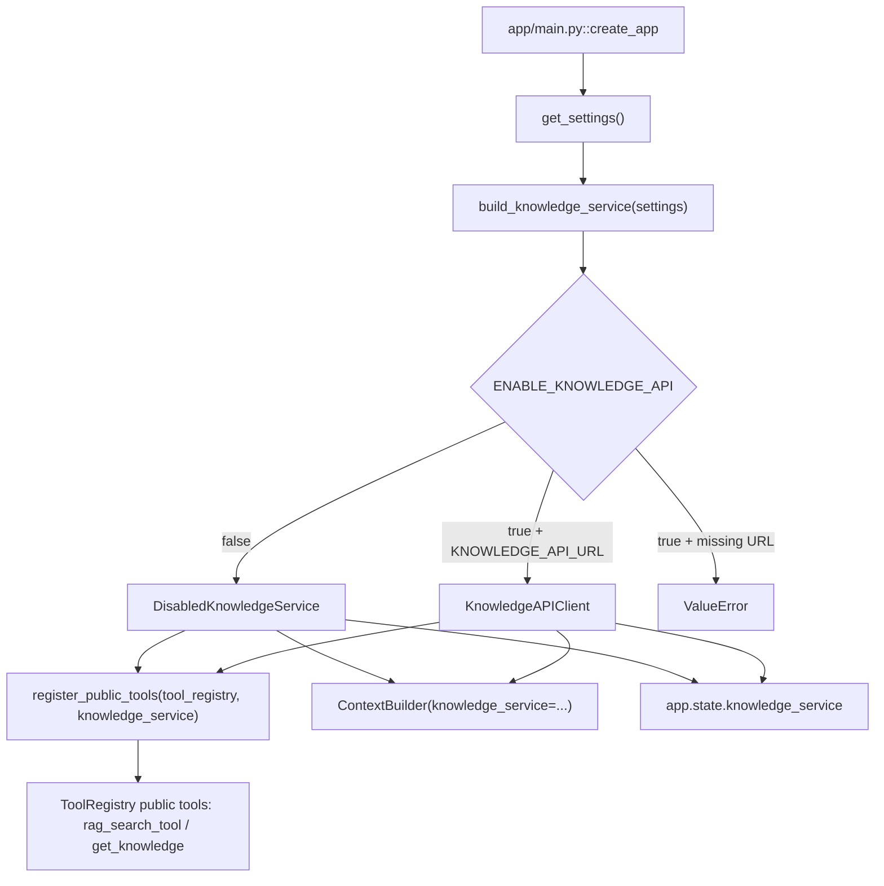
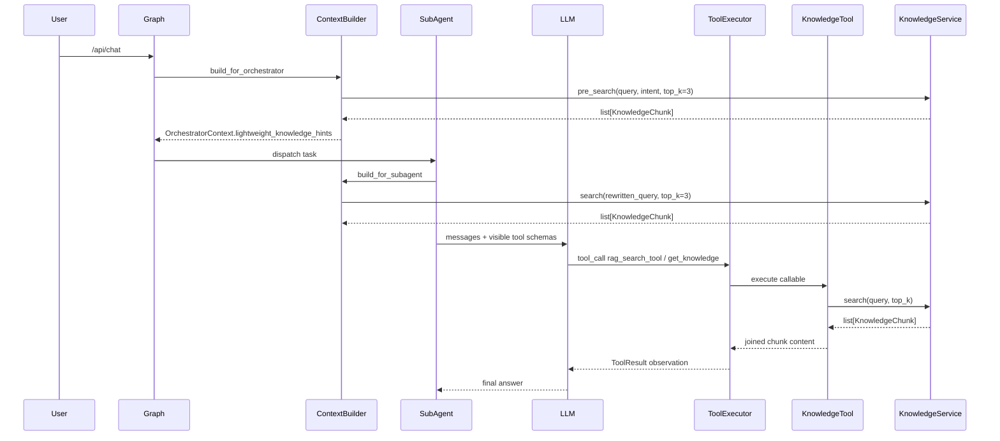
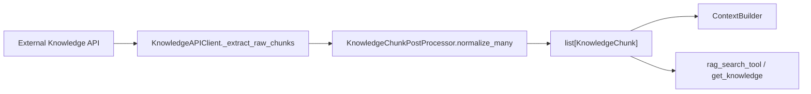

# Knowledge Service Usage

## 1. Overview

`KnowledgeService` 是当前项目里的知识检索抽象，定义在 `app/knowledge/service.py::KnowledgeService`。它不是 Agent，也不是 MCP Server，而是一个可被多个组件复用的检索接口：

- `ContextBuilder` 直接调用它，为主流程构建轻量知识提示，并为子 Agent 构建子任务知识提示。
- `public_tools.py` 把它包装成 `rag_search_tool` / `get_knowledge`，作为 public tools 暴露给允许使用公有工具的子 Agent。
- `ToolCallingRunner` 和 `ToolExecutor` 本身不持有 KnowledgeService，但当 LLM 调用知识工具时，会通过工具 callable 间接触达它。

当前默认实现不是内存 mock 知识库。`app/main.py::create_app` 通过 `app/knowledge/factory.py::build_knowledge_service` 初始化知识服务；默认 `ENABLE_KNOWLEDGE_API=false` 时使用 `DisabledKnowledgeService`，返回空 chunks。

## 2. Current Implementations

| 类 / 模块 | 文件路径 | 职责 | 主要方法 | create_app 中实际使用 |
|---|---|---|---|---|
| `KnowledgeService` | `app/knowledge/service.py` | 协议接口，约束检索服务形状 | `search(query, top_k)`, `pre_search(query, intent, top_k)` | 作为类型抽象使用 |
| `KnowledgeChunk` | `app/knowledge/schemas.py` | 内部统一 chunk schema | `content`, `source`, `score`, `metadata` | 被 ContextBuilder、tools、client 消费 |
| `DisabledKnowledgeService` | `app/knowledge/disabled_service.py` | 知识库关闭时的安全空实现 | `search`, `pre_search` 均返回 `[]` | 默认使用 |
| `KnowledgeAPIClient` | `app/integrations/knowledge_api_client.py` | 外部知识库 API 客户端 | `/knowledge/search`, `/knowledge/pre-search` | 仅 `ENABLE_KNOWLEDGE_API=true` 且有 URL 时使用 |
| `KnowledgeChunkPostProcessor` / `KnowledgeChunkNormalizer` | `app/knowledge/chunk_post_processor.py` | 将外部 raw chunks 规范化为 `KnowledgeChunk` | `normalize_many`, `normalize_one` | `KnowledgeAPIClient` 内部使用 |
| `FakeKnowledgeService` | `tests/fakes/fake_knowledge_service.py` | 测试 fake | `search`, `pre_search` | 测试专用，不在 app 主路径使用 |

当前未发现 `app/knowledge/in_memory_service.py` 或 `InMemoryKnowledgeService` 生产残留。

## 3. Initialization Flow

知识服务初始化入口在 `app/main.py::create_app`：

1. `settings = get_settings()` 读取 `app/config/settings.py::Settings`。
2. `knowledge_service = build_knowledge_service(settings)` 调用 `app/knowledge/factory.py::build_knowledge_service`。
3. `register_public_tools(tool_registry, knowledge_service)` 把知识服务包装成 public tools。
4. `ContextBuilder(..., knowledge_service=knowledge_service, ...)` 将同一个实例注入上下文构建器。
5. `app.state.knowledge_service = knowledge_service` 暴露给测试和运行时检查。

配置字段在 `app/config/settings.py::Settings`：

| 配置 | 默认值 | 含义 |
|---|---:|---|
| `enable_knowledge_api` / `ENABLE_KNOWLEDGE_API` | `False` | 是否启用外部知识库 API |
| `knowledge_api_url` / `KNOWLEDGE_API_URL` | `None` | 外部知识库 base URL |
| `knowledge_api_timeout` / `KNOWLEDGE_API_TIMEOUT` | `10.0` | HTTP 超时时间 |

`build_knowledge_service(settings)` 的行为：

- `enable_knowledge_api=false`：返回 `DisabledKnowledgeService()`。
- `enable_knowledge_api=true` 且 `knowledge_api_url` 为空：抛出 `ValueError("ENABLE_KNOWLEDGE_API=true requires KNOWLEDGE_API_URL.")`。
- `enable_knowledge_api=true` 且 URL 存在：返回 `KnowledgeAPIClient(BaseIntegrationHTTPClient(...))`。

## 4. Direct Usage in ContextBuilder

`ContextBuilder` 是当前直接调用 `KnowledgeService` 的核心组件，代码在 `app/runtime/context_builder.py`。

### Orchestrator 轻量预检索

`app/runtime/context_builder.py::ContextBuilder.build_for_orchestrator` 调用：

```text
_build_lightweight_hints(
  query=f"{original_query} {rewritten_query}",
  intent=intent,
)
```

`_build_lightweight_hints` 在有 `knowledge_service` 时调用：

```python
await self.knowledge_service.pre_search(query=query, intent=intent, top_k=3)
```

返回值处理：

- 输入：原始 query + rewritten query、intent。
- 输出：`list[str]`，即 `[chunk.content for chunk in chunks]`。
- 写入：`OrchestratorContext.lightweight_knowledge_hints`。
- 后续进入：`AgentTaskAssembler` 会把它带入 `SubAgentTask.lightweight_knowledge_hints`，`BaseSubAgent.build_messages` 会把 `parent_context.lightweight_knowledge_hints` 写入 LLM user message。

### 子 Agent 知识提示

`app/runtime/context_builder.py::ContextBuilder.build_for_subagent` 调用：

```python
knowledge_hint = await self._build_subagent_knowledge_hint(parent_context.rewritten_query)
```

`_build_subagent_knowledge_hint` 在有 `knowledge_service` 时调用：

```python
await self.knowledge_service.search(query=query, top_k=3)
```

返回值处理：

- 输入：`parent_context.rewritten_query`。
- 输出：`"\n".join(chunk.content for chunk in chunks)` 或 `None`。
- 写入：`SubAgentContext.knowledge_hint`。

当前注意点：`SubAgentContext.knowledge_hint` 已经构建，但通用 `app/subagents/base.py::BaseSubAgent.build_messages` 当前只把 `parent_context.lightweight_knowledge_hints` 放进 prompt，没有直接写入 `sub_context.knowledge_hint`。如果希望子 Agent prompt 显式包含这段搜索结果，需要后续补充。

## 5. Knowledge as Public Tools

知识工具注册在 `app/tools/public_tools.py::register_public_tools`，不是在 Agent 私有工具注册里完成。

### `rag_search_tool`

定义位置：`app/tools/public_tools.py::build_rag_search_tool`

注册位置：`app/tools/public_tools.py::register_public_tools`

行为：

- 工具 callable 调用 `knowledge_service.search(query=query, top_k=top_k)`。
- 没有 chunks 且 service 有 `disabled_reason` 时返回 `"knowledge api disabled"`。
- 没有 chunks 且不是 disabled service 时返回 `"No matching knowledge chunks found."`。
- 有 chunks 时返回多个 `chunk.content` 的换行拼接。

LLM tool schema 由 `ToolRegistry.get_tool_schema` 统一输出为 OpenAI function-calling 结构。`rag_search_tool` 的参数 schema 来自 `app/tools/public_tools.py::RAG_SEARCH_PARAMETERS`：

- `query`：required。
- `top_k`：可选，默认由工具函数使用 `3`。

注意：函数签名里有 `namespace: str | None = None`，但当前参数 schema 不暴露 `namespace`，实现也没有把 namespace 传给 KnowledgeService。

### `get_knowledge`

定义位置：`app/tools/public_tools.py::build_get_knowledge_tool`

注册位置：`app/tools/public_tools.py::register_public_tools`

当前定位：legacy alias。描述中明确建议新提示优先使用 `rag_search_tool`，但 `get_knowledge` 仍保留用于兼容已有 Skill / 子 Agent。

行为和 `rag_search_tool` 基本一致：

- 调用 `knowledge_service.search(query=query, top_k=top_k)`。
- `query` required。
- 返回 disabled reason、空结果提示或 chunks 内容拼接。

## 6. Is KnowledgeService Used as Private Tool?

结论：当前 KnowledgeService 没有被注册成 private tool。

需要区分三个文件：

| 文件 | 与知识服务关系 | 是否注册知识工具 | 注册类型 |
|---|---|---:|---|
| `app/tools/public_tools.py` | 定义并注册 `build_rag_search_tool` 和 `build_get_knowledge_tool` | 注册 `rag_search_tool` / `get_knowledge` | public tools |
| `app/tools/agent_tools.py` | 定义并注册各 Agent 私有工具，包括 `query_internal_log` | 不注册知识工具 | private tools |

所以，当前已经没有 `builtin_tools.py` 主路径；知识工具的定义和注册都在 `public_tools.py`，私有业务工具在 `agent_tools.py`。

## 7. Runtime Tool Calling Flow

当 LLM 在子 Agent 执行阶段调用 `rag_search_tool` 或 `get_knowledge` 时，链路如下：

1. `BaseSubAgent.run` 读取当前 `AgentCard`。
2. `BaseSubAgent.get_available_tool_schemas` 调用 `ToolRegistry.list_tools_for_agent(agent_card)`。
3. `ToolRegistry` 根据 `AgentCard.private_tools`、`AgentCard.public_tools_allowed`、`AgentCard.mcp_tools`、`AgentCard.mcp_tool_scopes` 过滤可见工具。
4. 如果 `AgentCard.public_tools_allowed=true`，`rag_search_tool` / `get_knowledge` 会进入 LLM 可见工具列表。
5. `ToolCallingRunner.run` 把 `messages` 和 `tools` 传给 `LLMProvider.chat(..., scene="subagent_reasoning")`。
6. LLM 返回 tool call。
7. `ToolCallingRunner` 解析 tool call 后调用 `ToolExecutor.execute(...)`。
8. `ToolExecutor` 做工具存在性、AgentCard 可见性、required 参数、写工具审批等校验。
9. 对 local public knowledge tool，`ToolExecutor._execute_definition` 执行 `ToolDefinition.callable(**arguments)`。
10. callable 内部调用 `knowledge_service.search(...)`。
11. 工具结果被包装成 `ToolResult`。
12. `ToolCallingRunner` 将 `ToolResult.model_dump()` 作为 `role="tool"` observation 追加回 messages，再让 LLM 继续推理或最终回答。

`ToolExecutor` 不直接认识 KnowledgeService；它只执行 ToolRegistry 里的 callable。因此它是间接使用知识服务。

## 8. KnowledgeService and AgentCard / Skill

### AgentCard

Agent 是否能通过 tool calling 使用知识工具，主要取决于 `AgentCard.public_tools_allowed`。

当前 `app/agents/cards/*.yaml` 中：

- `troubleshooting_agent`：`public_tools_allowed: true`
- `policy_query_agent`：`public_tools_allowed: true`
- `claim_agent`：`public_tools_allowed: true`
- `document_parse_agent`：`public_tools_allowed: true`
- `change_impact_analysis_agent`：`public_tools_allowed: true`
- `compliance_agent`：`public_tools_allowed: false`

因此，`compliance_agent` 默认看不到 public knowledge tools。

### `rag_namespaces`

AgentCard 中存在 `rag_namespaces` 字段，例如 troubleshooting、policy、claim、documents 等。但当前代码没有把 `rag_namespaces` 传入 `KnowledgeService.search` / `pre_search`，也没有做 namespace 过滤。它当前更像能力元数据或后续扩展点。

### Skill

Skill body 可以指导 LLM 何时调用 `get_knowledge` 或 `rag_search_tool`。例如 `app/skills/troubleshooting_agent/signature_error/SKILL.md` 中提到使用 `get_knowledge` 查询 E102 和签名规则知识。

当前通用工具可见性仍由 AgentCard + ToolRegistry 控制，不由 Skill 单独控制。也就是说，Skill 写了某个知识工具并不等于工具一定可见；AgentCard 必须允许 public tools，且 ToolRegistry 中必须注册该工具。

## 9. Data Model and Chunk Format

内部统一 chunk schema 定义在 `app/knowledge/schemas.py::KnowledgeChunk`：

| 字段 | 类型 | 含义 |
|---|---|---|
| `content` | `str` | 知识片段正文 |
| `source` | `str` | 来源文档或来源标识 |
| `score` | `float` | 相关性分数 |
| `metadata` | `dict[str, Any]` | 溯源和扩展字段 |

外部 API 返回的 raw chunk 不会直接泄露给 ContextBuilder 或 public tools。`app/integrations/knowledge_api_client.py::KnowledgeAPIClient._search` 的流程是：

```text
external API response
-> _extract_raw_chunks(data)
-> KnowledgeChunkPostProcessor.normalize_many(raw_chunks, top_k)
-> list[KnowledgeChunk]
```

`KnowledgeChunkPostProcessor` 负责：

- 兼容 `content/text/chunk_text/page_content/passage`。
- 兼容 `source/doc_id/docId/document_id/documentId/document_name/title`。
- 兼容 `score/similarity/rerank_score/distance_score`。
- 过滤空 content。
- 截断过长 content。
- 去重。
- 按 score 排序。
- 应用 top_k。
- 在 `metadata["raw"]` 保留原始 chunk，并对敏感字段和敏感文本做脱敏。

`ContextBuilder` 和知识工具最终消费的是 `KnowledgeChunk`，不是外部 raw dict。

## 10. Current Nodes / Components That Use KnowledgeService

| Component | File | Direct / Indirect | Method | Purpose |
|---|---|---|---|---|
| `create_app` | `app/main.py` | Direct | `build_knowledge_service(settings)` | 初始化当前知识服务实现 |
| `create_app` | `app/main.py` | Direct | `register_public_tools(tool_registry, knowledge_service)` | 将知识服务包装成 public tools |
| `create_app` | `app/main.py` | Direct | `ContextBuilder(..., knowledge_service=knowledge_service)` | 注入给上下文构建器 |
| `ContextBuilder` | `app/runtime/context_builder.py` | Direct | `_build_lightweight_hints` -> `pre_search` | 主流程轻量知识预检索 |
| `ContextBuilder` | `app/runtime/context_builder.py` | Direct | `_build_subagent_knowledge_hint` -> `search` | 子 Agent 上下文知识提示 |
| `public_tools` | `app/tools/public_tools.py` | Direct | `build_rag_search_tool` -> `search` | 构建 `rag_search_tool` callable |
| `public_tools` | `app/tools/public_tools.py` | Direct | `build_get_knowledge_tool` -> `search` | 构建 `get_knowledge` callable |
| `ToolRegistry` | `app/tools/registry.py` | Indirect | `register_public`, `list_tools_for_agent` | 保存知识工具定义并按 AgentCard 暴露 schema |
| `ToolExecutor` | `app/tools/executor.py` | Indirect | `_execute_definition` | 执行知识工具 callable |
| `ToolCallingRunner` | `app/subagents/tool_calling_runner.py` | Indirect | `LLM -> tool_call -> ToolExecutor` | 将知识工具结果作为 observation 追加回 LLM |
| `BaseSubAgent` | `app/subagents/base.py` | Indirect | `get_available_tool_schemas`, `build_messages` | 暴露 public tool schema，并将 lightweight hints 放入 prompt |
| `ChangeImpactAnalysisAgent` | `app/subagents/change_impact_analysis_agent.py` | Indirect | `_call_tool(name="get_knowledge")` | 不走 LLM loop，直接通过 ToolExecutor 调用 `get_knowledge` |
| `KnowledgeAPIClient` | `app/integrations/knowledge_api_client.py` | Direct | `search`, `pre_search` | 外部知识库 API 适配 |
| `KnowledgeChunkPostProcessor` | `app/knowledge/chunk_post_processor.py` | Direct | `normalize_many` | raw chunk 到 `KnowledgeChunk` 的规范化 |

## 11. Current Problems / Residual Code

基于当前搜索结果：

- 未发现 `InMemoryKnowledgeService` / `in_memory_service` / 生产内置 mock chunks 残留。
- `get_knowledge` 仍然存在，但当前定位是 legacy alias，并且仍作为 public tool 注册。
- `get_knowledge` 仍然存在，但当前定位是 legacy alias，并且仍作为 public tool 注册。
- `rag_search_tool` 的 Python 函数签名有 `namespace` 参数，但 Tool schema 没有暴露，且实现没有使用 namespace。
- AgentCard 的 `rag_namespaces` 当前没有参与 `KnowledgeService.search` / `pre_search` 过滤。
- `ContextBuilder` 会构建 `SubAgentContext.knowledge_hint`，但通用 `BaseSubAgent.build_messages` 当前没有直接把该字段写入 LLM prompt；目前 prompt 中可见的是 `lightweight_knowledge_hints`。
- MCP 与 KnowledgeService 当前是两条独立工具来源链路。MCP tools 通过 `MCPClientManager` / `MCPCapabilityRegistry` 注册到 ToolRegistry；知识工具是 local public tools，不是 MCP tools。

## 12. Mermaid Flow Diagram

### 图 1：初始化链路



### 图 2：运行时检索链路



### 图 3：Chunk 规范化链路


