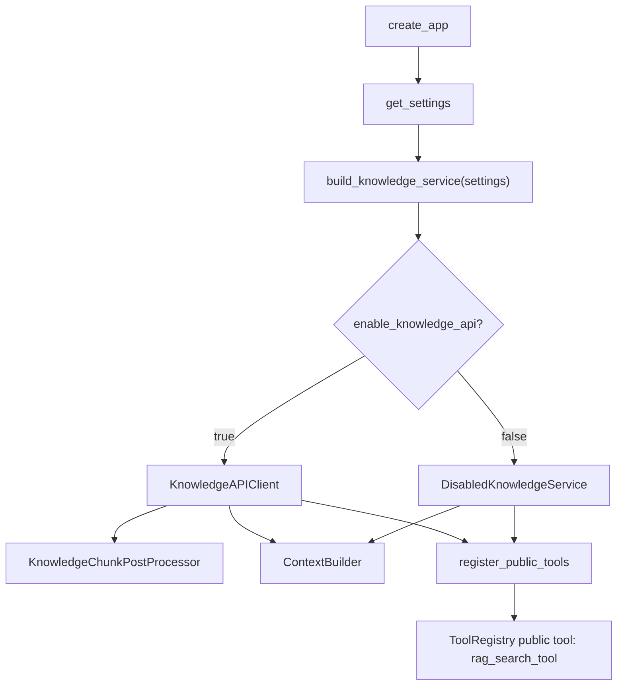
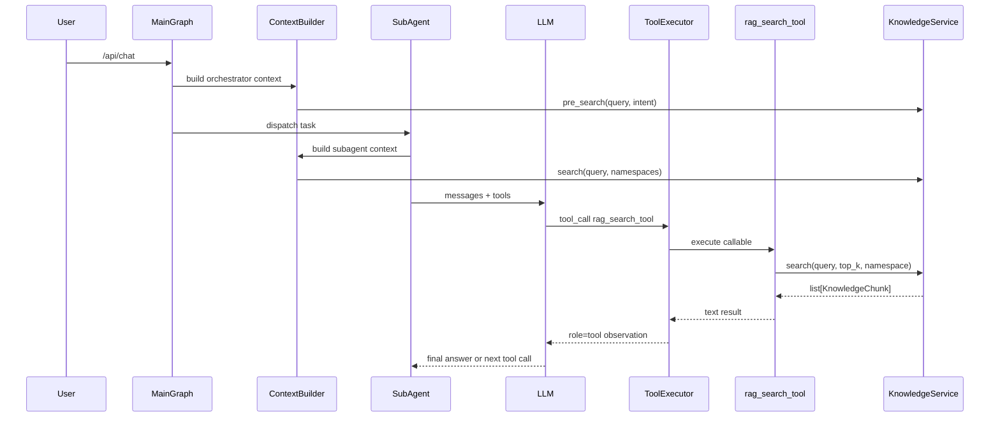

# Knowledge Service Usage

本文基于当前源码同步知识服务链路。当前项目已经不再使用生产内置 mock chunks，也没有 `get_knowledge` legacy alias；知识检索入口是 `KnowledgeService` 抽象、`ContextBuilder` 轻量预检索，以及 public tool `rag_search_tool`。

## 1. Overview

`KnowledgeService` 是项目中的知识检索抽象。它有两条使用路径：

1. `ContextBuilder` 直接调用，用于给主编排和子 Agent 构造轻量知识提示。
2. `app/tools/public_tools.py` 将它包装成 `rag_search_tool`，作为允许使用 public tools 的子 Agent 的 LLM tool。

默认情况下知识库关闭，`build_knowledge_service(settings)` 返回 `DisabledKnowledgeService`，不会回退到内置 mock chunks。开启 `ENABLE_KNOWLEDGE_API=true` 后才使用外部 `KnowledgeAPIClient`。

## 2. Current Implementations

| 实现 | 代码位置 | 职责 | 是否主链路使用 |
|---|---|---|---|
| `KnowledgeService` | `app/knowledge/service.py::KnowledgeService` | Protocol，定义 `search` / `pre_search` | 作为依赖类型使用 |
| `DisabledKnowledgeService` | `app/knowledge/disabled_service.py::DisabledKnowledgeService` | 知识库关闭时返回空 chunks，并记录日志 | 默认使用 |
| `KnowledgeAPIClient` | `app/integrations/knowledge_api_client.py::KnowledgeAPIClient` | 调外部知识库 API，并把 raw chunks 归一化 | `enable_knowledge_api=true` 时使用 |
| `KnowledgeChunkPostProcessor` | `app/knowledge/chunk_post_processor.py::KnowledgeChunkPostProcessor` | raw chunk -> `KnowledgeChunk`，过滤空内容、截断、去重、排序、脱敏 metadata | `KnowledgeAPIClient` 内部使用 |
| `KnowledgeChunk` | `app/knowledge/schemas.py::KnowledgeChunk` | 内部统一 chunk schema：`content/source/score/metadata` | ContextBuilder 和 tool 最终消费 |

当前未发现 `app/knowledge/in_memory_service.py` 或 `InMemoryKnowledgeService` 生产残留。

## 3. Initialization Flow

初始化入口是 `app/main.py::create_app`：

```text
settings = get_settings()
knowledge_service = build_knowledge_service(settings)
register_public_tools(tool_registry, knowledge_service)
context_builder = ContextBuilder(..., knowledge_service=knowledge_service, ...)
app.state.knowledge_service = knowledge_service
```

工厂逻辑在 `app/knowledge/factory.py::build_knowledge_service`：

```text
enable_knowledge_api=false
  -> DisabledKnowledgeService()

enable_knowledge_api=true + knowledge_api_url
  -> KnowledgeAPIClient(BaseIntegrationHTTPClient(...))

enable_knowledge_api=true + knowledge_api_url empty
  -> ValueError
```

配置字段来自 `app/config/settings.py`：

| 配置 | 默认 | 含义 |
|---|---:|---|
| `ENABLE_KNOWLEDGE_API` / `enable_knowledge_api` | `false` | 是否启用外部知识库 API |
| `KNOWLEDGE_API_URL` / `knowledge_api_url` | `None` | 外部知识库 API base url |
| `KNOWLEDGE_API_TIMEOUT` / `knowledge_api_timeout` | `10.0` | 外部请求超时 |

## 4. Direct Usage in ContextBuilder

`ContextBuilder` 不直接拼接 mock 知识，而是委托 `KnowledgeHintBuilder`：

| 场景 | 代码位置 | 调用 | top_k | 输出 |
|---|---|---|---:|---|
| 主编排轻量提示 | `app/runtime/context/knowledge_hint_builder.py::KnowledgeHintBuilder.build_lightweight_hints` | `knowledge_service.pre_search(query, intent, top_k=3)` | 3 | `list[str]`，进入 `OrchestratorContext.lightweight_knowledge_hints` |
| 子 Agent 知识提示 | `app/runtime/context/knowledge_hint_builder.py::KnowledgeHintBuilder.build_subagent_knowledge_hint` | `knowledge_service.search(query, top_k=3, namespaces=...)` | 3 | `str | None`，进入 `SubAgentContext.knowledge_hint` |

`app/runtime/context_builder.py::ContextBuilder.build_for_subagent` 会从 `AgentCard` metadata 中读取 `rag_namespaces`，并传给 `build_subagent_knowledge_hint`。当前是否由外部知识 API真正按 namespace 过滤，取决于外部服务实现；本项目只负责把 namespaces 放进请求 payload。

## 5. Knowledge as Public Tool

知识工具注册在 `app/tools/public_tools.py::register_public_tools`。

当前知识相关 public tool 只有：

| Tool | 构建函数 | 参数 | 返回 |
|---|---|---|---|
| `rag_search_tool` | `app/tools/public_tools.py::build_rag_search_tool` | `query` required，`top_k` optional，`namespace` optional | 命中时返回 chunks content 拼接字符串；无命中时返回 `"No matching knowledge chunks found."` 或 disabled reason |

`rag_search_tool` 的 LLM schema 是 OpenAI function-calling 风格，由 `ToolRegistry` 根据 `ToolDefinition.parameters` 输出给 LLM。`query` 是必填参数；如果 LLM 未传 `query`，`ToolExecutor` 会在执行前返回缺参错误，而不是抛未捕获异常。

`get_knowledge` 已从当前代码删除，不再注册、不再传给 LLM，也不应写入新的 Skill prompt。

## 6. Is KnowledgeService Used as Private Tool?

不是。

当前 `app/tools/builtin_tools.py` 文件不存在。知识服务工具不在 private tools 中构建，也不是某个 Agent 的私有工具。它通过 `app/tools/public_tools.py::register_public_tools` 注册为 public tool，是否对某个子 Agent 可见取决于：

- `AgentCard.public_tools_allowed`
- `ToolRegistry` 中 public tool 是否 enabled
- `ToolRegistry.get_available_tool_schemas_for_agent(...)` 的可见性过滤

`app/tools/agent_tools.py` 注册的是 Agent 私有业务工具，例如排障工具、保单工具、理赔工具、保全异常处理工具等，不负责知识服务工具。

## 7. Runtime Tool Calling Flow

当 LLM 调用 `rag_search_tool` 时，链路是：

```text
BaseSubAgent.run
  -> ToolRegistry.get_available_tool_schemas_for_agent(agent_name, card)
  -> ToolCallingRunner.run(messages, tools)
  -> LLMProvider.chat(messages=..., tools=..., scene="subagent_reasoning")
  -> LLM returns tool_call(name="rag_search_tool", arguments={...})
  -> ToolExecutor.execute(...)
  -> ToolDefinition.callable
  -> rag_search_tool(...)
  -> knowledge_service.search(...)
  -> ToolResult
  -> ToolCallingRunner appends role=tool observation
  -> LLMProvider.chat(...) continues or returns final answer
```

`ToolExecutor` 不直接知道知识服务细节；它只执行 `ToolDefinition.callable`。`ToolCallingRunner` 和 `LLMProvider` 也不直接感知 Knowledge API，它们只处理标准 tool schema 和 tool result。

## 8. KnowledgeService and AgentCard / Skill

`AgentCard.public_tools_allowed=true` 时，子 Agent 可以看到 public tools，其中包括 `rag_search_tool`。如果为 `false`，该 Agent 不会收到 public tools schema。

`AgentCard.rag_namespaces` 当前被 `ContextBuilder.build_for_subagent` 读取，用于子 Agent 预检索提示。Skill body 可以指导 LLM 何时调用 `rag_search_tool`，但 Skill 选择阶段不会加载所有 Skill body，也不会把所有工具 schema 交给主 Agent。

## 9. Data Model and Chunk Format

外部 API 的 raw chunk 不会直接进入 public tools、ContextBuilder 或子 Agent。当前流程是：

```text
external api response
  -> KnowledgeAPIClient._extract_raw_chunks(...)
  -> KnowledgeChunkPostProcessor.normalize_many(raw_chunks, top_k)
  -> list[KnowledgeChunk]
```

`KnowledgeChunkPostProcessor` 支持字段兼容：

- content: `content/text/chunk_text/page_content/passage`
- source: `source/doc_id/docId/document_id/documentId/document_name/title`
- score: `score/similarity/rerank_score/distance_score`

它还会过滤空 content、截断过长 content、去重、按 score 排序，并在 `metadata.raw` 保留溯源信息，同时对部分敏感文本和敏感 metadata key 做脱敏。

## 10. Current Usage Points

| Component | File | Direct/Indirect | Method | Purpose |
|---|---|---|---|---|
| `create_app` | `app/main.py` | Direct | `build_knowledge_service` | 初始化知识服务 |
| `public_tools` | `app/tools/public_tools.py` | Direct | `build_rag_search_tool` | 将知识服务包装成 public tool |
| `ContextBuilder` | `app/runtime/context_builder.py` | Direct | `KnowledgeHintBuilder` | 构建主编排和子 Agent 知识提示 |
| `KnowledgeHintBuilder` | `app/runtime/context/knowledge_hint_builder.py` | Direct | `pre_search` / `search` | 直接检索 chunks 并转成提示 |
| `ToolExecutor` | `app/tools/executor.py` | Indirect | `execute` | 执行 `rag_search_tool` callable |
| `ToolCallingRunner` | `app/subagents/tool_calling_runner.py` | Indirect | tool loop | 把工具 observation 回灌给 LLM |
| `BaseSubAgent` | `app/subagents/base.py` | Indirect | `run` | 使用 `SubAgentContext.knowledge_hint` 和可见 tools |

## 11. Current Problems / Residual Code

- 未发现 `InMemoryKnowledgeService` 生产残留。
- 未发现生产内置 mock chunks。
- `get_knowledge` 已删除；旧文档中关于它的描述是过时内容。
- `DisabledKnowledgeService` 是默认实现；这意味着本地默认运行时 RAG 提示为空，LLM 仍可调用 `rag_search_tool`，但会收到 disabled/no chunks 结果。
- `rag_search_tool` 的中文参数描述在源码中存在 mojibake 风险；这属于代码质量问题，不影响本文档链路判断，但后续可以单独清理。

## 12. Mermaid Diagrams

### 初始化链路



### 运行时检索链路



