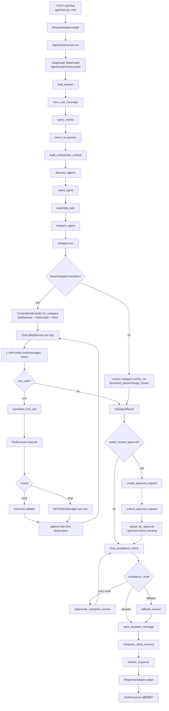
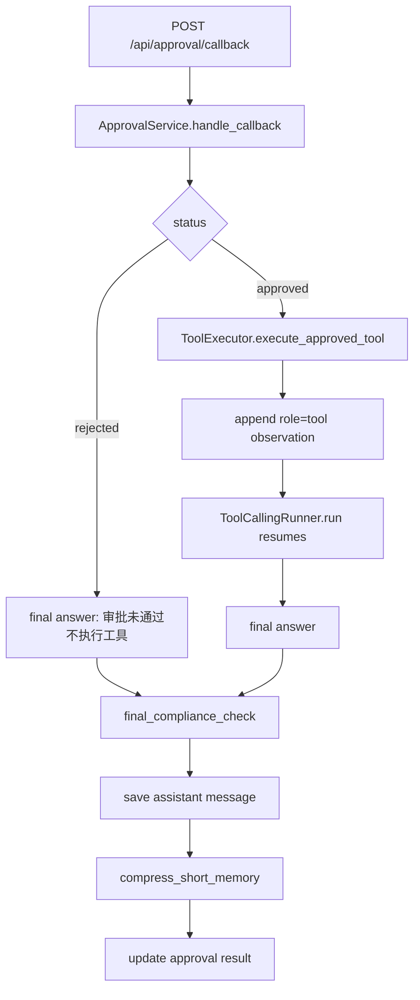

# 主流程代码走读

本文基于当前真实代码更新，目标是帮助新人理解一次 `POST /api/chat` 请求如何从 HTTP 入口进入系统，经过主 Agent 编排、子 Agent 执行、工具调用、记忆压缩、最终合规检查，再返回用户。请注意：仓库当前没有 `app/api/*` 目录，`/api/chat` 直接定义在 `app/main.py::create_app` 内；仓库也没有 `app/subagents/agent_card_loader.py`，AgentCard 加载器位于 `app/agents/card_loader.py`。

## 当前主架构

当前项目由 FastAPI 接收 `/api/chat` 请求，`RequestAdapter` 将外部请求转换为内部 `InboundMessage`，`AgentOrchestrator` 负责以 `session_key` 作为 LangGraph config 的 `thread_id` 执行 `StateGraph`。主流程中的主 Agent 不承载所有业务逻辑，而是根据 `intent`、`entities` 和 `AgentCard` 发现并选择子 Agent，随后组装 `AgentTaskEnvelope` 并派发。子 Agent 基于 `AgentCard + Skills + RAG + tools` 执行任务，其中继承 `BaseSubAgent` 的子 Agent 会走统一模板：读取 AgentCard、选择并加载 Skill、解析可见工具 schema，然后进入 `ToolCallingRunner` 的 ReAct-style 工具调用循环。`ToolExecutor` 负责执行本地或 MCP 工具、做 AgentCard 可见性二次校验并写入工具执行日志；当工具是 `is_write=true` 的写入/修改/删除类高风险工具时，`ToolExecutor` 不执行工具，而是返回 `human_approval_required` 和 pending tool call。主图随后进入人工审批分支，由 `ApprovalService` 创建 SQLite 审批请求、提交外部审批系统并让 `/api/chat` 返回 pending。审批系统通过 `/api/approval/callback` 回调 approved/rejected，approved 后才执行原工具并继续 tool loop，rejected 则不执行工具。`LLMProvider` 只负责模型调用和响应归一化，不执行工具。`final_compliance_check` 是返回用户前的强制节点，负责脱敏和阻断不应外发的内容。SQLite 负责 `messages`、`short_term_memory`、`graph_checkpoints`、`tool_execution_logs`、`approval_requests`、`approval_events` 等持久化。MCP Client 已接入为外部工具来源：应用启动时在配置了 MCP server 的情况下发现工具能力，并注册到 `ToolRegistry`。

## 完整主流程图



审批回调恢复流程：



## 主流程节点表

| 流程节点 | 代码位置 | 核心职责 | 输入 state / 参数 | 输出 state / 结果 | 使用技术 | 关键说明 |
| ---- | ---- | ---- | ---- | ---- | ---- | ---- |
| `/api/chat` | `app/main.py::create_app` 内部 `chat` | HTTP 入口，记录请求日志，调用请求适配、编排器和响应适配 | `ChatRequest` | `ChatResponse` | FastAPI、Pydantic | 当前没有 `app/api/*`，路由直接挂在 `app/main.py`。 |
| `RequestAdapter` | `app/adapters/request_adapter.py::RequestAdapter.adapt` | 从外部请求取最后一条 user 消息，生成 `request_id`、`trace_id`、`session_key` | `ChatRequest` | `InboundMessage` | Pydantic、UUID | `session_key = tenant_id:channel:user_id:session_id`，用于多租户、多用户、多会话隔离。 |
| `AgentOrchestrator` | `app/runtime/orchestrator.py::AgentOrchestrator.run` | 构造初始 `AgentGraphState`，执行 LangGraph，并保存最终 checkpoint | `InboundMessage` | 完整 graph state | LangGraph、SQLite checkpoint | `config = {"configurable": {"thread_id": inbound.session_key}}`，每个会话独立线程。 |
| `LangGraph StateGraph` | `app/runtime/graph.py::AgentGraphFactory.build` | 定义真实状态机节点和条件路由 | `AgentGraphState` | compiled graph | LangGraph `StateGraph`、`MemorySaver` | 当前节点链路包含 AgentCard 发现/选择/任务派发和最终合规检查；旧的 `route_intent/direct_answer/call_troubleshooting_agent` 已不在主链路。 |
| `load_session` | `app/runtime/graph.py::AgentGraphFactory.load_session` | 加载历史会话上下文 | `session_key` | `recent_messages`、`short_summary`、`retry_count` | SQLite、`SessionManager` | `SessionManager.load_session` 从 `MessageStore.list_by_session(limit=60)` 读取最近 60 条消息，从 `ShortTermMemoryManager.get_summary` 读取 `short_term_memory.summary`。checkpoint 不在此节点读取，最终 state 由 `AgentOrchestrator` 写入 `graph_checkpoints`。 |
| `save_user_message` | `app/runtime/graph.py::AgentGraphFactory.save_user_message` | 保存本轮用户原始输入 | `session_key`、`original_query`、`request_id`、`trace_id` | 写入 messages 表 | SQLite、`MessageStore` | `MessageStore.append` 写入 `messages(session_key, role, content, metadata_json, created_at)`，metadata 中保留 `original_query` 和 `session_key`。 |
| `query_rewrite` | `app/runtime/graph.py::AgentGraphFactory.query_rewrite`，`app/query/query_rewrite_node.py::QueryRewriteNode.rewrite` | 将用户原始问题改写为更适合意图识别和工具调用的查询 | `original_query`、`recent_messages`、`short_summary` | `rewritten_query` | 规则改写、Pydantic schema | 构造函数可注入 `LLMProvider`，但当前 `rewrite` 实际未调用模型。规则支持 `REQ_xxx + E102` 和基于最近消息/summary 的追问 fallback。 |
| `intent_recognition` | `app/runtime/graph.py::AgentGraphFactory.intent_recognition`，`app/query/intent_recognition_node.py::IntentRecognitionNode.recognize` | 识别 intent 并抽取实体 | `original_query`、`rewritten_query`、`recent_messages`、`short_summary` | `intent`、`confidence`、`entities`、`required_tools=[]` | 规则分类、正则实体抽取、Pydantic schema | 当前未使用 LLM JSON 分类，构造函数虽注入 `LLMProvider` 但未调用。实体包括 `request_id`、`error_code`、`policy_no`、`claim_no`、`interface_name`。`required_tools` 已被置为空数组，未再和 intent 强绑定。 |
| `build_orchestrator_context` | `app/runtime/graph.py::AgentGraphFactory.build_orchestrator_context`，`app/runtime/context_builder.py::ContextBuilder.build_for_orchestrator` | 构建主 Agent 轻量上下文 | query、intent、entities、session、history、available agents/tools | `orchestrator_context` | Pydantic `OrchestratorContext`、RAG pre-search | 包含 `short_summary`、最近 10 条消息、可用子 Agent、全量已注册工具名、轻量知识提示。ContextBuilder 是公共组件，不属于主 Agent 或子 Agent。 |
| `discover_agents` | `app/runtime/graph.py::AgentGraphFactory.discover_agents`，`app/agents/card_loader.py::AgentCardLoader.list_available_agents` | 发现可用 AgentCard | cards root | `available_agents` | YAML 子集解析、Pydantic `AgentCard` | AgentCard 存在 `app/agents/cards/*.yaml`，通过 `AgentCardLoader.load_all` 读取并校验 enabled。 |
| `select_agent` | `app/runtime/graph.py::AgentGraphFactory.select_agent`，`app/agents/selection.py::AgentSelectionNode.select` | 根据 intent/entities/query/AgentCard 选择子 Agent | `intent`、`entities`、`rewritten_query` | `agent_selection`、`selected_agent`、`selected_agent_card` | 规则打分、AgentCard | `AgentCardLoader.match_candidates` 按 supported_intents、required_entities、capabilities、关键词、enabled 加权排序。当前不是 LLM 选择。没有候选时抛错；分数小于等于 0 标记 `fallback=True`，但仍选择最高分。 |
| `assemble_task` | `app/runtime/graph.py::AgentGraphFactory.assemble_task`，`app/agents/task_assembler.py::AgentTaskAssembler.assemble` | 把主流程上下文封装成子 Agent 任务信封 | `selected_agent_card`、`orchestrator_context`、`entities`、`request_id`、`trace_id` | `assembled_task` | Pydantic `AgentTaskEnvelope` | 任务包含 `task_id`、`agent_name`、`query`、`original_query`、`intent`、`entities`、`session_key`、`request_id`、`trace_id`、`agent_card`、`short_summary`、按 AgentCard `memory_policy.recent_turns` 截断的 recent messages、知识 hints。 |
| `dispatch_agent` | `app/runtime/graph.py::AgentGraphFactory.dispatch_agent`，`app/agents/dispatcher.py::DispatchAgentNode.dispatch` | 把任务交给选中的子 Agent | `AgentTaskEnvelope`、`OrchestratorContext` | `subagent_result`、`answer`、skill 选择信息 | `SubAgentManager`、Pydantic `SubAgentTask`/`SubAgentResult` | `DispatchAgentNode` 将 envelope 转为当前子 Agent 协议 `SubAgentTask`，把 `agent_card` 放入 `metadata`，再调用 `SubAgentManager.call_subagent`。 |
| `check_human_approval_required` | `app/runtime/graph.py::AgentGraphFactory.check_human_approval_required` | 判断子 Agent 是否因写工具停在审批点 | `subagent_result.needs_human_approval`、`approval_payloads` | `approval_required`、`approval_payloads` | LangGraph 条件路由 | required 进入审批分支，not_required 进入 `final_compliance_check`。 |
| `create_approval_request` | `app/runtime/graph.py::AgentGraphFactory.create_approval_request`，`app/approval/service.py::ApprovalService.create_approval_request` | 创建审批请求并保存 pending 恢复上下文 | approval payload、pending messages/tools/tool_call、当前 state | `approval_id`、`approval_request` | SQLite、Pydantic | 写入 `approval_requests`，保存 `pending_state_json`、`pending_messages_json`、`pending_tools_json`、`pending_tool_call_json`。 |
| `submit_approval_request` | `app/runtime/graph.py::AgentGraphFactory.submit_approval_request`，`app/approval/client.py::ApprovalSystemClient.submit_approval_request` | 提交外部审批系统 | `ApprovalRequest` | `approval_submit_result`、`external_approval_id`、status | httpx、外部审批 API | 使用 `APPROVAL_SYSTEM_URL` 和 `APPROVAL_CALLBACK_URL`。提交失败时 status=`submit_failed`，原工具不执行。 |
| `pause_for_approval` | `app/runtime/graph.py::AgentGraphFactory.pause_for_approval` | 不阻塞 `/api/chat`，生成 pending/submit_failed 回复 | `approval_id`、submit result | pending answer 或 submit_failed answer | LangGraph 节点 | pending answer 仍继续进入 `final_compliance_check`，再保存为 assistant message。 |
| `SubAgentManager` | `app/subagents/manager.py::SubAgentManager.call_subagent` | 按名称查找并调用子 Agent | agent name、`SubAgentTask`、parent context | `SubAgentResult` | Protocol、运行时注册表 | 子 Agent 在 `app/main.py::create_app` 中注册，包括 troubleshooting、compliance、document_parse、change_impact、policy_query、claim。 |
| `BaseSubAgent.run` | `app/subagents/base.py::BaseSubAgent.run` | 继承类的统一执行模板 | `SubAgentTask`、`OrchestratorContext` | `SubAgentResult` | AgentCard、Skill、RAG、ToolCallingRunner | 从 `task.metadata["agent_card"]` 读取 AgentCard，经 `ToolRegistry` 计算可见工具，调用 `ContextBuilder.build_for_subagent` 选择并加载 Skill，再构造 LLM messages 和工具 schema，进入 `ToolCallingRunner.run`。`TroubleshootingAgent`、`PolicyQueryAgent`、`ClaimAgent`、`ComplianceSecurityAgent` 继承该模板。 |
| 自定义子 Agent | `app/subagents/document_parse_agent.py::DocumentParseAgent.run`，`app/subagents/change_impact_analysis_agent.py::ChangeImpactAnalysisAgent.run` | 不继承 `BaseSubAgent` 的任务级执行 | `SubAgentTask`、parent context | `SubAgentResult` | 规则解析、ContextBuilder、ToolExecutor | `document_parse_agent` 规则解析文本/JSON/YAML/Markdown；`change_impact_analysis_agent` 规则分析影响并调用 `get_knowledge`。它们仍会调用 `ContextBuilder.build_for_subagent` 触发 skill 选择和 RAG。 |
| `SkillCatalog / SkillSelector` | `app/skills/catalog.py::SkillCatalog.scan`，`app/skills/selector.py::SkillSelector.select`，`app/skills/loader.py::SkillLoader.load` | metadata-first skill 发现、选择和正文加载 | agent name、`SkillSelectionContext`、candidate metadata | `selected_skill_id`、skill body | YAML frontmatter、Pydantic、规则打分 | 启动/校验阶段只扫描 `app/skills/*/*/SKILL.md` 的 frontmatter metadata，跳过 `deprecated` 和旧两层目录；执行时才加载完整 `SKILL.md`。`AgentCardLoader.validate_with_skill_catalog` 校验 AgentCard.skills 存在、agent 匹配、private tools 不越界，并要求每个 enabled agent 至少一个 default skill。 |
| `KnowledgeService / RAG` | `app/knowledge/in_memory_service.py::InMemoryKnowledgeService.search`，`app/runtime/context_builder.py::_build_lightweight_hints`，`app/runtime/context_builder.py::_build_subagent_knowledge_hint` | 为主流程和子 Agent 提供知识检索增强 | query、intent、top_k | knowledge hints 或 mock_knowledge_hint | InMemory mock、关键词 scoring | 当前不是 Milvus/Elasticsearch/embedding/hybrid。内置 chunks 按 metadata keywords 命中数算分，`score = 0.5 + hits * 0.15`，降序取 top-k。主流程 `pre_search(top_k=3)` 进入 `lightweight_knowledge_hints`，子 Agent `search(top_k=3)` 拼接进 `mock_knowledge_hint`。 |
| `ToolRegistry` | `app/tools/registry.py::ToolRegistry`，`app/tools/public_tools.py::register_public_tools`，`app/tools/agent_tools.py::register_agent_private_tools` | 注册和暴露工具 schema | 工具定义、AgentCard | 可见工具名和 OpenAI-compatible tools schema | Pydantic `ToolDefinition`、函数签名 introspection、MCP capability | 公有工具包括 `rag_search_tool/get_knowledge/calculator_tool/current_time_tool`；私有工具按 agent 注册；MCP 工具由 `register_mcp_tools` 注册。不会把所有工具都给 LLM，而是按 `AgentCard.private_tools`、`public_tools_allowed`、`mcp_tools`、`mcp_tool_scopes` 生成当前子 Agent 可见工具。 |
| `LLMProvider` | `app/llm/base.py::LLMProvider`，`app/llm/internal_provider.py::InternalLLMProvider.chat`，`app/llm/opensdk_provider.py::OpenSDKLLMProvider.chat`，`app/llm/factory.py::build_llm_provider` | 统一模型调用边界 | messages、tools、scene/model 配置 | `LLMResponse` | httpx、OpenAI SDK、scene-aware model config | 当前应用默认 `build_llm_provider` 返回 `InternalLLMProvider`；当 `ENABLE_OPENSDK_LLM=true` 时使用 OpenAI-compatible SDK provider。`InternalLLMProvider` 若未配置 `INTERNAL_LLM_API_URL`，走本地确定性 fallback。`FakeLLMProvider` 存在于 `app/llm/fake_provider.py`，主要给测试/隔离场景使用，不是当前 `create_app` 默认注入。LLMProvider 不执行工具。 |
| `ToolCallingRunner` | `app/subagents/tool_calling_runner.py::ToolCallingRunner.run` | 实现 LLM 工具调用循环 | agent name、messages、visible tools、session/request/trace、AgentCard | `ToolCallingRunResult` | ReAct-style loop、OpenAI tool call schema | 每轮调用 `llm_provider.chat(messages, tools, scene="subagent_reasoning")`。如果工具结果是 `human_approval_required`，立即停止 loop，返回 `stopped_reason="human_approval_required"`、`pending_tool_call`、`approval_payload`、当时 messages/tools。无 tool_calls 时以 assistant content 结束。 |
| `ToolExecutor` | `app/tools/executor.py::ToolExecutor.execute`，`app/tools/executor.py::ToolExecutor.execute_approved_tool` | 执行工具、二次权限校验、写执行日志、审批后安全执行 | agent name、tool name、arguments、AgentCard、session/request/trace、approval_id | `ToolResult` | ToolRegistry、SQLite audit、MCP dispatch、approval guard | 普通 `execute` 遇到 `is_write=true` 工具只返回 `human_approval_required`，不执行 callable。approved callback 后只能通过 `execute_approved_tool` 执行，并校验 approval 存在、status=approved、agent/tool/arguments 一致。 |
| `ApprovalService` | `app/approval/service.py::ApprovalService` | 审批创建、提交、callback 处理、approved/rejected 恢复 | approval payload 或 callback | approval status、final answer | SQLite、httpx、ToolExecutor、ToolCallingRunner | approved 后执行 pending tool，追加 tool observation 并继续 loop；rejected 后不执行工具。两条路径最终都调用 final compliance、保存 assistant message、压缩短期记忆。 |
| `MCP Client` | `app/main.py::lifespan`，`app/mcp/client_manager.py::MCPClientManager.initialize`，`app/mcp/capability_registry.py::MCPCapabilityRegistry`，`app/mcp/client.py::HTTPMCPClient` | 发现外部 MCP 工具并路由调用 | `MCP_SERVERS_JSON` / `MCP_SERVERS` 配置 | MCP capabilities 注册到 ToolRegistry | HTTP JSON-RPC-ish client、Pydantic schemas | `settings.enable_mcp_client` 默认 true，但没有配置 server 时列表为空，不会发现工具。启动时 `initialize -> list_tools -> capability_registry.upsert_tools -> tool_registry.register_mcp_tools`。执行时 `ToolExecutor` 根据 source=mcp 调 `MCPClientManager.call_tool`，再由 capability 找到 server 和原始工具名。 |
| `final_compliance_check` | `app/runtime/graph.py::AgentGraphFactory.final_compliance_check`，`app/compliance/final_checker.py::FinalComplianceChecker.check` | 返回用户前强制合规检查 | `answer` | `final_compliance_result`，通过时更新 `answer=sanitized_answer` | 规则脱敏、可选 LLM scene 调用 | 检查手机号、身份证、银行卡、凭据字段、内部日志字段、健康隐私词、raw tool markers。若包含 raw tool output marker，`passed=False` 且 `retry_required=True`。会调用一次 `llm_provider.chat(scene="final_compliance")` 作模型侧检查，但实际判定和脱敏由规则完成。 |
| `regenerate_compliant_answer` | `app/runtime/graph.py::AgentGraphFactory.regenerate_compliant_answer` | 合规失败且允许重试时生成安全版本 | `final_compliance_result`、`retry_count` | 新 `answer`、`retry_count+1` | 规则 fallback 文案 | 当前最多重试一次，随后重新进入 `final_compliance_check`。 |
| `fallback_answer` | `app/runtime/graph.py::AgentGraphFactory.fallback_answer` | 合规仍不通过时使用兜底答复 | `final_compliance_result` | `answer=fallback_answer` | 规则兜底 | 合规强制分支，避免原始不安全内容保存和返回。 |
| `save_assistant_message` | `app/runtime/graph.py::AgentGraphFactory.save_assistant_message` | 保存最终助手回复 | `answer`、request/session/query/intent/entities/selected_agent | 写入 messages 表 | SQLite、`MessageStore` | 保存的是合规链路后的 `answer`，不是原始子 Agent answer。metadata 保存 `rewritten_query`、`intent`、`entities`、`selected_agent`。 |
| `compress_short_memory` | `app/runtime/graph.py::AgentGraphFactory.compress_short_memory`，`app/memory/short_term_memory_manager.py::ShortTermMemoryManager.compress_after_turn` | 每轮结束后更新短期摘要 | session/query/intent/answer/subagent_result | `short_summary` | SQLite upsert、规则摘要 | 当前是规则 summary，不调用 LLM summary。按 request_id、E102、intent 生成摘要并 upsert 到 `short_term_memory(session_key, summary, updated_at)`。代码没有显式异常 fallback，失败会向上抛错。 |
| `finalize_response` | `app/runtime/graph.py::AgentGraphFactory.finalize_response`，`app/adapters/response_adapter.py::ResponseAdapter.adapt` | 记录最终日志，并转换成 API 响应 | graph final state | `ChatResponse` | Pydantic、日志 | `finalize_response` 本身主要记录日志；`ResponseAdapter` 只暴露 `request_id/session_key/original_query/rewritten_query/intent/answer`，不泄露内部状态、工具结果或完整上下文。 |

## 关键技术清单

| 技术/机制 | 在本项目中的用途 | 代码位置 |
| ----- | -------- | ---- |
| FastAPI | 提供 `/api/chat` HTTP 入口和 lifespan 初始化 | `app/main.py::create_app` |
| LangGraph / StateGraph | 主 Agent 任务级状态机编排，节点顺序和合规条件路由都在图里 | `app/runtime/graph.py::AgentGraphFactory.build` |
| Pydantic | 请求、响应、AgentCard、SubAgentTask、SubAgentResult、Skill、MCP、tool schema 校验 | `app/schemas/*`，`app/mcp/schemas.py` |
| SQLite | 持久化 messages、short_term_memory、graph_checkpoints、tool_call_logs、tool_execution_logs | `app/storage/sqlite.py::SQLiteDatabase.initialize` |
| AgentCard | 描述子 Agent 能力、intent、实体需求、工具可见性、skills、RAG namespace、memory_policy | `app/schemas/agent_card.py`，`app/agents/cards/*.yaml` |
| YAML | AgentCard 和 Skill frontmatter 的轻量配置格式 | `app/agents/card_loader.py::_parse_card_yaml`，`app/skills/metadata.py::split_frontmatter` |
| LLMProvider | 统一模型调用协议，规范 `chat(messages, tools)` 的输入输出 | `app/llm/base.py::LLMProvider` |
| 内部数智 LLM API | 默认模型调用方式；未配置 URL 时走本地 deterministic fallback | `app/llm/internal_provider.py::InternalLLMProvider` |
| OpenSDK / OpenAI-compatible | 可选模型调用方式，`ENABLE_OPENSDK_LLM=true` 时启用 | `app/llm/opensdk_provider.py::OpenSDKLLMProvider`，`app/llm/openai_provider.py::OpenAICompatibleLLMProvider` |
| scene 模型选择 | 为 query rewrite、intent、agent selection、subagent reasoning、final compliance、summary 预留不同模型配置 | `app/llm/model_config.py::get_llm_model` |
| ToolCallingRunner | 子 Agent 的 ReAct-style LLM 工具调用循环 | `app/subagents/tool_calling_runner.py::ToolCallingRunner.run` |
| ToolExecutor | 当前主路径的工具执行、AgentCard 权限校验、MCP 分发、SQLite 日志记录 | `app/tools/executor.py::ToolExecutor.execute` |
| ApprovalService | 高风险写工具的人审闭环：创建请求、提交外部审批、callback 恢复、保存结果 | `app/approval/service.py::ApprovalService` |
| ApprovalSystemClient | 向外部审批系统提交审批请求，当前可指向 mock URL | `app/approval/client.py::ApprovalSystemClient` |
| ToolBroker / PolicyGate | 兼容/旧工具通道，强制经过策略门；当前主 LLM 工具循环未使用它 | `app/tools/broker.py::ToolBroker.call`，`app/tools/policy_gate.py::PolicyGate.allow` |
| ToolRegistry | 公有工具、私有工具、MCP 工具统一注册，并按 AgentCard 生成可见工具 schema | `app/tools/registry.py::ToolRegistry` |
| Skills metadata-first loading | 扫描时只读取 frontmatter metadata，执行选中后才加载完整 `SKILL.md` body | `app/skills/catalog.py::SkillCatalog.scan`，`app/skills/catalog.py::SkillCatalog.load_skill_content` |
| RAG / KnowledgeService | 主流程轻量知识提示和子 Agent 任务级知识上下文；当前是 in-memory keyword mock | `app/knowledge/in_memory_service.py::InMemoryKnowledgeService` |
| MCP Client | 作为外部工具来源，启动时发现能力，执行时由 ToolExecutor 分发 | `app/mcp/client_manager.py::MCPClientManager`，`app/main.py::lifespan` |
| final compliance check | 所有返回用户前的强制合规检查、脱敏、重试/兜底 | `app/compliance/final_checker.py::FinalComplianceChecker` |
| summary + recent N turns | `short_summary` 加最近消息窗口共同提供历史上下文 | `app/session/session_manager.py::SessionManager.load_session`，`app/agents/task_assembler.py::AgentTaskAssembler.assemble` |

## 数据流与状态流

| 数据对象 | 产生位置 | 消费位置 | 说明 |
| ---- | ---- | ---- | ---- |
| `request_id` | `RequestAdapter.adapt` | 全链路日志、message metadata、task、LLM、tools、checkpoint | 格式 `req_<uuid>`，用于单次请求追踪。 |
| `trace_id` | `RequestAdapter.adapt` | 日志、task、tools、messages metadata | 格式 `trace_<uuid>`，用于链路追踪。 |
| `session_key` | `RequestAdapter.build_session_key` | `AgentOrchestrator.run`、`load_session`、message/memory/checkpoint/tool logs | 格式 `tenant_id:channel:user_id:session_id`，也是 LangGraph `thread_id`。 |
| `original_query` | `RequestAdapter.adapt` 从最后一条 user message 提取 | `save_user_message`、`query_rewrite`、`intent_recognition`、task、ResponseAdapter | 用户原始输入，保存到 messages。 |
| `rewritten_query` | `query_rewrite` | `intent_recognition`、`build_orchestrator_context`、`assemble_task`、ResponseAdapter | 当前主要规则改写。 |
| `intent` | `intent_recognition` | `build_orchestrator_context`、`select_agent`、task、memory compression、ResponseAdapter | 当前规则识别。 |
| `entities` | `intent_recognition` | `select_agent`、`assemble_task`、子 Agent、assistant message metadata | 包括 `request_id/error_code/policy_no/claim_no/interface_name` 等。 |
| `available_agents` | `discover_agents` | 主要用于状态观测和调试 | 来自 enabled AgentCard。 |
| `selected_agent` | `select_agent` | `assemble_task`、`dispatch_agent`、assistant metadata、ResponseAdapter 间接观测 | 当前由规则打分选择。 |
| `agent_card` / `selected_agent_card` | `select_agent` | `assemble_task`、`dispatch_agent`、`BaseSubAgent.run`、ToolRegistry/ToolExecutor | 决定子 Agent 的能力、记忆窗口、工具和 skills。 |
| `subagent_task` / `assembled_task` | `assemble_task` | `dispatch_agent` | `AgentTaskEnvelope`，包含任务、上下文、AgentCard 和 trace 信息。 |
| `subagent_result` | `dispatch_agent` | `final_compliance_check` 间接使用其 `answer`，`compress_short_memory` | `SubAgentResult` 里包含 answer、evidence、tool_calls、skill 信息。 |
| `tool_calls` | `ToolCallingRunner.run` 或子 Agent 规则调用 | `SubAgentResult.tool_calls`、`compress_short_memory`、审计查询 | 工具执行结果也会写入 `tool_execution_logs`。 |
| `final_answer` / `answer` | 子 Agent 或 ToolCallingRunner 产出，`dispatch_agent` 写入 state | `final_compliance_check`、`save_assistant_message`、ResponseAdapter | 合规检查可能覆盖为 sanitized 或 fallback answer。 |
| `sanitized_answer` | `FinalComplianceChecker.check` | `final_compliance_check`、`regenerate_compliant_answer`、`fallback_answer` | 规则脱敏后的答案。通过时直接覆盖 state.answer。 |
| `short_summary` | `load_session` 读取，`compress_short_memory` 更新 | `query_rewrite`、`intent_recognition`、`build_orchestrator_context`、子 Agent context | SQLite `short_term_memory` 中每个 session_key 一条摘要。 |

## 记忆与历史会话

1. 历史会话保存在 SQLite `messages` 表，代码在 `app/session/message_store.py::MessageStore`。
2. `session_key` 由 `RequestAdapter.build_session_key(tenant_id, channel, user_id, session_id)` 生成，确保同一租户、渠道、用户、会话共享历史，不同组合互相隔离。
3. `load_session` 通过 `SessionManager.load_session(session_key, recent_limit=60)` 读取最近 60 条消息。注释里把 60 条视作约 30 轮 user/assistant 对话。
4. `short_summary` 通过 `ShortTermMemoryManager.get_summary(session_key)` 从 `short_term_memory` 表读取。
5. `compress_short_memory` 在助手消息保存后调用 `ShortTermMemoryManager.compress_after_turn`，用当前 query、intent、answer、subagent_result 生成摘要并 upsert。
6. 当前系统保留所有 messages，但每次主流程只读取最近 60 条。传给 `OrchestratorContext` 时进一步截断到最近 10 条；传给子 Agent 时按 AgentCard `memory_policy.recent_turns * 2` 截断。
7. 压缩记忆当前是规则 summary，不是 LLM smart summary。配置里有 `summary_model` 预留，但当前未使用。
8. 失败 fallback：代码没有捕获压缩失败的 fallback，SQLite 或规则执行异常会导致 graph 节点失败。
9. 与 HelloAgents “summary + 最近 N 轮”的思想相似：都有一个滚动摘要加最近完整对话窗口。差异是本项目当前 summary 是规则生成，窗口读取和 AgentCard memory policy 在代码里固定实现，没有引入 LLM 摘要质量控制。

## 工具调用机制

1. 系统不会把所有工具都交给 LLM。原因是工具包含业务边界和潜在高风险能力，需要按 AgentCard 的任务权限最小化暴露。
2. 每个子 Agent 的可见工具由 `ToolRegistry.list_available_tools_for_agent` 和 `ToolRegistry.list_tools_for_agent` 计算：`private_tools` 必须在 AgentCard 中声明；`public_tools_allowed=true` 才能看到公有工具；MCP 工具需在 `mcp_tools` 或 `mcp_tool_scopes` 中声明。
3. private tools 是绑定子 Agent 的本地工具，例如 `query_internal_log`、`query_policy_info`；public tools 是允许复用的本地工具，例如 `get_knowledge`；MCP tools 是外部 MCP server 发现后注册的工具，`source="mcp"`。
4. `ToolCallingRunner.run` 循环调用 `LLMProvider.chat(messages, tools)`，有 `tool_calls` 时执行工具并追加 `role=tool` observation，没有 tool call 时返回最终 answer。
5. `ToolExecutor.execute` 会二次校验 `registry.is_tool_available_for_agent(agent_name, tool_name, agent_card)`。越权工具返回 `allowed=False, success=False, error="tool_not_available_for_agent"`。
6. `tool_execution_logs` 记录 `request_id`、`trace_id`、`session_key`、`agent_name`、`tool_name`、脱敏后的 `arguments_json`、`success`、`result_json`、`error`、起止时间、耗时、`source`、`server_name`、`original_tool_name`。
7. 工具失败不会直接中断循环。失败结果会被序列化为 `role=tool` 消息，交回 LLM 继续推理；解析 tool call 失败也会作为 tool observation 追加。
8. 写工具不会作为普通失败继续交给 LLM，而是立即停止 loop，生成 `needs_human_approval=true` 的 `SubAgentResult`，由主图创建审批请求并返回 pending。
9. approved callback 后，`ApprovalService.resume_after_approval` 调 `ToolExecutor.execute_approved_tool`，把工具结果追加为 `role=tool` observation，再用保存的 messages/tools 继续 `ToolCallingRunner.run`。
10. 达到 `max_iterations` 后返回 `ToolCallingRunResult(stopped_reason="max_iterations", final_answer="", error="tool_calling_runner_exceeded_max_iterations:<limit>")`。`BaseSubAgent.build_result_from_runner` 会把它转成低置信度、medium risk 的 `SubAgentResult`。
11. `ToolBroker/PolicyGate` 仍在代码中，`DocumentParseAgent` 和 `ChangeImpactAnalysisAgent` 的构造函数也保留 `ToolBroker` 兼容参数。但当前主路径的 LLM 工具循环没有经过 `PolicyGate`，而是由 `ToolExecutor + AgentCard visibility + approval guard` 完成权限控制。

## 合规检查机制

1. `final_compliance_check` 位于 `dispatch_agent` 之后、`save_assistant_message` 之前，是所有返回用户内容的强制出口节点。
2. 所有返回用户的内容必须经过它，因为子 Agent 和工具可能产生敏感信息、内部字段或原始工具结果，保存和返回前必须脱敏或阻断。
3. 当前实现会调用一次 `LLMProvider.chat(scene="final_compliance", tools=None)`，但判定、脱敏、retry/fallback 决策由规则完成。
4. 脱敏规则覆盖手机号、身份证、银行卡、credential 字段，以及 `server_sign`、`partner_sign`、`raw_payload`、`authorization`、`stack_trace`、`traceback`、`base_string_fields` 等内部日志字段。
5. 如果只是可脱敏内容，`passed=True`，`sanitized_answer` 覆盖 `state.answer`；如果包含 raw tool output marker，`passed=False` 且 `retry_required=True`，图会先进入 `regenerate_compliant_answer` 重试一次，仍不通过则进入 `fallback_answer`。
6. `final_compliance_check` 与 `compliance_agent` 不同。`compliance_agent` 是一个可被选择的业务子 Agent，用于用户主动请求文本合规/隐私审查；`final_compliance_check` 是主流程强制出口检查，不依赖用户 intent，所有 answer 都必须经过它。

## 当前主流程节点列表

当前 `AgentGraphFactory.build` 注册并串联的节点如下：

```text
load_session
save_user_message
query_rewrite
intent_recognition
build_orchestrator_context
discover_agents
select_agent
assemble_task
dispatch_agent
check_human_approval_required
create_approval_request
submit_approval_request
pause_for_approval
final_compliance_check
regenerate_compliant_answer
fallback_answer
save_assistant_message
compress_short_memory
finalize_response
```

条件路由如下：

```text
final_compliance_check
  -> passed: save_assistant_message
  -> retry: regenerate_compliant_answer -> final_compliance_check
  -> fallback: fallback_answer -> save_assistant_message
```

审批条件路由如下：

```text
check_human_approval_required
  -> required: create_approval_request -> submit_approval_request -> pause_for_approval -> final_compliance_check
  -> not_required: final_compliance_check
```

## 当前代码与早期架构描述的差异

| 差异点 | 当前真实代码 | 影响 |
| ---- | ---- | ---- |
| 旧 `route_intent/direct_answer/call_troubleshooting_agent` 节点 | 当前没有这些节点，测试 `tests/test_langgraph_flow.py` 也断言它们不在 graph path | 主流程已经升级为 AgentCard 选择和统一 dispatch。 |
| `app/api/*` | 当前不存在 | `/api/chat` 路由在 `app/main.py`。 |
| `app/subagents/agent_card_loader.py` | 当前不存在 | AgentCard loader 在 `app/agents/card_loader.py`。 |
| FakeLLMProvider 默认启用 | 当前 `create_app` 默认由 `build_llm_provider` 返回 `InternalLLMProvider`，未配置 URL 时使用本地 fallback；`FakeLLMProvider` 主要用于测试/隔离 | 若架构要求“默认 FakeLLMProvider”，代码与要求不一致。 |
| QueryRewrite / IntentRecognition LLM JSON | 当前两个节点都可注入 LLMProvider，但实际只用规则 | 文档不能写成已接入 LLM JSON 分类。 |
| ToolBroker / PolicyGate 主路径 | 当前 `ToolCallingRunner` 直接调用 `ToolExecutor` | 文档需说明 PolicyGate 存在但非主工具循环路径。 |
| 人工审批 | 当前已接入完整 pending/callback/resume 闭环 | 写工具不再只是 fail-closed，而是由 `approval_requests` 持久化并等待 callback。 |
| MCP | 已有 client manager、capability registry、HTTP client 和 ToolRegistry 注册路径 | 只有配置 MCP servers 时才会实际发现外部工具。 |
| RAG | 当前是内存 mock 关键词检索 | 未接 Milvus、Elasticsearch、embedding 或 hybrid ranking。 |
