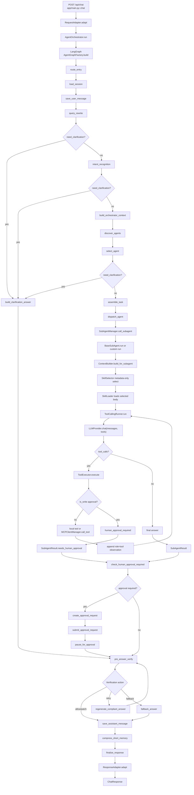
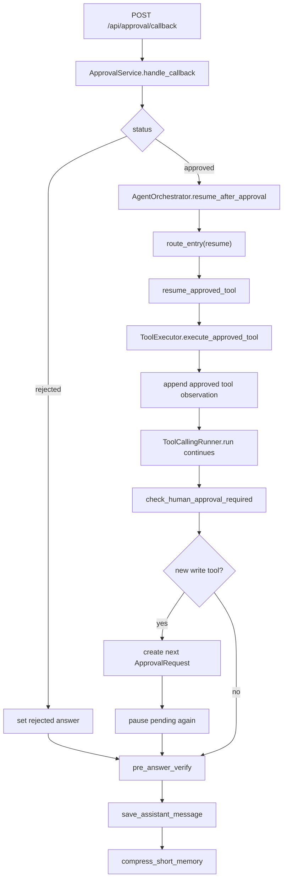

# Main Flow Code Walkthrough

本文基于当前真实代码同步 `/api/chat` 主流程。当前项目是 FastAPI API 入口 + LangGraph 主编排 + AgentCard/Skill 子 Agent 执行 + ToolCallingRunner/ToolExecutor 工具循环 + ApprovalStore 人审闭环 + VerificationService 最终出口的企业级 Agent Harness MVP。

## 1. 当前主架构

当前项目的主链路是：

- FastAPI 接收 `/api/chat` 和 `/api/approval/callback`。
- `RequestAdapter` 将 HTTP 请求转为内部 `InboundMessage`，并生成 `request_id`、`trace_id`、`session_key`。
- `AgentOrchestrator` 调用已编译 LangGraph，`thread_id = f"{session_key}:{request_id}"`。
- `AgentGraphFactory` 构建 LangGraph `StateGraph`，负责请求级状态机编排。
- Query rewrite 和 intent recognition 使用动态 `EntityBag` 和可选 LLM JSON 输出。
- 主 Agent 根据 `intent/entities/query/AgentCard` 选择子 Agent。
- 子 Agent 基于 `AgentCard + Skill + Knowledge hints + visible tools` 执行。
- `ToolCallingRunner` 负责 LLM tool loop。
- `ToolExecutor` 负责工具存在性、AgentCard 可见性、必填参数、权限、`pre_tool` verification、审批拦截、local/MCP 分发和日志。
- `VerificationService(pre_answer)` 是所有返回用户内容的最终出口，旧 `final_compliance_check / FinalComplianceChecker` 主路径已替换。
- SQLite 持久化 messages、short_term_memory、graph_checkpoints、tool_execution_logs、approval_requests、approval_events、evidence。

## 2. 完整主流程图



审批恢复：



## 3. 主流程节点表

| 节点 | 代码位置 | 输入 | 输出 | 说明 |
|---|---|---|---|---|
| `/api/chat` | `app/main.py::create_app.chat` | `ChatRequest`、header principal | `ChatResponse` | FastAPI 路由，调用 request/orchestrator/response adapter。 |
| `RequestAdapter` | `app/adapters/request_adapter.py::RequestAdapter.adapt` | `ChatRequest`、`Principal` | `InboundMessage` | 生成 `request_id`、`trace_id`、`session_key`，header 身份优先。 |
| `AgentOrchestrator.run` | `app/runtime/orchestrator.py::AgentOrchestrator.run` | `InboundMessage` | final graph state | 构造初始 `AgentGraphState`，用 `thread_id=session_key:request_id` 调 `graph.ainvoke`。 |
| `route_entry` | `app/runtime/graph.py::route_entry` | `approval_resume` | route | 正常请求进 `load_session`，审批恢复进 `resume_approved_tool`。 |
| `load_session` | `app/runtime/graph.py::load_session` | `session_key` | `recent_messages`、`short_summary` | `SessionManager.load_session` 读取 SQLite messages 与 short memory。 |
| `save_user_message` | `app/runtime/graph.py::save_user_message`、`app/runtime/handlers/message_commit_handler.py` | `original_query` | 写入 messages | 保存用户原始消息。 |
| `query_rewrite` | `app/query/query_rewrite_node.py::QueryRewriteNode.rewrite` | 原始 query、recent、summary | `rewritten_query`、`entities`、`entity_bag`、clarification | 使用 EntityExtractor/EntityBag，可选 LLM JSON rewrite，失败走规则 fallback。 |
| `intent_recognition` | `app/query/intent_recognition_node.py::IntentRecognitionNode.recognize` | query、entities、conversation window、AgentCard summaries | `intent`、`sub_intent`、`confidence`、entities merge | LLM JSON 分类 + 规则 fallback，不输出 required_tools。 |
| `build_orchestrator_context` | `app/runtime/context_builder.py::ContextBuilder.build_for_orchestrator` | query、intent、history、agents/tools | `OrchestratorContext` | 构建主编排轻量上下文，知识 hint 由 `KnowledgeHintBuilder` 预检索。 |
| `discover_agents` | `app/agents/card_loader.py::AgentCardLoader.list_available_agents` | cards root | `available_agents` | 读取 enabled AgentCard。 |
| `select_agent` | `app/agents/selection.py::AgentSelectionNode.select` | intent、entities、query | `selected_agent`、`selected_agent_card` | 规则 Top-K 召回，必要时 LLM Router 在 Top-K 中重排；随后做 Agent access check。 |
| `build_clarification_answer` | `app/runtime/handlers/clarification_handler.py::ClarificationHandler.build_answer` | clarification fields | `answer` | 前置理解/路由需要澄清时直接出答，不 dispatch agent。 |
| `assemble_task` | `app/agents/task_assembler.py::AgentTaskAssembler.assemble` | selected card、context、entities | `AgentTaskEnvelope` | 组装子 Agent 任务信封，附带 AgentCard、memory、knowledge hints、auth。 |
| `dispatch_agent` | `app/agents/dispatcher.py::DispatchAgentNode.dispatch` | task envelope、context | `subagent_result`、`answer` | 调 `SubAgentManager.call_subagent`。 |
| `BaseSubAgent.run` | `app/subagents/base.py::BaseSubAgent.run` | `SubAgentTask`、`OrchestratorContext` | `SubAgentResult` | 读取 AgentCard、计算 visible tools、构建 sub context、进入 tool loop。 |
| `ContextBuilder.build_for_subagent` | `app/runtime/context_builder.py` | task、parent context、allowed_tools | `SubAgentContext` | 委托 `SkillContextResolver` 和 `KnowledgeHintBuilder`。 |
| `SkillSelector` | `app/skills/selector.py`、`scorer.py`、`reranker.py`、`selection_policy.py` | skill metadata candidates | `SkillSelectionResult` | metadata-only 规则打分，必要时 LLM rerank，只从候选 skill_id 中选择。 |
| `RequiredEntityChecker` | `app/skills/required_entities.py` | selected skill、entities、EntityBag | entity check | 只有选中 skill 的 required_entities 缺失时才 clarification。 |
| `ToolCallingRunner` | `app/subagents/tool_calling_runner.py::ToolCallingRunner.run` | messages、tools schema | `ToolCallingRunResult` | LLM + tools loop，带 max/failure/duplicate guard。 |
| `ToolExecutor.execute` | `app/tools/executor.py::ToolExecutor.execute`、`app/tools/execution_pipeline.py` | tool call | `ToolResult` | 工具存在性、可见性、参数、权限、pre_tool verify、审批、执行、日志。 |
| `check_human_approval_required` | `app/runtime/handlers/approval_handler.py::check_required` | `subagent_result` | `approval_required` | 根据 `needs_human_approval` 路由。 |
| `create_approval_request` | `app/runtime/handlers/approval_handler.py::create_request` | approval payload、pending messages/tools | `approval_id` | 写 `approval_requests`，支持 parent/root/depth 审批链。 |
| `submit_approval_request` | `app/approval/client.py::ApprovalSystemClient.submit_approval_request` | `ApprovalRequest` | submit result | 提交外部审批系统；失败则不执行工具。 |
| `pause_for_approval` | `app/runtime/handlers/approval_handler.py::pause` | submit result | pending answer | `/api/chat` 不阻塞等待人工，直接返回 pending。 |
| `resume_approved_tool` | `app/runtime/handlers/approval_handler.py::resume_approved_tool` | approved approval state | `subagent_result` | 执行已批准工具，把 observation 加回 messages，继续 runner；再次遇到写工具会回到审批节点。 |
| `pre_answer_verify` | `app/runtime/handlers/verification_handler.py::pre_answer_verify` | `answer`、principal、evidence | `pre_answer_verification_result`、可能 patch answer | 调 `VerificationService(stage="pre_answer")`。 |
| `regenerate_compliant_answer` | `app/runtime/graph.py::regenerate_compliant_answer` | retry action | rewritten safe answer | Verification action=retry 且未超过一次时使用。 |
| `fallback_answer` | `app/runtime/graph.py::fallback_answer` | blocking/fallback | fallback answer | 最终兜底出答。 |
| `save_assistant_message` | `app/runtime/handlers/message_commit_handler.py::save_assistant_message` | verified answer | 写 messages | 保存最终对用户可见内容。 |
| `compress_short_memory` | `app/runtime/handlers/memory_commit_handler.py::compress_short_memory` | query、intent、answer、subagent result | `short_summary` | 调 `ShortTermMemoryManager.compress_after_turn` 更新短期记忆。 |
| `finalize_response` | `app/runtime/graph.py::finalize_response` | state | graph end | 记录最终日志。 |
| `ResponseAdapter` | `app/adapters/response_adapter.py::ResponseAdapter.adapt` | final state | `ChatResponse` | 只暴露 request/session/query/intent/answer/approval 字段。 |

## 4. 业务流程：保全任务完成后异常处理

示例请求：

```json
{
  "tenant_id": "tenant_a",
  "channel": "web",
  "user_id": "u1",
  "session_id": "s1",
  "messages": [
    {
      "role": "user",
      "content": "保全任务完成了，但是保单信息没有更新，受理号 APPLY_POLICY_UPDATE_FAIL，保单号 P001，保全项退保"
    }
  ]
}
```

执行过程：

```text
RequestAdapter
-> session_key = tenant_a:web:u1:s1
-> original_query = 用户最后一条 user message

query_rewrite
-> 抽取 apply_seq=APPLY_POLICY_UPDATE_FAIL、policy_no=P001、endorseType=退保

intent_recognition
-> intent = troubleshooting
-> sub_intent 可能为 endo_completion_aftercare 或由规则/LLM router 进一步选择

select_agent
-> 选择 troubleshooting_agent

assemble_task
-> 构造 AgentTaskEnvelope，包含 AgentCard、entities、short_summary、recent_messages、auth_context

BaseSubAgent.run
-> ContextBuilder.build_for_subagent
-> SkillSelector 选择 troubleshooting_agent.endo_completion_aftercare
-> SkillLoader 加载该 skill body
-> RequiredEntityChecker 确认 apply_seq/policy_no/endorseType 足够
-> ToolRegistry 只返回 troubleshooting_agent 可见工具 schema

ToolCallingRunner
-> 第 1 轮 LLM 调 query_endo_task_record(apply_seq)
-> ToolExecutor 执行查询工具，返回 9/10/11 节点状态
-> 第 2 轮 LLM 根据 response_body 包含“保单更新错误”调用 notice_policy_update
-> ToolExecutor 发现 notice_policy_update is_write=true
-> 返回 human_approval_required

Graph approval branch
-> create_approval_request
-> submit_approval_request
-> pause_for_approval
-> pre_answer_verify
-> save_assistant_message
-> compress_short_memory
-> ChatResponse pending
```

pending 响应示例：

```json
{
  "request_id": "req_xxx",
  "session_key": "tenant_a:web:u1:s1",
  "original_query": "保全任务完成了，但是保单信息没有更新，受理号 APPLY_POLICY_UPDATE_FAIL，保单号 P001，保全项退保",
  "rewritten_query": "保全任务完成了，但是保单信息没有更新，受理号 APPLY_POLICY_UPDATE_FAIL，保单号 P001，保全项退保",
  "intent": "troubleshooting",
  "answer": "该操作需要人工审批，审批请求已提交，approval_id=approval_xxx。当前操作尚未执行。",
  "approval_required": true,
  "approval_id": "approval_xxx",
  "approval_status": "pending"
}
```

## 5. 数据流

| 字段 | 产生位置 | 消费位置 | 说明 |
|---|---|---|---|
| `request_id` | `RequestAdapter.adapt` | 全链路日志、messages、tools、approval、checkpoint | 单次请求 ID。 |
| `trace_id` | `RequestAdapter.adapt` | 日志、tools、approval | 链路追踪 ID。 |
| `session_key` | `RequestAdapter.build_session_key` | message/memory/checkpoint/tool logs | `tenant_id:channel:user_id:session_id`。 |
| `thread_id` | `AgentOrchestrator._thread_id` | LangGraph config、approval resume | `session_key:request_id`，避免同 session 并发请求互相污染。 |
| `principal` / `auth_context` | auth dependencies + RequestAdapter | Agent access、Tool access、Verification、Approval snapshot | header principal 优先，不建议信任 body 身份覆盖 header。 |
| `entities` / `entity_bag` | query rewrite + intent recognition | agent selection、task assembly、skill entity check | 动态实体容器，不在 ConversationWindow 顶层写死业务字段。 |
| `selected_agent_card` | select_agent | assemble_task、BaseSubAgent、ToolRegistry/ToolExecutor | 控制子 Agent 能力与工具可见性。 |
| `assembled_task` | assemble_task | dispatch_agent | 子 Agent 任务信封。 |
| `subagent_result` | dispatch_agent / resume_approved_tool | approval route、Verification、memory | 包含 answer、tool_calls、evidence、skill 信息。 |
| `approval_id` | create_approval_request | pause、callback、query API | 审批业务主键。 |
| `answer` | 子 Agent、clarification、approval pause、Verification patch | save_assistant_message、ResponseAdapter | 保存和返回的是最终 verified answer。 |
| `short_summary` | load_session / compress_short_memory | query rewrite、context、memory | 每 session 的滚动摘要。 |

## 6. 关键边界

### Agent 选择边界

主 Agent 不读取所有 skill body，也不拿所有 tools schema 给 LLM 做路由。Agent 选择只基于 AgentCard 摘要、intent、entities、query 和可选 LLM Top-K rerank。

### Skill 边界

Skill 不是每个问题都必须强制命中。`SkillSelector` 低置信时可以 fallback 到 generic execution，让子 Agent 依靠 AgentCard、上下文和可见工具进行 tool calling 或直接回答。只有选中具体 skill 后，该 skill 的 `required_entities` 才会阻塞执行。

### Tool 边界

LLM 看到的是 OpenAI function-calling schema。实际执行前仍经过 ToolExecutor 二次校验；MCP/local 分发、审批、审计都不在 LLMProvider 中。

### Verification 边界

最终外发统一通过 `pre_answer_verify -> VerificationService`。`ComplianceVerifier` 已作为 verifier 接入，不再由 Graph 直接调用 `FinalComplianceChecker`。

### Approval 边界

`ToolExecutor.execute` 不创建审批单，只返回 `human_approval_required`。Graph approval nodes 创建审批单、提交外部审批、返回 pending。callback approved 后回到 Graph resume path，保证第二个写工具仍能产生第二个审批闭环。

## 7. 当前仍需同步或注意

- 部分历史设计文档仍可能出现 `final_compliance_check` 或 `FinalComplianceChecker` 字样；当前主链路应以 `pre_answer_verify -> VerificationService` 为准。
- 历史 mojibake 文案未批量修复。
- `app/integrations/*` 是预留/示例目录，不等于主链路已接入。
- 默认 KnowledgeService 关闭，不会使用内置 mock chunks。
