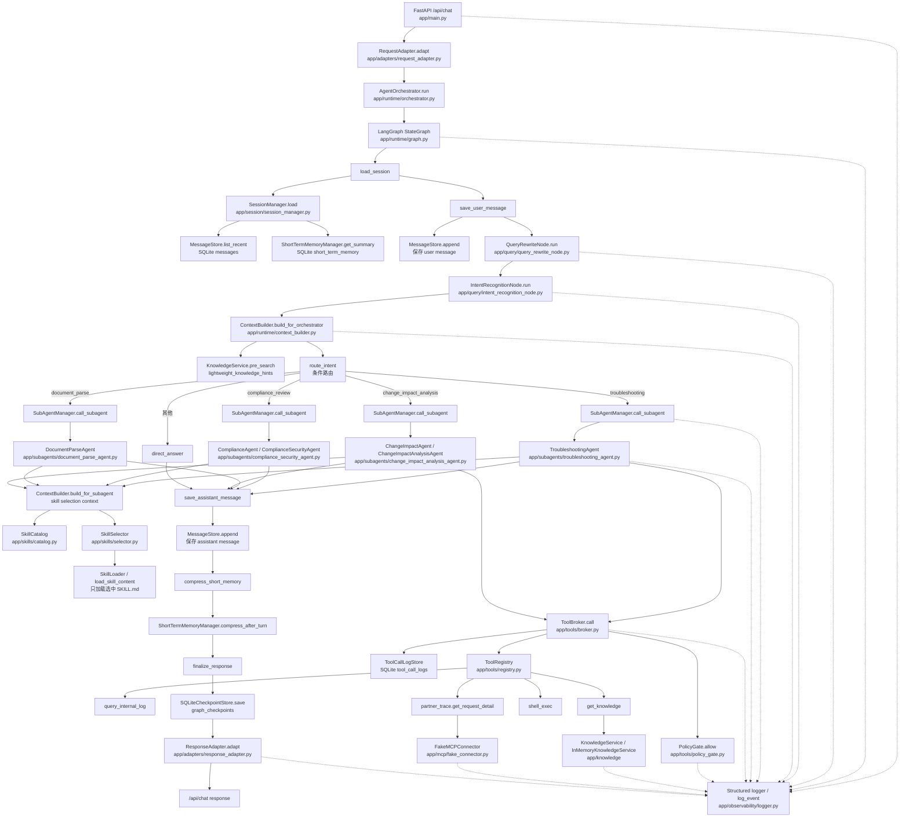

# 项目主干链路代码介绍文档

本文面向后续开发者，说明当前项目从 FastAPI `/api/chat` 请求入口到最终返回结果的完整代码执行链路。阅读本文后，应能快速定位主干模块、理解组件职责、核心方法、上下游关系，以及一次请求中的数据如何在 LangGraph、子 Agent、工具、持久化和日志之间流转。

## 1. 项目主干链路总览

当前项目主链路可以概括为：

1. FastAPI 接收 `/api/chat` 请求。
2. `RequestAdapter` 将外部请求转换为内部 `InboundMessage`，生成 `request_id`、`trace_id`、`session_key`。
3. `AgentOrchestrator` 使用 `session_key` 作为 LangGraph `thread_id` 执行 `StateGraph`。
4. LangGraph 固定执行前置节点：加载会话、保存用户消息、Query Rewrite、Intent Recognition、构建主干上下文。
5. `route_intent` 根据意图选择对应子 Agent 或直接回答。
6. 子 Agent 通过 `ContextBuilder` 获取最小必要上下文，并通过 `SkillCatalog` / `SkillSelector` 动态选择 skill。
7. 子 Agent 如需工具能力，必须通过 `ToolBroker`，再经过 `PolicyGate`、`ToolRegistry` 调用具体 tool。
8. 工具调用可能访问 `KnowledgeService`、`FakeMCPConnector`、SQLite 审计表或受限本地能力。
9. LangGraph 保存 assistant 消息、压缩短期记忆、生成最终响应状态。
10. `ResponseAdapter` 将内部状态转换为 `/api/chat` 的稳定响应格式。
11. 全链路通过 `log_event` 输出结构化运行日志。



## 2. 一次请求的完整执行链路

以下请求用于说明一次典型问题排查链路：

```json
{
  "tenant_id": "pingan_health",
  "channel": "web",
  "user_id": "u001",
  "session_id": "s001",
  "messages": [
    {
      "role": "user",
      "content": "REQ_001 为什么返回 E102？"
    }
  ]
}
```

### 2.1 FastAPI 请求入口

代码位置：`app/main.py`

核心入口是：

```python
@app.post("/api/chat", response_model=ChatResponse)
async def chat(request: ChatRequest) -> ChatResponse:
    ...
```

`create_app()` 会完成主流程依赖装配，包括：

- SQLite 数据库与存储组件。
- `MessageStore`、`SessionManager`、`ShortTermMemoryManager`。
- `InMemoryKnowledgeService`。
- `FakeMCPConnector`。
- `ToolRegistry`、`PolicyGate`、`ToolBroker`。
- `SkillCatalog`、`ContextBuilder`、`SubAgentManager`。
- `AgentGraphFactory` 与 `AgentOrchestrator`。
- `RequestAdapter` 与 `ResponseAdapter`。

请求进入后，`/api/chat` 会先记录 `request_received` 日志，再调用：

```python
inbound = request_adapter.adapt(request)
```

### 2.2 RequestAdapter：外部请求转内部消息

代码位置：`app/adapters/request_adapter.py`

核心方法：

```python
RequestAdapter.adapt(request: ChatRequest) -> InboundMessage
```

它会完成以下工作：

- 从 `messages` 中取最后一条 user 消息作为 `original_query`。
- 生成 `request_id`。
- 生成 `trace_id`。
- 生成 `session_key`。
- 记录 `session_key_created`、`request_adapted`、`original_query` 日志。

本示例中的 `session_key` 为：

```text
pingan_health:web:u001:s001
```

这是当前多租户、多用户、多会话隔离的核心键，也会作为 LangGraph 的 `thread_id`。

### 2.3 AgentOrchestrator：启动 LangGraph

代码位置：`app/runtime/orchestrator.py`

核心方法：

```python
AgentOrchestrator.run(inbound: InboundMessage) -> AgentState
```

它会构造初始 `AgentState`：

- `request_id`
- `trace_id`
- `tenant_id`
- `channel`
- `user_id`
- `session_id`
- `session_key`
- `original_query`

然后使用 `session_key` 作为 LangGraph thread：

```python
config = {"configurable": {"thread_id": inbound.session_key}}
final_state = await self.graph.ainvoke(initial_state, config=config)
```

执行完成后，`AgentOrchestrator` 会将最终 state 写入 `SQLiteCheckpointStore`，用于后续回放或排查。

### 2.4 LangGraph StateGraph：主干状态机

代码位置：`app/runtime/graph.py`

当前真实使用 LangGraph `StateGraph`，不是普通函数串联。主节点包括：

| 节点 | 职责 |
| --- | --- |
| `load_session` | 根据 `session_key` 加载历史消息和短期摘要。 |
| `save_user_message` | 保存当前用户消息。 |
| `query_rewrite` | 调用 `QueryRewriteNode` 改写用户问题。 |
| `intent_recognition` | 调用 `IntentRecognitionNode` 识别意图。 |
| `build_orchestrator_context` | 构建主干轻量上下文。 |
| `route_intent` | 根据意图选择子 Agent 或直接回答。 |
| `call_troubleshooting_agent` | 调用问题排查子 Agent。 |
| `call_compliance_security_agent` | 调用合规安全子 Agent。 |
| `call_document_parse_agent` | 调用文档解析子 Agent。 |
| `call_change_impact_analysis_agent` | 调用变更影响分析子 Agent。 |
| `direct_answer` | 非子 Agent 场景的直接回答。 |
| `save_assistant_message` | 保存助手回复。 |
| `compress_short_memory` | 更新短期记忆摘要。 |
| `finalize_response` | 生成最终响应状态。 |

每个节点进入和退出都会通过统一日志输出：

- `langgraph_node_enter`
- `langgraph_node_exit`

### 2.5 load_session：读取历史上下文

代码位置：

- `app/runtime/graph.py`
- `app/session/session_manager.py`
- `app/session/message_store.py`
- `app/memory/short_term_memory_manager.py`

`load_session` 调用：

```python
session_snapshot = session_manager.load(...)
```

`SessionManager` 会读取：

- 最近消息：`MessageStore.list_recent(session_key, limit=60)`
- 短期摘要：`ShortTermMemoryManager.get_summary(session_key)`

当前 `ContextBuilder` 侧会使用最近 30 轮消息，即最多 60 条 user / assistant 消息。日志中可以看到：

- `session_loaded`
- `memory_context_loaded`

### 2.6 save_user_message：保存用户消息

代码位置：`app/session/message_store.py`

`save_user_message` 会把用户原始输入写入 SQLite `messages` 表，包含：

- `request_id`
- `trace_id`
- `session_key`
- `tenant_id`
- `user_id`
- `role=user`
- `content`
- `original_query`

对应日志：

- `user_message_saved`

### 2.7 QueryRewriteNode：问题改写

代码位置：`app/query/query_rewrite_node.py`

核心方法：

```python
QueryRewriteNode.run(original_query, recent_messages, short_summary, request_id, trace_id, session_key, user_id, tenant_id)
```

本示例输入：

```text
REQ_001 为什么返回 E102？
```

规则识别到 `REQ_001` 和 `E102` 后，会改写为类似：

```text
排查 requestId=REQ_001 的健康险个险接口 E102 错误原因
```

对应日志：

- `query_rewrite_started`
- `query_rewrite_finished`

### 2.8 IntentRecognitionNode：意图识别

代码位置：`app/query/intent_recognition_node.py`

核心方法：

```python
IntentRecognitionNode.run(original_query, rewritten_query, recent_messages, short_summary, request_id, trace_id, session_key, user_id, tenant_id)
```

当前是规则识别。对本示例来说，命中 `REQ_`、`E102`、`排查` 等关键词，因此意图为：

```text
troubleshooting
```

对应日志：

- `intent_recognition_started`
- `intent_recognition_finished`

### 2.9 ContextBuilder：构建主干上下文

代码位置：`app/runtime/context_builder.py`

主干阶段调用：

```python
ContextBuilder.build_for_orchestrator(...)
```

它会生成 `OrchestratorContext`，包括：

- `tenant_id`
- `channel`
- `user_id`
- `session_id`
- `session_key`
- `original_query`
- `rewritten_query`
- `intent`
- `recent_messages`
- `short_summary`
- `lightweight_knowledge_hints`

其中 `lightweight_knowledge_hints` 来自：

```python
KnowledgeService.pre_search(query)
```

对本示例，会命中 E102、签名校验、timestamp 等轻量知识提示。

对应日志：

- `knowledge_hint_loaded`
- `orchestrator_context_built`

### 2.10 route_intent：条件路由

代码位置：`app/runtime/graph.py`

当前条件路由规则是：

| intent | 目标节点 |
| --- | --- |
| `troubleshooting` | `call_troubleshooting_agent` |
| `compliance_review` | `call_compliance_security_agent` |
| `document_parse` | `call_document_parse_agent` |
| `change_impact_analysis` | `call_change_impact_analysis_agent` |
| 其他 | `direct_answer` |

本示例的 `intent=troubleshooting`，因此进入：

```text
call_troubleshooting_agent
```

对应日志：

- `route_decision`

### 2.11 SubAgentManager：选择固定注册的子 Agent

代码位置：`app/subagents/manager.py`

当前项目不支持自由 spawn。子 Agent 通过固定 Agent Catalog 注册，包括：

- `troubleshooting_agent`
- `compliance_security_agent`
- `document_parse_agent`
- `change_impact_analysis_agent`

LangGraph 传入 `SubAgentTask` 后，`SubAgentManager.call_subagent()` 会根据 `task.name` 调用对应 agent。

本示例进入：

```text
troubleshooting_agent
```

对应日志：

- `subagent_selected`

### 2.12 TroubleshootingAgent：问题排查执行

代码位置：`app/subagents/troubleshooting_agent.py`

核心方法：

```python
TroubleshootingAgent.run(task: SubAgentTask) -> SubAgentResult
```

本示例中，`TroubleshootingAgent` 的主要执行步骤为：

1. 构建子 Agent 上下文。
2. 选择最合适的 skill。
3. 查询内部日志。
4. 查询知识库。
5. 必要时查询渠道侧 trace。
6. 构建结构化 evidence。
7. 生成 diagnosis、responsibility、recommendation、confidence 和最终 answer。

对应日志：

- `troubleshooting_started`
- `evidence_built`

### 2.13 动态 Skill 选择

代码位置：

- `app/runtime/context_builder.py`
- `app/skills/catalog.py`
- `app/skills/selector.py`
- `app/skills/loader.py`

当前已经从“一个子 Agent 固定绑定一个 SKILL.md”升级为“一个子 Agent 拥有多个 skills，并动态选择”。

对问题排查子 Agent，当前候选 skills 包括：

- `troubleshooting.signature_error`
- `troubleshooting.missing_field`
- `troubleshooting.callback_failure`

执行流程：

1. `ContextBuilder.build_skill_selection_context()` 从请求中提取 `request_id`、`error_code`、`interface_name` 等字段。
2. `SkillCatalog.list_skills(agent_name)` 只加载候选 skill 的 YAML frontmatter metadata。
3. `SkillSelector.select()` 基于 intent、query、error_code、interface_name、business_domain、description、intent_tags、required_context 做规则匹配。
4. 选中后，才通过 `SkillLoader` / `SkillCatalog.load_skill_content()` 加载完整 `SKILL.md` 正文。

本示例会选择：

```text
troubleshooting.signature_error
```

原因是 query 包含 `REQ_001` 和 `E102`，且 metadata 中的 description、intent_tags 与签名失败排查匹配。

对应日志：

- `skill_candidates_built`
- `skill_selection_started`
- `skill_selected`
- `skill_content_loaded`

### 2.14 ToolBroker：统一工具调用入口

代码位置：

- `app/tools/broker.py`
- `app/tools/policy_gate.py`
- `app/tools/registry.py`
- `app/tools/audit_store.py`

子 Agent 不能直接调用工具实现，必须通过：

```python
ToolBroker.call(tool_call)
```

`ToolBroker` 的执行顺序是：

1. 记录 `tool_call_requested`。
2. 从 `ToolRegistry` 获取 tool。
3. 调用 `PolicyGate.allow()` 判断是否允许。
4. 若拒绝，写入 `tool_call_logs` 审计记录并返回失败结果。
5. 若允许，记录 `tool_call_started`。
6. 调用具体 tool handler。
7. 记录 `tool_call_finished`。
8. 写入 `tool_call_logs` 审计记录。

所有 `ToolCall` 都携带：

- `request_id`
- `trace_id`
- `session_key`
- `tool_name`
- `arguments`

本示例会经过三类工具：

| 调用顺序 | tool_name | 作用 |
| --- | --- | --- |
| 1 | `query_internal_log` | 查询内部 mock 日志，确认 `REQ_001` 的内部错误。 |
| 2 | `get_knowledge` | 查询知识库，获取 E102、签名规则、timestamp 等依据。 |
| 3 | `partner_trace.get_request_detail` | 通过 fake MCP 查询渠道侧 trace。 |

### 2.15 query_internal_log：内部日志证据

代码位置：`app/tools/builtin_tools.py`

对 `REQ_001`，mock 内部日志会返回 E102 相关信息，表示接口侧发现签名校验失败。

这部分会进入 `TroubleshootingAgent` 的 evidence：

```text
内部日志证据
```

### 2.16 get_knowledge：知识库依据

代码位置：

- `app/tools/builtin_tools.py`
- `app/knowledge/base.py`
- `app/knowledge/in_memory.py`

`get_knowledge` 已改造为调用 `KnowledgeService`，默认实现是 `InMemoryKnowledgeService`。

知识块返回结构至少包含：

- `content`
- `source`
- `score`
- `metadata`

当前内置 mock knowledge 包含：

- E102 签名校验失败。
- `submitProposal` 接口说明。
- `timestamp` 参与签名规则。
- 密钥版本不一致。
- 字段排序不一致。
- 空值字段处理不一致。

这部分会进入 `TroubleshootingAgent` 的 evidence：

```text
知识库依据
```

### 2.17 partner_trace.get_request_detail：渠道侧 MCP trace

代码位置：

- `app/tools/mcp_tools.py`
- `app/mcp/base.py`
- `app/mcp/fake_connector.py`

`partner_trace.get_request_detail` 是通过统一 MCP tool wrapper 注册到 `ToolRegistry` 的，因此仍然走：

```text
ToolBroker -> PolicyGate -> ToolRegistry -> MCP tool wrapper -> FakeMCPConnector
```

对 `REQ_001`，`FakeMCPConnector` 返回渠道侧 trace，表示渠道侧仍使用旧版签名规则，未将 `timestamp` 纳入签名原文。

这部分会进入 `TroubleshootingAgent` 的 evidence：

```text
渠道侧 trace 证据
```

### 2.18 TroubleshootingAgent 输出结构化结果

`TroubleshootingAgent` 的 `SubAgentResult` 不只是拼接 answer，还包含结构化字段：

- `diagnosis`
- `evidence`
- `recommendation`
- `responsibility`
- `confidence`
- `selected_skill_id`
- `selected_skill_metadata`
- `selected_skill_score`
- `selected_skill_reason`

其中 evidence 的单项结构至少包含：

- `type`
- `source`
- `tool_name`
- `summary`
- `raw_ref` 或 `result_preview`
- `confidence`

对本示例，结论会聚合三类依据：

- 内部日志显示 `REQ_001` 返回 `E102`，属于签名校验失败。
- 知识库说明 `timestamp` 应参与签名原文。
- 渠道侧 trace 显示仍使用旧版签名规则，未将 `timestamp` 纳入签名原文。

因此初步归属通常会指向渠道侧签名规则未升级或签名原文构造不一致。

### 2.19 save_assistant_message：保存助手回复

代码位置：`app/session/message_store.py`

子 Agent 返回后，LangGraph 进入 `save_assistant_message`，将助手回复写入 SQLite `messages` 表。

保存字段包括：

- `request_id`
- `trace_id`
- `session_key`
- `role=assistant`
- `content`
- `original_query`
- `rewritten_query`
- `intent`

对应日志：

- `assistant_message_saved`

### 2.20 compress_short_memory：更新短期记忆

代码位置：`app/memory/short_term_memory_manager.py`

LangGraph 调用：

```python
ShortTermMemoryManager.compress_after_turn(...)
```

当前是轻量规则摘要。对 E102 问题排查场景，会将本轮关键信息写入 SQLite `short_term_memory` 表，供下一轮追问使用。

对应日志：

- `short_memory_compressed`

### 2.21 finalize_response 与 checkpoint

代码位置：

- `app/runtime/graph.py`
- `app/runtime/checkpoint.py`

`finalize_response` 会整理最终 state。随后 `AgentOrchestrator` 调用：

```python
SQLiteCheckpointStore.save(session_key, final_state)
```

checkpoint 存在 SQLite `graph_checkpoints` 表中，key 是 `thread_id`，当前就是 `session_key`。

### 2.22 ResponseAdapter：返回稳定 API 响应

代码位置：`app/adapters/response_adapter.py`

核心方法：

```python
ResponseAdapter.adapt(final_state: AgentState) -> ChatResponse
```

当前 `/api/chat` 对外响应保持简洁和向后兼容，主要包含：

- `request_id`
- `session_key`
- `original_query`
- `rewritten_query`
- `intent`
- `answer`

完整 evidence、selected skill、tool audit 等信息保存在内部 state、SQLite checkpoint 和审计表中，不默认完整暴露给 `/api/chat` 响应。

对应日志：

- `response_finalized`
- `response_returned`

## 3. 核心数据对象流转

### 3.1 ChatRequest

代码位置：`app/schemas/message.py`

外部请求模型，主要字段：

- `tenant_id`
- `channel`
- `user_id`
- `session_id`
- `messages`

### 3.2 InboundMessage

代码位置：`app/schemas/message.py`

由 `RequestAdapter` 生成，是内部主链路入口对象：

- `request_id`
- `trace_id`
- `tenant_id`
- `channel`
- `user_id`
- `session_id`
- `session_key`
- `original_query`

### 3.3 AgentState

代码位置：`app/runtime/graph_state.py`

LangGraph state，贯穿整条主干链路。核心字段包括：

- 请求身份：`request_id`、`trace_id`、`session_key`。
- 用户身份：`tenant_id`、`channel`、`user_id`、`session_id`。
- 查询内容：`original_query`、`rewritten_query`。
- 路由信息：`intent`、`target_subagent`、`required_tools`。
- 上下文：`recent_messages`、`short_summary`、`orchestrator_context`。
- 子 Agent 结果：`subagent_result`。
- skill 选择结果：`selected_skill_id`、`selected_skill_metadata`、`skill_selection_score`、`skill_selection_reason`。
- 最终输出：`answer`、`error`。
- 调试路径：`graph_path`。

### 3.4 SubAgentTask 和 SubAgentResult

代码位置：`app/schemas/subagent.py`

`SubAgentTask` 是主 Agent 调用子 Agent 的任务对象，包含：

- `name`
- `intent`
- `query`
- `context`
- `metadata`

`SubAgentResult` 是子 Agent 返回结果，包含：

- `answer`
- `data`
- `diagnosis`
- `evidence`
- `recommendation`
- `responsibility`
- `confidence`
- `selected_skill_id`
- `selected_skill_metadata`
- `selected_skill_score`
- `selected_skill_reason`

### 3.5 ToolCall 和 ToolResult

代码位置：`app/schemas/tool.py`

`ToolCall` 是所有工具调用的统一输入，包含：

- `tool_name`
- `arguments`
- `request_id`
- `trace_id`
- `session_key`

`ToolResult` 是统一工具输出，包含：

- `success`
- `data`
- `error`

## 4. 多用户、多会话、多轮隔离

当前隔离核心是 `session_key`：

```text
{tenant_id}:{channel}:{user_id}:{session_id}
```

例如：

```text
pingan_health:web:u001:s001
```

它同时用于：

- `MessageStore` 的消息隔离。
- `ShortTermMemoryManager` 的短期摘要隔离。
- `SQLiteCheckpointStore` 的 LangGraph checkpoint 隔离。
- `ToolCallLogStore` 的工具调用审计隔离。
- LangGraph `config.configurable.thread_id`。

因此：

- 同一 `tenant_id/channel/user_id/session_id` 的多轮对话会共享历史消息和短期摘要。
- 不同 `user_id` 或不同 `session_id` 会生成不同 `session_key`，互不读取对方上下文。

## 5. 持久化表与用途

SQLite 初始化代码位置：`app/storage/sqlite.py`

当前核心表包括：

| 表名 | 主要用途 |
| --- | --- |
| `messages` | 保存 user / assistant 消息、original_query、rewritten_query、intent 等。 |
| `short_term_memory` | 保存每个 session 的短期摘要。 |
| `graph_checkpoints` | 保存 LangGraph final state，按 thread_id/session_key 隔离。 |
| `tool_call_logs` | 保存每次工具调用的审计记录。 |

`tool_call_logs` 至少记录：

- `request_id`
- `trace_id`
- `session_key`
- `tool_name`
- `arguments_json`
- `allowed`
- `success`
- `result_json`
- `error`
- `started_at`
- `finished_at`
- `duration_ms`

敏感参数会在审计写入前做脱敏处理。

## 6. 工具调用安全边界

所有工具调用必须经过：

```text
ToolBroker -> PolicyGate -> ToolRegistry -> tool handler
```

当前主要工具：

| tool_name | 当前实现 | 说明 |
| --- | --- | --- |
| `query_internal_log` | mock | 查询内部请求日志。 |
| `get_knowledge` | mock RAG | 调用 `InMemoryKnowledgeService`。 |
| `partner_trace.get_request_detail` | fake MCP | 调用 `FakeMCPConnector`。 |
| `shell_exec` | 受限本地工具 | 默认禁用，仅允许 `echo`、`pwd`、`ls`，且不使用 `shell=True`。 |
| `http_request` | 示例工具 | 默认禁用，用于未来真实 HTTP 工具调用示例。 |
| `mcp_http.call_tool` | 示例工具 | 默认禁用，用于未来真实 MCP HTTP 调用示例。 |

`shell_exec` 即使被默认拒绝，也会进入 `tool_call_logs` 审计。

## 7. Runtime Execution Logging

统一日志工具代码位置：`app/observability/logger.py`

所有关键模块通过：

```python
log_event(...)
```

输出 JSON line 风格结构化日志。核心字段包括：

- `timestamp`
- `level`
- `event`
- `request_id`
- `trace_id`
- `session_key`
- `user_id`
- `tenant_id`
- `node`
- `message`
- `data`

一次 `/api/chat` 请求中，关键日志事件包括：

- `request_received`
- `request_adapted`
- `session_key_created`
- `session_loaded`
- `user_message_saved`
- `query_rewrite_started`
- `query_rewrite_finished`
- `intent_recognition_started`
- `intent_recognition_finished`
- `memory_context_loaded`
- `knowledge_hint_loaded`
- `orchestrator_context_built`
- `langgraph_node_enter`
- `langgraph_node_exit`
- `route_decision`
- `subagent_selected`
- `skill_candidates_built`
- `skill_selection_started`
- `skill_selected`
- `skill_content_loaded`
- `troubleshooting_started`
- `tool_call_requested`
- `policy_gate_checked`
- `tool_call_started`
- `tool_call_finished`
- `mcp_call_started`
- `mcp_call_finished`
- `evidence_built`
- `assistant_message_saved`
- `short_memory_compressed`
- `response_finalized`
- `response_returned`

日志 `data` 中只应放脱敏后的摘要，不放完整敏感数据。

## 8. 四类子 Agent 当前职责

### 8.1 TroubleshootingAgent

代码位置：`app/subagents/troubleshooting_agent.py`

职责：

- 排查接口请求失败、错误码、签名问题、渠道 trace 问题。
- 对 E102 等问题组合内部日志、知识库和 MCP trace。
- 输出结构化 evidence、diagnosis、responsibility、recommendation。

典型工具：

- `query_internal_log`
- `get_knowledge`
- `partner_trace.get_request_detail`

### 8.2 ComplianceAgent / ComplianceSecurityAgent

代码位置：`app/subagents/compliance_security_agent.py`

职责：

- 对文本做隐私、敏感信息、外发风险检查。
- 识别手机号、身份证、token、健康信息等风险。
- 输出合规检查发现和处理建议。

### 8.3 DocumentParseAgent

代码位置：`app/subagents/document_parse_agent.py`

职责：

- 解析 markdown / text / json / yaml 文档内容。
- 提取标题、接口、字段、错误码等结构。
- 当前不接真实 PDF / Word 解析。

### 8.4 ChangeImpactAgent / ChangeImpactAnalysisAgent

代码位置：`app/subagents/change_impact_analysis_agent.py`

职责：

- 分析接口字段、错误码、签名规则、知识文档变更的影响。
- 必要时通过 `get_knowledge` 查询相关背景。
- 输出影响范围、建议动作和风险提示。

## 9. Skill 动态选择机制

当前每个子 Agent 可以拥有多个 skills。目录形态示例：

```text
app/skills/
  troubleshooting_agent/
    signature_error/
      SKILL.md
    missing_field/
      SKILL.md
    callback_failure/
      SKILL.md
```

每个 `SKILL.md` 使用 YAML frontmatter 描述 metadata，例如：

```yaml
---
skill_id: troubleshooting.signature_error
name: 签名失败排查
description: 用于排查 E102、签名校验失败、timestamp 未参与签名等问题
agent: troubleshooting_agent
intent_tags:
  - troubleshooting
  - signature_error
  - E102
business_domain:
  - health_insurance_onboarding
required_context:
  - request_id
  - error_code
enabled: true
---
```

主流程只加载 metadata，不一次性加载所有 skill 正文。只有 `SkillSelector` 选中某个 `skill_id` 后，才加载该 skill 的完整正文并注入子 Agent 上下文。

这保证了：

- 上下文更小。
- skill 可扩展。
- 选择结果可测试、可日志回放。
- 子 Agent 仍然只能通过 `ToolBroker` / `PolicyGate` 调用工具。

## 10. 当前 Mock / Stub 与未来接入点

当前仍然是 MVP，不接真实企业外部系统：

| 能力 | 当前实现 | 未来替换方向 |
| --- | --- | --- |
| RAG | `InMemoryKnowledgeService` | Milvus / Elasticsearch / 向量检索服务。 |
| MCP | `FakeMCPConnector` | 真实 MCP Server 或 MCP HTTP gateway。 |
| 内部日志 | `query_internal_log` mock | 内部日志检索 API。 |
| 渠道 trace | fake `partner_trace.get_request_detail` | 渠道 trace API / MCP tool。 |
| 默认 LLM | `FakeLLMProvider` | OpenAI-compatible provider。 |
| 长期记忆 | stub / 示例 client | 真实长期记忆服务。 |
| checkpoint | 本地 SQLite | SQLite checkpointer / PostgreSQL / Redis 等。 |
| 审计 | 本地 SQLite `tool_call_logs` | 审计系统或日志平台。 |
| Observability | Python logging | OpenTelemetry / 真实观测平台。 |

真实 API 示例代码集中在：

```text
app/integrations/
```

这些代码默认不启用，仅作为后续接真实系统时的替换参考。

## 11. 开发调试定位建议

如果要排查一次 `/api/chat` 请求，可以按以下顺序定位：

1. 看请求是否进入 `app/main.py` 的 `/api/chat`。
2. 看 `RequestAdapter` 是否生成正确 `session_key`。
3. 看 `AgentOrchestrator` 是否使用 `session_key` 作为 `thread_id`。
4. 看 `app/runtime/graph.py` 中 `graph_path` 是否经过预期节点。
5. 看 `QueryRewriteNode` 的 `rewritten_query` 是否符合预期。
6. 看 `IntentRecognitionNode` 的 `intent` 是否正确。
7. 看 `ContextBuilder` 是否加载历史消息、短期摘要和轻量知识提示。
8. 看 `route_intent` 是否路由到正确子 Agent。
9. 看 `SkillSelector` 的 `selected_skill_id`、score、reason。
10. 看 `ToolBroker` 是否记录了预期工具调用。
11. 看 SQLite `tool_call_logs` 是否有工具审计记录。
12. 看 `subagent_result.evidence` 是否包含需要的证据类型。
13. 看 `messages` 和 `short_term_memory` 是否写入当前 `session_key`。
14. 看 `ResponseAdapter` 是否保持 `/api/chat` 响应格式稳定。

## 12. 示例请求的预期主干结果

对以下请求：

```json
{
  "tenant_id": "pingan_health",
  "channel": "web",
  "user_id": "u001",
  "session_id": "s001",
  "messages": [
    {
      "role": "user",
      "content": "REQ_001 为什么返回 E102？"
    }
  ]
}
```

预期关键中间结果：

| 阶段 | 结果 |
| --- | --- |
| `session_key` | `pingan_health:web:u001:s001` |
| `original_query` | `REQ_001 为什么返回 E102？` |
| `rewritten_query` | `排查 requestId=REQ_001 的健康险个险接口 E102 错误原因` |
| `intent` | `troubleshooting` |
| `route_intent` | `call_troubleshooting_agent` |
| `selected_skill_id` | `troubleshooting.signature_error` |
| 工具调用 1 | `query_internal_log` |
| 工具调用 2 | `get_knowledge` |
| 工具调用 3 | `partner_trace.get_request_detail` |
| 内部日志证据 | `REQ_001` 返回 `E102`，签名校验失败。 |
| 知识库依据 | `timestamp` 应参与签名原文，E102 与签名规则不一致有关。 |
| 渠道侧 trace | 渠道侧仍使用旧版签名规则，未将 `timestamp` 纳入签名原文。 |
| 初步归属 | 渠道侧签名规则未升级或签名原文构造不一致。 |
| 最终响应 | 返回核心 `ChatResponse` 字段，answer 中包含排查结论。 |

## 13. 最小运行验证

安装依赖：

```bash
uv sync
```

运行测试：

```bash
uv run pytest
```

启动服务：

```bash
uv run uvicorn app.main:app --reload
```

调用示例：

```bash
curl -X POST "http://127.0.0.1:8000/api/chat" \
  -H "Content-Type: application/json" \
  -d '{
    "tenant_id": "pingan_health",
    "channel": "web",
    "user_id": "u001",
    "session_id": "s001",
    "messages": [
      {
        "role": "user",
        "content": "REQ_001 为什么返回 E102？"
      }
    ]
  }'
```

预期响应中应能看到：

- `session_key=pingan_health:web:u001:s001`
- `intent=troubleshooting`
- `rewritten_query` 与 E102 排查相关
- `answer` 提到 E102、签名校验失败、timestamp、渠道侧 trace、旧版签名规则或 timestamp 未参与签名

