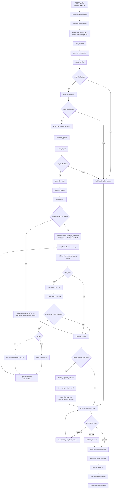
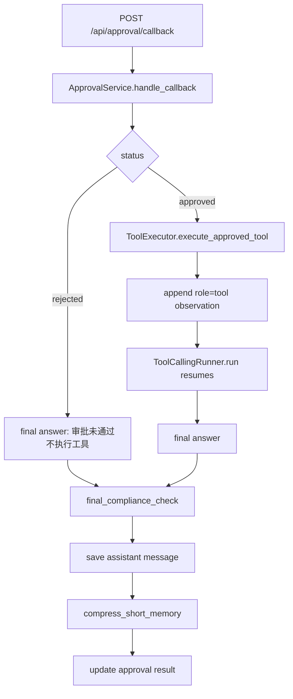

# 主流程代码走读

本文基于当前真实代码更新，目标是帮助新人理解一次 `POST /api/chat` 请求如何从 HTTP 入口进入系统，经过主 Agent 编排、子 Agent 执行、工具调用、记忆压缩、最终合规检查，再返回用户。请注意：仓库当前没有 `app/api/*` 目录，`/api/chat` 直接定义在 `app/main.py::create_app` 内；仓库也没有 `app/subagents/agent_card_loader.py`，AgentCard 加载器位于 `app/agents/card_loader.py`。

## 当前主架构

当前项目由 FastAPI 接收 `/api/chat` 请求，`RequestAdapter` 将外部请求转换为内部 `InboundMessage`，`AgentOrchestrator` 负责以 `session_key` 作为 LangGraph config 的 `thread_id` 执行 `StateGraph`。主流程中的主 Agent 不承载所有业务逻辑，而是通过 `EntityExtractor + EntityBag` 抽取通用实体，经 `IntentRecognitionNode` 识别 intent/sub_intent，再由 `AgentSelectionNode` 用规则 Top-K 召回和必要时的 LLM Router 重排选择子 Agent。子 Agent 基于 `AgentCard + Skills + RAG + tools` 执行任务，其中继承 `BaseSubAgent` 的子 Agent 会走统一模板：读取 AgentCard、选择并加载 Skill、解析可见工具 schema，然后进入 `ToolCallingRunner` 的 ReAct-style 工具调用循环。`ToolExecutor` 负责执行本地或 MCP 工具、做 AgentCard 可见性二次校验并写入工具执行日志；当工具是 `is_write=true` 的写入/修改/删除类高风险工具时，`ToolExecutor` 不执行工具，而是返回 `human_approval_required` 和 pending tool call。主图随后进入人工审批分支，由 `ApprovalService` 创建 SQLite 审批请求、提交外部审批系统并让 `/api/chat` 返回 pending。审批系统通过 `/api/approval/callback` 回调 approved/rejected，approved 后才执行原工具并继续 tool loop，rejected 则不执行工具。`LLMProvider` 只负责模型调用和响应归一化，不执行工具。`final_compliance_check` 是返回用户前的强制节点，负责脱敏和阻断不应外发的内容。SQLite 负责 `messages`、`short_term_memory`、`graph_checkpoints`、`tool_execution_logs`、`approval_requests`、`approval_events` 等持久化。MCP Client 已接入为外部工具来源：应用启动时在配置了 MCP server 的情况下发现工具能力，并注册到 `ToolRegistry`。

## 完整主流程图



审批回调恢复流程：



## 主流程节点表

| 流程节点 | 代码位置 | 核心职责 | 输入 state / 参数 | 输出 state / 结果 | 使用技术 | 关键说明 |
| ---- | ---- | ---- | ---- | ---- | ---- | ---- |
| `/api/chat` | `app/main.py::create_app` 内部 `chat` | HTTP 入口，记录请求日志，调用请求适配、编排器和响应适配 | `ChatRequest` | `ChatResponse` | FastAPI、Pydantic | 当前没有 `app/api/*`，路由直接挂在 `app/main.py`。 |
| `RequestAdapter` | `app/adapters/request_adapter.py::RequestAdapter.adapt` | 从外部请求取最后一条 user 消息，生成 `request_id`、`trace_id`、`session_key` | `ChatRequest` | `InboundMessage` | Pydantic、UUID | `session_key = tenant_id:channel:user_id:session_id`，用于多租户、多用户、多会话隔离。 |
| `AgentOrchestrator` | `app/runtime/orchestrator.py::AgentOrchestrator.run` | 构造初始 `AgentGraphState`，执行 LangGraph，并保存最终 checkpoint | `InboundMessage` | 完整 graph state | LangGraph、SQLite checkpoint | `config = {"configurable": {"thread_id": inbound.session_key}}`，每个会话独立线程。 |
| `LangGraph StateGraph` | `app/runtime/graph.py::AgentGraphFactory.build` | 定义真实状态机节点和条件路由 | `AgentGraphState` | compiled graph | LangGraph `StateGraph`、`MemorySaver` | 当前节点链路包含 AgentCard 发现/选择/任务派发和最终合规检查；旧的 `route_intent/direct_answer/call_troubleshooting_agent` 已不在主链路。 |
| `load_session` | `app/runtime/graph.py::AgentGraphFactory.load_session` | 加载历史会话上下文 | `session_key` | `recent_messages`、`short_summary`、`retry_count` | SQLite、`SessionManager` | `SessionManager.load_session` 从 `MessageStore.list_by_session(limit=60)` 读取最近 60 条消息，从 `ShortTermMemoryManager.get_summary` 读取 `short_term_memory.summary`。checkpoint 不在此节点读取，最终 state 由 `AgentOrchestrator` 写入 `graph_checkpoints`。 |
| `save_user_message` | `app/runtime/graph.py::AgentGraphFactory.save_user_message` | 保存本轮用户原始输入 | `session_key`、`original_query`、`request_id`、`trace_id` | 写入 messages 表 | SQLite、`MessageStore` | `MessageStore.append` 写入 `messages(session_key, role, content, metadata_json, created_at)`，metadata 中保留 `original_query` 和 `session_key`。 |
| `query_rewrite` | `app/runtime/graph.py::AgentGraphFactory.query_rewrite`，`app/query/query_rewrite_node.py::QueryRewriteNode.rewrite`，`app/query/entity_extractor.py::EntityExtractor` | 抽取通用实体、构建 `ConversationWindow`，对追问做上下文消解并改写查询 | `original_query`、`recent_messages`、`short_summary` | `rewritten_query`、`entities`、`entity_bag`、`conversation_window`、`need_clarification` | YAML entity patterns、EntityBag、LLM JSON rewrite、规则 fallback | 实体规则来自 `app/query/entity_patterns.yaml`。LLM 可用时按 `scene="query_rewrite"` 输出 JSON；JSON 失败时走新 EntityExtractor + EntityBag fallback。当前不再以旧 `FOLLOW_UP_MARKERS` 作为主路径，只作为弱信号辅助。 |
| `intent_recognition` | `app/runtime/graph.py::AgentGraphFactory.intent_recognition`，`app/query/intent_recognition_node.py::IntentRecognitionNode.recognize` | 基于 query、动态实体和 AgentCard 摘要识别 intent/sub_intent | `original_query`、`rewritten_query`、`current_entities`、`conversation_window`、AgentCard summaries | `intent`、`sub_intent`、`confidence`、`entities`、`need_clarification` | LLM JSON classification、EntityExtractor、规则 fallback、Pydantic schema | 主逻辑支持 LLM JSON 分类，fallback 是新架构规则分类。实体是动态 dict，不再固定到 ConversationWindow 顶层，也不输出 `required_tools` 或选择工具。 |
| `build_orchestrator_context` | `app/runtime/graph.py::AgentGraphFactory.build_orchestrator_context`，`app/runtime/context_builder.py::ContextBuilder.build_for_orchestrator` | 构建主 Agent 轻量上下文 | query、intent、entities、session、history、available agents/tools | `orchestrator_context` | Pydantic `OrchestratorContext`、RAG pre-search | 包含 `short_summary`、最近 10 条消息、可用子 Agent、全量已注册工具名、轻量知识提示。ContextBuilder 是公共组件，不属于主 Agent 或子 Agent。 |
| `discover_agents` | `app/runtime/graph.py::AgentGraphFactory.discover_agents`，`app/agents/card_loader.py::AgentCardLoader.list_available_agents` | 发现可用 AgentCard | cards root | `available_agents` | YAML 子集解析、Pydantic `AgentCard` | AgentCard 存在 `app/agents/cards/*.yaml`，通过 `AgentCardLoader.load_all` 读取并校验 enabled。 |
| `select_agent` | `app/runtime/graph.py::AgentGraphFactory.select_agent`，`app/agents/selection.py::AgentSelectionNode.select`，`app/agents/llm_router.py::LLMAgentRouter` | Hybrid router 选择子 Agent | `intent`、`sub_intent`、`entities`、`rewritten_query`、`intent_confidence`、`is_follow_up` | `agent_selection`、`selected_agent`、`selected_agent_card`、`selection_method`、`need_clarification` | 规则 Top-K 召回、AgentCard、LLM JSON re-rank | `AgentCardLoader.match_candidates` 先按 intent、sub_intent、required/optional entities、capabilities、description/examples 召回。Top1 足够确定时直接规则选择；分数接近、低置信或复杂追问时才让 LLM 在 Top-K AgentCard 摘要中重排。LLM 非法 JSON、选择非候选 Agent 或低置信时 fallback/clarification。 |
| `build_clarification_answer` | `app/runtime/graph.py::AgentGraphFactory.build_clarification_answer` | 将前置理解/路由节点的澄清问题转为最终 answer | `need_clarification`、`clarification_question`、`clarification_source` | `answer`、`graph_path` | LangGraph 条件路由 | `query_rewrite`、`intent_recognition`、`select_agent` 任一节点要求澄清时，不继续 dispatch agent，直接进入 `final_compliance_check`。Skill 级 clarification 由 `BaseSubAgent.run` 返回后同样经过合规出口。 |
| `assemble_task` | `app/runtime/graph.py::AgentGraphFactory.assemble_task`，`app/agents/task_assembler.py::AgentTaskAssembler.assemble` | 把主流程上下文封装成子 Agent 任务信封 | `selected_agent_card`、`orchestrator_context`、`entities`、`request_id`、`trace_id` | `assembled_task` | Pydantic `AgentTaskEnvelope` | 任务包含 `task_id`、`agent_name`、`query`、`original_query`、`intent`、`entities`、`session_key`、`request_id`、`trace_id`、`agent_card`、`short_summary`、按 AgentCard `memory_policy.recent_turns` 截断的 recent messages、知识 hints。 |
| `dispatch_agent` | `app/runtime/graph.py::AgentGraphFactory.dispatch_agent`，`app/agents/dispatcher.py::DispatchAgentNode.dispatch` | 把任务交给选中的子 Agent | `AgentTaskEnvelope`、`OrchestratorContext` | `subagent_result`、`answer`、skill 选择信息 | `SubAgentManager`、Pydantic `SubAgentTask`/`SubAgentResult` | `DispatchAgentNode` 将 envelope 转为当前子 Agent 协议 `SubAgentTask`，把 `agent_card` 放入 `metadata`，再调用 `SubAgentManager.call_subagent`。 |
| `check_human_approval_required` | `app/runtime/graph.py::AgentGraphFactory.check_human_approval_required` | 判断子 Agent 是否因写工具停在审批点 | `subagent_result.needs_human_approval`、`approval_payloads` | `approval_required`、`approval_payloads` | LangGraph 条件路由 | required 进入审批分支，not_required 进入 `final_compliance_check`。 |
| `create_approval_request` | `app/runtime/graph.py::AgentGraphFactory.create_approval_request`，`app/approval/service.py::ApprovalService.create_approval_request` | 创建审批请求并保存 pending 恢复上下文 | approval payload、pending messages/tools/tool_call、当前 state | `approval_id`、`approval_request` | SQLite、Pydantic | 写入 `approval_requests`，保存 `pending_state_json`、`pending_messages_json`、`pending_tools_json`、`pending_tool_call_json`。 |
| `submit_approval_request` | `app/runtime/graph.py::AgentGraphFactory.submit_approval_request`，`app/approval/client.py::ApprovalSystemClient.submit_approval_request` | 提交外部审批系统 | `ApprovalRequest` | `approval_submit_result`、`external_approval_id`、status | httpx、外部审批 API | 使用 `APPROVAL_SYSTEM_URL` 和 `APPROVAL_CALLBACK_URL`。提交失败时 status=`submit_failed`，原工具不执行。 |
| `pause_for_approval` | `app/runtime/graph.py::AgentGraphFactory.pause_for_approval` | 不阻塞 `/api/chat`，生成 pending/submit_failed 回复 | `approval_id`、submit result | pending answer 或 submit_failed answer | LangGraph 节点 | pending answer 仍继续进入 `final_compliance_check`，再保存为 assistant message。 |
| `SubAgentManager` | `app/subagents/manager.py::SubAgentManager.call_subagent` | 按名称查找并调用子 Agent | agent name、`SubAgentTask`、parent context | `SubAgentResult` | Protocol、运行时注册表 | 子 Agent 在 `app/main.py::create_app` 中注册，包括 troubleshooting、compliance、document_parse、change_impact、policy_query、claim。 |
| `BaseSubAgent.run` | `app/subagents/base.py::BaseSubAgent.run` | 继承类的统一执行模板 | `SubAgentTask`、`OrchestratorContext` | `SubAgentResult` | AgentCard、Skill、RAG、ToolCallingRunner | 从 `task.metadata["agent_card"]` 读取 AgentCard，经 `ToolRegistry` 计算可见工具，调用 `ContextBuilder.build_for_subagent` 选择并加载 Skill，再构造 LLM messages 和工具 schema，进入 `ToolCallingRunner.run`。`TroubleshootingAgent`、`PolicyQueryAgent`、`ClaimAgent`、`ComplianceSecurityAgent` 继承该模板。 |
| 自定义子 Agent | `app/subagents/document_parse_agent.py::DocumentParseAgent.run`，`app/subagents/change_impact_analysis_agent.py::ChangeImpactAnalysisAgent.run` | 不继承 `BaseSubAgent` 的任务级执行 | `SubAgentTask`、parent context | `SubAgentResult` | 规则解析、ContextBuilder、ToolExecutor | `document_parse_agent` 规则解析文本/JSON/YAML/Markdown；`change_impact_analysis_agent` 规则分析影响并调用 `get_knowledge`。它们仍会调用 `ContextBuilder.build_for_subagent` 触发 skill 选择和 RAG。 |
| `SkillCatalog / SkillSelector` | `app/skills/catalog.py::SkillCatalog.scan`，`app/skills/metadata.py::metadata_from_skill_file`，`app/skills/selector.py::SkillSelector.select`，`app/skills/loader.py::SkillLoader.load`，`app/skills/required_entities.py::RequiredEntityChecker` | metadata-first skill 发现、严格校验、选择、正文加载和必需实体检查 | agent name、`SkillSelectionContext`、candidate metadata、EntityBag | `selected_skill_id`、skill body、missing entities 或 clarification | YAML frontmatter、Pydantic、规则打分、EntityBag | 启动/校验阶段只扫描 `app/skills/*/*/SKILL.md` 的完整企业级 frontmatter metadata，跳过 `deprecated`。缺少 `skill_id/name/description/agent/intent_tags/required_entities/optional_entities/private_tools/enabled/is_default` 会直接报错；执行时才加载完整 `SKILL.md`。`RequiredEntityChecker` 在子 Agent 执行前检查 skill.required_entities，缺失时返回 clarification，不强行调用工具。 |
| `KnowledgeService / RAG` | `app/knowledge/factory.py::build_knowledge_service`，`app/integrations/knowledge_api_client.py::KnowledgeAPIClient.search`，`app/knowledge/disabled_service.py::DisabledKnowledgeService.search`，`app/runtime/context_builder.py::_build_lightweight_hints`，`app/runtime/context_builder.py::_build_subagent_knowledge_hint` | 为主流程和子 Agent 提供知识检索增强 | query、intent、top_k | knowledge hints | KnowledgeService 协议、外部 API、Disabled 空实现、chunk post-processing | 默认 `ENABLE_KNOWLEDGE_API=false`，不使用内置 mock chunks，返回空知识结果；开启后 `KnowledgeAPIClient` 调外部知识库 API，并通过 `KnowledgeChunkPostProcessor` 归一化为 `KnowledgeChunk`。 |
| `ToolRegistry` | `app/tools/registry.py::ToolRegistry`，`app/tools/public_tools.py::register_public_tools`，`app/tools/agent_tools.py::register_agent_private_tools` | 注册和暴露工具 schema | 工具定义、AgentCard | 可见工具名和 OpenAI-compatible tools schema | Pydantic `ToolDefinition`、函数签名 introspection、MCP capability | 公有工具包括 `rag_search_tool/get_knowledge/calculator_tool/current_time_tool`；私有工具按 agent 注册；MCP 工具由 `register_mcp_tools` 注册。不会把所有工具都给 LLM，而是按 `AgentCard.private_tools`、`public_tools_allowed`、`mcp_tools`、`mcp_tool_scopes` 生成当前子 Agent 可见工具。 |
| `LLMProvider` | `app/llm/base.py::LLMProvider`，`app/llm/internal_provider.py::InternalLLMProvider.chat`，`app/llm/opensdk_provider.py::OpenSDKLLMProvider.chat`，`app/llm/factory.py::build_llm_provider` | 统一模型调用边界 | messages、tools、scene/model 配置 | `LLMResponse` | httpx、OpenAI SDK、scene-aware model config | 当前应用默认 `build_llm_provider` 返回 `InternalLLMProvider`；当 `ENABLE_OPENSDK_LLM=true` 时使用 OpenAI-compatible SDK provider。`InternalLLMProvider` 若未配置 `INTERNAL_LLM_API_URL`，走本地确定性 fallback。项目不再保留单独 fake provider；LLMProvider 不执行工具。 |
| `ToolCallingRunner` | `app/subagents/tool_calling_runner.py::ToolCallingRunner.run` | 实现 LLM 工具调用循环 | agent name、messages、visible tools、session/request/trace、AgentCard | `ToolCallingRunResult` | ReAct-style loop、OpenAI tool call schema | 每轮调用 `llm_provider.chat(messages, tools, scene="subagent_reasoning")`。如果工具结果是 `human_approval_required`，立即停止 loop，返回 `stopped_reason="human_approval_required"`、`pending_tool_call`、`approval_payload`、当时 messages/tools。无 tool_calls 时以 assistant content 结束。 |
| `ToolExecutor` | `app/tools/executor.py::ToolExecutor.execute`，`app/tools/executor.py::ToolExecutor.execute_approved_tool` | 执行工具、二次权限校验、写执行日志、审批后安全执行 | agent name、tool name、arguments、AgentCard、session/request/trace、approval_id | `ToolResult` | ToolRegistry、SQLite tool execution logs、MCP dispatch、approval guard | 普通 `execute` 遇到 `is_write=true` 工具只返回 `human_approval_required`，不执行 callable。approved callback 后只能通过 `execute_approved_tool` 执行，并校验 approval 存在、status=approved、agent/tool/arguments 一致。 |
| `ApprovalService` | `app/approval/service.py::ApprovalService` | 审批创建、提交、callback 处理、approved/rejected 恢复 | approval payload 或 callback | approval status、final answer | SQLite、httpx、ToolExecutor、ToolCallingRunner | approved 后执行 pending tool，追加 tool observation 并继续 loop；rejected 后不执行工具。两条路径最终都调用 final compliance、保存 assistant message、压缩短期记忆。 |
| `MCP Client` | `app/main.py::lifespan`，`app/mcp/client_manager.py::MCPClientManager.initialize`，`app/mcp/capability_registry.py::MCPCapabilityRegistry`，`app/mcp/client.py::HTTPMCPClient` | 发现外部 MCP 工具并路由调用 | `MCP_SERVERS_JSON` / `MCP_SERVERS` 配置 | MCP capabilities 注册到 ToolRegistry | HTTP JSON-RPC-ish client、Pydantic schemas | `settings.enable_mcp_client` 默认 true，但没有配置 server 时列表为空，不会发现工具。启动时 `initialize -> list_tools -> capability_registry.upsert_tools -> tool_registry.register_mcp_tools`。执行时 `ToolExecutor` 根据 source=mcp 调 `MCPClientManager.call_tool`，再由 capability 找到 server 和原始工具名。 |
| `final_compliance_check` | `app/runtime/graph.py::AgentGraphFactory.final_compliance_check`，`app/compliance/final_checker.py::FinalComplianceChecker.check` | 返回用户前强制合规检查 | `answer` | `final_compliance_result`，通过时更新 `answer=sanitized_answer` | 规则脱敏、可选 LLM scene 调用 | 检查手机号、身份证、银行卡、凭据字段、内部日志字段、健康隐私词、raw tool markers。若包含 raw tool output marker，`passed=False` 且 `retry_required=True`。会调用一次 `llm_provider.chat(scene="final_compliance")` 作模型侧检查，但实际判定和脱敏由规则完成。 |
| `regenerate_compliant_answer` | `app/runtime/graph.py::AgentGraphFactory.regenerate_compliant_answer` | 合规失败且允许重试时生成安全版本 | `final_compliance_result`、`retry_count` | 新 `answer`、`retry_count+1` | 规则 fallback 文案 | 当前最多重试一次，随后重新进入 `final_compliance_check`。 |
| `fallback_answer` | `app/runtime/graph.py::AgentGraphFactory.fallback_answer` | 合规仍不通过时使用兜底答复 | `final_compliance_result` | `answer=fallback_answer` | 规则兜底 | 合规强制分支，避免原始不安全内容保存和返回。 |
| `save_assistant_message` | `app/runtime/graph.py::AgentGraphFactory.save_assistant_message` | 保存最终助手回复 | `answer`、request/session/query/intent/entities/selected_agent | 写入 messages 表 | SQLite、`MessageStore` | 保存的是合规链路后的 `answer`，不是原始子 Agent answer。metadata 保存 `rewritten_query`、`intent`、`entities`、`selected_agent`。 |
| `compress_short_memory` | `app/runtime/graph.py::AgentGraphFactory.compress_short_memory`，`app/memory/short_term_memory_manager.py::ShortTermMemoryManager.compress_after_turn` | 每轮结束后更新短期摘要 | session/query/intent/answer/subagent_result | `short_summary` | SQLite upsert、规则摘要 | 当前是规则 summary，不调用 LLM summary。按 request_id、E102、intent 生成摘要并 upsert 到 `short_term_memory(session_key, summary, updated_at)`。代码没有显式异常 fallback，失败会向上抛错。 |
| `finalize_response` | `app/runtime/graph.py::AgentGraphFactory.finalize_response`，`app/adapters/response_adapter.py::ResponseAdapter.adapt` | 记录最终日志，并转换成 API 响应 | graph final state | `ChatResponse` | Pydantic、日志 | `finalize_response` 本身主要记录日志；`ResponseAdapter` 只暴露 `request_id/session_key/original_query/rewritten_query/intent/answer`，不泄露内部状态、工具结果或完整上下文。 |

## 关键技术清单

| 技术/机制 | 在本项目中的用途 | 代码位置 |
| ----- | -------- | ---- |
| FastAPI | 提供 `/api/chat` HTTP 入口和 lifespan 初始化 | `app/main.py::create_app` |
| LangGraph / StateGraph | 主 Agent 任务级状态机编排，节点顺序和合规条件路由都在图里 | `app/runtime/graph.py::AgentGraphFactory.build` |
| Pydantic | 请求、响应、AgentCard、SubAgentTask、SubAgentResult、Skill、MCP、tool schema 校验 | `app/schemas/*`，`app/mcp/schemas.py` |
| SQLite | 持久化 messages、short_term_memory、graph_checkpoints、tool_execution_logs、approval_requests、approval_events | `app/storage/sqlite.py::SQLiteDatabase.initialize` |
| AgentCard | 描述子 Agent 能力、intent、实体需求、工具可见性、skills、RAG namespace、memory_policy | `app/schemas/agent_card.py`，`app/agents/cards/*.yaml` |
| YAML | AgentCard 和 Skill frontmatter 的轻量配置格式 | `app/agents/card_loader.py::_parse_card_yaml`，`app/skills/metadata.py::split_frontmatter` |
| EntityBag / EntityExtractor | 动态实体容器和通用实体抽取；规则来自 YAML，不写死在 ConversationWindow 顶层 | `app/schemas/entities.py`，`app/query/entity_extractor.py`，`app/query/entity_patterns.yaml` |
| Hybrid Agent Router | 规则 Top-K 召回，必要时 LLM Router 仅在候选 AgentCard 摘要中重排 | `app/agents/selection.py::AgentSelectionNode`，`app/agents/llm_router.py::LLMAgentRouter` |
| LLMProvider | 统一模型调用协议，规范 `chat(messages, tools)` 的输入输出 | `app/llm/base.py::LLMProvider` |
| 内部数智 LLM API | 默认模型调用方式；未配置 URL 时走本地 deterministic fallback | `app/llm/internal_provider.py::InternalLLMProvider` |
| OpenSDK / OpenAI-compatible | 可选模型调用方式，`ENABLE_OPENSDK_LLM=true` 时启用 | `app/llm/opensdk_provider.py::OpenSDKLLMProvider` |
| scene 模型选择 | 为 query rewrite、intent、agent selection、subagent reasoning、final compliance、summary 预留不同模型配置 | `app/llm/model_config.py::get_llm_model` |
| ToolCallingRunner | 子 Agent 的 ReAct-style LLM 工具调用循环 | `app/subagents/tool_calling_runner.py::ToolCallingRunner.run` |
| ToolExecutor | 当前主路径的工具执行、AgentCard 权限校验、MCP 分发、SQLite 日志记录 | `app/tools/executor.py::ToolExecutor.execute` |
| ApprovalService | 高风险写工具的人审闭环：创建请求、提交外部审批、callback 恢复、保存结果 | `app/approval/service.py::ApprovalService` |
| ApprovalSystemClient | 向外部审批系统提交审批请求，当前可指向 mock URL | `app/approval/client.py::ApprovalSystemClient` |
| ToolRegistry | 公有工具、私有工具、MCP 工具统一注册，并按 AgentCard 生成可见工具 schema | `app/tools/registry.py::ToolRegistry` |
| Skills metadata-first loading | 扫描时只读取完整企业级 frontmatter metadata，执行选中后才加载完整 `SKILL.md` body | `app/skills/catalog.py::SkillCatalog.scan`，`app/skills/metadata.py::metadata_from_skill_file`，`app/skills/catalog.py::SkillCatalog.load_skill_content` |
| RAG / KnowledgeService | 主流程轻量知识提示和子 Agent 任务级知识上下文；默认关闭，开启后通过 KnowledgeAPIClient 接外部知识库 | `app/knowledge/factory.py::build_knowledge_service`，`app/integrations/knowledge_api_client.py::KnowledgeAPIClient` |
| MCP Client | 作为外部工具来源，启动时发现能力，执行时由 ToolExecutor 分发 | `app/mcp/client_manager.py::MCPClientManager`，`app/main.py::lifespan` |
| final compliance check | 所有返回用户前的强制合规检查、脱敏、重试/兜底 | `app/compliance/final_checker.py::FinalComplianceChecker` |
| summary + recent N turns | `short_summary` 加最近消息窗口共同提供历史上下文 | `app/session/session_manager.py::SessionManager.load_session`，`app/agents/task_assembler.py::AgentTaskAssembler.assemble` |

## 数据流与状态流

| 数据对象 | 产生位置 | 消费位置 | 说明 |
| ---- | ---- | ---- | ---- |
| `request_id` | `RequestAdapter.adapt` | 全链路日志、message metadata、task、LLM、tools、checkpoint | 格式 `req_<uuid>`，用于单次请求追踪。 |
| `trace_id` | `RequestAdapter.adapt` | 日志、task、tools、messages metadata | 格式 `trace_<uuid>`，用于链路追踪。 |
| `session_key` | `RequestAdapter.build_session_key` | `AgentOrchestrator.run`、`load_session`、message/memory/checkpoint/tool logs | 格式 `tenant_id:channel:user_id:session_id`，也是 LangGraph `thread_id`。 |
| `original_query` | `RequestAdapter.adapt` 从最后一条 user message 提取 | `save_user_message`、`query_rewrite`、`intent_recognition`、task、ResponseAdapter | 用户原始输入，保存到 messages。 |
| `rewritten_query` | `query_rewrite` | `intent_recognition`、`build_orchestrator_context`、`assemble_task`、ResponseAdapter | LLM JSON rewrite 或新 EntityExtractor + EntityBag fallback 产物。 |
| `intent` / `sub_intent` | `intent_recognition` | `build_orchestrator_context`、`select_agent`、task、memory compression、ResponseAdapter | LLM JSON classification 或新规则 fallback 识别，不再输出 `required_tools`。 |
| `entities` / `entity_bag` | `query_rewrite` 首次产生，`intent_recognition` 合并补充 | `select_agent`、`assemble_task`、`ContextBuilder`、Skill required entity check、assistant message metadata | `EntityBag` 支持任意实体类型；`entities` 是紧凑动态 dict，如 `request_id/error_code/policy_no/claim_no/interface_name/product_code`。 |
| `available_agents` | `discover_agents` | 主要用于状态观测和调试 | 来自 enabled AgentCard。 |
| `selected_agent` | `select_agent` | `assemble_task`、`dispatch_agent`、assistant metadata、ResponseAdapter 间接观测 | 由 Hybrid Router 选择：规则确定时直接选，规则不确定时 LLM Router 在 Top-K 中重排。 |
| `agent_card` / `selected_agent_card` | `select_agent` | `assemble_task`、`dispatch_agent`、`BaseSubAgent.run`、ToolRegistry/ToolExecutor | 决定子 Agent 的能力、记忆窗口、工具和 skills。 |
| `subagent_task` / `assembled_task` | `assemble_task` | `dispatch_agent` | `AgentTaskEnvelope`，包含任务、上下文、AgentCard 和 trace 信息。 |
| `subagent_result` | `dispatch_agent` | `final_compliance_check` 间接使用其 `answer`，`compress_short_memory` | `SubAgentResult` 里包含 answer、evidence、tool_calls、skill 信息。 |
| `tool_calls` | `ToolCallingRunner.run` 或子 Agent 规则调用 | `SubAgentResult.tool_calls`、`compress_short_memory`、审计查询 | 工具执行结果也会写入 `tool_execution_logs`。 |
| `final_answer` / `answer` | 子 Agent 或 ToolCallingRunner 产出，`dispatch_agent` 写入 state | `final_compliance_check`、`save_assistant_message`、ResponseAdapter | 合规检查可能覆盖为 sanitized 或 fallback answer。 |
| `sanitized_answer` | `FinalComplianceChecker.check` | `final_compliance_check`、`regenerate_compliant_answer`、`fallback_answer` | 规则脱敏后的答案。通过时直接覆盖 state.answer。 |
| `short_summary` | `load_session` 读取，`compress_short_memory` 更新 | `query_rewrite`、`intent_recognition`、`build_orchestrator_context`、子 Agent context | SQLite `short_term_memory` 中每个 session_key 一条摘要。 |

## 记忆与历史会话

1. 历史会话保存在 SQLite `messages` 表，代码在 `app/session/message_store.py::MessageStore`。
2. `session_key` 由 `RequestAdapter.build_session_key(tenant_id, channel, user_id, session_id)` 生成，确保同一租户、渠道、用户、会话共享历史，不同组合互相隔离。
3. `load_session` 通过 `SessionManager.load_session(session_key, recent_limit=60)` 读取最近 60 条消息。注释里把 60 条视作约 30 轮 user/assistant 对话。
4. `short_summary` 通过 `ShortTermMemoryManager.get_summary(session_key)` 从 `short_term_memory` 表读取。
5. `compress_short_memory` 在助手消息保存后调用 `ShortTermMemoryManager.compress_after_turn`，用当前 query、intent、answer、subagent_result 生成摘要并 upsert。
6. 当前系统保留所有 messages，但每次主流程只读取最近 60 条。传给 `OrchestratorContext` 时进一步截断到最近 10 条；传给子 Agent 时按 AgentCard `memory_policy.recent_turns * 2` 截断。
7. 压缩记忆当前是规则 summary，不是 LLM smart summary。配置里有 `summary_model` 预留，但当前未使用。
8. 失败 fallback：代码没有捕获压缩失败的 fallback，SQLite 或规则执行异常会导致 graph 节点失败。
9. 与 HelloAgents “summary + 最近 N 轮”的思想相似：都有一个滚动摘要加最近完整对话窗口。差异是本项目当前 summary 是规则生成，窗口读取和 AgentCard memory policy 在代码里固定实现，没有引入 LLM 摘要质量控制。

## 工具调用机制

1. 系统不会把所有工具都交给 LLM。原因是工具包含业务边界和潜在高风险能力，需要按 AgentCard 的任务权限最小化暴露。
2. 每个子 Agent 的可见工具由 `ToolRegistry.list_available_tools_for_agent` 和 `ToolRegistry.list_tools_for_agent` 计算：`private_tools` 必须在 AgentCard 中声明；`public_tools_allowed=true` 才能看到公有工具；MCP 工具需在 `mcp_tools` 或 `mcp_tool_scopes` 中声明。
3. private tools 是绑定子 Agent 的本地工具，例如 `query_internal_log`、`query_policy_info`；public tools 是允许复用的本地工具，例如 `get_knowledge`；MCP tools 是外部 MCP server 发现后注册的工具，`source="mcp"`。
4. `ToolCallingRunner.run` 循环调用 `LLMProvider.chat(messages, tools)`，有 `tool_calls` 时执行工具并追加 `role=tool` observation，没有 tool call 时返回最终 answer。
5. `ToolExecutor.execute` 会二次校验 `registry.is_tool_available_for_agent(agent_name, tool_name, agent_card)`。越权工具返回 `allowed=False, success=False, error="tool_not_available_for_agent"`。
6. `tool_execution_logs` 记录 `request_id`、`trace_id`、`session_key`、`agent_name`、`tool_name`、脱敏后的 `arguments_json`、`success`、`result_json`、`error`、起止时间、耗时、`source`、`server_name`、`original_tool_name`。
7. 工具失败不会直接中断循环。失败结果会被序列化为 `role=tool` 消息，交回 LLM 继续推理；解析 tool call 失败也会作为 tool observation 追加。
8. 写工具不会作为普通失败继续交给 LLM，而是立即停止 loop，生成 `needs_human_approval=true` 的 `SubAgentResult`，由主图创建审批请求并返回 pending。
9. approved callback 后，`ApprovalService.resume_after_approval` 调 `ToolExecutor.execute_approved_tool`，把工具结果追加为 `role=tool` observation，再用保存的 messages/tools 继续 `ToolCallingRunner.run`。
10. 达到 `max_iterations` 后返回 `ToolCallingRunResult(stopped_reason="max_iterations", final_answer="", error="tool_calling_runner_exceeded_max_iterations:<limit>")`。`BaseSubAgent.build_result_from_runner` 会把它转成低置信度、medium risk 的 `SubAgentResult`。
11. 旧工具代理和策略门路径已删除；当前主路径的 LLM 工具循环由 `ToolExecutor + AgentCard visibility + approval guard` 完成权限控制，受限运维工具还会在工具实现内部做禁用/白名单校验。

## 合规检查机制

1. `final_compliance_check` 位于 `dispatch_agent` 之后、`save_assistant_message` 之前，是所有返回用户内容的强制出口节点。
2. 所有返回用户的内容必须经过它，因为子 Agent 和工具可能产生敏感信息、内部字段或原始工具结果，保存和返回前必须脱敏或阻断。
3. 当前实现会调用一次 `LLMProvider.chat(scene="final_compliance", tools=None)`，但判定、脱敏、retry/fallback 决策由规则完成。
4. 脱敏规则覆盖手机号、身份证、银行卡、credential 字段，以及 `server_sign`、`partner_sign`、`raw_payload`、`authorization`、`stack_trace`、`traceback`、`base_string_fields` 等内部日志字段。
5. 如果只是可脱敏内容，`passed=True`，`sanitized_answer` 覆盖 `state.answer`；如果包含 raw tool output marker，`passed=False` 且 `retry_required=True`，图会先进入 `regenerate_compliant_answer` 重试一次，仍不通过则进入 `fallback_answer`。
6. `final_compliance_check` 与 `compliance_agent` 不同。`compliance_agent` 是一个可被选择的业务子 Agent，用于用户主动请求文本合规/隐私审查；`final_compliance_check` 是主流程强制出口检查，不依赖用户 intent，所有 answer 都必须经过它。

## 三层实体理解与 Hybrid Router

当前主流程已经从“固定规则实体抽取 + AgentCard 规则打分”升级为三层理解与路由：

1. 通用 EntityExtractor：`app/query/entity_extractor.py::EntityExtractor` 从 `app/query/entity_patterns.yaml` 加载规则，面向 current query、summary、recent_turns 抽取通用实体，输出 `app/schemas/entities.py::EntityBag`。主 Agent 不是天然知道所有业务实体；新增通用实体先改 YAML pattern，而不是给 `ConversationWindow` 增加 `last_xxx` 顶层字段。
2. AgentCard 实体声明：`app/agents/cards/*.yaml` 的 `required_entities` / `optional_entities` 描述 Agent 粗粒度能力边界和召回信号。`app/agents/card_loader.py::AgentCardLoader.match_candidates` 会用 intent、sub_intent、动态实体、capabilities、description/examples 做 Top-K 规则召回。
3. Skill 实体声明：`app/skills/*/*/SKILL.md` 的 `required_entities` / `optional_entities` 表示具体技能流程的实体需求。`app/skills/required_entities.py::RequiredEntityChecker` 在子 Agent 执行前检查必需实体；缺失时进入 clarification，不强行执行工具。

Agent 选择不是纯规则，也不是把所有信息都丢给 LLM。`app/agents/selection.py::AgentSelectionNode` 先规则召回 Top-K：如果 Top1 分数足够高或领先明显，直接选择；如果规则分数接近、intent 低置信、追问或语义复杂，才调用 `app/agents/llm_router.py::LLMAgentRouter`。LLM Router 只接收 Top-K AgentCard 轻量摘要，不能看到所有 tools schema、所有 Skill body 或 Agent 内部 prompt。非法 JSON、选择非候选 Agent、选择 disabled Agent 或低置信时，回落到规则最高分或 clarification。

主 Agent 只做轻量理解、召回和编排；子 Agent 执行阶段才根据 AgentCard 计算自己的可见工具并加载被选中的 Skill body。`ToolExecutor` 仍然是最终工具权限校验和执行边界。

## 当前主流程节点列表

当前 `AgentGraphFactory.build` 注册并串联的节点如下：

```text
load_session
save_user_message
query_rewrite
intent_recognition
build_orchestrator_context
discover_agents
select_agent
build_clarification_answer
assemble_task
dispatch_agent
check_human_approval_required
create_approval_request
submit_approval_request
pause_for_approval
final_compliance_check
regenerate_compliant_answer
fallback_answer
save_assistant_message
compress_short_memory
finalize_response
```

条件路由如下：

```text
query_rewrite
  -> clarify: build_clarification_answer -> final_compliance_check
  -> continue: intent_recognition
intent_recognition
  -> clarify: build_clarification_answer -> final_compliance_check
  -> continue: build_orchestrator_context
select_agent
  -> clarify: build_clarification_answer -> final_compliance_check
  -> continue: assemble_task
final_compliance_check
  -> passed: save_assistant_message
  -> retry: regenerate_compliant_answer -> final_compliance_check
  -> fallback: fallback_answer -> save_assistant_message
```

审批条件路由如下：

```text
check_human_approval_required
  -> required: create_approval_request -> submit_approval_request -> pause_for_approval -> final_compliance_check
  -> not_required: final_compliance_check
```

## 当前代码与早期架构描述的差异

| 差异点 | 当前真实代码 | 影响 |
| ---- | ---- | ---- |
| 旧 `route_intent/direct_answer/call_troubleshooting_agent` 节点 | 当前没有这些节点，测试 `tests/test_langgraph_flow.py` 也断言它们不在 graph path | 主流程已经升级为 AgentCard 选择和统一 dispatch。 |
| `app/api/*` | 当前不存在 | `/api/chat` 路由在 `app/main.py`。 |
| `app/subagents/agent_card_loader.py` | 当前不存在 | AgentCard loader 在 `app/agents/card_loader.py`。 |
| QueryRewrite / IntentRecognition LLM JSON | 当前两个节点已支持 LLM JSON；LLM 不可用或 JSON 非法时走新 EntityExtractor/规则 fallback | 文档不能再写成旧固定规则主路径。 |
| 人工审批 | 当前已接入完整 pending/callback/resume 闭环 | 写工具不再只是 fail-closed，而是由 `approval_requests` 持久化并等待 callback。 |
| MCP | 已有 client manager、capability registry、HTTP client 和 ToolRegistry 注册路径 | 只有配置 MCP servers 时才会实际发现外部工具。 |
| RAG | 当前是内存 mock 关键词检索 | 未接 Milvus、Elasticsearch、embedding 或 hybrid ranking。 |

## 开发者修改指南

本节面向后续开发者，说明“要改一个能力时到底改哪些真实文件”。所有路径均以当前代码为准；如果某个目标架构中的模块当前不存在，会明确标注“当前不存在”。

### 1. LangGraph 初始化在做什么？

当前初始化链路从 `app/main.py::create_app` 开始。它不是只创建 FastAPI route，而是把主流程所需依赖一次性组装出来，再把编译后的 LangGraph 交给 `AgentOrchestrator`。

```text
create_app()
  -> get_settings()
  -> init SQLiteDatabase
  -> init MessageStore / ShortTermMemoryManager / SQLiteCheckpointStore
  -> init ToolExecutionLogStore / SQLiteApprovalStore
  -> init LLMProvider
  -> init KnowledgeService via build_knowledge_service()
  -> init MCPCapabilityRegistry / MCPClientManager
  -> init ToolRegistry
  -> register_public_tools()
  -> register_agent_private_tools()
  -> register restricted admin tools(shell_exec/http_request/mcp_http.call_tool)
  -> init ToolExecutor
  -> init ToolCallingRunner
  -> init FinalComplianceChecker
  -> init ApprovalService
  -> init SkillCatalog / SkillSelector / ContextBuilder
  -> init SubAgentManager and register subagents
  -> init AgentCardLoader and validate_with_skill_catalog()
  -> init AgentGraphFactory(...).build()
  -> init AgentOrchestrator(graph, checkpoint_store)
  -> register /api/chat, /api/approval/callback, /api/approval/{approval_id}
```

关键代码位置：

| 问题 | 当前真实代码 |
| ---- | ---- |
| FastAPI 创建依赖 | `app/main.py::create_app` |
| `AgentGraphFactory` 创建位置 | `app/main.py::create_app`，调用 `AgentGraphFactory(...).build()` |
| LangGraph 节点注册 | `app/runtime/graph.py::AgentGraphFactory.build` |
| LangGraph 普通边 | `app/runtime/graph.py::AgentGraphFactory.build` 中连续 `graph.add_edge(...)` |
| LangGraph 条件边 | `app/runtime/graph.py::AgentGraphFactory.build` 中 `graph.add_conditional_edges(...)` |
| 人工审批条件路由 | `app/runtime/graph.py::AgentGraphFactory.human_approval_route` |
| 合规检查条件路由 | `app/runtime/graph.py::AgentGraphFactory.compliance_route` |
| compiled graph 调用 | `app/runtime/orchestrator.py::AgentOrchestrator.run` |
| LangGraph `thread_id` | `AgentOrchestrator.run` 用 `{"configurable": {"thread_id": inbound.session_key}}` 调用 `graph.ainvoke(...)` |

`AgentGraphFactory.build()` 当前做三件事：

1. 用 `StateGraph(AgentGraphState)` 创建状态机。
2. 注册节点：`load_session`、`save_user_message`、`query_rewrite`、`intent_recognition`、`build_orchestrator_context`、`discover_agents`、`select_agent`、`assemble_task`、`dispatch_agent`、`check_human_approval_required`、`create_approval_request`、`submit_approval_request`、`pause_for_approval`、`final_compliance_check`、`regenerate_compliant_answer`、`fallback_answer`、`save_assistant_message`、`compress_short_memory`、`finalize_response`。
3. 连接普通边和条件边，最后 `compile(checkpointer=self.checkpointer)`。

`MemorySaver` / SQLite checkpoint 的关系要特别注意：`app/runtime/graph.py::AgentGraphFactory.__init__` 默认使用 LangGraph `MemorySaver` 编译图；`app/runtime/orchestrator.py::AgentOrchestrator.run` 在 `graph.ainvoke` 结束后，把最终 state 另存到项目自己的 `SQLiteCheckpointStore`，也就是 SQLite `graph_checkpoints` 表。当前代码还不是 LangGraph 官方 SQLite checkpointer。

graph state 关键字段来自 `app/runtime/graph_state.py::AgentGraphState`：`request_id`、`trace_id`、`session_key`、`original_query`、`rewritten_query`、`intent`、`entities`、`orchestrator_context`、`selected_agent`、`selected_agent_card`、`assembled_task`、`subagent_result`、`answer`、`approval_required`、`approval_id`、`compliance_result`、`response`、`graph_path` 等。每个节点返回的是一个 dict patch，LangGraph 将 patch 合并进 state。

### 2. 新增一个子 Agent 应该怎么做？

以新增 `underwriting_agent` 为例，最小改动不是只写一个 Python 类，还要让 AgentCard、Skill、工具可见性和选择逻辑都能对齐。

Checklist：

1. 新增 AgentCard YAML：`app/agents/cards/underwriting_agent.yaml`。

   当前 `app/schemas/agent_card.py::AgentCard` 支持这些字段：

   ```yaml
   agent_name: underwriting_agent
   display_name: 核保 Agent
   description: 负责健康险个险核保相关查询和处理
   capabilities: []
    supported_intents: []
    required_entities: []
    optional_entities: []
    output_schema: SubAgentResult
   private_tools: []
   public_tools_allowed: true
   mcp_tools: []
   mcp_tool_scopes: []
   skills: []
   rag_namespaces: []
   memory_policy:
     use_short_summary: true
     recent_turns: 5
   examples: []
   enabled: true
   version: "1.0.0"
   ```

   `required_entities` 表示该 Agent 所有任务共同需要的实体；不是所有任务都必需的实体应放在 `optional_entities`，由 AgentCard 召回打分和 Skill 层必需实体检查继续细分。

2. 新增子 Agent 类：建议放在 `app/subagents/underwriting_agent.py`，默认继承 `app/subagents/base.py::BaseSubAgent`。如果只是使用 AgentCard + Skill + RAG + ToolCallingRunner，通常只需要像 `app/subagents/policy_query_agent.py::PolicyQueryAgent` 那样继承 `BaseSubAgent`；只有像 `app/subagents/document_parse_agent.py::DocumentParseAgent`、`app/subagents/change_impact_analysis_agent.py::ChangeImpactAnalysisAgent` 这种规则执行型 Agent，才建议自定义 `run`。

3. 注册子 Agent：当前注册位置是 `app/main.py::create_app`，通过 `SubAgentManager.register("underwriting_agent", UnderwritingAgent(...))` 注册。对应 manager 在 `app/subagents/manager.py::SubAgentManager`。

4. 如果新增 intent：需要同步改 `AgentCard.supported_intents`、`app/query/intent_recognition_node.py::IntentRecognitionNode.recognize` 的 LLM JSON 候选摘要/新架构 fallback 规则、Skill 的 `intent_tags` 和测试。不要让 `intent_recognition` 输出工具名，工具选择仍在子 Agent 可见工具 schema 内完成。

5. 如果需要私有工具：在 `app/tools/agent_tools.py::register_agent_private_tools` 注册；在 `app/agents/cards/underwriting_agent.yaml` 的 `private_tools` 声明；在对应 Skill 的 `private_tools` 中只声明 AgentCard 允许的子集；测试 `ToolRegistry` 可见性和 `ToolExecutor` 二次校验。

6. 如果需要 Skill：新增 `app/skills/underwriting_agent/{skill_name}/SKILL.md`；`skill_id` 必须写进 AgentCard `skills`；`SkillMetadata.agent` 必须等于 `underwriting_agent`。

7. 建议新增或修改测试：`tests/test_agent_card_loader.py`、`tests/test_new_subagents.py`、`tests/test_architecture_acceptance.py`、`tests/test_intent_recognition.py`、`tests/test_tool_registry_visibility.py`、`tests/test_subagent_tool_visibility.py`、`tests/test_skill_catalog.py`、`tests/test_skill_selection_end_to_end.py`。

新增 Agent 最小改动清单：

```text
app/agents/cards/underwriting_agent.yaml
app/subagents/underwriting_agent.py
app/main.py::create_app 注册 SubAgent
app/skills/underwriting_agent/default/SKILL.md
必要时修改 app/query/intent_recognition_node.py
必要时修改 app/tools/agent_tools.py
对应 tests/*
```

### 3. 新增或修改 Skill 应该怎么做？

Skill 文件放在 `app/skills/{agent_name}/{skill_name}/SKILL.md`。当前 `app/skills/catalog.py::SkillCatalog` 只扫描这个两层结构下的 `SKILL.md`，并跳过 `app/skills/deprecated/**`。

标准 frontmatter 模板：

```yaml
---
skill_id: troubleshooting_agent.refund_failure
name: 退保失败排查
description: 用于排查保单退保没有成功、任务状态异常、节点卡住等问题
agent: troubleshooting_agent
intent_tags:
  - troubleshooting
  - refund_failure
required_entities:
  - policy_no
optional_entities:
  - request_id
  - task_id

private_tools:
  - query_task_status
  - query_node_status

enabled: true
is_default: false

---
```

必填字段由 `app/skills/metadata.py::REQUIRED_SKILL_METADATA_FIELDS` 和 `app/schemas/skill.py::SkillMetadata` 共同约束：`skill_id`、`name`、`description`、`agent`、`intent_tags`、`required_entities`、`optional_entities`、`private_tools`、`enabled`、`is_default`。只有 `name/description` 的旧格式会校验失败。

对齐规则：

1. `skill_id` 使用 `<agent_name>.<skill_name>`，全局唯一。
2. `agent` 必须匹配真实 AgentCard 的 `agent_name`。
3. `skill_id` 必须出现在对应 AgentCard 的 `skills` 中。
4. `private_tools` 必须是 AgentCard `private_tools` 的子集，不能越权声明其他 Agent 的私有工具。
5. `enabled=false` 后，`SkillCatalog.list_skills(..., include_disabled=False)` 不会把它交给选择器。
6. 每个 enabled Agent 至少要有一个 enabled 且 `is_default=true` 的 skill，校验在 `app/agents/card_loader.py::AgentCardLoader.validate_with_skill_catalog`。

启动和执行的加载策略：`SkillCatalog` 启动时只解析 metadata；`app/runtime/context_builder.py::ContextBuilder.build_for_subagent` 选择具体 skill 后，才通过 `app/skills/loader.py::SkillLoader.load` 加载完整 `SKILL.md` body。`app/skills/selector.py::SkillSelector.select` 根据 intent、sub_intent、动态实体、query 和 AgentCard.skills 候选打分；随后 `app/skills/required_entities.py::RequiredEntityChecker` 检查 `required_entities`，缺失时返回 clarification，不进入工具调用。没有强匹配时回落到 default skill。

修改 Skill 后建议跑：`tests/test_skill_catalog.py`、`tests/test_skill_selector.py`、`tests/test_skill_selection_end_to_end.py`、`tests/test_skill_context_builder.py`、`tests/test_skill_required_entities.py`、`tests/test_agent_card_loader.py`。

VSCode 中只有 `name/description` 高亮，不代表项目只使用这两个字段；运行时以 `SkillMetadata` schema 和 `SkillCatalog` 解析为准。

### 4. 新增或修改本地工具应该怎么做？

#### 4.1 新增公有工具

公有工具注册在 `app/tools/public_tools.py::register_public_tools`。工具定义最终进入 `app/tools/registry.py::ToolRegistry.register_public`，`ToolDefinition` 在 `app/tools/base.py::ToolDefinition`，关键字段包括：`name`、`description`、`callable`、`scope`、`source`、`parameters`、`enabled`、`is_write`。

`parameters` 建议写成 OpenAI-compatible tool schema 的 JSON schema 结构；如果不写，`ToolRegistry.get_tool_schema` 会根据 callable signature 自动生成基础 schema。公有工具不是所有 Agent 必然可见，只有 AgentCard `public_tools_allowed=true` 时，`ToolRegistry.list_tools_for_agent` 才会返回它们。

执行链路是：LLM tool schema 来自 `ToolRegistry.list_tools_for_agent`；工具调用进入 `app/subagents/tool_calling_runner.py::ToolCallingRunner.run`；真正执行由 `app/tools/executor.py::ToolExecutor.execute` 完成；审计记录写入 SQLite `tool_execution_logs`，字段包括 session、request、trace、agent、tool、arguments、result/error、source、耗时等。

建议测试：`tests/test_tool_registry_visibility.py`、`tests/test_tool_executor_authorization.py`、`tests/test_tool_calling_runner.py`、`tests/test_tool_call_audit.py`。

#### 4.2 新增某个 Agent 的私有工具

私有工具注册在 `app/tools/agent_tools.py::register_agent_private_tools`，通过 `ToolRegistry.register_private(agent_name=..., name=..., tool=...)` 绑定到某个 Agent。工具名要稳定、业务语义清晰，例如 `query_underwriting_result`。

只注册工具不够，还必须在对应 `app/agents/cards/{agent_name}.yaml` 的 `private_tools` 中声明。原因是 `ToolRegistry.list_available_tools_for_agent` 会同时看注册表和 AgentCard；`ToolExecutor.execute` 也会调用 `ToolRegistry.is_tool_available_for_agent` 做二次校验，避免 LLM 或调用方伪造工具名越权执行。

建议测试：验证目标 Agent 能看到工具、其他 Agent 看不到工具、`ToolExecutor` 对越权调用返回 `tool_not_available_for_agent`。

#### 4.3 新增写工具 / 删除工具 / 修改工具

写类工具要在注册时设置 `ToolDefinition.is_write=true`，或让工具名包含 `delete/update/modify/write/create/submit` 这类高风险操作词。当前判断在 `app/tools/executor.py::ToolExecutor._requires_approval`。

写工具不能直接执行。当前完整审批已经接入：

1. `ToolExecutor.execute` 不执行原 callable，而是返回 `error="human_approval_required"`、`needs_human_approval=true`、`approval_payload`、`pending_tool_call`，并写 `tool_execution_logs`。
2. `ToolCallingRunner` 遇到该错误立即停止 loop，返回 `stopped_reason="human_approval_required"` 和当时的 messages/tools。
3. `BaseSubAgent.run` 生成 `SubAgentResult.needs_human_approval=true`。
4. `AgentGraphFactory` 走 `check_human_approval_required -> create_approval_request -> submit_approval_request -> pause_for_approval -> final_compliance_check`，`/api/chat` 返回 pending。
5. callback approved 后，`app/approval/service.py::ApprovalService.resume_after_approval` 调 `ToolExecutor.execute_approved_tool` 执行原工具，再继续 `ToolCallingRunner` loop。
6. callback rejected 时，不执行工具，直接走拒绝答案、合规检查、保存结果。

安全校验在 `app/tools/executor.py::ToolExecutor.execute_approved_tool` 和 `app/tools/executor.py::ToolExecutor._validate_approval_for_tool`：approval 必须存在、状态必须 approved、agent/tool/arguments 必须和审批请求一致，并且工具仍要通过 AgentCard 可见性校验。

建议测试：`tests/test_approval_full_flow.py`、`tests/test_approval_callback_approved.py`、`tests/test_approval_callback_rejected.py`、`tests/test_approval_idempotency.py`、`tests/test_approved_tool_guard.py`。

### 5. 新增 MCP Tool 应该怎么做？

当前项目是 MCP Client 消费方，不是 MCP Server。MCP Server 能力发现发生在 FastAPI lifespan 启动阶段：`app/main.py::create_app` 内部的 `lifespan` 调用 `app/mcp/client_manager.py::MCPClientManager.initialize`，再调用 `ToolRegistry.register_mcp_tools(mcp_capability_registry.list_tools())`。

MCP 相关代码位置：

| 机制 | 代码位置 |
| ---- | ---- |
| 配置读取 | `app/config/settings.py::Settings`，`ENABLE_MCP_CLIENT`、`MCP_SERVERS_JSON` / `MCP_SERVERS` |
| client manager | `app/mcp/client_manager.py::MCPClientManager` |
| HTTP client | `app/mcp/client.py::HTTPMCPClient` |
| 能力缓存 | `app/mcp/capability_registry.py::MCPCapabilityRegistry` |
| tool name 适配 | `app/mcp/tool_adapter.py` |
| ToolRegistry 注册 | `app/tools/registry.py::ToolRegistry.register_mcp_tools` |
| MCP 执行分发 | `app/tools/executor.py::ToolExecutor._execute_definition`，`source="mcp"` 时调用 `MCPClientManager.call_tool` |

可见性由 AgentCard 控制：`mcp_tools` 可列出具体 MCP tool name，`mcp_tool_scopes` 可按 scope 放行。LLMProvider 和 ToolCallingRunner 不直接感知 MCP，它们只看到普通 OpenAI-style tool schema；MCP/local 的分发边界在 ToolExecutor。

新增 MCP tool 的最小步骤：

1. 在环境变量 `MCP_SERVERS_JSON` 或 `MCP_SERVERS` 配置 MCP server，保持 `ENABLE_MCP_CLIENT=true`。
2. 确认 server 的 `list_tools` 能返回工具名、描述、input_schema。
3. 在目标 AgentCard 的 `mcp_tools` 或 `mcp_tool_scopes` 中放行工具。
4. 启动应用，lifespan 会发现并注册 MCP tools。
5. 增加测试。Fake MCP 应放在 `tests`，当前已有 `tests/fakes/mcp.py`；不要把测试假实现放进 `app` 主代码。

建议测试：`tests/test_mcp_client_manager.py`、`tests/test_mcp_capability_registry.py`、`tests/test_tool_registry_mcp_visibility.py`、`tests/test_tool_executor_mcp.py`、`tests/test_agent_mcp_tool_loop.py`、`tests/test_troubleshooting_with_mcp.py`。

### 6. 新增主流程节点应该怎么做？

主流程节点都在 `app/runtime/graph.py::AgentGraphFactory`。新增节点的基本步骤：

1. 在 `AgentGraphFactory` 增加一个 async 方法，例如 `async def clarify_missing_entities(self, state: AgentGraphState) -> dict[str, Any]: ...`。
2. 在 `AgentGraphFactory.build()` 中 `graph.add_node("clarify_missing_entities", self.clarify_missing_entities)`。
3. 用 `graph.add_edge("from_node", "clarify_missing_entities")` 和 `graph.add_edge("clarify_missing_entities", "to_node")` 连接普通边。
4. 如需分支，新增一个 route 方法，并用 `graph.add_conditional_edges(...)` 连接。
5. 节点返回 state patch，不要原地依赖隐式副作用；需要观测路径时，把节点名追加到 `graph_path`。
6. 新增测试断言节点是否进入路径，可参考 `tests/test_langgraph_flow.py`。
7. 不要破坏 `final_compliance_check` 强制出口：任何会返回用户的分支最终都应进入 `final_compliance_check -> save_assistant_message`，人工审批 pending 分支也是这样设计的。
8. 如果节点会中断主流程，例如 clarification 或 human approval，应设计成条件路由，不要在节点里同步阻塞等待外部人工处理。

### 7. 新增实体类型应该怎么做？

当前代码已有动态实体容器：`app/schemas/entities.py::EntityBag`、`EntityMention`、`ConversationWindow`。`ConversationWindow` 顶层没有 `last_policy_no`、`last_claim_no` 之类业务字段；所有业务实体都放进 `EntityBag.entities: dict[str, list[EntityMention]]`，再以紧凑 `entities` dict 在 Graph state、OrchestratorContext、AgentTaskEnvelope、SubAgentTask 中传递。

新增实体时不要给某个历史窗口对象硬塞 `last_policy_no`、`last_claim_no` 之类字段。当前应改：

1. 通用实体：修改 `app/query/entity_patterns.yaml`，必要时补充 `app/query/entity_extractor.py` 的 normalize helper。
2. 某个 Agent 关心实体：在对应 `app/agents/cards/{agent_name}.yaml` 的 `required_entities` 或 `optional_entities` 声明。只有所有任务都共同必需的实体才放 `required_entities`。
3. Skill 执行必需实体：在 `app/skills/{agent_name}/{skill_name}/SKILL.md` 的 `required_entities` 声明；可选实体放 `optional_entities`。
4. Query rewrite 的历史继承：`app/query/query_rewrite_node.py` 会从 current query、summary、recent_turns 抽取 EntityBag；当前 query 缺实体时，只继承唯一高置信实体。
5. 多个同类型实体：不要盲目继承，进入 clarification flow，最终仍会经过 `final_compliance_check`。

例子：

| 实体 | 当前建议改动 |
| ---- | ---- |
| `claim_no` | 在 `app/query/entity_patterns.yaml` 增加或调整 pattern；在需要它的 AgentCard optional/required entities 和 Skill required/optional entities 中声明。 |
| `hospital_name` | 增加通用 pattern 或后续 LLM entity 补充逻辑；通常作为 claim/policy 类 AgentCard optional entity，具体 Skill 需要时再设 required。 |
| `document_type` | 增加 pattern；配合 `document_parse_agent` AgentCard `optional_entities` 和具体文档解析 Skill 使用。 |

建议测试：`tests/test_entity_patterns_loader.py`、`tests/test_entity_extractor.py`、`tests/test_entity_bag.py`、`tests/test_query_rewrite_entity_inheritance.py`、`tests/test_intent_recognition_llm_json.py`、`tests/test_skill_required_entities.py`、`tests/test_clarification_flow.py`。

### 8. 新增 intent / sub_intent 应该怎么做？

当前 intent 识别在 `app/query/intent_recognition_node.py::IntentRecognitionNode.recognize`。它以 LLM JSON classification 为主路径，prompt 中传入轻量 AgentCard summaries；LLM 不可用或 JSON 非法时，使用新架构规则 fallback。`sub_intent` 已是 `IntentResult` 和 graph state 字段。

新增 intent 的步骤：

1. 在目标 `app/agents/cards/{agent_name}.yaml` 的 `supported_intents` 增加 intent。
2. 更新 `IntentRecognitionNode.recognize` 的候选 AgentCard 摘要来源无需手写工具列表；如需新 fallback，修改 `_recognize_with_rules` 等新架构规则 helper。
3. 在相关 Skill 的 `intent_tags` 中增加 intent。
4. 需要实体时同步更新 AgentCard `required_entities` / `optional_entities` 和 Skill `required_entities` / `optional_entities`。
5. Agent selection 会通过 `app/agents/selection.py::AgentSelectionNode.select` 和 `app/agents/card_loader.py::AgentCardLoader.match_candidates` 使用 intent、sub_intent、query、entities、AgentCard 打分；不确定时 `app/agents/llm_router.py::LLMAgentRouter` 只在 Top-K 候选中重排。
6. 增加测试：`tests/test_intent_recognition_llm_json.py`、`tests/test_agent_selection_hybrid_router.py`、`tests/test_agent_card_loader.py`、`tests/test_langgraph_flow.py`、`tests/test_skill_selection_end_to_end.py`。

### 9. 修改 LLM 模型调用应该怎么做？

LLM 抽象在 `app/llm/base.py::LLMProvider`。当前实现包括：

| 实现 | 代码位置 | 说明 |
| ---- | ---- | ---- |
| 内部数智 LLM | `app/llm/internal_provider.py::InternalLLMProvider` | `build_llm_provider` 默认返回；配置 `INTERNAL_LLM_API_URL` 时走 HTTP，未配置时使用本地 deterministic fallback。 |
| OpenSDK / OpenAI-compatible | `app/llm/opensdk_provider.py::OpenSDKLLMProvider` | `ENABLE_OPENSDK_LLM=true` 时启用。 |
| OpenAI-compatible 旧实现 | `app/llm/openai_provider.py` | 代码保留。 |
切换入口在 `app/llm/factory.py::build_llm_provider`，配置字段在 `app/config/settings.py::Settings`。model 不应该写死在业务节点里；scene 模型选择在 `app/llm/model_config.py::SCENE_MODEL_FIELDS`，当前 scene 包括：`query_rewrite`、`intent_recognition`、`agent_selection`、`subagent_reasoning`、`final_compliance`、`summary`。

新增 scene 时要改：

1. `app/config/settings.py::Settings` 增加环境变量字段。
2. `app/llm/model_config.py::SCENE_MODEL_FIELDS` 增加映射。
3. 对应调用 `llm_provider.chat(..., scene="new_scene")`。
4. 增加模型配置测试，参考 `tests/test_llm_model_config.py`。

LLMProvider 只负责模型调用，不执行工具。工具 loop 在 `app/subagents/tool_calling_runner.py::ToolCallingRunner.run`，工具权限和分发在 `app/tools/executor.py::ToolExecutor`。

### 10. 修改记忆压缩应该怎么做？

SQLite 表由 `app/storage/sqlite.py::SQLiteDatabase` 初始化。`messages` 保存完整消息；`short_term_memory` 保存每个 `session_key` 的滚动摘要；`graph_checkpoints` 保存每次图执行后的最终 state。

当前读取和压缩链路：

1. `app/runtime/graph.py::AgentGraphFactory.load_session` 调 `app/session/session_manager.py::SessionManager.load_session`。
2. `SessionManager.load_session` 读取 `MessageStore.get_recent_messages(session_key, limit=60)` 和 `ShortTermMemoryManager.get_summary(session_key)`。
3. `app/runtime/context_builder.py::ContextBuilder.build_for_orchestrator` 只把 recent messages 截到最近 10 条给主编排上下文。
4. `ContextBuilder.build_for_subagent` 按 AgentCard `memory_policy.recent_turns * 2` 给子 Agent。
5. `app/runtime/graph.py::AgentGraphFactory.compress_short_memory` 调 `app/memory/short_term_memory_manager.py::ShortTermMemoryManager.compress_after_turn`。

当前 `compress_after_turn` 是规则 summary，不是 LLM smart summary。若要接 LLM summary，建议在 `ShortTermMemoryManager` 或一个新的 summary service 中实现，并通过 `app/main.py::create_app` 注入；scene 可复用 `summary`。压缩失败不应该导致主流程整体失败，但当前代码没有显式 try/fallback，属于需要补强的 TODO；如果修改，应加测试覆盖 SQLite/LLM 失败时仍返回用户答案。

建议测试：`tests/test_multi_turn_memory.py`、`tests/test_multi_user_isolation.py`、`tests/test_sqlite_persistence.py`、`tests/test_langgraph_flow.py`。

### 11. 常见问题 FAQ

1. 为什么新增 Agent 不只是写一个 Python 类，还要写 AgentCard？
   AgentCard 是主 Agent 发现、选择、授权和上下文裁剪的依据；没有 AgentCard，`AgentCardLoader`、`AgentSelectionNode`、`ToolRegistry` 和 Skill 校验都无法知道这个 Agent 的能力边界。

2. 为什么工具注册了，LLM 还是看不到？
   注册只是进入 ToolRegistry；LLM 看到的是 `ToolRegistry.list_tools_for_agent(agent_card)` 的结果，还受 AgentCard `public_tools_allowed`、`private_tools`、`mcp_tools`、`mcp_tool_scopes` 控制。

3. 为什么 AgentCard.private_tools 写了，但 ToolExecutor 仍然拒绝？
   可能工具没有在 `app/tools/agent_tools.py` 注册给该 agent，或调用时传入的 AgentCard/agent_name 不匹配。`ToolExecutor` 会二次调用 `is_tool_available_for_agent`。

4. 为什么不能把所有工具都给 LLM？
   工具包含私有业务查询、写操作和外部系统能力。最小可见性可以降低误调用、越权和提示注入风险。

5. 为什么 intent_recognition 不应该输出 required_tools？
   当前 `IntentResult` 不再包含 `required_tools` 主路径字段。工具选择应由 AgentCard、Skill 和子 Agent 的 tool schema 决定，避免 intent 节点把业务执行路径绑死。

6. 为什么 final_compliance_check 必须在 save_assistant_message 前？
   保存到 `messages` 和返回给用户的都应是合规后的内容，避免敏感字段、内部日志或原始工具输出被持久化成最终回答。

7. 为什么 Skill 只有 name/description 在 VSCode 中高亮，其他 metadata 是灰色？
   编辑器高亮不等于运行时 schema。项目运行时按 `app/schemas/skill.py::SkillMetadata` 和 `app/skills/metadata.py` 校验完整企业级 metadata。

8. 为什么 MCP 工具不是直接让 LLM 去发现？
   MCP 发现、缓存、命名和权限控制属于系统边界；LLM 只接收已经被 ToolRegistry 过滤后的 tool schema。

9. 为什么 ConversationWindow 不应该固定 last_policy_no / last_claim_no 这类字段？
   当前 `ConversationWindow` 存在，但只承载 `session_key`、summary、recent_turns、active_task 和 `EntityBag`。实体应作为动态 `EntityBag` / `entities` dict 传递；把业务字段固化到窗口顶层会导致每新增一个实体都要改通用历史结构。

10. 为什么写工具需要人工审批？
    写、删、改工具会改变外部系统或业务状态。当前系统要求先创建审批请求，approved callback 后才能通过 `execute_approved_tool` 执行，rejected 则不执行。

### 12. 开发者最小改动路径汇总

| 目标 | 必改文件 | 选改文件 | 必跑测试 |
| ---- | ---- | ---- | ---- |
| 新增 Agent | `app/agents/cards/{agent_name}.yaml`、`app/subagents/{agent_name}.py`、`app/main.py`、`app/skills/{agent_name}/default/SKILL.md` | `app/query/intent_recognition_node.py`、`app/tools/agent_tools.py` | `tests/test_agent_card_loader.py`、`tests/test_new_subagents.py`、`tests/test_architecture_acceptance.py`、相关 LangGraph/工具测试 |
| 新增 Skill | `app/skills/{agent_name}/{skill_name}/SKILL.md`、对应 `app/agents/cards/{agent_name}.yaml` | `app/skills/selector.py`、`app/skills/required_entities.py` | `tests/test_skill_catalog.py`、`tests/test_skill_selector.py`、`tests/test_skill_selection_end_to_end.py`、`tests/test_skill_required_entities.py` |
| 新增公有 Tool | `app/tools/public_tools.py` | `app/tools/base.py`、相关 AgentCard `public_tools_allowed` | `tests/test_tool_registry_visibility.py`、`tests/test_tool_executor_authorization.py`、`tests/test_tool_calling_runner.py` |
| 新增私有 Tool | `app/tools/agent_tools.py`、对应 `app/agents/cards/{agent_name}.yaml` | 对应 Skill `private_tools` | `tests/test_tool_registry_visibility.py`、`tests/test_subagent_tool_visibility.py`、`tests/test_tool_executor_authorization.py` |
| 新增 MCP Tool | MCP server 配置环境变量、对应 `app/agents/cards/{agent_name}.yaml` | `app/mcp/*` 仅在协议适配变化时修改 | `tests/test_mcp_client_manager.py`、`tests/test_tool_registry_mcp_visibility.py`、`tests/test_tool_executor_mcp.py`、`tests/test_agent_mcp_tool_loop.py` |
| 新增 intent | `app/query/intent_recognition_node.py`、对应 AgentCard `supported_intents`、对应 Skill `intent_tags` | `app/agents/selection.py`、`app/agents/llm_router.py` | `tests/test_intent_recognition_llm_json.py`、`tests/test_agent_selection_hybrid_router.py`、`tests/test_agent_card_loader.py`、`tests/test_langgraph_flow.py` |
| 新增实体类型 | `app/query/entity_patterns.yaml`、对应 AgentCard/Skill `required_entities` / `optional_entities` | `app/query/entity_extractor.py` normalize helper、`app/schemas/entities.py` 仅在通用结构变化时修改 | `tests/test_entity_patterns_loader.py`、`tests/test_entity_extractor.py`、`tests/test_entity_bag.py`、`tests/test_query_rewrite_entity_inheritance.py`、`tests/test_skill_required_entities.py` |
| 新增 graph 节点 | `app/runtime/graph.py` | `app/runtime/graph_state.py`、`app/schemas/message.py` | `tests/test_langgraph_flow.py`、相关端到端测试 |
| 修改 LLM Provider | `app/llm/factory.py`、具体 `app/llm/*_provider.py`、`app/config/settings.py` | `app/llm/model_config.py` | `tests/test_llm_model_config.py`、`tests/test_internal_llm_provider_tools.py` |
| 修改记忆压缩 | `app/memory/short_term_memory_manager.py`、`app/runtime/graph.py::compress_short_memory` | `app/llm/model_config.py`、`app/config/settings.py` | `tests/test_multi_turn_memory.py`、`tests/test_multi_user_isolation.py`、`tests/test_sqlite_persistence.py` |
