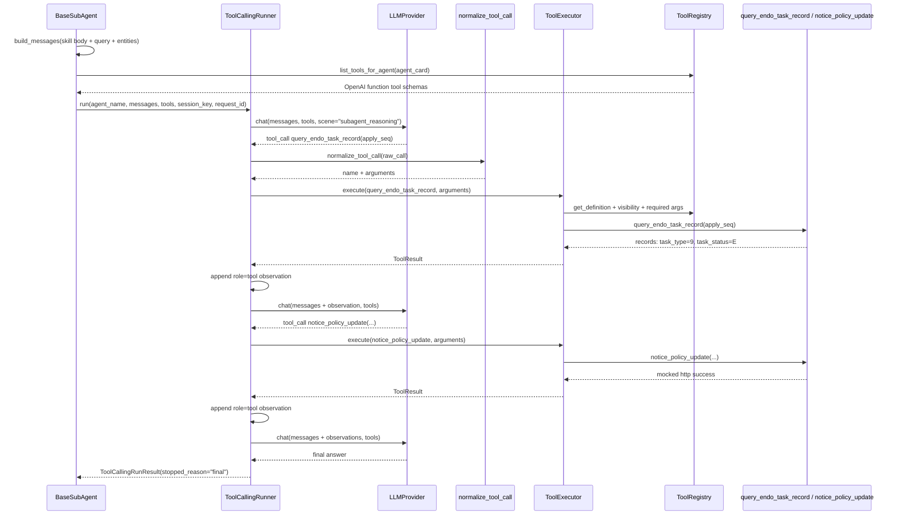

# Tool Calling Runner Endo Aftercare Flow

本文基于当前源码说明一次“保全任务完成后异常处理”请求进入子 Agent 后，`ToolCallingRunner.run(...) -> LLM + tools loop -> ToolExecutor.execute(...)` 的真实代码流转、使用的 LLM、以及关键入参/出参结构。

示例问题：

```text
保全任务完成了，但是保单信息没有更新，受理号 APPLY_POLICY_UPDATE_FAIL，保单号 P001，保全项退保
```

## 1. 相关代码位置

| 环节 | 代码位置 | 说明 |
|---|---|---|
| LLM Provider 创建 | `app/main.py::create_app` -> `app/llm/factory.py::build_llm_provider` | 应用级唯一 LLM provider 注入给 graph、skill selector、ToolCallingRunner 等 |
| LLM Provider 实现 | `app/llm/internal_provider.py::InternalLLMProvider` / `app/llm/opensdk_provider.py::OpenSDKLLMProvider` | 默认 Internal，`ENABLE_OPENSDK_LLM=true` 时切 OpenSDK |
| 模型选择 | `app/llm/model_config.py::get_llm_model` | `scene="subagent_reasoning"` 时优先读 `SUBAGENT_REASONING_MODEL` |
| 子 Agent 统一模板 | `app/subagents/base.py::BaseSubAgent.run` | 构建子 Agent 上下文、messages、tool schemas，并调用 runner |
| tool loop | `app/subagents/tool_calling_runner.py::ToolCallingRunner.run` | 每轮调用 LLM，解析 tool_calls，执行工具，追加 observation |
| tool call 解析 | `app/llm/tool_call_parser.py::normalize_tool_call` | 兼容 OpenAI function call 格式和简化格式 |
| 工具注册 | `app/tools/agent_tools.py::register_agent_private_tools` | 注册 `query_endo_task_record`、`notice_policy_update` 等 troubleshooting private tools |
| 工具 schema | `app/tools/registry.py::ToolRegistry.get_tool_schema` | 转成 OpenAI function-calling schema 给 LLM |
| 工具执行 | `app/tools/executor.py::ToolExecutor.execute` | 做权限、required 参数、审批、local/MCP 分发、日志 |
| aftercare skill | `app/skills/troubleshooting_agent/endo_completion_aftercare/SKILL.md` | 指导 LLM 如何根据 9/10/11 节点调用后续工具 |

## 2. 使用的是哪一个 LLM？

当前 `ToolCallingRunner` 使用的是 `app/main.py::create_app` 中构造并注入的同一个 `llm_provider`：

```python
llm_provider = build_llm_provider(settings)
tool_calling_runner = ToolCallingRunner(llm_provider=llm_provider, tool_executor=tool_executor)
```

`build_llm_provider(settings)` 的规则在 `app/llm/factory.py`：

```python
if settings.enable_opensdk_llm:
    return OpenSDKLLMProvider(settings)
return InternalLLMProvider(settings)
```

所以：

- 默认：`InternalLLMProvider`
- `ENABLE_OPENSDK_LLM=true`：`OpenSDKLLMProvider`
- 子 Agent tool loop 调用时固定传：`scene="subagent_reasoning"`

模型名解析在 `app/llm/model_config.py::get_llm_model`：

```text
显式 model
-> SUBAGENT_REASONING_MODEL
-> INTERNAL_LLM_MODEL，默认 "1501"
```

注意：如果 `InternalLLMProvider` 没有配置 `INTERNAL_LLM_API_URL`，会走本地 deterministic fallback。当前 fallback 只内置了 `query_internal_log`、`query_policy_info`、`query_claim_case` 等简单分支，没有专门内置 `query_endo_task_record` 的 aftercare tool-call 逻辑。因此这个 aftercare 示例要完整跑出两轮工具调用，依赖真实 LLM 返回 tool calls，或测试里的 fake / sequenced LLM。

## 3. 进入 ToolCallingRunner 前的数据

完整主流程先经过：

```text
/api/chat
-> query_rewrite
-> intent_recognition
-> select_agent
-> assemble_task
-> dispatch_agent
-> BaseSubAgent.run
```

本文从 `dispatch_agent -> BaseSubAgent.run` 开始看。

### 3.1 AgentTaskEnvelope

`app/agents/task_assembler.py::AgentTaskAssembler.assemble` 会把主流程状态组装成 `AgentTaskEnvelope`。

示例结构：

```json
{
  "task_id": "task_<uuid>",
  "agent_name": "troubleshooting_agent",
  "query": "保全任务完成了，但是保单信息没有更新，受理号 APPLY_POLICY_UPDATE_FAIL，保单号 P001，保全项退保",
  "original_query": "保全任务完成了，但是保单信息没有更新，受理号 APPLY_POLICY_UPDATE_FAIL，保单号 P001，保全项退保",
  "intent": "troubleshooting",
  "entities": {
    "apply_seq": "APPLY_POLICY_UPDATE_FAIL",
    "policy_no": "P001",
    "endorseType": "退保"
  },
  "session_key": "tenant:web:user:session",
  "request_id": "req-demo",
  "trace_id": "trace-demo",
  "agent_card": {
    "agent_name": "troubleshooting_agent",
    "private_tools": [
      "query_task_status",
      "query_node_status",
      "query_internal_log",
      "query_endo_task_record",
      "notice_policy_update",
      "notice_customer_update",
      "notice_period_update",
      "policy_suspendOrRecovery",
      "notice_finance"
    ],
    "public_tools_allowed": true,
    "skills": [
      "troubleshooting_agent.signature_error",
      "troubleshooting_agent.refund_failure",
      "troubleshooting_agent.missing_field",
      "troubleshooting_agent.callback_failure",
      "troubleshooting_agent.endo_completion_aftercare"
    ]
  },
  "metadata": {
    "request_id": "req-demo",
    "trace_id": "trace-demo"
  }
}
```

`app/agents/dispatcher.py::DispatchAgentNode.dispatch` 再把它转成 `SubAgentTask`：

```json
{
  "name": "troubleshooting_agent",
  "query": "保全任务完成了，但是保单信息没有更新，受理号 APPLY_POLICY_UPDATE_FAIL，保单号 P001，保全项退保",
  "intent": "troubleshooting",
  "session_key": "tenant:web:user:session",
  "original_query": "保全任务完成了，但是保单信息没有更新，受理号 APPLY_POLICY_UPDATE_FAIL，保单号 P001，保全项退保",
  "entities": {
    "apply_seq": "APPLY_POLICY_UPDATE_FAIL",
    "policy_no": "P001",
    "endorseType": "退保"
  },
  "task_id": "task_<uuid>",
  "metadata": {
    "request_id": "req-demo",
    "trace_id": "trace-demo",
    "agent_card": {
      "...": "AgentCard.model_dump()"
    }
  }
}
```

### 3.2 BaseSubAgent 构建 SubAgentContext

`app/subagents/base.py::BaseSubAgent.run` 先做：

```python
agent_card = self.get_agent_card(task)
allowed_tools = self.get_available_tool_names(agent_card)
sub_context = await self.context_builder.build_for_subagent(...)
```

`ContextBuilder` 会：

1. 读取 `troubleshooting_agent` 的 skill metadata。
2. `SkillSelector` 选择 `troubleshooting_agent.endo_completion_aftercare`。
3. 只有选中后才加载完整 `SKILL.md` body。
4. `RequiredEntityChecker` 检查 skill 必需实体。

当前 aftercare skill 的必需实体来自 `app/skills/troubleshooting_agent/endo_completion_aftercare/SKILL.md`：

```yaml
required_entities:
  - apply_seq
  - policy_no
  - endorseType
```

如果三者都存在，`SubAgentContext` 关键字段类似：

```json
{
  "rewritten_query": "保全任务完成了，但是保单信息没有更新，受理号 APPLY_POLICY_UPDATE_FAIL，保单号 P001，保全项退保",
  "intent": "troubleshooting",
  "allowed_tools": [
    "query_endo_task_record",
    "notice_policy_update",
    "notice_customer_update",
    "notice_period_update",
    "policy_suspendOrRecovery",
    "notice_finance",
    "... public tools if AgentCard.public_tools_allowed=true"
  ],
  "selected_skill_id": "troubleshooting_agent.endo_completion_aftercare",
  "missing_required_entities": [],
  "need_clarification": false,
  "skill_content": "<完整 SKILL.md 正文>"
}
```

如果缺少 `apply_seq` / `policy_no` / `endorseType`，`BaseSubAgent.run` 会直接返回澄清型 `SubAgentResult`，不会进入 `ToolCallingRunner.run`。

## 4. 传给 LLM 的 messages 和 tools

### 4.1 messages

`app/subagents/base.py::BaseSubAgent.build_messages` 构造两条消息：

```json
[
  {
    "role": "system",
    "content": "You are troubleshooting_agent. Diagnose policy onboarding, refund, callback, interface, and production integration failures.\nUse only the provided tools. When enough evidence is available, answer the user directly.\nSkill body:\n<endo_completion_aftercare SKILL.md 完整正文>"
  },
  {
    "role": "user",
    "content": "Original query: 保全任务完成了，但是保单信息没有更新，受理号 APPLY_POLICY_UPDATE_FAIL，保单号 P001，保全项退保\nRewritten query: 保全任务完成了，但是保单信息没有更新，受理号 APPLY_POLICY_UPDATE_FAIL，保单号 P001，保全项退保\nIntent: troubleshooting\nEntities: {'apply_seq': 'APPLY_POLICY_UPDATE_FAIL', 'policy_no': 'P001', 'endorseType': '退保'}\nShort summary: \nLightweight hints: []"
  }
]
```

这两条消息告诉 LLM：

- 当前子 Agent 是谁。
- 当前选中的 skill 是什么。
- 用户问题、改写问题、intent、entities 是什么。
- 可以根据 skill SOP 先查 `query_endo_task_record`，再按 9/10/11 节点结果决定后续工具。

### 4.2 tools

`BaseSubAgent.get_available_tool_schemas` 调用：

```python
self.tool_executor.registry.list_tools_for_agent(agent_card)
```

`ToolRegistry` 会按 AgentCard 可见性过滤工具，并输出 OpenAI function-calling schema。

aftercare 相关工具 schema 示例：

```json
[
  {
    "type": "function",
    "function": {
      "name": "query_endo_task_record",
      "description": "查询保全任务记录表，获取任务详情和 9/10/11 节点状态。",
      "parameters": {
        "type": "object",
        "properties": {
          "apply_seq": {
            "type": "string",
            "description": "保全受理号 / 申请流水号，用于查询保全任务节点记录。"
          }
        },
        "required": ["apply_seq"]
      }
    }
  },
  {
    "type": "function",
    "function": {
      "name": "notice_policy_update",
      "description": "通知保全任务完成，保单更新失败，需要触发保单更新数据。",
      "parameters": {
        "type": "object",
        "properties": {
          "apply_seq": {"type": "string", "description": "保全受理号。"},
          "policyNo": {"type": "string", "description": "保单号。"},
          "endorseType": {"type": "string", "description": "保全项。"}
        },
        "required": ["apply_seq", "policyNo", "endorseType"]
      }
    }
  }
]
```

真实列表还包含：

- `notice_customer_update`
- `notice_period_update`
- `policy_suspendOrRecovery`
- `notice_finance`
- 其他 troubleshooting private tools
- 若 `public_tools_allowed=true`，还会包含 public tools，例如 `rag_search_tool` / `get_knowledge`

## 5. ToolCallingRunner.run 的循环

`ToolCallingRunner.run` 的入参结构：

```python
await self.tool_calling_runner.run(
    agent_name="troubleshooting_agent",
    messages=messages,
    tools=tool_schemas,
    session_key="tenant:web:user:session",
    request_id="req-demo",
    trace_id="trace-demo",
    agent_card=agent_card,
)
```

核心循环在 `app/subagents/tool_calling_runner.py::ToolCallingRunner.run`：

```text
for iteration in range(1, max_iterations + 1):
  response = llm_provider.chat(messages=messages, tools=tools, scene="subagent_reasoning")
  if response.has_tool_calls:
    messages.append(role="assistant", tool_calls=response.tool_calls)
    for raw_call in response.tool_calls:
      normalized = normalize_tool_call(raw_call)
      tool_result = ToolExecutor.execute(...)
      messages.append(role="tool", content=ToolResult JSON)
    continue
  else:
    messages.append(role="assistant", content=response.content)
    return final
```

`max_iterations` 默认是 `30`，防止 LLM 无限调用工具。

## 6. 第 1 轮：LLM 调用 query_endo_task_record

### 6.1 LLMProvider.chat 入参

`ToolCallingRunner` 调用：

```python
response = await self.llm_provider.chat(
    messages=messages,
    tools=tools,
    scene="subagent_reasoning",
    request_id="req-demo",
)
```

如果使用真实 Internal LLM HTTP，`InternalLLMProvider._build_payload` 会构造：

```json
{
  "model": "1501",
  "messages": [
    {"role": "system", "content": "...Skill body..."},
    {"role": "user", "content": "...Original query...Entities..."}
  ],
  "tools": [
    {"type": "function", "function": {"name": "query_endo_task_record", "...": "..."}},
    {"type": "function", "function": {"name": "notice_policy_update", "...": "..."}}
  ],
  "stream": false,
  "temperature": 0.1,
  "max_tokens": 8192
}
```

### 6.2 LLMResponse 出参

一个合理的 LLM 返回会是：

```json
{
  "content": null,
  "has_tool_calls": true,
  "finish_reason": "tool_calls",
  "tool_calls": [
    {
      "id": "call_query_endo",
      "type": "function",
      "function": {
        "name": "query_endo_task_record",
        "arguments": "{\"apply_seq\": \"APPLY_POLICY_UPDATE_FAIL\"}"
      }
    }
  ]
}
```

测试中 `tests/test_endo_aftercare_tool_calling_loop.py::SequencedLLM` 就是用这个结构模拟 LLM。

### 6.3 ToolCallingRunner 追加 assistant tool_call 消息

Runner 会先追加：

```json
{
  "role": "assistant",
  "content": null,
  "tool_calls": [
    {
      "id": "call_query_endo",
      "function": {
        "name": "query_endo_task_record",
        "arguments": "{\"apply_seq\": \"APPLY_POLICY_UPDATE_FAIL\"}"
      }
    }
  ]
}
```

### 6.4 normalize_tool_call

`app/llm/tool_call_parser.py::normalize_tool_call` 输出：

```json
{
  "id": "call_query_endo",
  "name": "query_endo_task_record",
  "arguments": {
    "apply_seq": "APPLY_POLICY_UPDATE_FAIL"
  },
  "error": null
}
```

### 6.5 ToolExecutor.execute 入参

Runner 调用：

```python
tool_result = await self.tool_executor.execute(
    agent_name="troubleshooting_agent",
    tool_name="query_endo_task_record",
    arguments={"apply_seq": "APPLY_POLICY_UPDATE_FAIL"},
    agent_card=agent_card,
    session_key="tenant:web:user:session",
    request_id="req-demo",
    trace_id="trace-demo",
)
```

### 6.6 ToolExecutor 内部流转

`app/tools/executor.py::ToolExecutor.execute` 做这些检查：

1. `registry.get_definition("query_endo_task_record")`
   - 找到 `ToolDefinition`
   - `scope="private"`
   - `source="local"`
   - `agent_name="troubleshooting_agent"`
   - `is_write=False`
2. `registry.is_tool_available_for_agent(...)`
   - 检查该工具在 `AgentCard.private_tools` 中
   - 通过
3. `_missing_required_arguments(...)`
   - schema required 是 `["apply_seq"]`
   - arguments 有 `apply_seq`
   - 通过
4. `_requires_approval(...)`
   - 当前该工具 `is_write=False`
   - 不进入人工审批
5. `_execute_definition(...)`
   - `definition.source == "local"`
   - 执行 `await definition.callable(**arguments)`
   - 即 `app/tools/agent_tools.py::query_endo_task_record(apply_seq="APPLY_POLICY_UPDATE_FAIL")`
6. `_log(...)`
   - 写日志事件
   - 如果配置了 `ToolExecutionLogStore`，写入 `tool_execution_logs`

### 6.7 query_endo_task_record 出参

`query_endo_task_record` 根据 `apply_seq` 包含 `POLICY_UPDATE_FAIL` 返回 9 节点失败：

```json
{
  "apply_seq": "APPLY_POLICY_UPDATE_FAIL",
  "records": [
    {
      "task_type": "9",
      "task_status": "E",
      "response_body": "保单更新错误：mock policy update failed"
    },
    {
      "task_type": "10",
      "task_status": "S",
      "response_body": "财务创单成功"
    },
    {
      "task_type": "11",
      "task_status": "S",
      "response_body": "保单恢复成功，E08消息发送成功"
    }
  ],
  "success": true
}
```

### 6.8 ToolResult 出参

`ToolExecutor.execute` 返回：

```json
{
  "name": "query_endo_task_record",
  "allowed": true,
  "success": true,
  "result": {
    "apply_seq": "APPLY_POLICY_UPDATE_FAIL",
    "records": [
      {
        "task_type": "9",
        "task_status": "E",
        "response_body": "保单更新错误：mock policy update failed"
      },
      {
        "task_type": "10",
        "task_status": "S",
        "response_body": "财务创单成功"
      },
      {
        "task_type": "11",
        "task_status": "S",
        "response_body": "保单恢复成功，E08消息发送成功"
      }
    ],
    "success": true
  },
  "error": null,
  "agent_name": "troubleshooting_agent",
  "duration_ms": 0,
  "needs_human_approval": false,
  "approval_payload": null,
  "pending_tool_call": null,
  "approval_id": null
}
```

### 6.9 Runner 追加 role=tool observation

Runner 把 `ToolResult.model_dump()` JSON 化后追加：

```json
{
  "role": "tool",
  "tool_call_id": "call_query_endo",
  "name": "query_endo_task_record",
  "content": "{\"name\":\"query_endo_task_record\",\"allowed\":true,\"success\":true,\"result\":{\"apply_seq\":\"APPLY_POLICY_UPDATE_FAIL\",\"records\":[{\"task_type\":\"9\",\"task_status\":\"E\",\"response_body\":\"保单更新错误：mock policy update failed\"},{\"task_type\":\"10\",\"task_status\":\"S\",\"response_body\":\"财务创单成功\"},{\"task_type\":\"11\",\"task_status\":\"S\",\"response_body\":\"保单恢复成功，E08消息发送成功\"}],\"success\":true},\"error\":null,...}"
}
```

这就是你说的“工具返回结果累加在 messages 给 LLM”。下一轮 LLM 的判断主要依赖这条 observation。

## 7. 第 2 轮：LLM 根据 observation 调用 notice_policy_update

LLM 看到 observation 中：

```json
{
  "task_type": "9",
  "task_status": "E",
  "response_body": "保单更新错误：mock policy update failed"
}
```

再结合 skill body：

```text
如果 task_type=9 且 task_status=E，response_body 包含“保单更新错误”
-> 调用 notice_policy_update
```

### 7.1 LLMResponse 出参

```json
{
  "content": null,
  "has_tool_calls": true,
  "finish_reason": "tool_calls",
  "tool_calls": [
    {
      "id": "call_notice_policy",
      "type": "function",
      "function": {
        "name": "notice_policy_update",
        "arguments": "{\"apply_seq\": \"APPLY_POLICY_UPDATE_FAIL\", \"policyNo\": \"P001\", \"endorseType\": \"退保\"}"
      }
    }
  ]
}
```

### 7.2 ToolExecutor.execute 入参

```python
await tool_executor.execute(
    agent_name="troubleshooting_agent",
    tool_name="notice_policy_update",
    arguments={
        "apply_seq": "APPLY_POLICY_UPDATE_FAIL",
        "policyNo": "P001",
        "endorseType": "退保",
    },
    agent_card=agent_card,
    session_key="tenant:web:user:session",
    request_id="req-demo",
    trace_id="trace-demo",
)
```

### 7.3 ToolExecutor 检查结果

1. 工具存在：通过。
2. 工具在 `AgentCard.private_tools` 中：通过。
3. required 参数：
   - `apply_seq`
   - `policyNo`
   - `endorseType`
   全部存在，通过。
4. `is_write=False`：不触发人工审批。
5. 执行 local callable：`app/tools/agent_tools.py::notice_policy_update`。

注意：虽然 `notice_policy_update` 是业务处理类工具，但当前代码注册时没有传 `is_write=True`，所以它不会进入 `human_approval_required` 分支。当前只有像 `update_policy_status` 这类注册了 `is_write=True` 的工具会触发审批。

### 7.4 notice_policy_update 出参

`notice_policy_update` 调用 `_mock_http_post`，当前不会请求真实生产系统：

```json
{
  "mock": true,
  "url": "/endo/notice/policy-update",
  "payload": {
    "apply_seq": "APPLY_POLICY_UPDATE_FAIL",
    "policyNo": "P001",
    "endorseType": "退保"
  },
  "success": true,
  "message": "mocked http response"
}
```

### 7.5 ToolResult 出参

```json
{
  "name": "notice_policy_update",
  "allowed": true,
  "success": true,
  "result": {
    "mock": true,
    "url": "/endo/notice/policy-update",
    "payload": {
      "apply_seq": "APPLY_POLICY_UPDATE_FAIL",
      "policyNo": "P001",
      "endorseType": "退保"
    },
    "success": true,
    "message": "mocked http response"
  },
  "error": null,
  "agent_name": "troubleshooting_agent",
  "duration_ms": 0,
  "needs_human_approval": false,
  "approval_payload": null,
  "pending_tool_call": null,
  "approval_id": null
}
```

Runner 再把它作为 `role="tool"` observation 追加回 messages。

## 8. 第 3 轮：LLM 生成最终 answer

这时 messages 已经包含：

1. system：AgentCard + skill body
2. user：query / intent / entities
3. assistant：第一次 tool_call
4. tool：`query_endo_task_record` 结果
5. assistant：第二次 tool_call
6. tool：`notice_policy_update` 结果

LLM 再次被调用：

```python
llm_provider.chat(
    messages=[...6 条...],
    tools=tools,
    scene="subagent_reasoning",
    request_id="req-demo",
)
```

如果 LLM 不再返回 tool_calls，而是返回内容：

```json
{
  "content": "已查询保全任务节点：9 节点为 E，response_body 显示保单更新错误；已调用 notice_policy_update 触发保单更新通知，工具返回 mocked http response。",
  "has_tool_calls": false,
  "finish_reason": "stop"
}
```

Runner 返回 `ToolCallingRunResult`：

```json
{
  "final_answer": "已查询保全任务节点：9 节点为 E，response_body 显示保单更新错误；已调用 notice_policy_update 触发保单更新通知，工具返回 mocked http response。",
  "tool_calls": [
    {
      "name": "query_endo_task_record",
      "allowed": true,
      "success": true,
      "result": {
        "apply_seq": "APPLY_POLICY_UPDATE_FAIL",
        "records": [
          {"task_type": "9", "task_status": "E", "response_body": "保单更新错误：mock policy update failed"},
          {"task_type": "10", "task_status": "S", "response_body": "财务创单成功"},
          {"task_type": "11", "task_status": "S", "response_body": "保单恢复成功，E08消息发送成功"}
        ],
        "success": true
      },
      "error": null,
      "agent_name": "troubleshooting_agent",
      "needs_human_approval": false
    },
    {
      "name": "notice_policy_update",
      "allowed": true,
      "success": true,
      "result": {
        "mock": true,
        "url": "/endo/notice/policy-update",
        "payload": {
          "apply_seq": "APPLY_POLICY_UPDATE_FAIL",
          "policyNo": "P001",
          "endorseType": "退保"
        },
        "success": true,
        "message": "mocked http response"
      },
      "error": null,
      "agent_name": "troubleshooting_agent",
      "needs_human_approval": false
    }
  ],
  "stopped_reason": "final",
  "iterations": 3,
  "messages": ["...system/user/assistant/tool/assistant/tool/assistant..."],
  "tools": ["...OpenAI function schemas..."],
  "error": null,
  "needs_human_approval": false,
  "approval_payload": null,
  "pending_tool_call": null
}
```

## 9. BaseSubAgent 如何把 runner 结果变成 SubAgentResult

`app/subagents/base.py::BaseSubAgent.build_result_from_runner` 会把 `ToolCallingRunResult` 转成主流程需要的 `SubAgentResult`。

示例：

```json
{
  "name": "troubleshooting_agent",
  "agent_name": "troubleshooting_agent",
  "task_id": "task_<uuid>",
  "answer": "已查询保全任务节点：9 节点为 E，response_body 显示保单更新错误；已调用 notice_policy_update 触发保单更新通知，工具返回 mocked http response。",
  "evidence": [
    {
      "type": "tool_observation",
      "source": "query_endo_task_record",
      "tool_name": "query_endo_task_record",
      "summary": "{'apply_seq': 'APPLY_POLICY_UPDATE_FAIL', 'records': ...}",
      "confidence": 0.8
    },
    {
      "type": "tool_observation",
      "source": "notice_policy_update",
      "tool_name": "notice_policy_update",
      "summary": "{'mock': True, 'url': '/endo/notice/policy-update', ...}",
      "confidence": 0.8
    }
  ],
  "tool_calls": ["...ToolResult dumps..."],
  "confidence": 0.88,
  "needs_human_approval": false,
  "approval_payloads": [],
  "risk_level": "low",
  "selected_skill_id": "troubleshooting_agent.endo_completion_aftercare",
  "selected_skill_metadata": {
    "skill_id": "troubleshooting_agent.endo_completion_aftercare",
    "agent": "troubleshooting_agent",
    "required_entities": ["apply_seq", "policy_no", "endorseType"],
    "private_tools": [
      "query_endo_task_record",
      "notice_policy_update",
      "notice_customer_update",
      "notice_period_update",
      "policy_suspendOrRecovery",
      "notice_finance"
    ]
  }
}
```

`dispatch_agent` 节点收到这个结果后，把：

```json
{
  "subagent_result": "...",
  "answer": "SubAgentResult.answer",
  "selected_skill_id": "troubleshooting_agent.endo_completion_aftercare"
}
```

写回 graph state。

## 10. 如果工具需要人工审批，流转有什么不同？

如果某个工具的 `ToolDefinition.is_write=True`，`ToolExecutor.execute` 会在真正执行 callable 前返回：

```json
{
  "name": "<tool_name>",
  "allowed": false,
  "success": false,
  "error": "human_approval_required",
  "needs_human_approval": true,
  "approval_payload": {
    "agent_name": "troubleshooting_agent",
    "tool_name": "<tool_name>",
    "arguments": {"...": "..."},
    "operation_type": "write",
    "risk_level": "high",
    "reason": "Tool <tool_name> is a write-side operation and requires human approval.",
    "session_key": "tenant:web:user:session",
    "request_id": "req-demo",
    "trace_id": "trace-demo"
  },
  "pending_tool_call": {
    "name": "<tool_name>",
    "arguments": {"...": "..."},
    "agent_name": "troubleshooting_agent",
    "request_id": "req-demo",
    "trace_id": "trace-demo",
    "session_key": "tenant:web:user:session"
  }
}
```

此时 `ToolCallingRunner.run` 不再继续下一轮 LLM，而是直接返回：

```json
{
  "stopped_reason": "human_approval_required",
  "needs_human_approval": true,
  "approval_payload": "...",
  "pending_tool_call": "...",
  "messages": "...当前已累积 messages...",
  "tools": "...当前可见 tools..."
}
```

之后 `AgentGraphFactory` 会进入：

```text
check_human_approval_required
-> create_approval_request
-> submit_approval_request
-> pause_for_approval
-> final_compliance_check
-> save_assistant_message
```

但当前 aftercare 工具 `notice_policy_update`、`notice_customer_update`、`notice_period_update`、`policy_suspendOrRecovery`、`notice_finance` 注册时没有设置 `is_write=True`，所以这个示例不会触发审批。

## 11. 图：保单信息未更新场景



## 12. 关键结论

1. `ToolCallingRunner` 不自己判断业务规则，它只负责循环：LLM -> tool_call -> ToolExecutor -> observation -> LLM。
2. 工具调用的“下一步该调哪个工具”主要来自 LLM 对 `messages` 中 skill body、entities、历史 observation 的理解。
3. Tool schema 负责让 LLM 知道工具名、用途、参数；真正执行前仍由 `ToolExecutor` 做权限和缺参校验。
4. 工具返回结果会作为 `role="tool"` message 累加回 messages，下一轮 LLM 会基于这些 observation 决策。
5. aftercare 示例中，`query_endo_task_record` 的结果让 LLM 看到 9 节点失败且 `response_body` 包含“保单更新错误”，所以第二轮应调用 `notice_policy_update`。
6. 当前默认本地 deterministic fallback LLM 没有 aftercare 专用 tool-call 逻辑；完整 aftercare loop 需要真实 LLM 或测试 fake LLM 产出对应 tool_calls。
7. 当前 aftercare notice / recovery 工具是 mock local tools，且没有设置 `is_write=True`，所以不会进入人工审批分支。
