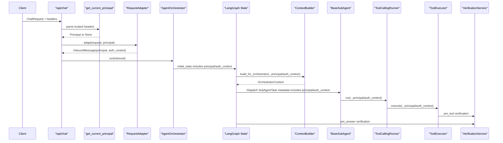
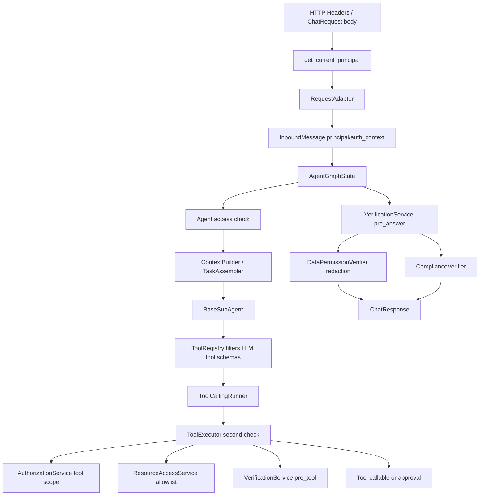

# Auth Context 权限机制说明

本文基于当前项目源码整理 `auth_context` / `principal` 的设计思想、真实代码链路和当前能力边界。结论先说：当前项目已经具备 MVP 级的身份透传、Agent 访问校验、Tool scope 校验、资源 allowlist 校验预留、最终回答敏感数据脱敏；但还没有接入真实 JWT、统一 IAM、机构权限中心或完整字段级权限策略中心。

## 1. 设计思想

当前权限设计分成三层：

| 层级 | 目标 | 当前实现 |
|---|---|---|
| 入口身份层 | 确认“当前请求是谁发起的” | 从可信 Header 解析 `Principal`；开发模式下允许从 body fallback |
| 执行权限层 | 控制能否使用某个 Agent / Tool / 资源 | `AuthorizationService` 校验 AgentCard access policy 和 ToolDefinition scopes；`ResourceAccessService` 支持资源 allowlist |
| 最终回答层 | 控制哪些数据能返回给用户 | `VerificationService(pre_answer)` 调用 `DataPermissionVerifier` 和 `ComplianceVerifier`，对敏感字段做 patch/redaction |

`auth_context` 的定位不是让 LLM 自己判断权限，而是把可信身份上下文从 API 入口一路传到 Graph、子 Agent、ToolExecutor、ApprovalStore、VerificationService。真正的拒绝、过滤和脱敏在服务端代码里完成。

## 2. 核心数据结构

### Principal

代码位置：`app/auth/principal.py::Principal`

```python
class Principal(BaseModel):
    tenant_id: str
    subject: str
    user_id: str | None = None
    org_id: str | None = None
    org_path: list[str] = []
    branch_code: str | None = None
    channel: str | None = None
    roles: list[str] = []
    scopes: list[str] = []
    data_permissions: list[str] = []
    resource_domains: list[str] = []
    attributes: dict[str, Any] = {}
```

关键字段含义：

| 字段 | 用途 |
|---|---|
| `tenant_id` | 租户隔离 |
| `subject` / `user_id` | 用户或主体身份 |
| `org_id` / `org_path` / `branch_code` | 机构维度预留 |
| `roles` | Agent 访问策略可用 |
| `scopes` | Agent/Tool 操作权限 |
| `data_permissions` | 最终回答敏感数据权限，如 `policy.sensitive.read` |
| `attributes` | MVP 本地资源 allowlist，例如 `{"policy_allowlist": ["P001"]}` |

`effective_user_id` 使用 `user_id or subject`。

### AuthContext

代码位置：`app/auth/principal.py::AuthContext`

```python
class AuthContext(BaseModel):
    principal: Principal
    auth_source: Literal["gateway", "jwt", "dev_header", "body_fallback", "service_account"]
    raw_claims: dict[str, Any] = {}
    authenticated_at: str | None = None
```

当前 `auth_source` 实际主要使用：

- `dev_header`：从 Header 解析的可信开发身份。
- `body_fallback`：没有 Header 时，从请求 body 生成本地 fallback identity。

`gateway/jwt/service_account` 是架构预留，当前没有完整 JWT 验签实现。

## 3. 身份从哪里来

入口代码：

- `app/main.py::create_app` 中 `/api/chat`
- `app/auth/dependencies.py::get_current_principal`
- `app/adapters/request_adapter.py::RequestAdapter.adapt`

`/api/chat` 签名：

```python
async def chat(
    request: ChatRequest,
    principal: Principal | None = Depends(get_current_principal),
) -> ChatResponse:
```

### 3.1 Header 可信身份

`get_current_principal` 支持这些 Header：

| Header | 映射字段 |
|---|---|
| `X-Tenant-Id` | `Principal.tenant_id` |
| `X-User-Id` | `Principal.user_id` |
| `X-Subject` | `Principal.subject` |
| `X-Org-Id` | `Principal.org_id` |
| `X-Org-Path` | `Principal.org_path`，逗号分隔 |
| `X-Branch-Code` | `Principal.branch_code` |
| `X-Channel` | `Principal.channel` |
| `X-User-Roles` | `Principal.roles`，逗号分隔 |
| `X-User-Scopes` | `Principal.scopes`，逗号分隔 |
| `X-Data-Permissions` | `Principal.data_permissions`，逗号分隔 |

示例：

```http
X-Tenant-Id: tenant_001
X-User-Id: user_001
X-Org-Id: branch_100
X-Org-Path: group,province,branch_100
X-User-Scopes: policy:read,troubleshooting:read
X-Data-Permissions: policy.sensitive.read
```

如果设置了 `AUTH_MODE=required` 或 `AUTH_MODE=jwt`，没有身份 Header 会返回 `401 authentication_required`。当前 `jwt` 只是模式名，源码里还没有真实 JWT 解析和验签。

### 3.2 Body fallback

如果没有 Header，且 `ALLOW_REQUEST_BODY_IDENTITY_FALLBACK=true`，`RequestAdapter` 会从 `ChatRequest` body 构造 fallback Principal：

```python
fallback_principal = Principal(
    tenant_id=request.tenant_id,
    subject=request.user_id,
    user_id=request.user_id,
    channel=request.channel,
    scopes=["agent:use", "policy:read", "claim:read", "troubleshooting:read"],
    data_permissions=[],
)
```

这意味着：

- 本地开发可以不传 Header。
- fallback 用户默认没有 `policy.sensitive.read`，最终回答中的手机号、身份证、银行卡会被脱敏。
- 生产环境建议关闭：`ALLOW_REQUEST_BODY_IDENTITY_FALLBACK=false`。

### 3.3 Header 与 body 冲突

`RequestAdapter.adapt` 的规则：

- `request.tenant_id` 必须等于 `principal.tenant_id`，否则 `PermissionError`。
- 如果 `request.user_id != principal.effective_user_id` 且 `ALLOW_REQUEST_BODY_IDENTITY_FALLBACK=false`，则拒绝。
- 如果允许 fallback，则当前代码会使用 Header principal 的 `effective_user_id` 构造 `session_key`。

相关测试：`tests/test_enterprise_harness_p0_p1.py::test_chat_uses_header_principal_for_session_key`。

## 4. auth_context 如何在主链路流转



关键传递点：

| 位置 | 代码 | 传递内容 |
|---|---|---|
| API 入口 | `app/main.py::chat` | `principal=Depends(get_current_principal)` |
| 请求适配 | `app/adapters/request_adapter.py::adapt` | `InboundMessage.principal`, `InboundMessage.auth_context` |
| Graph 初始 state | `app/runtime/orchestrator.py::run` | `state["principal"]`, `state["auth_context"]` |
| OrchestratorContext | `app/runtime/context_builder.py::build_for_orchestrator` | `principal`, `auth_context` |
| AgentTaskEnvelope | `app/agents/task_assembler.py::assemble` | `principal`, `auth_context` |
| SubAgentTask metadata | `app/agents/dispatcher.py::dispatch` | `metadata["principal"]`, `metadata["auth_context"]` |
| Tool loop | `app/subagents/base.py::run` | 传给 `ToolCallingRunner.run` |
| Tool execution | `app/subagents/tool_calling_runner.py::run` | 传给 `ToolExecutor.execute` |
| 最终验证 | `app/runtime/graph.py::pre_answer_verify` | 传给 `VerificationService.verify` |
| 审批单 | `app/runtime/graph.py::create_approval_request` | 保存 `principal_snapshot`, `auth_context_snapshot` |

## 5. Agent 级权限

代码位置：

- `app/auth/authorization_service.py::AuthorizationService.check_agent_access`
- `app/runtime/graph.py::AgentGraphFactory._check_agent_access`
- `app/schemas/agent_card.py::AgentCard.access_policy`

`select_agent` 选中 AgentCard 后，会调用：

```python
decision = authorization_service.check_agent_access(
    principal=principal,
    agent_card=card,
)
```

AgentCard 可配置：

```yaml
access_policy:
  required_roles:
    - claim_ops
  required_scopes:
    - claim:read
  allowed_org_types:
    - branch
```

当前逻辑：

| 策略字段 | 当前行为 |
|---|---|
| `required_roles` | 用户 `principal.roles` 至少命中一个 |
| `required_scopes` | 用户 `principal.scopes` 必须包含全部 required scopes |
| `allowed_org_types` | 读取 `principal.attributes["org_type"]` 判断 |

如果 AgentCard 没有配置 `access_policy`，默认允许访问。

如果拒绝，Graph 会设置：

```json
{
  "need_clarification": true,
  "clarification_source": "agent_authorization",
  "error": "permission_denied:<reason>",
  "answer": "当前身份无权使用该业务 Agent，请联系管理员开通对应机构或岗位权限。"
}
```

注意：当前 `get_current_principal` 没有从 Header 填充 `attributes.org_type`，所以 `allowed_org_types` 属于预留/测试可用能力，真实生产需要由网关/JWT claims 或权限中心补充。

## 6. Tool 级权限

代码位置：

- `app/tools/base.py::ToolDefinition`
- `app/tools/registry.py::ToolRegistry.list_tools_for_agent`
- `app/auth/authorization_service.py::AuthorizationService.check_tool_access`
- `app/tools/executor.py::ToolExecutor.execute`

ToolDefinition 中和权限相关的字段：

```python
required_scopes: list[str]
resource_type: str | None
resource_id_arg: str | None
data_classification: "public" | "internal" | "confidential" | "sensitive"
risk_level: "low" | "medium" | "high"
is_write: bool
```

### 6.1 LLM 可见工具过滤

子 Agent 给 LLM 的 tools schema 来自：

```python
ToolRegistry.list_tools_for_agent(
    agent_card,
    principal=principal,
    authorization_service=authorization_service,
)
```

这一步会过滤掉当前 principal 没有 scope 的工具。也就是说，LLM 通常看不到无权使用的工具 schema。

相关测试：

- `tests/test_enterprise_harness_p0_p1.py::test_tool_registry_filters_llm_tools_by_principal_scope`

### 6.2 ToolExecutor 二次校验

即使 LLM 返回了某个 tool call，`ToolExecutor.execute` 仍会二次校验：

```text
tool exists
-> AgentCard visibility
-> required arguments
-> AuthorizationService.check_tool_access
-> ResourceAccessService.check_access
-> VerificationService(stage="pre_tool")
-> is_write approval check
-> execute local/MCP tool
```

scope 拒绝示例：

```json
{
  "success": false,
  "allowed": false,
  "error": "permission_denied:principal_required"
}
```

或：

```json
{
  "success": false,
  "allowed": false,
  "error": "permission_denied:missing_required_scope"
}
```

相关测试：

- `tests/test_enterprise_harness_p0_p1.py::test_tool_executor_enforces_required_scope`

## 7. 资源级权限

代码位置：`app/auth/authorization_service.py::ResourceAccessService`

当前是 MVP 本地实现，不是企业权限中心。

如果工具定义了：

```python
resource_type="policy"
resource_id_arg="policy_no"
```

`ToolExecutor` 会从 arguments 中取：

```python
resource_id = arguments["policy_no"]
```

再调用：

```python
ResourceAccessService.check_access(
    principal=principal,
    resource_type="policy",
    resource_id="P001",
    action="read",
)
```

当前 `ResourceAccessService` 只支持 `principal.attributes` 中的 allowlist：

```json
{
  "policy_allowlist": ["P001", "P002"]
}
```

如果 allowlist 存在且资源不在列表中，则拒绝：

```text
permission_denied:resource_not_allowed
```

当前限制：

- `get_current_principal` 没有从 Header 读取 `attributes`。
- 没有机构维度策略查询。
- 没有按 `org_path` 判断保单/理赔归属机构。
- 所以这块目前是“接口和本地规则预留”，不是完整企业级资源权限。

## 8. 最终回答级数据权限

代码位置：

- `app/runtime/graph.py::pre_answer_verify`
- `app/verification/service.py::VerificationService`
- `app/verification/verifiers/data_permission_verifier.py::DataPermissionVerifier`
- `app/verification/verifiers/compliance_verifier.py::ComplianceVerifier`

Graph 最终返回用户前统一调用：

```python
VerificationService.verify(
    VerificationInput(
        stage="pre_answer",
        principal=state.get("principal"),
        auth_context=state.get("auth_context") or {},
        answer=answer,
        ...
    )
)
```

`DataPermissionVerifier` 当前规则：

| 条件 | 行为 |
|---|---|
| principal 不存在 | 脱敏手机号、身份证、银行卡 |
| principal 没有 `policy.sensitive.read` | 脱敏手机号、身份证、银行卡 |
| principal 有 `policy.sensitive.read` | 不由 DataPermissionVerifier 脱敏这些字段 |

脱敏示例：

```text
客户手机号 13812345678，身份证 110101199001011234
```

变为：

```text
客户手机号 ***PHONE***，身份证 ***ID_CARD***
```

相关测试：

- `tests/test_enterprise_harness_p0_p1.py::test_pre_answer_data_permission_verifier_redacts_without_sensitive_permission`
- `tests/test_enterprise_harness_p0_p1.py::test_pre_answer_data_permission_verifier_allows_sensitive_permission`

`ComplianceVerifier` 负责更广义的外发合规检查，例如手机号、身份证、银行卡、token/secret、内部日志字段、原始工具结果等。它也挂在 `VerificationService` 下。

## 9. 审批链路中的 auth_context

代码位置：

- `app/runtime/graph.py::create_approval_request`
- `app/schemas/approval.py::ApprovalRequest`
- `app/approval/store.py::SQLiteApprovalStore`
- `app/approval/service.py::ApprovalService`

当写工具触发审批时，Graph 会把当时的身份快照写入审批单：

```python
principal_snapshot=state.get("principal") or {}
auth_context_snapshot=state.get("auth_context") or {}
resource_type=payload.get("resource_type")
resource_id=payload.get("resource_id")
tool_required_scopes=payload.get("required_scopes") or []
```

审批表字段包括：

| 字段 | 用途 |
|---|---|
| `principal_snapshot_json` | 创建审批时的用户身份快照 |
| `auth_context_snapshot_json` | 创建审批时的认证上下文 |
| `resource_type` / `resource_id` | 审批对象关联资源 |
| `tool_required_scopes_json` | 工具所需 scope |

审批通过恢复时，`ToolExecutor.execute_approved_tool` 仍会重新做工具可见性、scope、资源和 pre_tool verification 校验，不只信任审批单本身。

## 10. 当前权限链路图



## 11. 当前已实现能力

| 能力 | 状态 | 代码位置 |
|---|---|---|
| Header 解析 Principal | 已实现 | `app/auth/dependencies.py` |
| Body fallback Principal | 已实现 | `app/adapters/request_adapter.py` |
| tenant mismatch 拒绝 | 已实现 | `RequestAdapter.adapt` |
| Header principal 生成 session_key | 已实现 | `RequestAdapter.build_session_key` |
| principal/auth_context 进入 Graph state | 已实现 | `AgentOrchestrator.run` |
| AgentCard access_policy 校验 | 已实现但依赖配置 | `AgentGraphFactory._check_agent_access` |
| Tool required_scopes 校验 | 已实现 | `AuthorizationService.check_tool_access` |
| LLM tools schema 按 scope 过滤 | 已实现 | `ToolRegistry.list_tools_for_agent` |
| ToolExecutor 二次权限校验 | 已实现 | `ToolExecutor._authorize` |
| 资源 allowlist 校验 | 部分实现 | `ResourceAccessService` |
| 最终回答敏感数据脱敏 | 已实现 | `DataPermissionVerifier` |
| 审批单保存身份快照 | 已实现 | `ApprovalRequest` / `SQLiteApprovalStore` |

## 12. 当前未完成 / 预留能力

| 能力 | 当前状态 | 建议 |
|---|---|---|
| JWT 验签 | 未实现 | 在 `get_current_principal` 中增加 JWT verifier 或接入网关 claims |
| 机构权限中心 | 未实现 | 新增 `OrganizationPolicyService` 或 `ResourceAccessService` 后端实现 |
| org_path 资源归属判断 | 未实现 | 工具返回或资源查询前使用 policy/claim org ownership 校验 |
| 字段级策略中心 | 未实现 | 将 `DataPermissionVerifier` 从正则脱敏升级为 schema-aware field policy |
| ToolDefinition 真实 sensitive classification 使用 | 部分实现 | 当前有 `data_classification` 字段，但没有完整参与所有过滤策略 |
| Principal.attributes 从 Header/JWT 填充 | 未实现 | 生产应由 JWT claims 或 IAM 返回 attributes |
| pre_tool verifier 业务规则 | 预留 | 当前 `DataPermissionVerifier` 只在 `pre_answer`，无复杂 pre_tool verifier |

## 13. 如何扩展到“机构维度权限”

你之前提到“某个机构可以查看什么，某个机构没有权限查看什么”。当前代码的推荐扩展点是 `ResourceAccessService`，而不是让 LLM 判断。

建议目标模型：

```text
Principal.org_id / org_path
-> ResourceAccessService.check_access(resource_type, resource_id, action)
-> 查询保单/理赔归属机构
-> 判断 principal.org_path 是否覆盖资源机构
-> 允许或拒绝
```

示例策略：

| 用户机构 | 资源归属 | 是否允许 |
|---|---|---|
| 总公司 | 任意分支保单 | 允许 |
| 省分公司 A | 省 A 下辖分支保单 | 允许 |
| 省分公司 A | 省 B 保单 | 拒绝 |
| 分支机构 B001 | B001 保单 | 允许 |
| 分支机构 B001 | B002 保单 | 拒绝 |

落代码的位置：

- `app/auth/authorization_service.py::ResourceAccessService`
- 或新增 `app/auth/resource_access_service.py`
- Tool 注册时补齐 `resource_type` / `resource_id_arg`
- 测试补 `policy_no -> org_id` 的 fake policy ownership resolver

## 14. 如何扩展到“同一个工具，不同用户返回不同字段”

当前更合适的长期架构是：

```text
同一个 tool 查询完整业务结果
-> ToolExecutor 保存完整 evidence/log
-> 最终 pre_answer VerificationService 根据 principal.data_permissions 决定外发字段/文本是否脱敏
```

当前已经有这个方向的基础：

- `ToolDefinition.data_classification`
- `VerificationService`
- `DataPermissionVerifier`
- `ComplianceVerifier`

但当前 `DataPermissionVerifier` 仍是正则脱敏，不是结构化字段过滤。后续可升级为：

```text
answer/evidence/tool_result
-> DataFilterService / DataPermissionVerifier
-> 根据 field policy 过滤:
   policy.holder_name
   policy.phone
   policy.id_card
   policy.medical_history
```

注意：当前项目没有在工具结果进入 LLM 前做数据过滤；敏感数据主要在最终回答返回用户前由 `VerificationService(pre_answer)` 处理。

## 15. 配置项

代码位置：`app/config/settings.py`

| 配置 | 默认 | 含义 |
|---|---|---|
| `AUTH_MODE` | `dev_header` | 认证模式；`required/jwt` 时无身份 Header 会拒绝 |
| `ALLOW_REQUEST_BODY_IDENTITY_FALLBACK` | `true` | 是否允许没有 Header 时从 body 构造 fallback principal |

生产建议：

```env
AUTH_MODE=required
ALLOW_REQUEST_BODY_IDENTITY_FALLBACK=false
```

如果接 JWT：

```env
AUTH_MODE=jwt
ALLOW_REQUEST_BODY_IDENTITY_FALLBACK=false
```

但当前还需要补 JWT 验签代码。

## 16. 测试覆盖

主要测试文件：`tests/test_enterprise_harness_p0_p1.py`

覆盖点：

| 测试 | 覆盖能力 |
|---|---|
| `test_chat_uses_header_principal_for_session_key` | Header principal 优先用于 session_key |
| `test_request_adapter_rejects_body_identity_override_when_fallback_disabled` | 禁止 body identity 覆盖 Header principal |
| `test_tool_executor_enforces_required_scope` | ToolExecutor required scope 校验 |
| `test_tool_registry_filters_llm_tools_by_principal_scope` | LLM 可见工具按 principal scope 过滤 |
| `test_pre_answer_data_permission_verifier_redacts_without_sensitive_permission` | 没有敏感权限时最终回答脱敏 |
| `test_pre_answer_data_permission_verifier_allows_sensitive_permission` | 有 `policy.sensitive.read` 时允许敏感字段 |

## 17. 总结

当前项目的 `auth_context` 不是一个独立权限引擎，而是一条贯穿请求生命周期的身份上下文通道：

```text
Header / body fallback
-> Principal / AuthContext
-> AgentGraphState
-> Agent access
-> Tool schema visibility
-> ToolExecutor authorization
-> Approval snapshot
-> pre_answer VerificationService
-> ChatResponse
```

当前已经能做到：

- 多用户 session_key 隔离使用 Header principal。
- Agent 可基于 AgentCard access policy 做访问控制。
- Tool 可基于 required scopes 做 LLM 可见性过滤和执行前二次校验。
- 最终回答可基于 `data_permissions` 做敏感字段脱敏。

当前还没做到：

- 真实 JWT / IAM。
- 真实机构层级资源权限。
- 结构化字段级返回过滤。
- 完整的策略中心。

