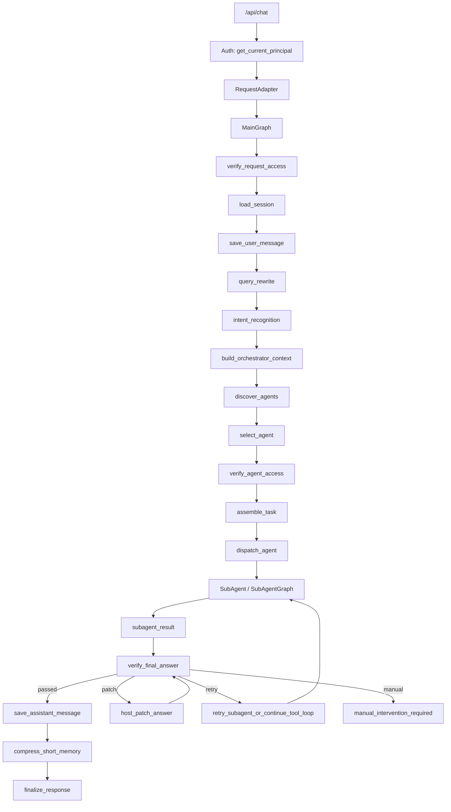

# multi-agent 企业级 Agent Harness 完整设计方案

> 适用项目：`https://github.com/Ygj11/multi-agent/tree/master/agent-development`  
> 目标：在当前已有 Multi-Agent MVP 基础上，演进为可鉴权、可审计、可验证、可审批恢复、可持续沉淀的企业级 Agent Harness 架构。

---

## 0. 一句话结论

当前项目已经具备企业级 Agent Harness 的核心雏形：

```text
FastAPI API 入口
  -> RequestAdapter
  -> LangGraph 主编排
  -> QueryRewrite / IntentRecognition
  -> AgentCard 发现与选择
  -> AgentTaskAssembler
  -> SubAgentManager
  -> SkillSelector / SkillLoader
  -> ToolCallingRunner
  -> ToolRegistry / ToolExecutor
  -> ApprovalService
  -> FinalComplianceChecker
  -> Memory / SQLite 持久化
```

下一步不应该继续把所有能力塞进主 LangGraph，而应该演进为：

```text
MainGraph 负责全局生命周期
SubAgentGraph 负责复杂 Agent 内部流程
Verification Framework 负责规则 + LLM 校验
ToolExecutor 负责工具安全边界
ApprovalStore + Checkpoint 负责审批中断与恢复
AuthContext 负责可信身份和权限传递
Evidence/Audit 负责证据链和可追溯
Learning Pipeline 负责 badcase 回灌
```

最终目标不是“更复杂的 Agent”，而是一个：

```text
可控、可查、可恢复、可审计、可持续优化的企业级 Agent Harness 平台
```

---

## 1. 当前项目现状判断

### 1.1 当前已经做得比较好的部分

当前项目已经具备以下基础能力：

1. **FastAPI 入口清晰**
   - `/api/chat`
   - `/api/approval/callback`
   - `/api/approval/{approval_id}`

2. **主流程使用 LangGraph**
   - `load_session`
   - `save_user_message`
   - `query_rewrite`
   - `intent_recognition`
   - `build_orchestrator_context`
   - `discover_agents`
   - `select_agent`
   - `assemble_task`
   - `dispatch_agent`
   - `final_compliance_check`
   - `save_assistant_message`
   - `compress_short_memory`
   - `finalize_response`

3. **AgentCard 已经作为子 Agent 能力声明**
   - `agent_name`
   - `description`
   - `capabilities`
   - `supported_routes`
   - `required_entities`
   - `optional_entities`
   - `private_tools`
   - `public_tools_allowed`
   - `skills`
   - `rag_namespaces`
   - `memory_policy`

4. **Skill 体系已经具备渐进式披露雏形**
   - 先用 metadata 选择 Skill
   - 选中后加载完整 `SKILL.md`
   - 支持 LLM rerank
   - 支持 required_entities 检查

5. **工具系统已经有企业化方向**
   - `ToolDefinition`
   - `ToolRegistry`
   - `ToolExecutor`
   - public/private/MCP tools
   - OpenAI function-calling schema
   - `is_write`
   - approval pending
   - tool execution log

6. **审批体系已有基础**
   - `ApprovalStore`
   - `ApprovalService`
   - 外部审批 callback
   - pending tool call
   - approved tool execution

7. **知识服务已抽象**
   - `KnowledgeService`
   - `DisabledKnowledgeService`
   - `KnowledgeAPIClient`
   - `build_knowledge_service(settings)`
   - RAG public tools

8. **最终合规检查已有基础**
   - `FinalComplianceChecker`
   - retry/fallback

这些说明项目已经不是简单的 “LLM + tools demo”，而是一个真正开始工程化的 Agent Harness MVP。

---

### 1.2 当前还不够企业级的关键点

当前项目距离生产级企业 Harness 还差这些关键能力：

| 方向 | 当前风险 | 推荐增强 |
|---|---|---|
| 鉴权 | `tenant_id/user_id` 多来自请求体，不是可信身份 | 引入 `Principal/AuthContext` |
| 权限 | ToolExecutor 主要做 AgentCard 工具权限，不做用户权限 | 引入 `AuthorizationService` |
| 数据权限 | 保单字段级权限不足 | 引入 `DataFilterService` |
| Verify | 校验分散，缺少统一 Verification Framework | 抽象 `VerificationService` |
| 主图复杂度 | 后续如果所有步骤都进主图会爆炸 | 引入 SubAgentGraph |
| 审批恢复 | callback 后如果再次触发写工具，链路不优雅 | 引入 checkpoint + approval chain |
| 工具幂等 | 写工具重复 callback 风险 | 引入 idempotency_key |
| Tool loop | 需要重复工具调用、连续失败保护 | 加 loop safety |
| 证据链 | evidence/audit 还需要更结构化 | 引入 Evidence Contract |
| 自优化 | badcase 目前靠人工总结 | 引入 Learning Pipeline |

---

## 2. 目标架构总览

### 2.1 总体分层

```text
API Layer
  ├── FastAPI Routes
  ├── Auth Dependency
  └── Request/Response Adapter

Main Orchestrator Layer
  ├── Main LangGraph
  ├── Query Rewrite
  ├── Intent Recognition
  ├── Agent Selection
  ├── Task Assembly
  ├── Dispatch Agent
  └── Final Verify / Compliance

SubAgent Layer
  ├── BaseSubAgent
  ├── Simple SubAgent
  ├── Complex SubAgentGraph
  ├── Skill Selection
  ├── Tool Loop
  └── SubAgentResult

Tool Layer
  ├── ToolRegistry
  ├── ToolDefinition
  ├── ToolExecutor
  ├── MCP Tool Adapter
  ├── HTTP Tool Adapter
  └── ToolExecutionLogStore

Verification Layer
  ├── VerificationService
  ├── VerifierRegistry
  ├── Rule Verifiers
  ├── LLM Verifiers
  ├── Evidence Verifiers
  └── Content Verifiers

Security Layer
  ├── Principal
  ├── AuthContext
  ├── AuthorizationService
  ├── ResourceAccessService
  └── DataFilterService

Approval Layer
  ├── ApprovalService
  ├── ApprovalStore
  ├── ApprovalClient
  ├── Approval Chain
  └── Resume via Checkpoint

Memory / Knowledge Layer
  ├── MessageStore
  ├── ShortTermMemoryManager
  ├── LongTermMemoryManager
  ├── KnowledgeService
  ├── KnowledgeAPIClient
  └── KnowledgeChunk PostProcessor

Observability / Learning Layer
  ├── Structured Logs
  ├── Tool Audit
  ├── Evidence Store
  ├── Badcase Store
  ├── Patch Suggestion
  └── Human Review Queue
```

---

### 2.2 目标核心流程



---

## 3. 主 LangGraph 设计

### 3.1 主图职责

主图只负责全局生命周期，不负责业务细节。

主图应该负责：

```text
1. 接收请求
2. 加载会话
3. 保存用户消息
4. query rewrite
5. intent recognition
6. 构建主上下文
7. 发现并选择 Agent
8. 组装 AgentTaskEnvelope
9. dispatch_agent
10. 审批 pending 判断
11. 最终 verify/compliance
12. 保存 assistant 消息
13. 压缩短期记忆
14. 返回响应
```

主图不应该负责：

```text
1. 保全 9/10/11 节点具体判断
2. 某个写工具的前置条件细节
3. 某个生成内容的 HTML 结构检查
4. 某个 Agent 内部 retry 逻辑
5. 某个 Skill 的分支执行细节
```

### 3.2 推荐主图节点

```text
load_session
save_user_message
verify_request_access
query_rewrite
intent_recognition
build_orchestrator_context
discover_agents
select_agent
verify_agent_access
assemble_task
dispatch_agent
check_human_approval_required
create_approval_request
submit_approval_request
pause_for_approval
verify_final_answer
host_patch_answer
regenerate_or_retry
fallback_answer
save_assistant_message
compress_short_memory
finalize_response
```

### 3.3 主图不爆炸原则

主图只放“全局必经节点”。

凡是满足以下条件的逻辑，不放主图：

```text
1. 只属于某个子 Agent
2. 只属于某个 Skill
3. 只属于某个工具
4. 只属于某类内容生成任务
5. 不需要影响全局生命周期
```

这些逻辑应该进入：

```text
SubAgentGraph
VerificationService
ToolExecutor
具体 Verifier
```

---

## 4. 多 Graph 架构设计

### 4.1 为什么需要多 Graph

如果所有步骤都塞进主 LangGraph，会出现：

```text
节点数量爆炸
条件边爆炸
state 字段膨胀
主图难以理解
任何业务改动都影响主图
测试粒度过大
```

因此推荐：

```text
MainGraph 负责全局编排
SubAgentGraph 负责复杂 Agent 内部流程
VerifyGraph 负责复杂校验编排
```

---

### 4.2 图的层级

```text
MainGraph
  ├── dispatch_agent -> Simple SubAgent
  ├── dispatch_agent -> TroubleshootingAgentGraph
  ├── dispatch_agent -> ContentGenerationAgentGraph
  └── verify_final_answer -> VerificationGraph
```

---

### 4.3 什么时候需要 SubAgentGraph

不需要子图：

```text
1. 简单查询
2. 一轮工具调用足够
3. 无复杂分支
4. 无局部 retry
5. 无局部 verify
```

需要子图：

```text
1. Agent 内部有多个阶段
2. 有多轮工具循环
3. 有局部 verify/retry
4. 有局部审批恢复
5. 有复杂业务分支
6. 内部流程已经开始污染主图
```

推荐优先升级为 SubAgentGraph 的 Agent：

```text
troubleshooting_agent
content_generation_agent
approval-heavy agent
```

---

## 5. Verification Harness 设计

### 5.1 核心思想

Verify 不是一个单纯 LLM 审核 Agent。

Verify 是一套校验能力体系：

```text
规则校验
代码校验
权限校验
资源校验
字段脱敏校验
工具前置条件校验
证据一致性校验
LLM 语义校验
格式结构校验
业务合规校验
```

因此顶层不要命名为 `ActionGuard`，应该设计为：

```text
VerificationService
VerifierRegistry
VerificationGraph
```

`ToolPreconditionVerifier` 只是其中一个插件。

---

### 5.2 Verification 阶段

建议定义以下 stage：

```text
request_access
agent_access
pre_skill
pre_tool
post_tool
pre_approval
pre_answer
post_answer
offline_learning
```

| Stage | 触发点 | 主要检查 |
|---|---|---|
| request_access | 请求进入主图 | 用户是否有系统使用权限 |
| agent_access | 选中 Agent 后 | 用户是否可使用该 Agent |
| pre_skill | Skill 执行前 | required_entities 是否齐全 |
| pre_tool | 工具执行前 | 参数、权限、资源、前置条件 |
| post_tool | 工具执行后 | 结构、字段、敏感数据 |
| pre_approval | 创建审批前 | 写动作是否确实有证据 |
| pre_answer | 最终回答前 | 合规、证据、权限、脱敏 |
| post_answer | 输出后 | badcase 归档 |
| offline_learning | 离线任务 | 规则/Skill/测试回灌 |

---

### 5.3 Verification 核心模型

建议新增：

```text
app/verification/schemas.py
app/verification/base.py
app/verification/registry.py
app/verification/service.py
```

#### VerificationInput

```python
class VerificationInput(BaseModel):
    stage: str
    request_id: str | None = None
    trace_id: str | None = None
    session_key: str | None = None

    auth_context: dict[str, Any] = {}
    principal: dict[str, Any] | None = None

    agent_name: str | None = None
    skill_id: str | None = None

    tool_name: str | None = None
    tool_arguments: dict[str, Any] = {}
    tool_result: Any = None
    tool_history: list[dict[str, Any]] = []

    answer: str | None = None
    evidence: list[dict[str, Any]] = []

    state: dict[str, Any] = {}
    metadata: dict[str, Any] = {}
```

#### VerificationResult

```python
class VerificationResult(BaseModel):
    passed: bool
    stage: str
    severity: str = "info"  # info / warning / error / blocking
    code: str | None = None
    message: str | None = None
    fix_hint: str | None = None

    action: str = "continue"
    # continue / clarify / block / patch / retry / approval / manual

    should_retry: bool = False
    should_patch_answer: bool = False
    should_escalate_to_human: bool = False

    metadata: dict[str, Any] = {}
```

#### Verifier

```python
class Verifier(Protocol):
    name: str
    stages: list[str]

    async def verify(self, input: VerificationInput) -> VerificationResult:
        ...
```

---

### 5.4 Verifier 类型

建议先实现这些：

```text
AuthorizationVerifier
ResourceAccessVerifier
RequiredEntityVerifier
ToolPreconditionVerifier
SensitiveDataVerifier
DataPermissionVerifier
EvidenceConsistencyVerifier
BusinessExpressionVerifier
ContentComplianceVerifier
FormatVerifier
```

#### 确定性 Verifier

适合规则判断：

```text
AuthorizationVerifier
ResourceAccessVerifier
RequiredEntityVerifier
ToolPreconditionVerifier
SensitiveDataVerifier
FormatVerifier
```

#### LLM Verifier

适合语义判断：

```text
EvidenceConsistencyVerifier
BusinessExpressionVerifier
ContentComplianceVerifier
```

#### Hybrid Verifier

先规则后 LLM：

```text
DataPermissionVerifier
ContentComplianceVerifier
```

---

## 6. Host / Worker / Verify 模式

### 6.1 当前项目中的映射

| 概念 | 当前项目对应 |
|---|---|
| Host | MainGraph / AgentOrchestrator |
| Worker | SubAgent / SubAgentGraph |
| Verify | VerificationService / VerifyGraph |
| Patch | HostPatchAnswer / RegenerateCompliantAnswer |
| Audit | ToolExecutionLogStore / EvidenceStore |
| Learning | BadcaseStore / PatchSuggestion |

---

### 6.2 在线闭环

```text
Worker Agent 执行
  -> Verify 检查
  -> Host 判断
       -> 通过：返回
       -> 可修正：局部 patch
       -> 需补查：让 Worker 继续查询
       -> 高风险：审批
       -> 不可修复：人工介入
  -> 再次 Verify
```

---

### 6.3 例子：保全任务完成后保单未更新

```text
用户：
  保全任务完成了，但是保单信息没更新，受理号 A001，保单号 P001，保全项退保。

Worker:
  query_endo_task_record(apply_seq=A001)

工具返回：
  task_type=9
  task_status=E
  response_body=保单更新错误

Worker:
  想调用 notice_policy_update

PreToolVerify:
  检查 task_type=9 是否存在
  检查 task_status 是否为 E
  检查 response_body 是否包含 保单更新错误
  检查 apply_seq/policyNo/endorseType 是否齐全
  检查用户权限

通过：
  进入 approval

不通过：
  返回 precondition_failed observation 给 Worker
```

---

## 7. 鉴权与数据权限设计

### 7.1 核心原则

```text
用户身份只能来自可信来源
不能来自 prompt
不能来自 LLM
不能完全相信 request body
```

### 7.2 Principal

```python
class Principal(BaseModel):
    tenant_id: str
    user_id: str
    roles: list[str] = []
    scopes: list[str] = []
    data_permissions: list[str] = []
    attributes: dict[str, Any] = {}
```

### 7.3 API 入口

```text
/api/chat
  -> get_current_principal()
  -> 校验 request body tenant_id/user_id
  -> 写入 auth_context
```

### 7.4 工具权限

ToolDefinition 增加：

```python
required_scopes: list[str] = []
required_data_permissions: list[str] = []
data_classification: str = "internal"
resource_type: str | None = None
```

### 7.5 ToolExecutor 鉴权顺序

```text
1. 工具是否存在
2. AgentCard 是否允许
3. required 参数是否齐全
4. principal scopes 是否满足
5. data_permissions 是否满足
6. resource access 是否允许
7. pre_tool verification
8. is_write 审批
9. 执行工具
10. DataFilterService 过滤结果
```

---

## 8. 工具治理设计

### 8.1 ToolDefinition 标准

```python
class ToolDefinition(BaseModel):
    name: str
    callable: ToolCallable | None = None
    description: str
    parameters: dict[str, Any]

    scope: str
    source: str
    enabled: bool = True
    is_write: bool = False

    agent_name: str | None = None
    server_name: str | None = None
    original_name: str | None = None

    required_scopes: list[str] = []
    required_data_permissions: list[str] = []
    data_classification: str = "internal"
    resource_type: str | None = None

    precondition_id: str | None = None
    idempotency_required: bool = False

    metadata: dict[str, Any] = {}
```

### 8.2 LLM 可见 schema

LLM 只看：

```json
{
  "type": "function",
  "function": {
    "name": "...",
    "description": "...",
    "parameters": {}
  }
}
```

LLM 不应该看到：

```text
is_write
scope
source
agent_name
server_name
required_scopes
approval_required
callable
metadata
```

这些是系统内部执行控制字段。

---

## 9. Tool Loop 安全设计

### 9.1 必要配置

```text
TOOL_LOOP_MAX_ITERATIONS=10
TOOL_LOOP_MAX_CONSECUTIVE_FAILURES=3
TOOL_LOOP_MAX_DUPLICATE_CALLS=2
TOOL_LOOP_MAX_SAME_TOOL_FAILURES=2
```

### 9.2 防死循环策略

ToolCallingRunner 应记录：

```text
iteration
tool_name
arguments_hash
success
error
```

发现以下情况时停止：

```text
1. 超过 max_iterations
2. 连续失败超过阈值
3. 同 tool + 同 arguments 重复调用超过阈值
4. 同一个缺参错误重复出现
5. MCP unavailable 重复调用
```

### 9.3 停止结果

```python
ToolCallingRunResult(
    stopped_reason="max_duplicate_tool_calls",
    error="max_duplicate_tool_calls",
    final_answer="工具重复调用超过上限，已停止自动处理，请人工介入。"
)
```

---

## 10. 写工具幂等设计

### 10.1 需要幂等的工具

```text
update_policy_status
notice_policy_update
notice_customer_update
notice_period_update
policy_suspendOrRecovery
notice_finance
所有 MCP 写工具
所有 HTTP 写工具
```

### 10.2 idempotency_key

建议：

```text
sha256(approval_id + tool_name + normalized_arguments)
```

### 10.3 执行前检查

```text
execute_approved_tool()
  -> 检查 approval_id 是否已执行
  -> 检查 idempotency_key 是否已成功执行
  -> 如果已执行，返回 previous result / idempotent_replay
  -> 否则执行真实工具
```

### 10.4 重复 callback

同一个 approval callback 到达两次：

```text
第一次：执行工具
第二次：返回 already_completed，不再执行工具
```

---

## 11. 审批中断与恢复设计

### 11.1 推荐方案

```text
LangGraph checkpoint + ApprovalStore 审批表
```

分工：

```text
LangGraph checkpoint:
  保存执行状态，用于 resume

ApprovalStore:
  保存审批业务记录，用于外部查询、callback、审计
```

### 11.2 ApprovalRequest 字段

```python
class ApprovalRequest(BaseModel):
    approval_id: str
    status: str

    tenant_id: str
    user_id: str
    session_key: str
    request_id: str
    trace_id: str

    thread_id: str | None = None
    checkpoint_id: str | None = None

    agent_name: str
    tool_name: str
    tool_arguments: dict[str, Any]
    approval_payload: dict[str, Any]

    parent_approval_id: str | None = None
    root_approval_id: str | None = None
    approval_depth: int = 0
    next_approval_id: str | None = None

    idempotency_key: str | None = None

    pending_messages: list[dict[str, Any]] = []
    pending_tools: list[dict[str, Any]] = []
    pending_tool_call: dict[str, Any] | None = None

    result: dict[str, Any] | None = None
    error: str | None = None
```

### 11.3 多轮审批链

```text
approval_1
  -> approved
  -> execute write_tool_A
  -> continue loop
  -> write_tool_B
  -> approval_2
```

要求：

```text
approval_1.status = completed
approval_1.next_approval_id = approval_2

approval_2.status = pending
approval_2.parent_approval_id = approval_1
approval_2.root_approval_id = approval_1.root
approval_2.approval_depth = approval_1.depth + 1
```

---

## 12. Evidence / Audit 设计

### 12.1 Evidence Contract

最终回答中的每个重要结论都应该有 evidence 支撑。

建议结构：

```python
class Evidence(BaseModel):
    evidence_id: str
    type: str
    source: str
    tool_name: str | None = None
    summary: str
    result_preview: Any = None
    confidence: float = 0.8
    metadata: dict[str, Any] = {}
```

### 12.2 ToolEvent

```python
class ToolEvent(BaseModel):
    event_id: str
    tool_name: str
    arguments: dict[str, Any]
    result: Any
    success: bool
    error: str | None
    duration_ms: int | None
    approval_id: str | None
    timestamp: str
```

### 12.3 Verify 使用 evidence

EvidenceConsistencyVerifier 检查：

```text
1. 回答里的结论是否有对应 tool evidence
2. 是否把工具没返回的信息编出来
3. 是否把可能原因说成确定原因
4. 是否遗漏关键失败工具
```

---

## 13. KnowledgeService / RAG 设计

### 13.1 双通道

```text
ContextBuilder pre_search:
  系统主动构建 lightweight hints

rag_search_tool:
  LLM 执行中按需检索
```

### 13.2 推荐增强

```text
1. KnowledgeChunk 统一 schema
2. ChunkPostProcessor 标准化外部返回
3. rag_namespaces 真正生效
4. score 阈值
5. 去重
6. citation/evidence 关联
```

### 13.3 KnowledgeChunk

```python
class KnowledgeChunk(BaseModel):
    content: str
    source: str | None = None
    score: float | None = None
    metadata: dict[str, Any] = {}
```

---

## 14. Memory 与问题沉淀设计

### 14.1 Memory 分类

```text
MessageStore:
  原始对话消息

ShortTermMemory:
  会话滚动摘要

EntityBag:
  可继承实体

LongTermMemory:
  用户偏好或长期知识

BadcaseStore:
  运行失败和验证不通过案例
```

### 14.2 Summary 建议

保留：

```text
summary_text
```

新增：

```text
memory_json / entity_bag
```

不要只依赖自然语言摘要做实体继承。

---

## 15. Badcase 自优化设计

### 15.1 在线闭环

```text
SubAgent 执行
  -> Verify
  -> Host patch / retry / manual
  -> 返回用户
```

### 15.2 离线闭环

```text
Verify failed
  -> BadcaseStore
  -> BadcaseAnalyzer
  -> PatchSuggester
  -> Human Review
  -> 更新 Skill / Tool schema / entity_patterns / tests / RAG
```

### 15.3 BadcaseEvent

```python
class BadcaseEvent(BaseModel):
    case_id: str
    agent_name: str
    skill_id: str | None
    user_query: str
    rewritten_query: str | None
    entities: dict[str, Any]
    tool_events: list[dict[str, Any]]
    answer: str | None
    verification_result: dict[str, Any]
    suggested_fix: dict[str, Any] | None
    created_at: str
```

### 15.4 回灌目标

```text
Skill body
Skill metadata
entity_patterns.yaml
Tool schema
Verification rule
Knowledge base
Test case
Prompt examples
```

必须人工审核后合并，不建议自动改生产规则。

---

## 16. 推荐模块目录

```text
app/
  auth/
    principal.py
    dependencies.py
    authorization_service.py
    resource_access_service.py
    data_filter_service.py

  verification/
    schemas.py
    base.py
    registry.py
    service.py
    graph.py
    verifiers/
      authorization_verifier.py
      resource_access_verifier.py
      required_entity_verifier.py
      tool_precondition_verifier.py
      sensitive_data_verifier.py
      data_permission_verifier.py
      evidence_consistency_verifier.py
      content_compliance_verifier.py
      format_verifier.py

  learning/
    badcase_store.py
    badcase_analyzer.py
    patch_suggester.py
    review_queue.py

  evidence/
    schemas.py
    evidence_store.py
    evidence_builder.py

  integrations/
    endo_client.py
    policy_client.py
    claim_client.py
```

---

## 17. 分阶段实施路线

### P0：先稳住安全边界

目标：不越权、不泄露、不乱执行写工具。

任务：

```text
1. Principal/AuthContext
2. ToolDefinition.required_scopes
3. ToolExecutor 权限校验
4. 写工具 is_write=True
5. 写工具幂等
6. Tool loop max_iterations / duplicate / failure limit
7. FinalComplianceChecker 接 auth_context
```

---

### P1：引入 Verification Framework

目标：把现有分散校验统一为 Harness。

任务：

```text
1. VerificationInput / VerificationResult
2. VerificationService
3. VerifierRegistry
4. pre_tool verifier
5. pre_answer verifier
6. FinalComplianceChecker 纳入 pre_answer
7. ToolExecutor 接入 pre_tool verification
```

---

### P2：复杂 Agent 子图化

目标：避免主图爆炸。

任务：

```text
1. 定义 SubAgentGraph 基类
2. troubleshooting_agent 改为可选内部 graph
3. content generation agent 使用内部 graph
4. 主图仍只 dispatch_agent
```

---

### P3：审批恢复企业化

目标：审批可恢复、可串联、可审计。

任务：

```text
1. LangGraph checkpointer factory
2. SQLite checkpointer local
3. ApprovalRequest parent/root/depth
4. approval chain
5. repeated callback idempotency
6. resume graph after approval
```

---

### P4：自优化闭环

目标：badcase 变成长期能力。

任务：

```text
1. BadcaseStore
2. BadcaseAnalyzer
3. Skill patch suggestion
4. Test case suggestion
5. Human review queue
```

---

## 18. 测试矩阵

### 18.1 Auth / Permission

```text
低权限用户看不到敏感工具
LLM 伪造敏感工具调用被 ToolExecutor 拒绝
用户 query 伪造 admin 身份无效
无资源权限不能查 policy_no
```

### 18.2 Tool Safety

```text
缺参工具调用返回 missing_required_argument
重复 tool call 被停止
连续失败工具调用被停止
max_iterations 生效
写工具需要审批
写工具幂等
```

### 18.3 Verification

```text
pre_tool verifier 阻止无证据写工具
pre_answer verifier 检查证据一致性
敏感字段被过滤
format verifier 检查结构
LLM verifier JSON 失败 fallback
```

### 18.4 Approval

```text
首次写工具创建 approval
approval approved 后执行工具
恢复后第二个写工具创建 approval_2
重复 callback 不重复执行
rejected 不执行工具
approval chain depth 生效
```

### 18.5 SubAgentGraph

```text
主图只 dispatch
子图内部完成局部 verify/retry
子图返回 SubAgentResult
子图失败可控
```

### 18.6 Learning

```text
Verify failed 产生 BadcaseEvent
BadcaseEvent 可生成 skill_patch suggestion
suggestion 不自动进入生产
```

---

## 19. 不建议做的事

```text
1. 不要把所有校验都搬到一个 VerifyAgent。
2. 不要让 LLM 判断权限。
3. 不要把所有业务步骤都塞进主 LangGraph。
4. 不要把 Skill/SOP 全部编码成死规则。
5. 不要让写工具绕过审批。
6. 不要只靠 final_compliance 做脱敏。
7. 不要让工具原始敏感结果进入 LLM。
8. 不要自动修改生产 Skill 或规则。
9. 不要让 ApprovalService 独自接管完整恢复流程。
10. 不要把 .env 或密钥提交到仓库。
```

---

## 20. 最终目标状态

最终项目应该变成：

```text
MainGraph:
  稳定、简洁、只管全局生命周期

SubAgentGraph:
  复杂 Agent 内部自治

Verification Framework:
  规则 + LLM + 代码校验统一编排

ToolExecutor:
  工具执行的最终安全边界

Approval System:
  多轮审批、可恢复、可审计

Auth/Data Permission:
  可信身份、资源级权限、字段级过滤

Evidence/Audit:
  所有结论和写动作都有证据链

Learning Pipeline:
  badcase 持续回灌为 Skill、规则、测试、知识
```

一句话：

> 让 LLM 负责复杂语义和业务推理，让 Harness 负责流程、权限、验证、审批、证据和持续优化。

---

## 21. 建议下一步最小落地任务

如果现在要让 Codex 开始执行，不建议直接全量改造。建议第一批任务是：

```text
任务 1：新增 app/verification 基础抽象
任务 2：ToolExecutor 接入 pre_tool verification
任务 3：FinalComplianceChecker 纳入 pre_answer verification
任务 4：新增 Principal/AuthContext 设计骨架
任务 5：为写工具补 is_write=True + 幂等设计
任务 6：为 ToolCallingRunner 补 duplicate/failure loop safety
任务 7：新增 BadcaseEvent 记录，不做自动回灌
```

这样既能体现 Harness Verify 思想，又不会把项目一次改炸。
