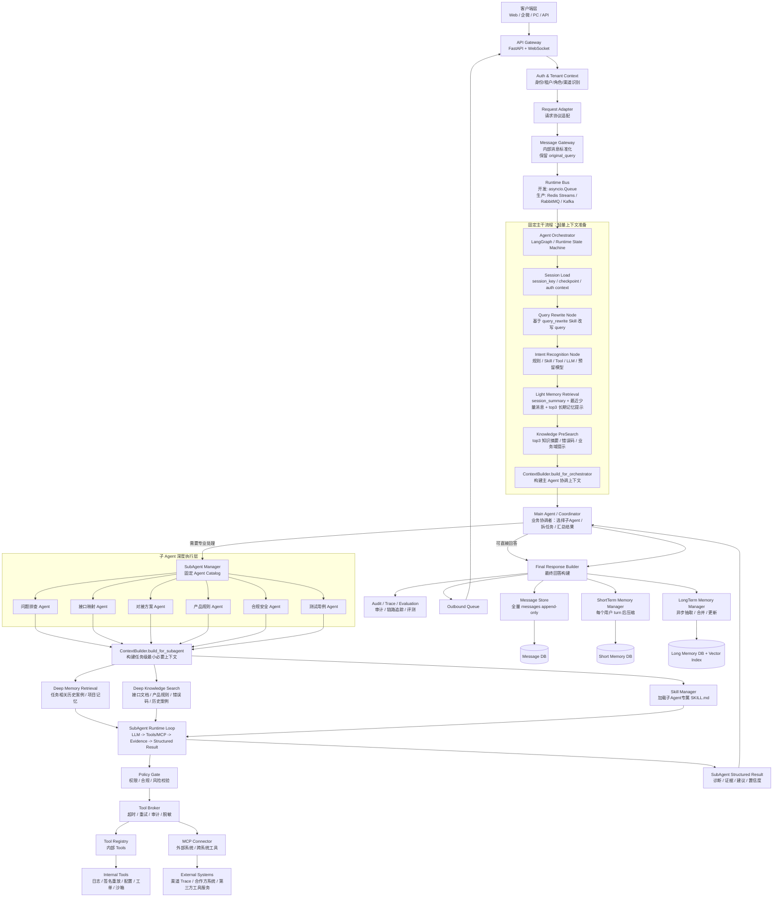
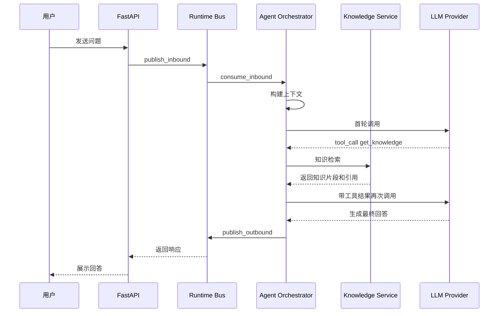
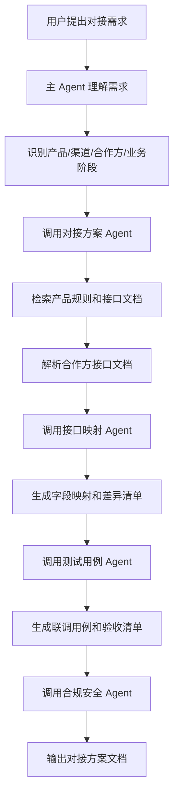
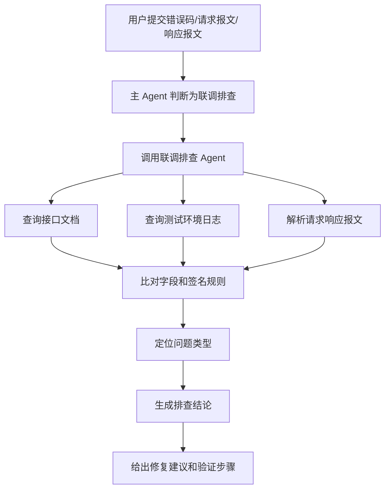

# 企业级健康险个险业务对接 Agent 平台架构设计与实现分析（V3：协调式主 Agent、两级上下文与子 Agent 深度执行版）

## 0. 文档定位

本文档基于当前 `agent1.jpg` 架构思路与后续优化建议整理，面向 **健康险行业个险业务对接场景**，目标不是设计一个简单聊天机器人，而是设计一个可在企业内部落地的 **Agent Runtime + 业务治理 + 知识服务 + 工具执行平台**。

本文重点回答以下问题：

1. 整体架构应该如何设计。
2. 为什么要拆成三层。
3. 每个核心节点负责什么。
4. 每个节点如何实现。
5. 核心方法应该有哪些。
6. 关键流程如何用伪代码表达。
7. 健康险企业级场景中需要特别注意哪些安全、合规、审计和治理问题。

## 0.1 本次版本更新重点

本版本在 V2 的 “Query 改写与记忆增强” 基础上，进一步明确 **主 Agent、子 Agent、ContextBuilder、记忆检索、知识检索** 之间的职责边界。

V3 的核心结论是：

```text
不是所有流程都交给主 Agent 自由思考，也不是所有流程都固定死。
推荐采用：固定主干流程 + 可配置节点 + 主 Agent 动态协调 + 子 Agent 深度执行。
```

相比 V2，本版本重点更新如下：

| 类别 | 新增/修改内容 | 目的 |
|---|---|---|
| 主 Agent 定位 | 主 Agent 从“执行者”进一步明确为“业务协调者” | 主 Agent 负责意图后的任务分配、子 Agent 选择、结果整合、风险控制，不直接承担所有业务细节 |
| 固定主干流程 | 明确 Query Rewrite、Intent Recognition、轻量记忆检索、轻量知识预检索、主 Agent 上下文构建是固定运行时主干 | 保证稳定性、可审计性、可复现性，避免每轮请求都由模型临时决定基础动作 |
| 动态业务分支 | 子 Agent 选择、工具调用、MCP 调用、是否继续排查、是否需要人工审批由主 Agent / 子 Agent 动态决策 | 保留 Agent 的灵活性，适配复杂健康险业务问题 |
| 两级上下文构建 | 将 ContextBuilder 明确为独立公共组件，并拆成 `build_for_orchestrator()` 与 `build_for_subagent()` | 主 Agent 只拿轻量协调上下文，子 Agent 拿任务级深度上下文 |
| 两级记忆检索 | 主干只做轻量 session 摘要、最近少量消息、少量长期记忆提示；子 Agent 根据任务做深度记忆检索 | 避免主 Agent 过重，同时保证子 Agent 执行时有足够证据 |
| 两级知识检索 | 主干做 Knowledge PreSearch，帮助路由和识别；子 Agent 做 Deep Knowledge Search，读取接口文档、错误码、条款、历史案例等 | 防止主干流程过早加载大量知识，降低 token 成本与干扰 |
| 子 Agent 角色 | 明确子 Agent 是“专业任务执行单元”，不是完整复制主 Agent 的聊天机器人 | 每个子 Agent 有固定职责、输入 schema、输出 schema、允许工具、知识范围、风险等级 |
| 问题排查流程 | 新增健康险接口联调问题排查完整示例 | 展示问题排查子 Agent 如何按 Skill 执行步骤，简单内部系统用 Tools，外部系统用 MCP |
| Tools 与 MCP 边界 | 明确内部简单能力用 Tools，跨系统/外部服务/标准化工具协议用 MCP | 避免工具接入混乱，提升企业集成可维护性 |
| 结构化任务与结果 | 主 Agent 调用子 Agent 时传结构化任务，子 Agent 返回结构化结果 | 保证可审计、可回放、可合并、可评测 |

本版本强调：

```text
Query 改写、意图识别、轻量记忆检索、轻量知识预检索、主 Agent 上下文构建，是 Agent Runtime 的固定前置能力；
主 Agent 在这些能力的结果基础上做业务协调；
子 Agent 在主 Agent 分配的任务范围内，按自身 Skill、工具权限和知识范围做深度执行；
权限校验、审计、脱敏、记忆压缩、长期记忆抽取是固定治理动作，不能交给 Agent 自由决定。
```

---

# 1. 整体架构概览

## 1.1 架构目标

健康险个险业务对接 Agent 平台的目标是：

- 支持 Web、企微、PC、API 等多入口接入。
- 支持健康险个险业务中的方案生成、接口对接、字段映射、联调排查、产品规则咨询、合规审核、测试用例生成等任务。
- 通过主控 Agent 调度多个专业子 Agent。
- 通过工具系统访问知识库、接口文档、日志平台、测试沙箱、工单系统、保险核心系统等外部能力。
- 通过 Policy Gate、Tool Broker、Audit、Trace、Eval、Human Approval 保证企业级可控性。
- 支持多租户、多渠道、多产品、多版本知识隔离。
- 支持可观测、可回放、可灰度、可回滚。

---

## 1.2 推荐整体架构图（V3）

V3 将原来的单层 Agent Runtime 进一步拆成：

```text
固定运行时主干：负责稳定、审计、安全、上下文、记忆、权限。
主 Agent 协调层：负责业务判断、子 Agent 选择、任务拆解、结果合并。
子 Agent 深度执行层：负责专业任务处理、深度检索、Tools/MCP 调用和结构化结果输出。
```



### 1.2.1 V3 架构读法

这张图要重点从三个角度理解。

第一，**主干流程不是为了做重业务处理，而是为了稳定地准备协调上下文**。它只做轻量级 query 改写、意图识别、记忆提示、知识预检索和主 Agent 上下文构建。

第二，**主 Agent 是协调者，不是所有业务细节的执行者**。它负责决定是否直接回答、是否调用子 Agent、调用哪个子 Agent、是否需要多个子 Agent、是否需要人工审批、最终如何汇总。

第三，**子 Agent 才做任务级深度执行**。例如问题排查 Agent 会加载自己的 troubleshooting Skill，按排查步骤查询内部 Tools 或外部 MCP，收集证据后输出结构化排查结果。

## 1.3 架构核心思想

本架构建议采用：

```text
入口统一化 + Agent 编排状态化 + 工具调用受控化 + 知识检索治理化 + 记忆管理分级化 + 全链路审计评测化
```

具体来说：

- **入口统一化**：所有外部请求都转成统一内部消息。
- **Agent 编排状态化**：用 LangGraph 或自研状态机管理 Agent 执行过程。
- **工具调用受控化**：所有工具调用都必须经过 Policy Gate 与 Tool Broker。
- **知识检索治理化**：RAG 不是简单向量检索，而是带租户、产品、版本、渠道、生效时间的知识治理系统。
- **记忆管理分级化**：不是所有信息都能写入长期记忆，尤其健康信息、身份信息、保单信息必须严格控制。
- **全链路审计评测化**：Agent 每一步都要可追踪、可回放、可评估。

---


## 1.4 V3 核心设计原则：固定主干 + 动态分支 + 两级上下文

### 1.4.1 固定主干流程

以下动作属于系统运行时能力，不建议让主 Agent 每次临时决定是否执行：

| 固定动作 | 原因 |
|---|---|
| 请求标准化 | 保证所有渠道进入统一消息协议 |
| session 加载 | 多轮对话必须先知道当前会话状态 |
| query 改写 | 给意图识别、检索和工具调用提供稳定输入 |
| 意图识别 | 决定路由、权限、工具范围和输出模板 |
| 轻量记忆检索 | 让主 Agent 理解“刚才那个”“这个接口”等指代 |
| 轻量知识预检索 | 辅助识别业务域、错误码、接口类型、候选子 Agent |
| 主 Agent 上下文构建 | 保证主 Agent 拿到统一、受控、可审计的协调上下文 |
| Policy Gate | 工具调用前必须固定校验，不能让模型绕过 |
| 审计记录 | 企业级系统必须可追踪、可回放 |
| 短期记忆压缩 | 控制上下文膨胀，应在每个用户 turn 后固定触发 |
| 长期记忆抽取 | 跨 session 复用经验，但必须异步、脱敏、可审计 |

### 1.4.2 动态业务分支

以下动作适合由主 Agent 或子 Agent 根据任务动态决定：

| 动态动作 | 决策者 |
|---|---|
| 是否直接回答 | 主 Agent |
| 是否调用子 Agent | 主 Agent |
| 调用哪个子 Agent | 主 Agent / SubAgentManager |
| 是否调用多个子 Agent | 主 Agent |
| 子 Agent 是否需要查内部日志 | 子 Agent |
| 子 Agent 是否需要调用 MCP | 子 Agent，但必须经过 Policy Gate |
| 排查证据是否足够 | 子 Agent |
| 是否需要人工审批 | Policy Gate 判断，主 Agent 感知结果 |
| 最终结果如何组织 | 主 Agent |

### 1.4.3 两级上下文

V3 不建议把所有记忆、所有知识和所有历史消息都放在主 Agent 里，而是采用两级上下文：

| 层级 | 目标 | 内容规模 | 典型内容 |
|---|---|---|---|
| 主 Agent 协调上下文 | 用于理解、路由、权限和协调 | 轻量 | 原始 query、改写 query、意图、session 摘要、最近 3-5 轮消息、top3 记忆提示、top3 知识提示、可用子 Agent、权限上下文 |
| 子 Agent 任务上下文 | 用于专业执行和证据收集 | 较重但受限 | 任务说明、子 Agent Skill、任务相关知识、历史案例、接口文档片段、允许工具、MCP 能力、输出 schema、风险约束 |

一句话：

```text
主 Agent 不做重活，但必须掌握足够上下文来决定把活交给谁、怎么交、能不能交；
子 Agent 负责把具体任务做深做细，但只能在被授权的任务范围、工具范围和知识范围内执行。
```

---

# 2. 三层分层设计

## 2.1 第一层：交互接入层

### 2.1.1 包含节点

- 客户端 Web / 企微 / PC / API
- API Gateway / FastAPI
- WebSocket / HTTP API
- Auth & Tenant Context
- Request Adapter
- Message Gateway

### 2.1.2 核心职责

交互接入层解决的是：

```text
谁在访问？
从哪里访问？
属于哪个租户？
是什么角色？
请求格式如何统一？
是否允许进入 Agent Runtime？
```

### 2.1.3 为什么必须有这一层

健康险企业级系统通常会存在多个接入方：

- 内部运营人员
- 技术对接人员
- 产品经理
- 客服人员
- 外部保险公司
- 经代渠道
- 第三方服务商
- 体检机构
- TPA
- 支付机构

不同用户的权限不同、能访问的数据不同、能调用的工具不同。入口层必须在请求进入 Agent 前完成身份、租户、渠道和角色识别。

---

## 2.2 第二层：Agent 运行时层

### 2.2.1 包含节点

- Runtime Bus
- Agent Orchestrator / AgentLoop
- Query Rewrite Node
- Intent Recognition Node
- Memory Retrieval Node
- Knowledge Retrieval Node
- Context Builder
- Session Manager
- ShortTerm Memory Manager
- LongTerm Memory Manager
- Skill Manager
- SubAgent Manager
- LLM Provider / Model Router

### 2.2.2 核心职责

Agent 运行时层解决的是：

```text
如何理解任务？
如何构造上下文？
如何调用模型？
如何选择工具？
如何调用子 Agent？
如何保存会话状态？
如何处理多轮任务？
如何处理异步后台任务？
```

### 2.2.3 为什么 AgentLoop 不能太重

如果把以下所有能力都塞到一个 AgentLoop 类里：

- 消息消费
- 会话读写
- 上下文拼接
- LLM 调用
- 工具执行
- MCP 连接
- 子 Agent 调度
- 记忆整合
- 审计记录
- 异常重试

后期 AgentLoop 会变成一个难以维护的 God Object。

因此建议拆分为：

| 模块 | 职责 |
|---|---|
| AgentOrchestrator | 管理 Agent 状态流转 |
| ContextBuilder | 构建 LLM 输入上下文 |
| SessionManager | 管理会话历史和 checkpoint |
| MemoryManager | 管理长期记忆和任务记忆 |
| SkillManager | 加载技能摘要和完整技能 |
| SubAgentManager | 选择和调用子智能体 |
| ToolExecutor / ToolBroker | 执行工具并处理安全控制 |
| LLMProvider | 调用模型并做路由、降级、预算控制 |

---

## 2.3 第三层：企业治理与业务能力层

### 2.3.1 包含节点

- Policy Gate
- Tool Broker
- Tool Registry
- MCP Connector
- Knowledge Service
- Insurance Core APIs
- Log Query
- Ticket System
- Test Sandbox
- File Parser
- Audit Logger
- Trace Manager
- Eval Service
- Human Approval

### 2.3.2 核心职责

企业治理与业务能力层解决的是：

```text
这个工具能不能调用？
这个用户有没有权限看这份数据？
这个结果能不能返回？
是否涉及敏感信息？
是否需要人工审批？
知识版本是否正确？
行为是否可审计？
结果是否可评测？
```

### 2.3.3 健康险场景为什么必须重视治理层

健康险业务中涉及大量敏感数据：

- 姓名
- 身份证号
- 手机号
- 出生日期
- 地址
- 保单号
- 投保信息
- 健康告知
- 疾病史
- 理赔材料
- 银行卡信息
- 医疗票据
- 体检报告

因此企业级 Agent 不能只追求“会回答”，更要保证：

- 不越权访问
- 不错误引用
- 不泄露隐私
- 不误操作生产系统
- 不把敏感数据写入长期记忆
- 不输出无依据的保险责任解释
- 不绕过人工审批执行高风险操作

---

# 3. 核心节点功能及实现思路

## 3.0 V3 标准处理链路：轻量主干与子 Agent 深度执行

V3 中，主干流程不再被理解为“主 Agent 自己完成所有事情”，而是被理解为 **Agent Runtime 的固定轻量前置处理链路**。

主干流程的目标不是深度回答问题，而是完成：

```text
标准化请求 -> 识别意图 -> 准备轻量上下文 -> 让主 Agent 做协调决策
```

子 Agent 流程的目标才是：

```text
接收结构化任务 -> 加载专属 Skill -> 做深度检索 -> 调用 Tools/MCP -> 输出结构化结果
```

### 3.0.1 固定主干处理链路

```text
用户 original_query
-> Request Adapter 标准化
-> SessionManager 获取或创建 session
-> 保存用户原始消息到 Message Store
-> QueryRewriteNode 基于 query_rewrite Skill 改写 query
-> IntentRecognitionNode 识别意图
-> LightMemoryRetrievalNode 轻量记忆检索
-> KnowledgePreSearchNode 轻量知识预检索
-> ContextBuilder.build_for_orchestrator 构建主 Agent 协调上下文
-> Main Agent / Coordinator 判断：直接回答 or 调用子 Agent or 澄清 or 人工审批
```

### 3.0.2 动态子 Agent 深度执行链路

当主 Agent 判断需要子 Agent 时，进入子 Agent 深度执行链路：

```text
Main Agent 生成结构化子任务
-> SubAgentManager 校验子 Agent 是否存在、是否可用、是否有权限
-> ContextBuilder.build_for_subagent 构建任务级最小必要上下文
-> 子 Agent 加载自身 SKILL.md
-> 子 Agent 按 Skill 生成执行计划
-> 子 Agent 判断是否需要内部 Tools 或 MCP
-> Policy Gate 校验工具调用权限
-> Tool Broker 执行内部 Tools / MCP Connector 执行外部能力
-> 子 Agent 汇总证据并输出结构化结果
-> Main Agent 合并结果、必要时调用合规 Agent
-> 生成最终回答
```

### 3.0.3 固定收尾链路

无论是主 Agent 直接回答，还是调用子 Agent 后回答，都进入固定收尾：

```text
保存 assistant 消息
-> 记录审计事件和 trace
-> ShortTermMemoryManager 压缩本轮用户 turn
-> LongTermMemoryManager 异步抽取可复用长期记忆
-> 更新 message processed 状态
```

### 3.0.4 V3 标准处理链路伪代码

```python
async def handle_user_query_v3(raw_request: dict) -> OutboundMessage:
    # 1. 请求标准化
    inbound = request_adapter.adapt(raw_request)

    # 2. session 加载与原始消息落库
    session = await session_manager.get_or_create(
        session_key=inbound.session_key,
        user_id=inbound.user_id,
        tenant_id=inbound.tenant_id,
        channel=inbound.channel,
    )

    await message_store.append(
        session_key=session.session_key,
        role="user",
        content=inbound.original_query,
        metadata={"request_id": inbound.request_id},
    )

    # 3. 固定前置：query 改写
    rewrite = await query_rewrite_node.rewrite(
        original_query=inbound.original_query,
        session_context=session,
        rewrite_skill_name="query_rewrite",
    )

    # 4. 固定前置：意图识别
    intent = await intent_recognition_node.recognize(
        original_query=inbound.original_query,
        rewritten_query=rewrite.rewritten_query,
        skill_catalog=skill_manager.get_skill_summary(),
        tool_catalog=tool_registry.get_tool_summary(),
        session_context=session,
    )

    # 5. 固定前置：轻量记忆检索，只服务主 Agent 协调，不做深度任务检索
    light_memory = await memory_retrieval_node.retrieve_light(
        session_key=session.session_key,
        user_id=session.user_id,
        tenant_id=session.tenant_id,
        query=rewrite.rewritten_query,
        intent=intent.intent,
        recent_turns=5,
        long_memory_top_k=3,
    )

    # 6. 固定前置：轻量知识预检索，只返回摘要/hint
    knowledge_hints = await knowledge_service.pre_search(
        query=rewrite.rewritten_query,
        intent=intent.intent,
        tenant_id=session.tenant_id,
        top_k=3,
    )

    # 7. 构建主 Agent 协调上下文
    orchestrator_context = await context_builder.build_for_orchestrator(
        session=session,
        original_query=inbound.original_query,
        rewritten_query=rewrite.rewritten_query,
        intent_result=intent,
        light_memory=light_memory,
        knowledge_hints=knowledge_hints,
        auth_context=inbound.auth_context,
    )

    # 8. 主 Agent 开始协调决策
    decision = await main_agent.decide(orchestrator_context)

    if decision.action == "clarify":
        answer = decision.clarification_question

    elif decision.action == "direct_answer":
        answer = await main_agent.answer(orchestrator_context)

    elif decision.action == "call_subagent":
        sub_task = await main_agent.build_subagent_task(
            decision=decision,
            context=orchestrator_context,
        )
        sub_result = await subagent_manager.call_subagent(
            agent_name=decision.target_subagent,
            task=sub_task,
            parent_context=orchestrator_context,
        )
        answer = await main_agent.merge_subagent_result(
            context=orchestrator_context,
            sub_results=[sub_result],
        )

    elif decision.action == "human_approval":
        answer = await human_approval.start(decision.approval_request)

    else:
        answer = "当前问题暂时无法判断，请补充业务对象、产品、接口或错误信息。"

    # 9. 固定收尾
    await message_store.append(
        session_key=session.session_key,
        role="assistant",
        content=answer,
        metadata={
            "request_id": inbound.request_id,
            "intent": intent.intent,
            "rewritten_query": rewrite.rewritten_query,
            "decision": decision.action,
        },
    )

    await audit_logger.log_event("final_response", {
        "request_id": inbound.request_id,
        "session_key": session.session_key,
        "intent": intent.intent,
        "decision": decision.action,
    })

    await short_term_memory_manager.compress_after_turn(session.session_key)

    background_tasks.create_task(
        long_term_memory_manager.extract_and_update(session.session_key)
    )

    return OutboundMessage(
        request_id=inbound.request_id,
        session_key=session.session_key,
        content=answer,
    )
```

### 3.0.5 关键原则

1. `original_query` 永远保留，不能被 `rewritten_query` 覆盖。
2. Query Rewrite、Intent Recognition、轻量记忆检索、轻量知识预检索是固定节点。
3. 主 Agent 只在协调上下文准备好之后开始业务决策。
4. 主 Agent 不做重型检索和重型工具调用，只负责判断路径、分配任务、合并结果。
5. 子 Agent 才做任务级深度检索、工具调用、MCP 调用和结构化结果输出。
6. 权限、审计、脱敏、短期记忆压缩、长期记忆抽取是固定治理动作，不能交给模型自由决定。

## 3.1 API Gateway / FastAPI Server

### 3.1.1 节点定位

API Gateway 是外部系统进入 Agent 平台的统一入口，负责接收 HTTP / WebSocket 请求，并将其交给 Request Adapter 转换为内部消息。

典型入口：

- `POST /api/chat`
- `WebSocket /ws`
- `POST /api/task`
- `GET /api/session/{session_id}`
- `POST /api/approval/callback`

### 3.1.2 核心职责

- 接收客户端请求。
- 校验请求格式。
- 提取 request_id、session_id、user_id、channel、tenant_id。
- 支持流式响应。
- 支持异步任务提交。
- 将请求转给 Request Adapter。

### 3.1.3 关键方法

| 方法 | 作用 |
|---|---|
| `chat_api()` | HTTP 问答入口 |
| `ws_endpoint()` | WebSocket 流式对话入口 |
| `submit_task()` | 长任务提交入口 |
| `approval_callback()` | 人工审批结果回调 |
| `health_check()` | 服务健康检查 |

### 3.1.4 伪代码

```python
@app.post('/api/chat')
async def chat_api(req: ChatRequest):
    # 1. 生成或读取 request_id
    request_id = req.request_id or generate_request_id()

    # 2. 构建入口上下文
    entry_context = EntryContext(
        request_id=request_id,
        channel=req.channel,
        user_id=req.user_id,
        tenant_id=req.tenant_id,
        session_id=req.session_id,
        source=req.source,
    )

    # 3. 身份与租户校验
    auth_context = await auth_service.resolve(entry_context)

    # 4. 外部请求转内部消息
    inbound_msg = request_adapter.adapt_chat_request(
        req=req,
        auth_context=auth_context,
    )

    # 5. 发布到运行时消息总线
    await message_bus.publish_inbound(inbound_msg)

    # 6. 等待或订阅响应
    outbound_msg = await outbound_waiter.wait(
        request_id=request_id,
        timeout=60,
    )

    # 7. 内部响应转外部响应
    return response_adapter.to_chat_response(outbound_msg)
```

### 3.1.5 实现要点

- WebSocket 适合长流程、流式输出、工具执行进度展示。
- HTTP 适合普通问答和短任务。
- 所有请求必须带 trace_id 或由系统生成 trace_id。
- API 层不直接调用 LLM，也不直接执行工具。
- API 层只负责接入、鉴权、协议转换和响应返回。

---

## 3.2 Auth & Tenant Context

### 3.2.1 节点定位

该节点负责识别当前请求的身份、租户、角色、渠道和权限边界。

### 3.2.2 核心职责

- 校验 token / cookie / 内部签名。
- 识别用户身份。
- 识别租户，例如内部团队、外部保险公司、经代渠道。
- 识别角色，例如运营、技术、产品、客服、外部合作方。
- 生成权限上下文，供后续 Policy Gate 使用。

### 3.2.3 关键数据结构

```python
class AuthContext:
    request_id: str
    tenant_id: str
    user_id: str
    user_name: str | None
    roles: list[str]
    channel: str
    permissions: list[str]
    data_scope: dict
    auth_level: str
```

### 3.2.4 关键方法

| 方法 | 作用 |
|---|---|
| `resolve()` | 根据请求解析身份上下文 |
| `validate_token()` | 校验访问令牌 |
| `load_user_roles()` | 查询用户角色 |
| `load_data_scope()` | 查询数据权限范围 |
| `build_permission_context()` | 构建权限上下文 |

### 3.2.5 伪代码

```python
async def resolve(entry_context: EntryContext) -> AuthContext:
    token = entry_context.headers.get('Authorization')

    principal = await validate_token(token)
    if principal is None:
        raise UnauthorizedError()

    roles = await role_service.get_roles(principal.user_id, entry_context.tenant_id)
    permissions = await permission_service.get_permissions(roles)
    data_scope = await data_scope_service.get_scope(
        user_id=principal.user_id,
        tenant_id=entry_context.tenant_id,
        channel=entry_context.channel,
    )

    return AuthContext(
        request_id=entry_context.request_id,
        tenant_id=entry_context.tenant_id,
        user_id=principal.user_id,
        user_name=principal.name,
        roles=roles,
        channel=entry_context.channel,
        permissions=permissions,
        data_scope=data_scope,
        auth_level=principal.auth_level,
    )
```

### 3.2.6 健康险场景注意点

不同角色权限必须区分：

| 角色 | 可访问内容 |
|---|---|
| 产品经理 | 产品规则、条款、方案文档 |
| 技术对接人 | 接口文档、字段映射、联调日志 |
| 客服 | 客户咨询、保单基础状态 |
| 理赔人员 | 理赔材料、理赔流程 |
| 外部渠道 | 只允许访问本渠道相关知识和对接状态 |
| 外部保险公司 | 只允许访问双方合作范围内的数据 |

---

## 3.3 Request Adapter

### 3.3.1 节点定位

Request Adapter 负责将不同来源、不同格式的外部请求转换成统一的内部消息格式。

### 3.3.2 核心职责

- 屏蔽 Web、企微、PC、API 的协议差异。
- 标准化 message、session、user、tenant、channel。
- 提取当前用户最后一条输入。
- 生成 `InboundMessage`。
- 不改变用户消息的 role，不把用户消息提升为 system。

### 3.3.3 内部消息结构

```python
class InboundMessage:
    request_id: str
    trace_id: str
    tenant_id: str
    channel: str
    user_id: str
    session_id: str
    session_key: str
    role: str
    content: str
    raw_messages: list[dict]
    metadata: dict
    created_at: datetime
```

### 3.3.4 关键方法

| 方法 | 作用 |
|---|---|
| `adapt_chat_request()` | 普通 HTTP 请求转换 |
| `adapt_ws_message()` | WebSocket 消息转换 |
| `build_session_key()` | 构建内部 session key |
| `extract_current_message()` | 提取当前用户输入 |
| `normalize_metadata()` | 标准化元数据 |

### 3.3.5 伪代码

```python
def adapt_chat_request(req: ChatRequest, auth_context: AuthContext) -> InboundMessage:
    current_message = extract_current_message(req.messages)

    session_key = build_session_key(
        tenant_id=auth_context.tenant_id,
        channel=auth_context.channel,
        user_id=auth_context.user_id,
        session_id=req.session_id,
    )

    return InboundMessage(
        request_id=req.request_id or generate_request_id(),
        trace_id=req.trace_id or generate_trace_id(),
        tenant_id=auth_context.tenant_id,
        channel=auth_context.channel,
        user_id=auth_context.user_id,
        session_id=req.session_id,
        session_key=session_key,
        role=current_message.role,   # 保持 user，不提升为 system
        content=current_message.content,
        raw_messages=req.messages,
        metadata={
            'source': req.source,
            'roles': auth_context.roles,
            'permissions': auth_context.permissions,
            'data_scope': auth_context.data_scope,
        },
        created_at=now(),
    )
```

### 3.3.6 实现要点

- 用户输入永远不能转成 system message。
- 系统提示词只能由服务端 ContextBuilder 生成。
- 外部来源、渠道、租户、角色放入 metadata。
- 每条消息必须带 request_id 和 trace_id。

---

## 3.4 Message Gateway / Runtime Bus

### 3.4.1 节点定位

Runtime Bus 负责在接入层和 Agent Runtime 之间传递消息。

开发阶段可以用 `asyncio.Queue`，生产阶段建议替换为 Redis Streams / RabbitMQ / Kafka。

### 3.4.2 核心职责

- inbound 消息入队。
- Agent 消费 inbound 消息。
- outbound 响应入队。
- 支持消息重试、死信、ACK。
- 支持多实例消费。

### 3.4.3 接口设计

```python
class MessageBus:
    async def publish_inbound(self, msg: InboundMessage): ...
    async def consume_inbound(self) -> InboundMessage: ...
    async def publish_outbound(self, msg: OutboundMessage): ...
    async def consume_outbound(self) -> OutboundMessage: ...
    async def ack(self, msg_id: str): ...
    async def retry(self, msg: InboundMessage, reason: str): ...
    async def dead_letter(self, msg: InboundMessage, reason: str): ...
```

### 3.4.4 开发版 asyncio.Queue 伪代码

```python
class AsyncioMessageBus(MessageBus):
    def __init__(self):
        self.inbound_queue = asyncio.Queue(maxsize=1000)
        self.outbound_queue = asyncio.Queue(maxsize=1000)

    async def publish_inbound(self, msg):
        await self.inbound_queue.put(msg)

    async def consume_inbound(self):
        return await self.inbound_queue.get()

    async def publish_outbound(self, msg):
        await self.outbound_queue.put(msg)

    async def consume_outbound(self):
        return await self.outbound_queue.get()
```

### 3.4.5 生产版 Redis Streams 伪代码

```python
class RedisStreamMessageBus(MessageBus):
    async def publish_inbound(self, msg):
        await redis.xadd(
            name='agent:inbound',
            fields=serialize(msg),
        )

    async def consume_inbound(self):
        records = await redis.xreadgroup(
            groupname='agent-workers',
            consumername=current_worker_id(),
            streams={'agent:inbound': '>'},
            count=1,
            block=5000,
        )
        return deserialize(records[0])

    async def ack(self, msg_id):
        await redis.xack('agent:inbound', 'agent-workers', msg_id)

    async def dead_letter(self, msg, reason):
        await redis.xadd(
            name='agent:dead-letter',
            fields={**serialize(msg), 'reason': reason},
        )
```

### 3.4.6 实现建议

| 阶段 | 方案 |
|---|---|
| 本地开发 | asyncio.Queue |
| 单机测试 | Redis List / Redis Streams |
| 生产初期 | Redis Streams |
| 高吞吐异步任务 | Kafka / RabbitMQ |

---

## 3.5 Agent Orchestrator / AgentLoop

### 3.5.1 节点定位

Agent Orchestrator 是整个系统的运行核心，负责协调 LLM、上下文、会话、记忆、工具、子 Agent 和输出。

它不应该直接承担所有细节，而应该作为调度层，调用其他组件完成具体工作。

### 3.5.2 核心职责

- 消费 Runtime Bus 中的 inbound 消息。
- 加载 session、memory、skill、subagent 信息。
- 调用 ContextBuilder 构造 LLM messages。
- 调用 LLM Provider。
- 解析 tool_calls。
- 通过 Policy Gate 和 Tool Broker 执行工具。
- 调用子智能体。
- 保存 session。
- 触发异步记忆整合。
- 发布 outbound 响应。

### 3.5.3 关键方法

| 方法 | 作用 |
|---|---|
| `run()` | 启动消费循环 |
| `dispatch()` | 分发消息并处理异常 |
| `process_message()` | 单条消息完整处理流程 |
| `run_agent_loop()` | LLM 工具调用循环 |
| `handle_tool_calls()` | 处理模型返回的工具调用 |
| `finalize_response()` | 构造最终响应 |
| `schedule_memory_consolidation()` | 异步触发记忆整合 |
| `connect_mcp()` | 初始化 MCP 连接 |
| `shutdown()` | 清理资源 |

### 3.5.4 主循环伪代码

```python
class AgentOrchestrator:
    async def run(self):
        await self.connect_mcp()

        while True:
            inbound_msg = await self.message_bus.consume_inbound()

            asyncio.create_task(
                self.dispatch(inbound_msg)
            )
```

### 3.5.5 dispatch 伪代码

```python
async def dispatch(self, inbound_msg: InboundMessage):
    try:
        await self.trace.start(inbound_msg.trace_id)
        await self.audit.log_event('message_received', inbound_msg)

        outbound_msg = await self.process_message(inbound_msg)

        await self.message_bus.publish_outbound(outbound_msg)
        await self.message_bus.ack(inbound_msg.request_id)

    except RetryableError as e:
        await self.message_bus.retry(inbound_msg, reason=str(e))
        await self.audit.log_error('message_retry', inbound_msg, e)

    except Exception as e:
        await self.message_bus.dead_letter(inbound_msg, reason=str(e))
        await self.audit.log_error('message_failed', inbound_msg, e)

        fallback = OutboundMessage.from_error(
            request_id=inbound_msg.request_id,
            session_key=inbound_msg.session_key,
            error='当前任务处理失败，已记录异常并进入人工排查。',
        )
        await self.message_bus.publish_outbound(fallback)
```

### 3.5.6 process_message 伪代码

```python
async def process_message(self, inbound_msg: InboundMessage) -> OutboundMessage:
    # 1. 读取会话
    session = await self.session_manager.get_or_create(
        session_key=inbound_msg.session_key,
        tenant_id=inbound_msg.tenant_id,
        user_id=inbound_msg.user_id,
    )

    # 2. 读取长期记忆和任务记忆
    memory_bundle = await self.memory_manager.load_relevant_memory(
        tenant_id=inbound_msg.tenant_id,
        user_id=inbound_msg.user_id,
        session_key=inbound_msg.session_key,
        query=inbound_msg.content,
    )

    # 3. 读取技能摘要
    skill_summary = await self.skill_manager.load_skill_summary(
        tenant_id=inbound_msg.tenant_id,
        channel=inbound_msg.channel,
    )

    # 4. 读取可用子智能体摘要
    subagent_summary = await self.subagent_manager.describe_available_agents(
        tenant_id=inbound_msg.tenant_id,
        permissions=inbound_msg.metadata.get('permissions', []),
    )

    # 5. 构建运行上下文
    runtime_context = RuntimeContext(
        inbound=inbound_msg,
        session=session,
        memory=memory_bundle,
        skills=skill_summary,
        subagents=subagent_summary,
        permissions=inbound_msg.metadata.get('permissions', []),
        data_scope=inbound_msg.metadata.get('data_scope', {}),
    )

    # 6. 进入 Agent 循环
    result = await self.run_agent_loop(runtime_context)

    # 7. 保存会话
    await self.session_manager.save(session)

    # 8. 异步触发记忆整合
    self.schedule_memory_consolidation(runtime_context)

    # 9. 构建响应
    return self.finalize_response(inbound_msg, result)
```

### 3.5.7 run_agent_loop 伪代码

```python
async def run_agent_loop(self, ctx: RuntimeContext) -> AgentResult:
    messages = await self.context_builder.build_messages(ctx)

    for step in range(self.config.max_agent_steps):
        # 1. 调用模型
        llm_response = await self.llm_provider.chat(
            messages=messages,
            tools=await self.tool_registry.available_tool_schemas(ctx),
            model_policy=ctx.model_policy,
        )

        # 2. 记录 assistant 消息
        messages.append(llm_response.to_assistant_message())
        ctx.session.messages.append(llm_response.to_session_message())

        # 3. 没有工具调用，则生成最终回答
        if not llm_response.tool_calls:
            return AgentResult(
                content=llm_response.content,
                finish_reason='final_answer',
                steps=step + 1,
            )

        # 4. 处理工具调用
        tool_results = await self.handle_tool_calls(
            tool_calls=llm_response.tool_calls,
            ctx=ctx,
        )

        # 5. 工具结果追加到上下文
        for tr in tool_results:
            messages.append(tr.to_tool_message())
            ctx.session.messages.append(tr.to_session_message())

    return AgentResult(
        content='当前任务步骤过多，已暂停执行。建议补充明确目标后继续。',
        finish_reason='max_steps_exceeded',
        steps=self.config.max_agent_steps,
    )
```

### 3.5.8 handle_tool_calls 伪代码

```python
async def handle_tool_calls(self, tool_calls: list[ToolCall], ctx: RuntimeContext):
    results = []

    for call in tool_calls:
        # 1. 参数 schema 校验
        validated_call = await self.tool_registry.validate_call(call)

        # 2. Policy Gate 校验
        decision = await self.policy_gate.evaluate(
            tool_call=validated_call,
            runtime_context=ctx,
        )

        if decision.action == 'deny':
            results.append(ToolResult.denied(call.id, decision.reason))
            continue

        if decision.action == 'need_approval':
            approval_result = await self.human_approval.request(
                tool_call=validated_call,
                context=ctx,
                reason=decision.reason,
            )
            if not approval_result.approved:
                results.append(ToolResult.denied(call.id, '人工审批未通过'))
                continue

        # 3. 通过 Tool Broker 执行
        result = await self.tool_broker.execute(
            tool_call=validated_call,
            runtime_context=ctx,
        )

        # 4. 工具结果脱敏
        sanitized = await self.result_sanitizer.sanitize(
            result=result,
            runtime_context=ctx,
        )

        results.append(sanitized)

    return results
```

### 3.5.9 实现要点

- `max_agent_steps` 必须限制，防止无限工具调用。
- 工具执行前必须经过 Policy Gate。
- 工具执行结果必须进入 session，但敏感内容要脱敏或摘要化。
- 生产环境不要让主 Agent 直接拥有 shell exec 权限。
- Agent 状态建议用 LangGraph checkpoint 持久化。

---


### 3.5.10 V3 中 Agent Orchestrator 与 Main Agent 的职责边界

在 V3 中，需要区分 **Agent Orchestrator** 与 **Main Agent / Coordinator**。

| 角色 | 定位 | 主要职责 |
|---|---|---|
| Agent Orchestrator | 运行时状态机 / 流程编排器 | 固定节点执行、状态流转、异常处理、审计、消息收发、调用 Main Agent 与子 Agent |
| Main Agent / Coordinator | 业务协调者 | 根据意图和轻量上下文判断是否直接回答、是否调用子 Agent、调用哪个子 Agent、如何合并结果 |
| SubAgent | 专业任务执行单元 | 在明确任务范围内按 Skill、知识、Tools/MCP 完成专业任务 |

主 Agent 不应该决定以下系统级动作是否执行：

```text
query 改写
意图识别
session 加载
轻量记忆检索
权限上下文构建
工具调用前 Policy Gate
审计记录
短期记忆压缩
长期记忆抽取
```

这些属于运行时固定主干。

主 Agent 应该决定的是：

```text
这个请求是否需要子 Agent？
需要哪个子 Agent？
是否需要多个子 Agent 协作？
是否需要澄清用户问题？
子 Agent 的任务边界是什么？
子 Agent 结果是否足够？
是否需要合规 Agent 复核？
最终输出如何组织？
```

#### Main Agent 决策伪代码

```python
class MainAgentCoordinator:
    async def decide(self, ctx: OrchestratorContext) -> AgentDecision:
        if ctx.intent_result.intent == "clarification_needed":
            return AgentDecision(
                action="clarify",
                clarification_question="请补充具体产品、接口、渠道或错误信息。",
            )

        if ctx.intent_result.route_to == "subagent":
            return AgentDecision(
                action="call_subagent",
                target_subagent=ctx.intent_result.target_subagent,
                reason="当前问题需要专业子 Agent 深度处理",
            )

        if ctx.intent_result.need_human_approval:
            return AgentDecision(
                action="human_approval",
                reason="当前请求涉及高风险操作，需要人工审批",
            )

        return AgentDecision(
            action="direct_answer",
            reason="当前问题可由主 Agent 基于轻量上下文和知识提示直接回答",
        )
```

---

## 3.6 Context Builder

### 3.6.1 节点定位

Context Builder 是 Agent Runtime 的 **公共上下文构建服务**，不属于主 Agent，也不属于某一个子 Agent。

它的职责是：根据不同执行节点的目标，构建不同粒度、不同权限范围、不同 token 预算的 LLM 输入上下文。

因此，不应设计成：

```text
主 Agent 内部自己拼 prompt
子 Agent 内部各自随意拼 prompt
```

而应设计成：

```text
Agent Orchestrator / Main Agent / SubAgent / MemoryCompression / QueryRewrite / IntentRecognition
都通过 ContextBuilder 按场景构建上下文。
```

### 3.6.2 V3 核心职责

| 职责 | 说明 |
|---|---|
| 构建主 Agent 协调上下文 | 轻量上下文，用于主 Agent 做路由、协调、任务拆解 |
| 构建子 Agent 任务上下文 | 最小必要上下文，用于子 Agent 深度执行 |
| 构建 query 改写上下文 | 只给最近少量消息、session 摘要和原始 query |
| 构建意图识别上下文 | 给原始 query、改写 query、skill/tool/subagent 摘要 |
| 构建记忆压缩上下文 | 给已有摘要和本轮新增消息 |
| 构建最终回答上下文 | 给主 Agent 决策、子 Agent 结果、合规结果和输出格式要求 |
| 控制 token 预算 | 不同场景有不同预算，防止上下文无限膨胀 |
| 权限与脱敏 | 只有通过权限过滤的数据才能进入上下文 |

### 3.6.3 两级上下文设计

#### 1. 主 Agent 协调上下文

主 Agent 需要的是“全局但轻量”的上下文，用于判断下一步怎么走。

建议包含：

```text
original_query
rewritten_query
intent_result
用户角色 / 租户 / 渠道 / 权限
session_summary
最近 3-5 轮消息
top3 长期记忆提示
top3 知识预检索摘要
可用子 Agent 列表
可用工具摘要
风险上下文
```

不建议包含：

```text
完整 30 轮历史消息
完整接口文档
完整产品条款
完整日志内容
完整长期记忆
大段工具结果
```

#### 2. 子 Agent 任务上下文

子 Agent 需要的是“局部但深度”的上下文，用于把具体任务做深做细。

建议包含：

```text
结构化任务说明
子 Agent 专属 SKILL.md
任务相关短期记忆
任务相关长期记忆 / 历史案例
任务相关知识片段
任务相关接口文档或错误码文档
允许工具列表
允许 MCP 能力列表
输出 schema
最大步骤数 / 最大工具调用数 / 风险约束
```

不建议包含：

```text
所有会话历史
所有长期记忆
所有工具
所有子 Agent 列表
无关产品知识
用户敏感信息
```

### 3.6.4 关键方法

| 方法 | 作用 |
|---|---|
| `build_for_orchestrator()` | 构建主 Agent 协调上下文 |
| `build_for_subagent()` | 构建子 Agent 任务上下文 |
| `build_for_query_rewrite()` | 构建 query 改写上下文 |
| `build_for_intent_recognition()` | 构建意图识别上下文 |
| `build_for_memory_compression()` | 构建短期记忆压缩上下文 |
| `build_for_final_response()` | 构建最终回答整合上下文 |
| `enforce_token_budget()` | 按场景控制 token 预算 |
| `sanitize_context()` | 上下文脱敏与权限过滤 |

### 3.6.5 build_for_orchestrator 伪代码

```python
class ContextBuilder:
    async def build_for_orchestrator(
        self,
        session: Session,
        original_query: str,
        rewritten_query: str,
        intent_result: IntentRecognitionResult,
        light_memory: LightMemoryBundle,
        knowledge_hints: list[KnowledgeHint],
        auth_context: AuthContext,
    ) -> OrchestratorContext:
        recent_messages = await self.session_manager.get_recent_messages(
            session_key=session.session_key,
            max_turns=5,
        )

        available_subagents = await self.subagent_manager.describe_available_agents(
            tenant_id=session.tenant_id,
            permissions=auth_context.permissions,
        )

        available_tools_summary = await self.tool_registry.get_tool_summary(
            permissions=auth_context.permissions,
            summary_only=True,
        )

        messages = self.prompt_builder.build_orchestrator_messages(
            system_prompt=self.system_prompt_manager.get_main_agent_prompt(),
            original_query=original_query,
            rewritten_query=rewritten_query,
            intent_result=intent_result,
            auth_context=auth_context,
            session_summary=light_memory.session_summary,
            recent_messages=recent_messages,
            long_memory_hints=light_memory.long_memory_hints,
            knowledge_hints=knowledge_hints,
            available_subagents=available_subagents,
            available_tools_summary=available_tools_summary,
        )

        messages = self.enforce_token_budget(
            messages=messages,
            budget_name="orchestrator_context",
        )

        return OrchestratorContext(
            session=session,
            original_query=original_query,
            rewritten_query=rewritten_query,
            intent_result=intent_result,
            auth_context=auth_context,
            messages=messages,
            available_subagents=available_subagents,
            available_tools_summary=available_tools_summary,
            knowledge_hints=knowledge_hints,
            light_memory=light_memory,
        )
```

### 3.6.6 build_for_subagent 伪代码

```python
class ContextBuilder:
    async def build_for_subagent(
        self,
        task: SubAgentTask,
        parent_context: OrchestratorContext,
    ) -> SubAgentContext:
        agent_def = await self.subagent_manager.get_definition(task.subagent_name)

        # 1. 加载子 Agent 专属技能全文
        skill = await self.skill_manager.load_skill_content(agent_def.skill_name)

        # 2. 深度检索任务相关长期记忆，不是全量长期记忆
        task_memory = await self.long_term_memory_manager.retrieve(
            user_id=parent_context.session.user_id,
            tenant_id=parent_context.session.tenant_id,
            query=task.rewritten_query,
            intent=task.intent,
            top_k=agent_def.memory_top_k,
        )

        # 3. 深度检索任务相关知识，不是主干预检索摘要
        task_knowledge = await self.knowledge_service.deep_search(
            query=task.rewritten_query,
            tenant_id=parent_context.session.tenant_id,
            filters=task.knowledge_filters,
            top_k=agent_def.knowledge_top_k,
        )

        # 4. 计算子 Agent 允许使用的工具与 MCP 能力
        allowed_tools = await self.policy_gate.get_allowed_tools_for_subagent(
            subagent_name=task.subagent_name,
            user_context=parent_context.auth_context,
            requested_tools=agent_def.allowed_tools,
        )

        messages = self.prompt_builder.build_subagent_messages(
            subagent_role=agent_def.role,
            skill_content=skill.content,
            task=task,
            task_memory=task_memory,
            task_knowledge=task_knowledge,
            allowed_tools=allowed_tools,
            constraints=task.constraints,
            output_schema=agent_def.output_schema,
        )

        messages = self.enforce_token_budget(
            messages=messages,
            budget_name=f"subagent:{task.subagent_name}",
        )

        messages = await self.sanitize_context(
            messages=messages,
            auth_context=parent_context.auth_context,
            sensitivity_policy=agent_def.sensitivity_policy,
        )

        return SubAgentContext(
            parent_request_id=parent_context.request_id,
            task=task,
            agent_def=agent_def,
            messages=messages,
            skill=skill,
            task_memory=task_memory,
            task_knowledge=task_knowledge,
            allowed_tools=allowed_tools,
        )
```

### 3.6.7 build_for_final_response 伪代码

```python
async def build_for_final_response(
    self,
    orchestrator_context: OrchestratorContext,
    subagent_results: list[SubAgentResult],
    compliance_result: ComplianceResult | None = None,
) -> list[dict]:
    messages = self.prompt_builder.build_final_response_messages(
        system_prompt="""
你是健康险 Agent 平台的主协调 Agent。
你需要基于子 Agent 的结构化结果，输出清晰、可追溯、可执行的最终回复。
不得编造证据；不得输出未授权的敏感信息；涉及外发内容时必须遵守合规结论。
""",
        original_query=orchestrator_context.original_query,
        rewritten_query=orchestrator_context.rewritten_query,
        intent=orchestrator_context.intent_result.intent,
        subagent_results=subagent_results,
        compliance_result=compliance_result,
        output_preference=orchestrator_context.output_preference,
    )

    return self.enforce_token_budget(messages, budget_name="final_response")
```

### 3.6.8 token 预算建议

| 场景 | 建议预算 | 说明 |
|---|---|---|
| query 改写 | 小 | 最近少量消息 + session 摘要 |
| 意图识别 | 小 | query、rewrite、skill/tool/subagent 摘要 |
| 主 Agent 协调 | 中小 | 轻量记忆 + 轻量知识 + 可用能力摘要 |
| 子 Agent 执行 | 中到大 | 任务相关知识、Skill、工具结果 |
| 最终回答整合 | 中 | 子 Agent 结果、合规结果、输出格式 |
| 记忆压缩 | 中 | 本轮新增消息 + 已有摘要 |

### 3.6.9 实现要点

1. ContextBuilder 是独立公共组件，不属于主 Agent 或某个子 Agent。
2. 主 Agent 与子 Agent 都可以调用 ContextBuilder，但构建策略不同。
3. 主 Agent 看全局、轻量信息；子 Agent 看局部、深度信息。
4. 上下文构建必须内置权限过滤和敏感信息过滤。
5. 子 Agent 只应拿到最小必要上下文，避免 token 浪费和信息越权。
6. 不同场景要有不同 token 预算，不能共用一个无限拼接策略。

## 3.7 Session Manager

### 3.7.1 节点定位

Session Manager 管理多轮会话状态，包括消息历史、会话元数据、任务状态、checkpoint、历史摘要等。

### 3.7.2 核心职责

- 创建 session。
- 读取 session。
- 保存 session。
- 控制历史消息长度。
- 生成历史摘要。
- 支持多实例并发。
- 支持 session checkpoint。

### 3.7.3 数据结构

```python
class Session:
    key: str
    tenant_id: str
    user_id: str
    channel: str
    messages: list[dict]
    metadata: dict
    summary: str | None
    last_consolidate_index: int
    created_at: datetime
    updated_at: datetime
```

### 3.7.4 关键方法

| 方法 | 作用 |
|---|---|
| `get_or_create()` | 获取或创建 session |
| `save()` | 保存 session |
| `append_message()` | 追加消息 |
| `get_history()` | 获取截断后的历史 |
| `summarize_history()` | 历史摘要 |
| `lock_session()` | 会话级并发锁 |
| `save_checkpoint()` | 保存执行状态 |
| `load_checkpoint()` | 恢复执行状态 |

### 3.7.5 get_history 截断伪代码

```python
async def get_history(self, session: Session, max_tokens: int) -> list[dict]:
    selected = []
    total_tokens = 0

    # 从新到旧选择消息
    for msg in reversed(session.messages):
        msg_tokens = estimate_tokens(msg['content'])
        if total_tokens + msg_tokens > max_tokens:
            break
        selected.append(msg)
        total_tokens += msg_tokens

    selected.reverse()

    # 对齐到最近的 user 消息边界，避免 assistant/tool 孤立出现
    while selected and selected[0]['role'] not in ('user', 'system'):
        selected.pop(0)

    # 如果存在历史摘要，则放在前面
    if session.summary:
        selected.insert(0, {
            'role': 'system',
            'content': f'历史会话摘要：\n{session.summary}',
        })

    return selected
```

### 3.7.6 保存伪代码

```python
async def save(self, session: Session):
    session.updated_at = now()

    async with self.lock_session(session.key):
        await self.store.upsert(
            key=session.key,
            value=serialize(session),
            ttl=self.config.session_ttl,
        )
```

### 3.7.7 实现建议

| 阶段 | 存储方案 |
|---|---|
| 原型 | 本地 JSON 文件 |
| 开发测试 | Redis |
| 生产 | Redis + PostgreSQL / MongoDB |
| 长期归档 | 对象存储 + 元数据 DB |

---

## 3.8 Memory Manager

### 3.8.1 节点定位

Memory Manager 负责长期记忆、任务记忆、用户偏好记忆、历史摘要的生成、读取、更新、删除和权限控制。

### 3.8.2 核心职责

- 判断哪些信息允许进入长期记忆。
- 对记忆进行分级。
- 存储任务级、用户级、项目级、产品级记忆。
- 防止敏感信息进入长期记忆。
- 异步整合历史对话。
- 支持记忆过期、删除、审计。

### 3.8.3 记忆分级

| 记忆类型 | 是否允许长期保存 | 示例 |
|---|---|---|
| 用户偏好 | 可以 | 用户喜欢 Markdown 输出 |
| 项目上下文 | 可以 | 当前对接 XX 渠道 |
| 接口经验 | 可以，需脱敏 | 某接口签名失败排查经验 |
| 产品规则 | 可以，但要版本化 | 某产品等待期规则 |
| 客户个人信息 | 默认不允许 | 姓名、身份证、手机号 |
| 健康信息 | 默认不允许 | 疾病史、健康告知 |
| 密钥 Token | 禁止 | API Key、Cookie |

### 3.8.4 数据结构

```python
class MemoryItem:
    memory_id: str
    tenant_id: str
    subject_type: str      # user / project / product / interface / case
    subject_id: str
    content: str
    source_session_id: str
    sensitivity_level: str # public / internal / sensitive / restricted
    permissions: list[str]
    expires_at: datetime | None
    reviewed: bool
    created_at: datetime
    updated_at: datetime
```

### 3.8.5 关键方法

| 方法 | 作用 |
|---|---|
| `load_relevant_memory()` | 根据当前问题加载相关记忆 |
| `consolidate_memory()` | 异步整合对话成记忆 |
| `classify_memory_candidate()` | 判断候选记忆类型和敏感级别 |
| `save_memory_item()` | 保存结构化记忆 |
| `redact_sensitive_content()` | 敏感信息脱敏 |
| `delete_memory()` | 删除记忆 |
| `expire_memory()` | 过期处理 |

### 3.8.6 加载记忆伪代码

```python
async def load_relevant_memory(self, tenant_id, user_id, session_key, query):
    candidates = await self.memory_store.search(
        tenant_id=tenant_id,
        subject_ids=[user_id, session_key],
        query=query,
        limit=20,
    )

    allowed = []
    for item in candidates:
        if await self.permission_checker.can_read_memory(user_id, item):
            allowed.append(item)

    return MemoryBundle(items=allowed)
```

### 3.8.7 异步整合伪代码

```python
async def consolidate_memory(self, session: Session):
    # 1. 找出未整合消息
    start = session.last_consolidate_index
    new_messages = session.messages[start:]

    if len(new_messages) < self.config.min_messages_to_consolidate:
        return

    # 2. 构建候选记忆提取 prompt
    prompt = build_memory_extract_prompt(
        existing_summary=session.summary,
        new_messages=new_messages,
    )

    # 3. 调用 LLM 提取候选记忆
    candidates = await self.llm_provider.chat_json(
        messages=[{'role': 'user', 'content': prompt}],
        schema=MemoryCandidateList,
    )

    # 4. 对每条候选记忆进行分类和安全检查
    for candidate in candidates:
        classification = await self.classify_memory_candidate(candidate)

        if classification.action == 'forbid':
            continue

        content = candidate.content
        if classification.need_redaction:
            content = await self.redact_sensitive_content(content)

        await self.save_memory_item(MemoryItem(
            tenant_id=session.tenant_id,
            subject_type=classification.subject_type,
            subject_id=session.user_id,
            content=content,
            source_session_id=session.key,
            sensitivity_level=classification.sensitivity_level,
            permissions=classification.permissions,
            expires_at=classification.expires_at,
            reviewed=classification.need_review is False,
        ))

    # 5. 更新整合位置
    session.last_consolidate_index = len(session.messages)
    await self.session_manager.save(session)
```

### 3.8.8 实现要点

- 不建议生产环境直接使用 `MEMORY.md` 作为底层存储。
- `MEMORY.md` 可以作为导出或展示视图。
- 记忆写入前必须经过敏感信息分类。
- 高敏记忆默认不进入 LLM 上下文。
- 用户级记忆、项目级记忆、产品级记忆要分开。

---

## 3.9 Skill Manager / SkillsLoader

### 3.9.1 节点定位

Skill Manager 负责加载、管理和治理 Agent 技能。技能可以理解为一组经过沉淀的能力说明、提示词模板、工具约束、输入输出格式和业务规则。

### 3.9.2 核心职责

- 扫描技能目录。
- 加载技能元数据。
- 按需加载完整技能内容。
- 管理技能版本。
- 管理技能审批状态。
- 根据当前任务选择可用技能。

### 3.9.3 技能目录结构

```text
skills/
  interface_mapping/
    SKILL.md
    examples/
      case_001.md
    eval_cases/
      eval_001.json
  onboarding_solution/
    SKILL.md
  troubleshooting/
    SKILL.md
```

### 3.9.4 SKILL.md frontmatter 示例

```yaml
name: interface_mapping_skill
version: 1.2.0
owner: health_insurance_arch_team
scope:
  - individual_insurance_onboarding
  - api_mapping
allowed_tools:
  - get_knowledge
  - parse_interface_doc
  - compare_schema
risk_level: medium
approval_status: approved
requires_human_review: true
```

### 3.9.5 关键方法

| 方法 | 作用 |
|---|---|
| `scan_skills()` | 扫描技能目录 |
| `load_metadata()` | 只加载 yaml frontmatter |
| `load_skill_content()` | 按需加载完整技能 |
| `select_skills()` | 根据任务选择技能 |
| `build_skill_summary()` | 构建给主 Agent 的技能摘要 |
| `validate_skill()` | 校验技能格式和权限 |
| `run_skill_eval()` | 技能上线前评测 |

### 3.9.6 渐进式加载伪代码

```python
async def load_skill_summary(self, tenant_id, channel) -> SkillSummary:
    metadata_list = await self.scan_skill_metadata(
        tenant_id=tenant_id,
        channel=channel,
    )

    approved = [
        m for m in metadata_list
        if m.approval_status == 'approved'
    ]

    return SkillSummary(
        skills=[
            {
                'name': m.name,
                'description': m.description,
                'scope': m.scope,
                'allowed_tools': m.allowed_tools,
            }
            for m in approved
        ]
    )
```

### 3.9.7 按需加载伪代码

```python
async def load_skill_content(self, skill_name: str, ctx: RuntimeContext):
    metadata = await self.skill_store.get_metadata(skill_name)

    if metadata.approval_status != 'approved':
        raise PermissionDenied('技能未审批通过')

    if not self.permission_checker.can_use_skill(ctx.user_id, metadata):
        raise PermissionDenied('无权使用该技能')

    content = await self.skill_store.read_skill_md(skill_name)
    return SkillContent(metadata=metadata, content=content)
```

### 3.9.8 实现要点

- 不要一开始把所有技能全文塞进 prompt。
- 主 Agent 只需要看到技能摘要。
- 需要时通过 `load_skill` 工具加载完整技能。
- 技能上线必须有评测集。
- 技能要支持版本回滚。

---

## 3.10 LLM Provider / Model Router

### 3.10.1 节点定位

LLM Provider 负责统一封装模型调用，屏蔽不同模型供应商、不同部署方式、不同接口协议。

### 3.10.2 核心职责

- 调用企业内部大模型或外部 LLM。
- 支持 OpenAI-compatible API。
- 支持 Qwen、GLM、DeepSeek 等模型路由。
- 支持 token 预算控制。
- 支持失败重试和降级。
- 支持结构化输出。

### 3.10.3 关键方法

| 方法 | 作用 |
|---|---|
| `chat()` | 普通对话 / tool calling |
| `chat_json()` | 结构化 JSON 输出 |
| `stream_chat()` | 流式输出 |
| `select_model()` | 根据场景选择模型 |
| `estimate_cost()` | 估算 token 成本 |
| `fallback_model()` | 模型失败时降级 |

### 3.10.4 模型路由伪代码

```python
async def select_model(self, ctx: RuntimeContext, task_type: str) -> ModelConfig:
    if task_type == 'compliance_review':
        return self.models['high_precision_model']

    if task_type == 'simple_faq':
        return self.models['fast_model']

    if ctx.inbound.metadata.get('requires_private_model'):
        return self.models['internal_qwen']

    return self.models['default']
```

### 3.10.5 chat 伪代码

```python
async def chat(self, messages, tools=None, model_policy=None):
    model = await self.select_model_by_policy(model_policy)

    try:
        response = await model_client.chat.completions.create(
            model=model.name,
            messages=messages,
            tools=tools,
            temperature=model.temperature,
            timeout=model.timeout,
        )
        return normalize_llm_response(response)

    except TimeoutError:
        fallback = await self.fallback_model(model)
        response = await fallback.chat(messages=messages, tools=tools)
        return normalize_llm_response(response)
```

### 3.10.6 实现要点

- 模型调用必须记录 token 用量。
- 高风险业务尽量使用内部私有模型。
- 对外部模型调用前必须做脱敏。
- 结构化任务建议使用 JSON schema 约束输出。

---

## 3.11 Policy Gate

### 3.11.1 节点定位

Policy Gate 是工具调用和敏感操作前的安全闸门。

### 3.11.2 核心职责

- 判断当前用户是否有权限调用工具。
- 判断工具参数是否涉及敏感数据。
- 判断是否需要人工审批。
- 判断是否允许访问某类知识。
- 判断是否允许返回某类内容。

### 3.11.3 策略维度

| 维度 | 示例 |
|---|---|
| 用户角色 | 技术、运营、客服、外部渠道 |
| 工具风险 | 只读、查询、写操作、外发操作 |
| 数据敏感级别 | 普通、内部、敏感、受限 |
| 环境 | dev、test、pre、prod |
| 操作对象 | 保单、理赔、日志、接口文档 |
| 业务阶段 | 方案、联调、上线、生产排查 |

### 3.11.4 关键方法

| 方法 | 作用 |
|---|---|
| `evaluate()` | 主策略判断入口 |
| `check_tool_permission()` | 工具权限判断 |
| `check_data_scope()` | 数据范围判断 |
| `check_environment()` | 环境判断 |
| `check_sensitive_params()` | 参数敏感性判断 |
| `need_human_approval()` | 判断是否需要人工审批 |

### 3.11.5 策略返回结构

```python
class PolicyDecision:
    action: str  # allow / deny / need_approval
    reason: str
    risk_level: str
    required_approval_role: str | None
```

### 3.11.6 evaluate 伪代码

```python
async def evaluate(self, tool_call: ToolCall, runtime_context: RuntimeContext) -> PolicyDecision:
    tool_meta = await self.tool_registry.get_metadata(tool_call.name)

    # 1. 工具是否存在
    if tool_meta is None:
        return PolicyDecision('deny', '工具不存在', 'high', None)

    # 2. 用户角色是否允许使用工具
    if not self.check_tool_permission(runtime_context.permissions, tool_meta):
        return PolicyDecision('deny', '当前用户无权调用该工具', 'high', None)

    # 3. 参数是否越权
    if not self.check_data_scope(tool_call.arguments, runtime_context.data_scope):
        return PolicyDecision('deny', '工具参数超出数据权限范围', 'high', None)

    # 4. 是否生产写操作
    if tool_meta.operation_type == 'write' and runtime_context.env == 'prod':
        return PolicyDecision('need_approval', '生产写操作需要人工审批', 'critical', 'ops_manager')

    # 5. 是否涉及健康信息或身份信息
    if self.contains_sensitive_params(tool_call.arguments):
        if not runtime_context.has_permission('sensitive_data:read'):
            return PolicyDecision('deny', '无权访问敏感信息', 'critical', None)

    # 6. 高风险外发操作
    if tool_meta.operation_type == 'external_send':
        return PolicyDecision('need_approval', '外发消息需要人工确认', 'high', 'business_owner')

    return PolicyDecision('allow', '允许调用', tool_meta.risk_level, None)
```

### 3.11.7 健康险场景策略示例

| 操作 | 策略 |
|---|---|
| 查询产品条款 | 允许 |
| 查询接口文档 | 允许 |
| 查询测试环境日志 | 允许，需记录审计 |
| 查询生产保单 | 需要角色权限 |
| 查询健康告知 | 高敏权限 + 审计 |
| 修改保单信息 | 人工审批 |
| 触发生产回调 | 人工审批 |
| 发送外部邮件 | 人工确认 |
| 执行 shell 命令 | 生产禁止 |

---

## 3.12 Tool Broker

### 3.12.1 节点定位

Tool Broker 是所有工具调用的统一代理层。Agent 不应该直接调用具体工具，而应该通过 Tool Broker 执行。

### 3.12.2 核心职责

- 统一工具执行入口。
- 参数校验。
- 超时控制。
- 重试控制。
- 幂等控制。
- 工具调用审计。
- 结果脱敏。
- 错误码统一。

### 3.12.3 关键方法

| 方法 | 作用 |
|---|---|
| `execute()` | 工具执行入口 |
| `validate_args()` | 参数校验 |
| `apply_timeout()` | 超时控制 |
| `apply_retry()` | 重试控制 |
| `build_idempotency_key()` | 构建幂等键 |
| `sanitize_result()` | 工具结果脱敏 |
| `normalize_error()` | 错误标准化 |

### 3.12.4 execute 伪代码

```python
async def execute(self, tool_call: ToolCall, runtime_context: RuntimeContext) -> ToolResult:
    tool = await self.tool_registry.get(tool_call.name)
    tool_meta = await self.tool_registry.get_metadata(tool_call.name)

    await self.audit.log_event('tool_call_start', {
        'tool_name': tool_call.name,
        'arguments': mask_sensitive(tool_call.arguments),
        'request_id': runtime_context.inbound.request_id,
    })

    try:
        validated_args = self.validate_args(tool_meta.schema, tool_call.arguments)

        idempotency_key = self.build_idempotency_key(
            tool_call=tool_call,
            runtime_context=runtime_context,
        )

        result = await asyncio.wait_for(
            tool.execute(**validated_args, context=runtime_context),
            timeout=tool_meta.timeout_seconds,
        )

        sanitized = await self.sanitize_result(result, runtime_context)

        await self.audit.log_event('tool_call_success', {
            'tool_name': tool_call.name,
            'request_id': runtime_context.inbound.request_id,
        })

        return ToolResult.success(
            tool_call_id=tool_call.id,
            name=tool_call.name,
            content=sanitized,
        )

    except Exception as e:
        normalized = self.normalize_error(e)

        await self.audit.log_event('tool_call_failed', {
            'tool_name': tool_call.name,
            'error': normalized.message,
            'request_id': runtime_context.inbound.request_id,
        })

        return ToolResult.error(
            tool_call_id=tool_call.id,
            name=tool_call.name,
            error=normalized.message,
            error_code=normalized.code,
        )
```

### 3.12.5 工具元数据示例

```yaml
name: query_policy_status
description: 查询保单状态
risk_level: high
operation_type: read
allowed_roles:
  - policy_ops
  - customer_service
required_permissions:
  - policy:read
timeout_seconds: 10
retry: 1
sensitive_result: true
```

### 3.12.6 实现要点

- Tool Broker 必须是所有工具执行的唯一入口。
- 所有工具结果都要标准化为 ToolResult。
- 工具异常不能直接抛给 LLM，要转成结构化错误。
- 对生产系统写操作必须支持幂等。

---

## 3.13 Tool Registry / MCP Connector

### 3.13.1 节点定位

Tool Registry 负责注册和发现工具。MCP Connector 负责接入符合 MCP 协议的外部工具服务。

### 3.13.2 核心职责

- 注册本地工具。
- 注册远程工具。
- 暴露 OpenAI-compatible tool schema。
- 管理工具元数据。
- 连接 MCP Server。
- 支持工具懒加载。

### 3.13.3 工具分类

| 工具 | 建议用途 |
|---|---|
| `get_knowledge` | 知识检索 |
| `load_skill` | 加载完整技能 |
| `call_subagent` | 调用固定子智能体 |
| `parse_interface_doc` | 解析接口文档 |
| `compare_schema` | 比较接口字段 |
| `query_log` | 查询联调日志 |
| `query_ticket` | 查询工单 |
| `run_sandbox_test` | 执行测试环境用例 |
| `read_file` | 读取受限目录文件 |
| `exec` | 仅开发环境可用，生产默认禁用 |

### 3.13.4 关键方法

| 方法 | 作用 |
|---|---|
| `register()` | 注册工具 |
| `get()` | 获取工具实现 |
| `get_metadata()` | 获取工具元数据 |
| `available_tool_schemas()` | 获取当前上下文可用工具 schema |
| `validate_call()` | 校验工具调用 |
| `connect_mcp_servers()` | 连接 MCP 服务 |
| `close()` | 清理连接 |

### 3.13.5 MCP 懒加载伪代码

```python
class MCPConnector:
    def __init__(self):
        self.exit_stack = AsyncExitStack()
        self.clients = {}

    async def connect_mcp_servers(self, server_configs):
        for cfg in server_configs:
            if not cfg.enabled:
                continue

            client = await self.exit_stack.enter_async_context(
                create_mcp_client(cfg)
            )
            self.clients[cfg.name] = client

    async def list_tools(self):
        tools = []
        for client in self.clients.values():
            tools.extend(await client.list_tools())
        return tools

    async def close(self):
        await self.exit_stack.aclose()
```

### 3.13.6 available_tool_schemas 伪代码

```python
async def available_tool_schemas(self, ctx: RuntimeContext) -> list[dict]:
    schemas = []

    for tool_meta in self.tools_metadata:
        if not self.permission_checker.can_use_tool(ctx, tool_meta):
            continue

        if tool_meta.env_limited and ctx.env not in tool_meta.allowed_envs:
            continue

        schemas.append(tool_meta.to_openai_tool_schema())

    return schemas
```

### 3.13.7 实现要点

- 工具 schema 给 LLM 看，但真实权限判断必须在 Policy Gate 做。
- LLM 看不到的工具就不会主动调用，可以减少错误调用。
- MCP 连接要支持启动连接和懒加载两种模式。
- MCP 工具也必须经过 Policy Gate 和 Tool Broker。

---

## 3.14 Knowledge Service / RAG

### 3.14.1 节点定位

Knowledge Service 是健康险 Agent 的知识检索与知识治理中台，不能只是简单的向量检索。

### 3.14.2 核心职责

- 管理健康险业务知识。
- 支持向量检索、关键词检索、混合检索。
- 按租户、产品、渠道、版本、时间过滤。
- 支持知识来源、引用和可追溯。
- 支持知识有效期和审批状态。

### 3.14.3 知识类型

| 类型 | 示例 |
|---|---|
| 产品知识 | 条款、责任、免责、等待期 |
| 核保规则 | 健康告知、年龄、职业类别 |
| 理赔规则 | 理赔材料、赔付范围、流程 |
| 保全规则 | 退保、变更、续期 |
| 接口文档 | 投保、支付、承保、回调、保全、理赔 API |
| 字段字典 | 字段含义、枚举、必填规则 |
| 历史联调案例 | 签名失败、字段缺失、回调异常 |
| 合规制度 | 隐私、销售话术、数据安全 |

### 3.14.4 知识元数据

```python
class KnowledgeChunk:
    chunk_id: str
    tenant_id: str
    product_code: str | None
    product_version: str | None
    insurance_company: str | None
    channel: str | None
    business_stage: str | None
    doc_type: str
    title: str
    content: str
    source_uri: str
    effective_date: date | None
    expired_date: date | None
    sensitivity_level: str
    review_status: str
    embedding: list[float]
```

### 3.14.5 关键方法

| 方法 | 作用 |
|---|---|
| `ingest_document()` | 文档入库 |
| `chunk_document()` | 文档切片 |
| `embed_chunks()` | 向量化 |
| `search()` | 知识检索入口 |
| `hybrid_search()` | 混合检索 |
| `metadata_filter()` | 元数据过滤 |
| `rerank()` | 重排序 |
| `build_citation()` | 构建引用来源 |

### 3.14.6 检索伪代码

```python
async def search(self, query: str, ctx: RuntimeContext, filters: dict) -> KnowledgeResult:
    # 1. 构建强制过滤条件
    mandatory_filters = {
        'tenant_id': ctx.inbound.tenant_id,
        'review_status': 'approved',
        'sensitivity_level': {'$in': ctx.allowed_knowledge_levels},
    }

    # 2. 根据业务上下文追加过滤
    if ctx.business_context.product_code:
        mandatory_filters['product_code'] = ctx.business_context.product_code

    if ctx.business_context.channel:
        mandatory_filters['channel'] = {
            '$in': [ctx.business_context.channel, 'common']
        }

    # 3. 过滤有效期
    mandatory_filters['effective_date'] = {'$lte': today()}
    mandatory_filters['expired_date'] = {'$or': [{'$gte': today()}, None]}

    # 4. 向量检索
    vector_hits = await self.vector_db.search(
        query=query,
        filters=mandatory_filters,
        top_k=30,
    )

    # 5. 关键词检索
    keyword_hits = await self.keyword_search.search(
        query=query,
        filters=mandatory_filters,
        top_k=30,
    )

    # 6. 合并去重
    merged = merge_and_deduplicate(vector_hits, keyword_hits)

    # 7. rerank
    ranked = await self.reranker.rerank(query=query, docs=merged, top_k=8)

    # 8. 构建引用
    return KnowledgeResult(
        chunks=ranked,
        citations=[self.build_citation(c) for c in ranked],
    )
```

### 3.14.7 get_knowledge 工具伪代码

```python
async def get_knowledge(query: str, product_code: str | None, doc_type: str | None, context: RuntimeContext):
    result = await knowledge_service.search(
        query=query,
        ctx=context,
        filters={
            'product_code': product_code,
            'doc_type': doc_type,
        },
    )

    return {
        'answer_context': [
            {
                'chunk_id': c.chunk_id,
                'title': c.title,
                'content': c.content,
                'source': c.source_uri,
                'effective_date': c.effective_date,
            }
            for c in result.chunks
        ],
        'citations': result.citations,
    }
```

### 3.14.8 实现要点

- 健康险知识必须有版本和有效期。
- 查询时必须做 metadata filter。
- 不能让 Agent 拿旧条款回答新产品问题。
- 接口文档、产品条款、核保规则、理赔规则要分库或至少分类型。
- 检索结果要带引用，最终回答要能追溯来源。

---


### 3.14.9 V3：知识预检索与深度检索分层

V3 不建议在主干流程中直接做完整 RAG 检索。知识检索应分成两类：

| 类型 | 调用时机 | 目标 | 返回内容 |
|---|---|---|---|
| Knowledge PreSearch | 主干固定前置流程 | 帮助主 Agent 判断业务域、候选意图、候选子 Agent | 少量摘要、错误码提示、业务域提示、候选知识类型 |
| Deep Knowledge Search | 子 Agent 执行阶段 | 支撑专业任务处理和证据生成 | 接口文档片段、字段字典、产品条款、错误码定义、历史案例、引用来源 |

### 3.14.10 pre_search 伪代码

```python
async def pre_search(
    self,
    query: str,
    intent: str,
    tenant_id: str,
    top_k: int = 3,
) -> list[KnowledgeHint]:
    hits = await self.hybrid_search(
        query=query,
        filters={
            "tenant_id": tenant_id,
            "review_status": "approved",
            "doc_type": {"$in": ["error_code", "business_glossary", "api_index", "product_index"]},
        },
        top_k=top_k,
    )

    return [
        KnowledgeHint(
            title=h.title,
            summary=summarize_for_routing(h.content),
            doc_type=h.doc_type,
            confidence=h.score,
        )
        for h in hits
    ]
```

### 3.14.11 deep_search 伪代码

```python
async def deep_search(
    self,
    query: str,
    tenant_id: str,
    filters: dict,
    top_k: int = 10,
) -> KnowledgeResult:
    mandatory_filters = {
        "tenant_id": tenant_id,
        "review_status": "approved",
        "effective_date": {"$lte": today()},
        "expired_date": {"$or": [{"$gte": today()}, None]},
        **filters,
    }

    vector_hits = await self.vector_db.search(query=query, filters=mandatory_filters, top_k=30)
    keyword_hits = await self.keyword_search.search(query=query, filters=mandatory_filters, top_k=30)
    merged = merge_and_deduplicate(vector_hits, keyword_hits)
    ranked = await self.reranker.rerank(query=query, docs=merged, top_k=top_k)

    return KnowledgeResult(
        chunks=ranked,
        citations=[self.build_citation(c) for c in ranked],
    )
```

### 3.14.12 实现要点

1. 主干预检索只返回 hint，不返回大段正文。
2. 子 Agent 深度检索必须根据任务过滤产品、渠道、接口、业务阶段、文档类型和生效时间。
3. 子 Agent 不应绕过 Knowledge Service 直接读取所有文档。
4. 最终回答中引用的事实必须来自 Deep Knowledge Search、工具结果或明确的结构化证据。

---

## 3.15 SubAgent Manager

### 3.15.1 节点定位

SubAgent Manager 负责管理固定子智能体目录，并在主 Agent 决策后调用对应子 Agent。

V3 中，子 Agent 的定位非常明确：

```text
子 Agent 是专业任务执行单元，不是完整复制一个主 Agent。
```

主 Agent 负责协调，子 Agent 负责在明确任务范围内完成专业工作。

### 3.15.2 核心原则

企业级场景不建议让主 Agent 自由 spawn 任意子智能体，而应该使用固定 Agent Catalog。

子 Agent 必须具备：

```text
名称
职责
输入 schema
输出 schema
专属 SKILL.md
允许工具
允许 MCP 能力
知识库范围
风险等级
最大执行步数
是否允许再调用其他子 Agent
是否需要人工复核
```

### 3.15.3 子智能体目录示例

| 子智能体 | 职责 | 典型深度动作 |
|---|---|---|
| 对接方案 Agent | 生成对接方案、接口清单、上线 checklist | 检索产品规则、接口文档、调用接口映射 Agent、测试用例 Agent、合规 Agent |
| 接口映射 Agent | 字段映射、枚举映射、差异分析 | 读取双方接口文档、比较 schema、生成 mapping 表 |
| 问题排查 Agent | 日志分析、报文分析、错误定位 | 按 troubleshooting Skill 查日志、查配置、重放签名、必要时通过 MCP 查外部 trace |
| 产品规则 Agent | 产品责任、投保规则、核保规则 | 检索产品条款、核保规则、输出带依据回答 |
| 合规安全 Agent | 隐私、话术、数据边界审查 | 检查输出是否涉及敏感数据、销售误导、外发风险 |
| 测试用例 Agent | 正常、异常、边界、回归用例生成 | 根据接口 schema 和业务流程生成测试用例 |
| 文档解析 Agent | 接口文档、PDF、Word、Excel 解析 | 解析字段、错误码、接口路径、请求响应样例 |
| 变更影响分析 Agent | 分析接口变更、规则变更影响 | 对比版本差异，识别影响接口、测试用例和上线风险 |

### 3.15.4 子智能体定义结构

```yaml
name: troubleshooting_agent
role: 健康险个险接口联调问题排查专家
description: 负责排查接口联调失败、错误码、签名失败、回调异常、状态不一致等问题
skill_name: troubleshooting
input_schema:
  required:
    - task_id
    - intent
    - original_query
    - rewritten_query
    - business_context
  optional:
    - request_id
    - interface_name
    - error_code
    - request_payload
    - response_payload
output_schema:
  - diagnosis
  - root_cause
  - responsibility
  - evidence
  - recommendations
  - confidence
  - need_human_review
allowed_tools:
  - get_knowledge
  - query_internal_log
  - get_signature_rule
  - compare_signature_base_string
  - query_gateway_trace
allowed_mcp_tools:
  - partner_trace.get_request_detail
  - partner_config.get_signature_version
risk_level: medium
max_loop_steps: 5
max_tool_calls: 8
allow_call_other_subagents: false
requires_review: false
```

### 3.15.5 主 Agent 调用子 Agent 的结构化任务

主 Agent 不应把一句自然语言直接丢给子 Agent，而应构造结构化任务。

示例：

```json
{
  "task_id": "task_troubleshoot_001",
  "subagent": "troubleshooting_agent",
  "intent": "api_troubleshooting.signature_error",
  "original_query": "REQ_20260516_001 为什么 E102？",
  "rewritten_query": "排查 requestId=REQ_20260516_001 的健康险个险接口 E102 签名失败原因",
  "business_context": {
    "tenant_id": "pingan_health",
    "product_name": "e生保",
    "channel_name": "XX渠道",
    "business_line": "个险",
    "business_stage": "投保",
    "interface_name": "submitProposal",
    "error_code": "E102",
    "request_id": "REQ_20260516_001"
  },
  "constraints": {
    "readonly": true,
    "do_not_modify_production_data": true,
    "mask_sensitive_fields": true,
    "max_tool_calls": 8,
    "max_loop_steps": 5,
    "output_format": "troubleshooting_report"
  }
}
```

### 3.15.6 子 Agent 返回结构化结果

子 Agent 返回结果也必须结构化，便于主 Agent 合并、审计、评测。

示例：

```json
{
  "task_id": "task_troubleshoot_001",
  "subagent": "troubleshooting_agent",
  "status": "success",
  "diagnosis": {
    "problem_type": "signature_rule_version_mismatch",
    "root_cause": "渠道侧仍按 v1 签名规则生成签名，未将 timestamp 纳入签名 base string；我方 submitProposal 接口当前按 v2 规则验签。",
    "responsibility": "partner_side",
    "confidence": 0.91
  },
  "evidence": [
    {
      "source": "internal_log",
      "detail": "内部日志显示我方计算签名与渠道传入签名不一致。"
    },
    {
      "source": "signature_rule_tool",
      "detail": "当前有效签名规则为 v2，timestamp 需参与签名。"
    },
    {
      "source": "partner_trace_mcp",
      "detail": "渠道侧 trace 显示仍使用 v1 规则，签名 base string 未包含 timestamp。"
    }
  ],
  "recommendations": [
    "请渠道方升级到 v2 签名规则。",
    "确认双方密钥版本一致。",
    "修复后重新发起 submitProposal 联调。"
  ],
  "need_human_review": false,
  "sensitive_data_masked": true
}
```

### 3.15.7 关键方法

| 方法 | 作用 |
|---|---|
| `describe_available_agents()` | 给主 Agent 提供可用子 Agent 摘要 |
| `select_agent()` | 根据任务选择子 Agent，可与 IntentRecognitionNode 联动 |
| `build_subagent_task()` | 将主 Agent 决策转为结构化子任务 |
| `call_subagent()` | 调用子 Agent |
| `validate_input()` | 校验输入 schema |
| `validate_output()` | 校验输出 schema |
| `merge_results()` | 合并多个子 Agent 结果 |

### 3.15.8 call_subagent 伪代码

```python
async def call_subagent(
    self,
    agent_name: str,
    task: SubAgentTask,
    parent_context: OrchestratorContext,
) -> SubAgentResult:
    agent_def = await self.agent_catalog.get(agent_name)

    if agent_def is None:
        raise ValueError("子智能体不存在")

    if not self.permission_checker.can_use_subagent(parent_context, agent_def):
        raise PermissionDenied("无权调用该子智能体")

    validated_task = validate_schema(task, agent_def.input_schema)

    # 构建子 Agent 任务级上下文
    sub_context = await self.context_builder.build_for_subagent(
        task=validated_task,
        parent_context=parent_context,
    )

    result = await agent_def.runner.run(
        task=validated_task,
        context=sub_context,
    )

    validated_output = validate_schema(result, agent_def.output_schema)

    await self.audit_logger.log_event("subagent_completed", {
        "agent_name": agent_name,
        "task_id": task.task_id,
        "status": result.status,
        "need_human_review": result.need_human_review,
    })

    return SubAgentResult(
        agent_name=agent_name,
        content=validated_output,
        requires_review=agent_def.requires_review or result.need_human_review,
    )
```

### 3.15.9 子 Agent Runtime Loop 伪代码

```python
class SubAgentRunner:
    async def run(self, task: SubAgentTask, context: SubAgentContext) -> SubAgentResult:
        messages = context.messages

        for step in range(context.agent_def.max_loop_steps):
            llm_result = await self.llm_provider.chat(
                messages=messages,
                tools=context.allowed_tools.to_openai_schema(),
                temperature=0,
            )

            messages.append(llm_result.to_assistant_message())

            if not llm_result.tool_calls:
                return self.parse_structured_result(llm_result.content)

            for tool_call in llm_result.tool_calls:
                decision = await self.policy_gate.evaluate(
                    tool_call=tool_call,
                    runtime_context=context,
                )

                if decision.action == "deny":
                    tool_result = ToolResult.denied(tool_call.id, decision.reason)
                elif decision.action == "need_approval":
                    approval = await self.human_approval.request(tool_call, context, decision.reason)
                    if not approval.approved:
                        tool_result = ToolResult.denied(tool_call.id, "人工审批未通过")
                    else:
                        tool_result = await self.tool_broker.execute(tool_call, context)
                else:
                    tool_result = await self.tool_broker.execute(tool_call, context)

                messages.append(tool_result.to_tool_message())

        return SubAgentResult.incomplete(
            task_id=task.task_id,
            reason="达到最大执行步数，证据不足，需要人工介入。",
        )
```

### 3.15.10 子 Agent 是否可以再调用其他子 Agent

默认建议：

```text
主 Agent 可以调用子 Agent；
子 Agent 默认不能自由调用其他子 Agent；
只有在 Agent Catalog 中明确授权的复杂流程，子 Agent 才能调用下游子 Agent。
```

原因：

1. 防止子 Agent 嵌套失控。
2. 保持调用链清晰。
3. 降低 token 和工具调用成本。
4. 方便审计与责任边界划分。

### 3.15.11 实现要点

1. 子 Agent 必须固定目录化、版本化、权限化。
2. 子 Agent 不应拿到所有工具，只能拿到 `allowed_tools` 和 `allowed_mcp_tools`。
3. 子 Agent 不应拿到所有上下文，只能拿到任务最小必要上下文。
4. 子 Agent 结果必须结构化，不能只返回自然语言。
5. 主 Agent 负责结果合并、冲突检查、合规复核和最终输出。

## 3.16 File / Document Parser

### 3.16.1 节点定位

文档解析服务负责解析健康险对接过程中的接口文档、产品条款、字段字典、测试用例、日志文件等。

### 3.16.2 核心职责

- 解析 Word / PDF / Excel / Markdown / OpenAPI / JSON / XML。
- 提取字段表、接口路径、请求响应样例、错误码。
- 输出结构化文档对象。
- 为 Knowledge Service 入库提供切片输入。

### 3.16.3 关键方法

| 方法 | 作用 |
|---|---|
| `parse_file()` | 文件解析入口 |
| `detect_file_type()` | 文件类型识别 |
| `parse_openapi()` | OpenAPI 文档解析 |
| `parse_excel_mapping()` | Excel 字段表解析 |
| `parse_pdf_terms()` | PDF 条款解析 |
| `extract_tables()` | 表格提取 |
| `normalize_schema()` | 接口字段结构标准化 |

### 3.16.4 伪代码

```python
async def parse_file(file_uri: str, context: RuntimeContext) -> ParsedDocument:
    file_type = detect_file_type(file_uri)

    if file_type == 'openapi':
        parsed = await parse_openapi(file_uri)
    elif file_type == 'excel':
        parsed = await parse_excel_mapping(file_uri)
    elif file_type == 'pdf':
        parsed = await parse_pdf_terms(file_uri)
    elif file_type == 'markdown':
        parsed = await parse_markdown(file_uri)
    else:
        raise UnsupportedFileType(file_type)

    return normalize_document(parsed)
```

### 3.16.5 实现要点

- 文档解析要保留页码、章节、表格位置，方便引用。
- 接口文档解析后要结构化为 endpoint、method、request_schema、response_schema、error_codes。
- 字段表解析要识别字段名、类型、必填、枚举、示例、说明。

---

## 3.17 Audit / Trace / Evaluation

### 3.17.1 节点定位

审计、追踪和评测是企业级 Agent 平台的基础能力。

### 3.17.2 核心职责

- 记录用户请求。
- 记录 LLM 输入输出摘要。
- 记录工具调用。
- 记录知识引用。
- 记录权限判断。
- 记录人工审批。
- 支持链路追踪。
- 支持离线评测和回放。

### 3.17.3 审计事件类型

| 事件 | 说明 |
|---|---|
| `message_received` | 收到用户消息 |
| `llm_call_start` | 开始调用模型 |
| `llm_call_end` | 模型调用结束 |
| `tool_call_start` | 开始工具调用 |
| `tool_call_success` | 工具调用成功 |
| `tool_call_failed` | 工具调用失败 |
| `policy_denied` | 策略拒绝 |
| `approval_requested` | 请求人工审批 |
| `approval_passed` | 审批通过 |
| `knowledge_retrieved` | 知识检索 |
| `final_response` | 最终响应 |

### 3.17.4 Audit Logger 伪代码

```python
async def log_event(self, event_type: str, payload: dict):
    event = AuditEvent(
        event_id=generate_id(),
        trace_id=payload.get('trace_id'),
        request_id=payload.get('request_id'),
        tenant_id=payload.get('tenant_id'),
        user_id=payload.get('user_id'),
        event_type=event_type,
        payload=mask_sensitive(payload),
        created_at=now(),
    )

    await self.audit_store.insert(event)
```

### 3.17.5 Eval Service 伪代码

```python
async def run_eval_suite(self, agent_name: str, eval_suite_id: str):
    cases = await self.eval_store.load_cases(eval_suite_id)
    results = []

    for case in cases:
        output = await self.agent_runner.run(
            agent_name=agent_name,
            input=case.input,
            test_mode=True,
        )

        score = await self.evaluator.evaluate(
            expected=case.expected,
            actual=output,
            metrics=case.metrics,
        )

        results.append(score)

    return EvalReport(
        agent_name=agent_name,
        eval_suite_id=eval_suite_id,
        pass_rate=calculate_pass_rate(results),
        details=results,
    )
```

### 3.17.6 实现要点

- 审计日志中不能保存明文敏感数据。
- trace_id 必须贯穿 API、Agent、LLM、Tool、Knowledge 全链路。
- 技能上线、Prompt 更新、模型切换前必须跑评测集。
- 高风险场景要支持人工复核抽样。

---

## 3.18 Human Approval

### 3.18.1 节点定位

Human Approval 负责高风险操作的人审流程。

### 3.18.2 需要审批的典型操作

- 修改生产保单信息。
- 触发生产回调。
- 发送外部正式邮件。
- 查询高敏健康信息。
- 导出大批量客户数据。
- 使用高风险工具。

### 3.18.3 关键方法

| 方法 | 作用 |
|---|---|
| `request()` | 创建审批单 |
| `wait_result()` | 等待审批结果 |
| `callback()` | 接收审批回调 |
| `expire()` | 审批超时处理 |

### 3.18.4 伪代码

```python
async def request(self, tool_call: ToolCall, context: RuntimeContext, reason: str):
    approval = ApprovalRequest(
        approval_id=generate_id(),
        request_id=context.inbound.request_id,
        tenant_id=context.inbound.tenant_id,
        user_id=context.inbound.user_id,
        tool_name=tool_call.name,
        arguments=mask_sensitive(tool_call.arguments),
        reason=reason,
        status='pending',
        created_at=now(),
    )

    await self.approval_store.insert(approval)
    await self.notify_approver(approval)

    return await self.wait_result(
        approval_id=approval.approval_id,
        timeout=self.config.approval_timeout,
    )
```

### 3.18.5 实现要点

- 审批页面必须展示工具名、风险原因、脱敏参数、影响范围。
- 审批通过后仍然要由 Tool Broker 执行，而不是绕过原流程。
- 审批结果要进入审计日志。

---


## 3.19 Query Rewrite Node

### 3.19.1 节点定位

Query Rewrite Node 是用户 query 进入主 Agent 推理前的固定前置节点。它的职责不是回答问题，而是把用户的自然语言输入改写为更适合健康险业务检索、意图识别和工具调用的标准查询。

在健康险个险业务对接场景中，用户 query 可能很短，例如：

```text
这个接口为啥失败？
这个产品能赔吗？
e生保保全怎么接？
上一版字段映射还能用吗？
```

这类 query 如果直接进入 RAG 或 LLM，容易出现检索范围过宽、意图不清、上下文指代错误。因此需要先做 query 改写。

### 3.19.2 核心职责

| 职责 | 说明 |
|---|---|
| 保留原始语义 | 不改变用户真实意图，不擅自扩展不存在的产品、接口、保单、渠道 |
| 补全业务上下文 | 结合 session、历史对话、当前渠道、业务阶段补全查询语境 |
| 生成检索 query | 输出适合 Knowledge Service 使用的 `rewritten_query` |
| 提取关键词 | 输出产品名、接口名、业务动作、错误码、字段名等关键词 |
| 给出候选意图 | 为 IntentRecognitionNode 提供候选意图 |
| 判断是否需要澄清 | query 信息不足时输出 `need_clarification=true` |

### 3.19.3 query_rewrite 技能目录建议

```text
skills/
  query_rewrite/
    SKILL.md
```

### 3.19.4 SKILL.md 示例

```yaml
name: query_rewrite
version: 1.0.0
owner: health_insurance_agent_team
scope:
  - health_insurance_query_rewrite
  - intent_preprocessing
allowed_tools: []
risk_level: low
approval_status: approved
```

```text
你是健康险个险业务 Agent 的 query 改写器。

任务：
将用户输入改写为适合意图识别、知识检索和工具调用的标准查询。

改写要求：
1. 保留用户原始语义，不得改变用户意图。
2. 可结合会话上下文补全“这个、上一版、刚才那个接口”等指代。
3. 不得编造产品名、保单号、接口名、渠道名、客户信息。
4. 如果信息不足，只做最小改写，并标记 need_clarification=true。
5. 对健康险场景优先识别：投保、核保、支付、承保、回调、保全、理赔、产品条款、接口联调、字段映射、错误排查、测试用例、合规审核。

输出 JSON：
{
  "rewritten_query": "...",
  "keywords": ["..."],
  "business_domain": "onboarding | underwriting | claim | preservation | product_rule | troubleshooting | compliance | unknown",
  "possible_intents": ["..."],
  "need_clarification": false,
  "clarification_question": ""
}
```

### 3.19.5 输入输出结构

```python
class QueryRewriteInput(BaseModel):
    original_query: str
    session_key: str
    user_id: str
    tenant_id: str
    channel: str
    recent_messages: list[dict]
    short_memory_summary: str | None
    runtime_metadata: dict
```

```python
class QueryRewriteResult(BaseModel):
    original_query: str
    rewritten_query: str
    keywords: list[str]
    business_domain: str
    possible_intents: list[str]
    need_clarification: bool = False
    clarification_question: str | None = None
    confidence: float | None = None
```

### 3.19.6 关键方法

| 方法 | 说明 |
|---|---|
| `load_rewrite_skill()` | 加载 query_rewrite 技能说明 |
| `build_rewrite_prompt()` | 构建改写提示词 |
| `rewrite()` | 执行 query 改写 |
| `validate_result()` | 校验改写结果 JSON schema |
| `fallback_rewrite()` | LLM 改写失败时使用规则兜底 |

### 3.19.7 rewrite 伪代码

```python
class QueryRewriteNode:
    def __init__(self, skill_manager, llm_provider):
        self.skill_manager = skill_manager
        self.llm_provider = llm_provider

    async def rewrite(
        self,
        original_query: str,
        session_context: Session,
        rewrite_skill_name: str = "query_rewrite",
    ) -> QueryRewriteResult:
        skill = await self.skill_manager.load_skill(rewrite_skill_name)

        recent_messages = await session_context.get_recent_messages(max_turns=5)
        short_summary = await session_context.get_short_summary()

        prompt = self.build_rewrite_prompt(
            skill_content=skill.content,
            original_query=original_query,
            recent_messages=recent_messages,
            short_summary=short_summary,
            tenant_id=session_context.tenant_id,
            channel=session_context.channel,
        )

        try:
            raw = await self.llm_provider.chat_json(
                messages=[
                    {"role": "system", "content": skill.content},
                    {"role": "user", "content": prompt},
                ],
                temperature=0,
                timeout_seconds=10,
            )
            result = QueryRewriteResult(**raw)
            self.validate_result(result, original_query)
            return result

        except Exception:
            return self.fallback_rewrite(original_query)
```

### 3.19.8 fallback_rewrite 伪代码

```python
def fallback_rewrite(self, original_query: str) -> QueryRewriteResult:
    keywords = simple_keyword_extract(original_query)

    return QueryRewriteResult(
        original_query=original_query,
        rewritten_query=original_query,
        keywords=keywords,
        business_domain="unknown",
        possible_intents=[],
        need_clarification=False,
        confidence=0.3,
    )
```

### 3.19.9 实现要点

1. `original_query` 不能被覆盖，必须进入审计日志。
2. 改写结果只作为检索和意图识别辅助，不应作为用户原始表达替代品。
3. 改写模型温度建议为 0，输出必须是 JSON。
4. query 改写失败时不能阻塞主流程，应使用原始 query 兜底。
5. 健康险场景中不得在改写阶段编造产品、保单、客户、疾病或接口信息。

---

## 3.20 Intent Recognition Node

### 3.20.1 节点定位

Intent Recognition Node 负责识别用户本轮 query 的业务意图，并决定后续应该走普通问答、RAG、工具调用、子 Agent 调度、澄清追问还是人工审批。

当前阶段可以基于规则、技能描述、工具描述、LLM 分类综合判断；后续可以替换或接入独立意图识别模型。

### 3.20.2 健康险个险场景意图分类建议

| 意图编码 | 说明 | 示例 |
|---|---|---|
| `product_rule_qa` | 产品规则咨询 | “这个产品等待期多久？” |
| `underwriting_rule_qa` | 核保规则咨询 | “甲状腺结节能不能投？” |
| `claim_rule_qa` | 理赔规则咨询 | “门诊费用能不能赔？” |
| `preservation_rule_qa` | 保全规则咨询 | “受益人怎么变更？” |
| `onboarding_solution` | 对接方案生成 | “帮我生成 e生保渠道接入方案” |
| `interface_mapping` | 接口字段映射 | “对方字段 certNo 对应我们哪个字段？” |
| `troubleshooting` | 联调排查 | “这个回调一直失败，帮我看原因” |
| `testcase_generation` | 测试用例生成 | “根据这个接口生成联调用例” |
| `document_parse` | 文档解析 | “解析这个接口文档” |
| `compliance_review` | 合规审查 | “这段销售话术合规吗？” |
| `memory_query` | 查询历史上下文 | “刚才我们说到哪了？” |
| `clarification_needed` | 需要澄清 | “这个怎么处理？” |

### 3.20.3 输入输出结构

```python
class IntentRecognitionInput(BaseModel):
    original_query: str
    rewritten_query: str
    keywords: list[str]
    possible_intents: list[str]
    skill_catalog: list[dict]
    tool_catalog: list[dict]
    session_context: dict
```

```python
class IntentRecognitionResult(BaseModel):
    intent: str
    confidence: float
    route_to: str  # agent_loop / subagent / knowledge_only / clarification / human
    target_subagent: str | None = None
    required_tools: list[str] = []
    need_knowledge: bool = True
    need_memory: bool = True
    need_human_approval: bool = False
    reason: str
```

### 3.20.4 关键方法

| 方法 | 说明 |
|---|---|
| `recognize_by_rules()` | 用关键词、正则、业务词典快速识别明显意图 |
| `recognize_by_llm()` | 用 LLM 根据 skill/tool 描述进行意图分类 |
| `merge_decision()` | 合并规则结果和 LLM 结果 |
| `map_intent_to_route()` | 将意图映射到子 Agent、工具或普通回答流程 |
| `fallback()` | 低置信度时进入澄清或普通问答 |

### 3.20.5 recognize 伪代码

```python
class IntentRecognitionNode:
    async def recognize(
        self,
        original_query: str,
        rewritten_query: str,
        skill_catalog: list[dict],
        tool_catalog: list[dict],
        session_context: Session,
    ) -> IntentRecognitionResult:
        rule_result = self.recognize_by_rules(
            query=rewritten_query,
            keywords=extract_keywords(rewritten_query),
        )

        if rule_result.confidence >= 0.9:
            return self.map_intent_to_route(rule_result)

        llm_result = await self.recognize_by_llm(
            original_query=original_query,
            rewritten_query=rewritten_query,
            skill_catalog=skill_catalog,
            tool_catalog=tool_catalog,
            session_context=session_context,
        )

        final_result = self.merge_decision(rule_result, llm_result)

        if final_result.confidence < 0.5:
            return IntentRecognitionResult(
                intent="clarification_needed",
                confidence=final_result.confidence,
                route_to="clarification",
                need_knowledge=False,
                need_memory=True,
                reason="意图置信度较低，需要向用户澄清业务对象或操作目标",
            )

        return self.map_intent_to_route(final_result)
```

### 3.20.6 路由映射示例

```python
INTENT_ROUTE_MAP = {
    "onboarding_solution": {
        "route_to": "subagent",
        "target_subagent": "onboarding_solution_agent",
        "required_tools": ["get_knowledge", "parse_document", "compare_schema"],
    },
    "interface_mapping": {
        "route_to": "subagent",
        "target_subagent": "interface_mapping_agent",
        "required_tools": ["parse_document", "compare_schema"],
    },
    "troubleshooting": {
        "route_to": "subagent",
        "target_subagent": "troubleshooting_agent",
        "required_tools": ["query_log", "query_ticket", "get_knowledge"],
    },
    "product_rule_qa": {
        "route_to": "agent_loop",
        "target_subagent": None,
        "required_tools": ["get_knowledge"],
    },
}
```

### 3.20.7 预留独立模型接口

```python
class IntentModelClient:
    async def predict(self, text: str, context: dict) -> IntentRecognitionResult:
        """
        后续可接入独立意图识别模型。
        当前可以先不实现，使用规则 + LLM 方案。
        """
        raise NotImplementedError
```

### 3.20.8 实现要点

1. 意图识别要同时看 `original_query` 和 `rewritten_query`。
2. 后续接模型时，模型输出不应直接决定工具调用，仍要经过 Policy Gate。
3. 低置信度不要强行调用工具，应优先澄清。
4. 意图识别结果要进入审计和 session metadata，便于复盘。

---

## 3.21 ShortTerm Memory Manager

### 3.21.1 节点定位

ShortTerm Memory Manager 负责维护 session 级别的短期记忆，用于多轮对话延续。它解决的是“同一个用户在同一个 session 内连续追问时，Agent 能理解刚才上下文”的问题。

本方案建议：

```text
短期记忆 = session_summary + 最近 30 轮原文 messages
```

其中：

- 最近 30 轮原文 messages 可进入 ContextBuilder。
- 超过 30 轮的旧消息不再直接进入 prompt。
- 超过窗口的内容先被压缩进 `session_summary`。
- 原始消息仍保存在 Message Store，用于审计和长期记忆抽取。

### 3.21.2 为什么不是简单丢弃旧消息

需求中提到“限制 30 轮，超出 30 轮，则丢弃旧的记忆”。在企业级系统中建议理解为：

```text
超出 30 轮的旧消息不再进入 LLM 上下文，而不是从数据库物理删除。
```

原因：

1. 健康险企业项目需要审计和问题复盘。
2. 历史消息可能用于长期记忆抽取。
3. 物理删除会影响合规留存策略。
4. 可以通过上下文窗口控制成本，而不是删除原始记录。

### 3.21.3 数据结构

```python
class Session(BaseModel):
    session_key: str
    user_id: str
    tenant_id: str
    channel: str
    status: str
    created_at: datetime
    updated_at: datetime
    last_compressed_seq: int = 0
```

```python
class Message(BaseModel):
    message_id: str
    session_key: str
    seq: int
    role: str  # user / assistant / tool / system
    content: str
    token_count: int
    metadata: dict
    created_at: datetime
```

```python
class ShortTermMemory(BaseModel):
    session_key: str
    summary: str
    covered_until_seq: int
    recent_window_start_seq: int
    version: int
    updated_at: datetime
```

### 3.21.4 关键方法

| 方法 | 说明 |
|---|---|
| `get_recent_messages()` | 获取最近 30 轮原文消息 |
| `get_summary()` | 获取 session 级摘要 |
| `compress_after_turn()` | 每个用户 turn 完成后触发压缩 |
| `build_compression_prompt()` | 构造压缩提示词 |
| `upsert_summary()` | 更新短期摘要 |

### 3.21.5 获取最近 30 轮上下文伪代码

```python
class ShortTermMemoryManager:
    async def get_context_window(
        self,
        session_key: str,
        max_turns: int = 30,
    ) -> dict:
        summary = await self.short_memory_repo.get_summary(session_key)

        recent_messages = await self.message_repo.get_recent_turns(
            session_key=session_key,
            max_turns=max_turns,
        )

        return {
            "session_summary": summary,
            "recent_messages": recent_messages,
        }
```

### 3.21.6 每轮压缩伪代码

```python
class ShortTermMemoryManager:
    async def compress_after_turn(self, session_key: str) -> None:
        session = await self.session_repo.get(session_key)

        # 获取上次压缩后新增的消息
        new_messages = await self.message_repo.list_after_seq(
            session_key=session_key,
            after_seq=session.last_compressed_seq,
        )

        if not new_messages:
            return

        existing_summary = await self.short_memory_repo.get_summary(session_key)

        prompt = self.build_compression_prompt(
            existing_summary=existing_summary,
            new_messages=new_messages,
        )

        new_summary = await self.context_compression_tool.compress(
            prompt=prompt,
            sensitivity_policy="health_insurance_default",
        )

        await self.short_memory_repo.upsert(
            session_key=session_key,
            summary=new_summary,
            covered_until_seq=new_messages[-1].seq,
            version_increment=True,
        )

        await self.session_repo.update_last_compressed_seq(
            session_key=session_key,
            last_compressed_seq=new_messages[-1].seq,
        )
```

### 3.21.7 压缩提示词要点

短期压缩不是普通摘要，它应重点保留：

| 应保留 | 不应保留 |
|---|---|
| 当前任务目标 | 身份证号 |
| 正在对接的产品/渠道/接口 | 手机号 |
| 用户明确偏好 | 客户姓名 |
| 已确认的字段映射结论 | 疾病史、体检异常 |
| 待办事项 | token、密码、密钥 |
| 未解决问题 | 完整报文中的敏感字段 |

压缩 system prompt 示例：

```text
你是健康险企业 Agent 的会话短期记忆压缩器。
只保留有助于后续多轮对话的任务状态、业务对象、用户偏好、已确认结论和待办事项。
禁止保留身份证、手机号、客户姓名、健康疾病信息、保单号明文、token、密码、密钥。
输出结构化 Markdown：
- 当前任务
- 业务对象
- 已确认信息
- 待解决问题
- 用户偏好
```

### 3.21.8 实现要点

1. 建议每个用户 turn 结束后压缩一次，而不是每次 LLM-tool loop 后压缩。
2. 压缩结果要经过敏感信息检测。
3. 最近 30 轮原文消息和 session summary 同时参与 ContextBuilder。
4. 短期摘要可以覆盖更新，但必须保存版本号，便于回滚。
5. 如果压缩失败，不应影响主回答流程，可以下次补压缩。

---

## 3.22 LongTerm Memory Manager

### 3.22.1 节点定位

LongTerm Memory Manager 负责跨 session 的长期记忆管理，包括原始消息存储、长期记忆抽取、记忆检索、记忆合并、记忆更新、记忆废弃和权限控制。

它解决的是：

```text
同一用户或同一项目再次咨询时，Agent 能记住长期稳定的偏好、项目背景、接口经验和历史案例。
```

### 3.22.2 设计原则

1. 全量原始消息应采用 append-only 形式存储，不建议物理上存成一个巨大的 messages 字段。
2. 长期记忆不是全量聊天记录，而是从全量消息中抽取出的稳定事实。
3. 长期记忆必须有敏感级别、权限范围、来源 session、来源 message、版本号和状态。
4. 健康险客户个人信息、健康信息、密钥信息默认不进入长期记忆。
5. 长期记忆需要支持新增、合并、覆盖、废弃、过期和删除。

### 3.22.3 存储设计

推荐物理存储拆成四类：

| 表/集合 | 作用 |
|---|---|
| `message_store` | 保存所有原始 user/assistant/tool 消息，append-only |
| `long_memory` | 保存抽取后的长期记忆 MemoryItem |
| `memory_embedding` | 保存长期记忆向量索引关联 |
| `memory_update_log` | 保存每次新增、合并、覆盖、废弃记录 |

不建议这样存：

```json
{
  "user_id": "u001",
  "messages": [
    {"role": "user", "content": "..."},
    {"role": "assistant", "content": "..."}
  ]
}
```

推荐这样存：

```text
message_store: 一条消息一行，按 session_key + seq 排序
long_memory: 一条可复用记忆一行
memory_embedding: memory_id -> vector_id
memory_update_log: memory_id 的变更历史
```

### 3.22.4 长期记忆类型

| 类型 | 示例 | 是否允许长期保存 |
|---|---|---|
| `user_preference` | 用户偏好 Markdown 表格、偏好先讲结论再给伪代码 | 允许 |
| `project_fact` | 当前项目是健康险个险业务对接 Agent 平台 | 允许 |
| `interface_experience` | 某渠道历史上常见签名失败原因 | 脱敏后允许 |
| `mapping_rule` | 外部字段 `certNo` 通常映射我方 `id_no` | 允许，需标注适用范围 |
| `business_decision` | 某项目阶段决定先支持保全和理赔咨询 | 允许 |
| `customer_pii` | 姓名、身份证、手机号 | 默认禁止 |
| `health_info` | 疾病、病史、体检异常 | 默认禁止 |
| `secret` | token、密码、API key | 禁止 |

### 3.22.5 数据结构

```python
class LongTermMemory(BaseModel):
    memory_id: str
    user_id: str
    tenant_id: str
    subject_type: str  # user_preference / project_fact / interface_experience / mapping_rule
    content: str
    source_session_key: str
    source_message_ids: list[str]
    sensitivity_level: str  # public / internal / confidential / restricted
    permissions: list[str]
    embedding_id: str | None
    version: int
    status: str  # active / deprecated / deleted
    created_at: datetime
    updated_at: datetime
    expires_at: datetime | None
```

### 3.22.6 关键方法

| 方法 | 说明 |
|---|---|
| `extract_from_messages()` | 从会话消息中抽取候选长期记忆 |
| `policy_filter()` | 过滤敏感信息和不允许保存的信息 |
| `retrieve()` | 根据 query、intent、tenant、user 检索长期记忆 |
| `upsert()` | 新增或更新长期记忆 |
| `merge_or_replace()` | 与已有相似记忆进行合并、覆盖或忽略 |
| `deprecate()` | 废弃过时记忆 |
| `delete()` | 按合规要求删除记忆 |

### 3.22.7 长期记忆抽取伪代码

```python
class LongTermMemoryManager:
    async def extract_and_update(self, session_key: str) -> None:
        messages = await self.message_repo.get_unprocessed_for_long_memory(
            session_key=session_key,
        )

        if not messages:
            return

        raw_items = await self.extract_from_messages(messages)

        for item in raw_items:
            allowed = await self.policy_gate.allow_save_memory(item)
            if not allowed:
                await self.audit_logger.log(
                    event_type="memory_save_blocked",
                    detail={"reason": "policy_blocked", "item": item.safe_preview()},
                )
                continue

            await self.merge_or_replace(item)

        await self.message_repo.mark_long_memory_processed(messages)
```

### 3.22.8 extract_from_messages 伪代码

```python
async def extract_from_messages(self, messages: list[Message]) -> list[LongTermMemory]:
    prompt = render_memory_extraction_prompt(messages)

    raw = await self.llm_provider.chat_json(
        messages=[
            {
                "role": "system",
                "content": """
你是企业级健康险 Agent 的长期记忆抽取器。
只抽取长期稳定、可复用、对后续任务有价值的信息。
允许抽取：用户输出偏好、项目背景、接口经验、字段映射经验、历史排查经验。
禁止抽取：身份证、手机号、客户姓名、健康疾病信息、保单号明文、token、密码、API key。
输出 JSON 数组。
""",
            },
            {"role": "user", "content": prompt},
        ],
        temperature=0,
    )

    return [LongTermMemory(**x) for x in raw]
```

### 3.22.9 长期记忆检索伪代码

```python
class LongTermMemoryManager:
    async def retrieve(
        self,
        user_id: str,
        tenant_id: str,
        query: str,
        intent: str,
        top_k: int = 5,
    ) -> list[LongTermMemory]:
        candidates = await self.vector_store.search(
            query=query,
            filters={
                "tenant_id": tenant_id,
                "status": "active",
            },
            top_k=20,
        )

        allowed = []
        for memory in candidates:
            if await self.policy_gate.allow_read_memory(
                memory=memory,
                user_id=user_id,
                intent=intent,
            ):
                allowed.append(memory)

        reranked = await self.memory_reranker.rerank(
            query=query,
            intent=intent,
            memories=allowed,
        )

        return reranked[:top_k]
```

### 3.22.10 长期记忆合并/更新伪代码

```python
class LongTermMemoryManager:
    async def merge_or_replace(self, new_item: LongTermMemory) -> None:
        similar_items = await self.memory_repo.find_similar(
            tenant_id=new_item.tenant_id,
            subject_type=new_item.subject_type,
            content=new_item.content,
            top_k=5,
        )

        if not similar_items:
            await self.memory_repo.insert(new_item)
            await self.vector_store.upsert(new_item.memory_id, new_item.content)
            return

        decision = await self.memory_merge_model.decide(
            old_items=similar_items,
            new_item=new_item,
        )

        if decision.action == "merge":
            await self.memory_repo.update(
                memory_id=decision.target_memory_id,
                content=decision.merged_content,
                version_increment=True,
            )
            await self.vector_store.upsert(
                decision.target_memory_id,
                decision.merged_content,
            )

        elif decision.action == "replace":
            await self.memory_repo.deprecate(decision.target_memory_id)
            await self.memory_repo.insert(new_item)
            await self.vector_store.upsert(new_item.memory_id, new_item.content)

        elif decision.action == "ignore":
            return
```

### 3.22.11 实现要点

1. 长期记忆不能等同于全量聊天记录。
2. 全量 messages 用于审计和抽取，长期记忆用于检索和上下文增强。
3. 长期记忆必须带来源，能追溯到原 session 和原 message。
4. 长期记忆必须带状态，支持 `active / deprecated / deleted`。
5. 健康险敏感信息默认不保存，除非有明确合规授权和业务必要性。
6. 记忆更新要支持合并和废弃，否则长期运行后会充满重复、冲突和过期信息。

---

## 3.23 Memory Retrieval Node

### 3.23.1 节点定位

Memory Retrieval Node 是 ContextBuilder 之前的固定节点，用于从短期记忆和长期记忆中取出本轮回答需要的上下文。

### 3.23.2 输入输出

```python
class MemoryRetrievalInput(BaseModel):
    session_key: str
    user_id: str
    tenant_id: str
    original_query: str
    rewritten_query: str
    intent: str
```

```python
class MemoryRetrievalResult(BaseModel):
    short_summary: str | None
    recent_messages: list[Message]
    long_memories: list[LongTermMemory]
```

### 3.23.3 retrieve 伪代码

```python
class MemoryRetrievalNode:
    async def retrieve(self, input: MemoryRetrievalInput) -> MemoryRetrievalResult:
        short_context = await self.short_term_memory_manager.get_context_window(
            session_key=input.session_key,
            max_turns=30,
        )

        long_memories = await self.long_term_memory_manager.retrieve(
            user_id=input.user_id,
            tenant_id=input.tenant_id,
            query=input.rewritten_query,
            intent=input.intent,
            top_k=5,
        )

        return MemoryRetrievalResult(
            short_summary=short_context["session_summary"],
            recent_messages=short_context["recent_messages"],
            long_memories=long_memories,
        )
```

### 3.23.4 实现要点

1. 短期记忆优先服务当前 session 的上下文延续。
2. 长期记忆优先服务跨 session 的稳定事实复用。
3. 两类记忆都要经过权限与敏感信息过滤后再进入 ContextBuilder。
4. 长期记忆召回数量不宜过多，建议 top 3 到 top 5。

---

## 3.24 Context Compression Tool

### 3.24.1 节点定位

Context Compression Tool 是系统内部工具，用于压缩会话上下文，更新 ShortTermMemory。它不建议作为普通 LLM tool 暴露给主 Agent 自由调用，而应由 ShortTermMemoryManager 在每个用户 turn 结束后固定触发。

### 3.24.2 关键方法

| 方法 | 说明 |
|---|---|
| `compress()` | 压缩新增对话和已有摘要 |
| `sanitize_summary()` | 对摘要做敏感信息过滤 |
| `validate_summary()` | 校验摘要格式和长度 |

### 3.24.3 compress 伪代码

```python
class ContextCompressionTool:
    async def compress(
        self,
        existing_summary: str | None,
        new_messages: list[Message],
    ) -> str:
        prompt = self.build_prompt(existing_summary, new_messages)

        summary = await self.llm_provider.chat(
            messages=[
                {
                    "role": "system",
                    "content": "你是健康险业务会话压缩器，只保留任务状态、关键结论、待办事项和用户偏好，禁止保留敏感个人信息。",
                },
                {"role": "user", "content": prompt},
            ],
            temperature=0,
        )

        summary = await self.sensitive_filter.mask_or_remove(summary)
        self.validate_summary(summary)
        return summary
```

### 3.24.4 实现要点

1. 该工具应作为系统后置任务执行，而不是由模型自由决定是否调用。
2. 压缩摘要必须做敏感信息过滤。
3. 压缩失败不阻断主链路。
4. 摘要版本要保存，便于排查“上下文丢失”问题。


# 4. 核心业务流程设计

## 4.1 普通问答流程



---

## 4.2 个险对接方案生成流程



---

## 4.3 联调排查流程



---


## 4.4 Query 改写 + 意图识别 + 多轮记忆增强问答流程

### 4.4.1 适用场景

该流程适用于最常见的用户问答、业务咨询、接口排查追问、对接方案连续生成等场景，重点解决：

1. 用户 query 较短、存在指代、上下文依赖强。
2. 需要先根据特定文档指示做 query 改写。
3. 需要识别用户意图并路由到不同 Agent、工具或知识库。
4. 同一用户再次询问时，需要拼接短期记忆、长期记忆和最近消息。
5. 会话超过 30 轮时，需要控制上下文长度。

### 4.4.2 完整链路

```text
Client 输入 query
-> FastAPI 接收请求
-> RequestAdapter 标准化为 InboundMessage
-> SessionManager 根据 session_key 获取 session
-> MessageStore 保存 original_query
-> QueryRewriteNode 读取 query_rewrite Skill 并改写 query
-> IntentRecognitionNode 识别 intent
-> MemoryRetrievalNode 检索 short_summary、recent_messages、long_memories
-> KnowledgeService 基于 rewritten_query + intent 检索知识
-> ContextBuilder 拼接 LLM messages
-> AgentRuntime 执行 LLM/tool loop
-> 输出 answer
-> MessageStore 保存 assistant answer
-> ShortTermMemoryManager 压缩本轮对话
-> LongTermMemoryManager 异步抽取并更新长期记忆
```

### 4.4.3 ContextBuilder 拼接顺序

建议拼接顺序如下：

```text
1. System Prompt
2. 租户、渠道、角色、权限上下文
3. 当前业务阶段与输出要求
4. Skill 摘要
5. 子智能体摘要
6. 短期记忆 session_summary
7. 长期记忆检索结果 long_memories
8. RAG 检索知识 knowledge_chunks
9. 最近 30 轮原文 messages
10. 当前用户 original_query
11. 当前 rewritten_query 和 intent
```

### 4.4.4 ContextBuilder 伪代码

```python
class ContextBuilder:
    async def build_runtime_context(
        self,
        session: Session,
        original_query: str,
        rewritten_query: str,
        intent: str,
        request_id: str,
    ) -> RuntimeContext:
        memory_context = await self.memory_retrieval_node.retrieve(
            MemoryRetrievalInput(
                session_key=session.session_key,
                user_id=session.user_id,
                tenant_id=session.tenant_id,
                original_query=original_query,
                rewritten_query=rewritten_query,
                intent=intent,
            )
        )

        knowledge = await self.knowledge_service.retrieve(
            query=rewritten_query,
            intent=intent,
            tenant_id=session.tenant_id,
            user_role=session.user_role,
            product_scope=session.metadata.get("product_scope"),
        )

        messages = self.prompt_builder.build_messages(
            system_prompt=self.system_prompt_manager.get_prompt(
                channel=session.channel,
                role=session.user_role,
            ),
            tenant_context=session.tenant_context,
            permission_context=session.permission_context,
            skill_summary=self.skill_manager.get_skill_summary(),
            subagent_summary=self.subagent_manager.get_subagent_summary(),
            short_summary=memory_context.short_summary,
            long_memories=memory_context.long_memories,
            knowledge_chunks=knowledge.chunks,
            recent_messages=memory_context.recent_messages,
            original_query=original_query,
            rewritten_query=rewritten_query,
            intent=intent,
        )

        return RuntimeContext(
            request_id=request_id,
            session_key=session.session_key,
            user_id=session.user_id,
            tenant_id=session.tenant_id,
            original_query=original_query,
            rewritten_query=rewritten_query,
            intent=intent,
            messages=messages,
            knowledge=knowledge,
            memory_context=memory_context,
        )
```

### 4.4.5 回答后处理伪代码

```python
async def after_answer(runtime_context: RuntimeContext, answer: str):
    await message_store.append(
        session_key=runtime_context.session_key,
        role="assistant",
        content=answer,
        metadata={
            "request_id": runtime_context.request_id,
            "intent": runtime_context.intent,
            "rewritten_query": runtime_context.rewritten_query,
        },
    )

    await short_term_memory_manager.compress_after_turn(
        session_key=runtime_context.session_key,
    )

    background_tasks.create_task(
        long_term_memory_manager.extract_and_update(
            session_key=runtime_context.session_key,
        )
    )
```

### 4.4.6 关键控制点

| 控制点 | 说明 |
|---|---|
| Query 改写 | 由专门 Skill 指导，不允许随意扩展事实 |
| 意图识别 | 结果进入 metadata，后续可替换为独立模型 |
| 30 轮限制 | 最近 30 轮原文进入上下文，旧消息只进入摘要或长期记忆 |
| 每轮压缩 | 每个用户 turn 结束后压缩一次，不建议每个 tool loop 压缩 |
| 长期记忆 | 全量消息落库，长期记忆结构化抽取、检索、更新 |
| 敏感信息 | 身份、健康、保单、密钥类信息默认不进入长期记忆 |
| 审计 | original_query、rewritten_query、intent、工具调用、记忆更新都要记录 |


## 4.5 问题排查完整示例：E102 签名校验失败

### 4.5.1 用户请求

用户在企业微信中输入：

```text
昨天 XX 渠道联调 e生保个险投保接口，submitProposal 返回 E102 签名校验失败。
requestId 是 REQ_20260516_001，帮我排查一下是我们的问题还是渠道方的问题。
```

该请求涉及：

| 信息 | 值 |
|---|---|
| 产品 | e生保 |
| 渠道 | XX 渠道 |
| 业务线 | 个险 |
| 业务阶段 | 投保 |
| 接口 | submitProposal |
| 错误码 | E102 |
| requestId | REQ_20260516_001 |
| 任务类型 | 联调问题排查 / 签名校验失败 |

---

### 4.5.2 主干流程执行

#### 1. Request Adapter 标准化

```json
{
  "request_id": "chat_req_001",
  "session_key": "wechat:user_1001:session_888",
  "user_id": "user_1001",
  "channel": "wechat",
  "tenant_id": "pingan_health",
  "original_query": "昨天 XX 渠道联调 e生保个险投保接口，submitProposal 返回 E102 签名校验失败。requestId 是 REQ_20260516_001，帮我排查一下是我们的问题还是渠道方的问题。",
  "metadata": {
    "source": "enterprise_wechat",
    "role": "integration_engineer"
  }
}
```

#### 2. QueryRewriteNode 改写

```json
{
  "rewritten_query": "排查 XX 渠道 e生保个险投保 submitProposal 接口在 requestId=REQ_20260516_001 下返回 E102 签名校验失败的原因，判断问题归属为我方签名生成、渠道方签名生成、参数传输、时间戳、密钥版本或签名规则版本不一致。",
  "keywords": [
    "XX渠道",
    "e生保",
    "个险投保",
    "submitProposal",
    "E102",
    "签名校验失败",
    "REQ_20260516_001"
  ],
  "business_domain": "individual_health_insurance_onboarding",
  "possible_intents": [
    "api_troubleshooting",
    "signature_error_diagnosis",
    "partner_integration_debugging"
  ],
  "need_clarification": false
}
```

#### 3. IntentRecognitionNode 识别意图

```json
{
  "intent": "api_troubleshooting.signature_error",
  "confidence": 0.93,
  "route_to": "subagent",
  "target_subagent": "troubleshooting_agent",
  "required_tools": [
    "query_internal_log",
    "get_signature_rule",
    "compare_signature_base_string"
  ],
  "required_mcp_tools": [
    "partner_trace.get_request_detail"
  ],
  "risk_level": "medium",
  "need_human_approval": false
}
```

#### 4. 轻量记忆检索与知识预检索

主干流程只获取轻量信息：

```json
{
  "session_summary": "用户最近在排查 XX 渠道 e生保接口联调问题。",
  "recent_messages": ["上一轮确认 payNotify 正常。"],
  "long_memory_hints": [
    "E102 常见原因包括签名字段排序、密钥版本、timestamp、空值处理。"
  ],
  "knowledge_hints": [
    "E102 在接口联调错误码中通常表示签名校验失败。"
  ]
}
```

主 Agent 此时不会直接查完整日志，也不会直接加载完整接口文档，而是判断：

```text
这是问题排查请求，需要调用 troubleshooting_agent。
```

---

### 4.5.3 主 Agent 构造子 Agent 任务

```json
{
  "task_id": "task_troubleshoot_001",
  "subagent": "troubleshooting_agent",
  "intent": "api_troubleshooting.signature_error",
  "original_query": "昨天 XX 渠道联调 e生保个险投保接口，submitProposal 返回 E102 签名校验失败。requestId 是 REQ_20260516_001，帮我排查一下是我们的问题还是渠道方的问题。",
  "rewritten_query": "排查 XX 渠道 e生保个险投保 submitProposal 接口在 requestId=REQ_20260516_001 下返回 E102 签名校验失败的原因。",
  "business_context": {
    "tenant_id": "pingan_health",
    "product_name": "e生保",
    "channel_name": "XX渠道",
    "business_line": "个险",
    "business_stage": "投保",
    "interface_name": "submitProposal",
    "error_code": "E102",
    "request_id": "REQ_20260516_001"
  },
  "constraints": {
    "readonly": true,
    "do_not_modify_production_data": true,
    "mask_sensitive_fields": true,
    "max_tool_calls": 8,
    "max_loop_steps": 5,
    "output_format": "troubleshooting_report"
  }
}
```

---

### 4.5.4 问题排查子 Agent 加载 Skill

`skills/troubleshooting/SKILL.md` 中可沉淀如下排查步骤：

```text
当遇到 submitProposal 接口 E102 签名校验失败时，按照以下顺序排查：

1. 确认 requestId 是否存在内部网关日志。
2. 获取请求原始报文、请求头、签名字段、timestamp、nonce、channelCode。
3. 查询当前渠道签名规则版本和密钥版本。
4. 对照签名规则，重放生成签名 base string。
5. 比较我方计算签名与渠道传入签名是否一致。
6. 如果不一致，检查字段排序、空值处理、body 序列化、URL encode、timestamp 有效期。
7. 如果内部无法定位，调用外部渠道 trace 查询渠道侧实际发送内容。
8. 输出问题归属、证据、建议修复方案。
```

---

### 4.5.5 子 Agent 使用内部 Tools 查询我方系统

#### 1. 查询内部日志

```json
{
  "name": "query_internal_log",
  "arguments": {
    "request_id": "REQ_20260516_001",
    "interface_name": "submitProposal",
    "time_range": {
      "start": "2026-05-15 00:00:00",
      "end": "2026-05-16 23:59:59"
    }
  }
}
```

Policy Gate 判断：

```json
{
  "allow": true,
  "reason": "用户角色为 integration_engineer，工具为只读日志查询，未涉及修改生产数据。",
  "mask_sensitive_fields": true
}
```

工具返回：

```json
{
  "found": true,
  "request_id": "REQ_20260516_001",
  "interface_name": "submitProposal",
  "channel": "XX渠道",
  "request_headers": {
    "channelCode": "XX_CHANNEL",
    "timestamp": "2026-05-15T21:03:12+08:00",
    "nonce": "8f2a****",
    "sign": "A9F3****"
  },
  "error_code": "E102",
  "error_message": "signature verification failed",
  "server_calculated_sign": "B82D****",
  "partner_sign": "A9F3****",
  "signature_base_string": "channelCode=XX_CHANNEL&nonce=8f2a****&productCode=ESHENGBAO&premium=1280.00&timestamp=2026-05-15T21:03:12+08:00"
}
```

#### 2. 查询签名规则

```json
{
  "name": "get_signature_rule",
  "arguments": {
    "channel": "XX_CHANNEL",
    "interface_name": "submitProposal",
    "product_code": "ESHENGBAO"
  }
}
```

返回：

```json
{
  "channel": "XX_CHANNEL",
  "signature_rule_version": "v2",
  "algorithm": "HMAC-SHA256",
  "field_order": "ASCII_ASC",
  "include_empty_value": false,
  "include_body_fields": true,
  "timestamp_tolerance_seconds": 300,
  "secret_version": "secret_v3",
  "effective_date": "2026-04-01"
}
```

#### 3. 重放签名

```json
{
  "name": "compare_signature_base_string",
  "arguments": {
    "request_id": "REQ_20260516_001",
    "rule_version": "v2",
    "secret_version": "secret_v3"
  }
}
```

返回：

```json
{
  "server_sign": "B82D****",
  "partner_sign": "A9F3****",
  "match": false,
  "suspected_differences": [
    {
      "type": "field_missing",
      "field": "timestamp",
      "description": "渠道侧可能未将 timestamp 纳入签名 base string"
    },
    {
      "type": "empty_value_handling",
      "field": "policyHolderEmail",
      "description": "渠道侧可能将空字符串字段参与了签名"
    }
  ]
}
```

---

### 4.5.6 子 Agent 需要外部系统证据时调用 MCP

如果内部 Tools 无法确认渠道侧实际签名方式，子 Agent 通过 MCP 查询外部渠道 trace。

```json
{
  "mcp_server": "partner_trace_mcp",
  "tool": "partner_trace.get_request_detail",
  "arguments": {
    "partner": "XX_CHANNEL",
    "request_id": "REQ_20260516_001",
    "interface_name": "submitProposal"
  }
}
```

MCP 返回：

```json
{
  "partner": "XX_CHANNEL",
  "request_id": "REQ_20260516_001",
  "partner_signature_rule_version": "v1",
  "partner_signature_base_string": "channelCode=XX_CHANNEL&nonce=8f2a****&productCode=ESHENGBAO&premium=1280.00",
  "partner_sign": "A9F3****",
  "note": "partner did not include timestamp in signature base string"
}
```

这时问题归因已经比较明确：

```text
我方按 v2 规则验签，要求 timestamp 参与签名；
渠道侧仍按 v1 规则签名，未将 timestamp 纳入 base string。
```

---

### 4.5.7 问题排查子 Agent 输出结构化结果

```json
{
  "task_id": "task_troubleshoot_001",
  "subagent": "troubleshooting_agent",
  "status": "success",
  "intent": "api_troubleshooting.signature_error",
  "diagnosis": {
    "problem_type": "signature_rule_version_mismatch",
    "root_cause": "渠道侧仍按 v1 签名规则生成签名，未将 timestamp 纳入签名 base string；我方 submitProposal 接口当前按 v2 规则验签，要求 timestamp 参与签名。",
    "responsibility": "partner_side",
    "confidence": 0.91
  },
  "evidence": [
    {
      "source": "internal_log",
      "detail": "内部日志显示我方计算签名 B82D****，渠道传入签名 A9F3****，二者不一致。"
    },
    {
      "source": "signature_rule_tool",
      "detail": "XX_CHANNEL 当前有效签名规则为 v2，timestamp 需参与签名。"
    },
    {
      "source": "partner_trace_mcp",
      "detail": "渠道侧 trace 显示 partner_signature_rule_version=v1，签名 base string 未包含 timestamp。"
    }
  ],
  "recommendations": [
    "请渠道方升级到 v2 签名规则，将 timestamp 纳入签名 base string。",
    "双方确认 secret_version 是否均为 secret_v3。",
    "建议渠道方使用我方提供的 v2 签名 SDK 或根据最新接口文档重新生成签名。",
    "修复后重新发起 submitProposal 联调请求。"
  ],
  "need_human_review": false,
  "sensitive_data_masked": true
}
```

---

### 4.5.8 主 Agent 汇总最终回答

主 Agent 将结构化结果转成用户可读报告：

```text
已根据 requestId=REQ_20260516_001 做了排查，初步判断问题在渠道侧，原因是签名规则版本不一致。

排查结论：
XX 渠道当前请求 submitProposal 时仍按 v1 签名规则生成签名，签名原文中没有包含 timestamp；但我方当前 submitProposal 接口已按 v2 规则验签，v2 规则要求 timestamp 参与签名。因此我方计算出的签名与渠道传入签名不一致，最终返回 E102 签名校验失败。

证据：
1. 内部日志显示：渠道传入签名为 A9F3****，我方按当前规则计算签名为 B82D****，二者不一致。
2. 我方配置显示：XX_CHANNEL 当前生效签名规则为 v2，timestamp 需要参与签名。
3. 渠道侧 trace 显示：渠道仍使用 v1 规则，签名 base string 中未包含 timestamp。

建议处理：
1. 请渠道方升级到 v2 签名规则。
2. 确认双方使用的密钥版本均为 secret_v3。
3. 建议渠道方使用最新签名 SDK 重新生成 submitProposal 请求。
4. 修复后重新发起联调，并重点核对 timestamp、nonce、body 字段排序和空值处理方式。
```

---

### 4.5.9 Tools 与 MCP 的边界

| 类型 | 适合场景 | 示例 |
|---|---|---|
| 内部 Tools | 内部简单工具、内部 API、固定能力 | 查内部日志、查签名规则、重放签名、查工单、查测试沙箱 |
| MCP | 外部系统、复杂工具服务、标准化工具协议、跨系统能力 | 查渠道侧 trace、查合作方配置、调用第三方沙箱、调用外部 Agent |

一句话：

```text
内部简单能力用 Tools；跨系统、外部系统、标准化工具服务用 MCP；两者都必须经过 Policy Gate 和 Tool Broker。
```

---

### 4.5.10 回答后的记忆处理

回答完成后，系统固定执行：

```text
保存 user / assistant / tool / subagent 消息
-> 审计日志记录工具调用与 MCP 调用
-> 短期记忆压缩
-> 长期记忆抽取
```

短期记忆摘要示例：

```text
本轮已排查 REQ_20260516_001 的 submitProposal E102 问题，结论为渠道侧使用 v1 签名规则，未包含 timestamp，建议渠道升级 v2。
```

长期记忆候选示例：

```json
{
  "subject_type": "interface_experience",
  "content": "XX 渠道在 e生保 submitProposal 联调中曾因仍使用 v1 签名规则、未将 timestamp 纳入签名 base string，导致 E102 签名校验失败。排查时应优先核对渠道侧签名规则版本。",
  "sensitivity_level": "internal",
  "source_session_key": "wechat:user_1001:session_888",
  "status": "active"
}
```

长期记忆抽取前必须脱敏，不允许保存客户姓名、证件号、手机号、健康信息、完整签名、密钥和 token。

---

## 4.6 主干轻量流程与子 Agent 深度流程的关系

### 4.6.1 为什么不能把所有检索都放到子 Agent

如果主干流程完全不做记忆检索和知识预检索，主 Agent 可能无法理解用户的指代问题。

例如用户问：

```text
那刚才那个 E102 问题，是不是渠道方的问题？
```

主 Agent 如果不先读取 session 摘要，就不知道：

```text
刚才那个问题是什么；
E102 属于哪个渠道；
requestId 是什么；
产品是不是 e生保；
前面已经查过哪些证据。
```

因此主干流程必须有轻量记忆检索和轻量知识预检索。

### 4.6.2 为什么不能把所有检索都放到主干流程

如果主干流程直接做完整 RAG、完整长期记忆检索、完整接口文档加载，会导致：

```text
token 成本高；
主 Agent 上下文噪声大；
无关知识干扰路由；
敏感信息暴露面扩大；
所有请求都变慢。
```

因此主干流程只做轻量提示，深度执行交给子 Agent。

### 4.6.3 推荐边界

| 能力 | 主干流程 | 子 Agent 流程 |
|---|---|---|
| session 读取 | 必须 | 使用主干传入的任务状态，必要时读取任务相关历史 |
| 最近消息 | 3-5 轮轻量读取 | 根据任务需要读取相关窗口 |
| 短期记忆 | session_summary | 任务相关摘要 |
| 长期记忆 | top3 hint | top5-10 任务相关历史案例 |
| 知识检索 | top3 pre-search hint | 深度检索接口文档、条款、错误码、字段字典 |
| ContextBuilder | `build_for_orchestrator()` | `build_for_subagent()` |
| 工具调用 | 默认不直接查重工具 | 按 Skill 和权限调用 Tools/MCP |
| 决策目标 | 选择路径和子 Agent | 完成专业任务 |
| 输出 | 决策或最终回答 | 结构化专业结果 |

### 4.6.4 主干与子 Agent 的协作伪代码

```python
async def process_with_two_level_context(inbound: InboundMessage):
    session = await session_manager.get_or_create(inbound.session_key)
    rewrite = await query_rewrite_node.rewrite(inbound.original_query, session)
    intent = await intent_recognition_node.recognize(inbound.original_query, rewrite.rewritten_query)

    # 主干轻量检索
    light_memory = await memory_retrieval_node.retrieve_light(
        session_key=session.session_key,
        query=rewrite.rewritten_query,
        top_k=3,
    )
    knowledge_hints = await knowledge_service.pre_search(
        query=rewrite.rewritten_query,
        intent=intent.intent,
        top_k=3,
    )

    orchestrator_context = await context_builder.build_for_orchestrator(
        session=session,
        original_query=inbound.original_query,
        rewritten_query=rewrite.rewritten_query,
        intent_result=intent,
        light_memory=light_memory,
        knowledge_hints=knowledge_hints,
        auth_context=inbound.auth_context,
    )

    decision = await main_agent.decide(orchestrator_context)

    if decision.action != "call_subagent":
        return await main_agent.answer(orchestrator_context)

    task = await main_agent.build_subagent_task(decision, orchestrator_context)

    # 子 Agent 深度上下文构建与执行
    sub_context = await context_builder.build_for_subagent(task, orchestrator_context)
    sub_result = await subagent_manager.run(task.subagent_name, task, sub_context)

    return await main_agent.merge_subagent_result(orchestrator_context, [sub_result])
```

---

# 5. 技术栈落地建议

## 5.1 基础技术栈

| 模块 | 建议 |
|---|---|
| Python 环境 | uv + Python 3.12 |
| Web 框架 | FastAPI + uvicorn |
| 异步模型 | asyncio |
| Agent 编排 | LangGraph |
| LLM 工具调用 | LangChain / OpenAI-compatible SDK |
| 开发期消息队列 | asyncio.Queue |
| 生产期消息队列 | Redis Streams / RabbitMQ / Kafka |
| 会话缓存 | Redis |
| 持久化数据库 | PostgreSQL / MongoDB |
| 向量库 | Milvus |
| 关键词检索 | Elasticsearch / OpenSearch / BM25 |
| 配置中心 | Apollo / Nacos / 环境变量 |
| 对象存储 | MinIO / OSS |
| 可观测 | OpenTelemetry + 内部 Dashboard |

---

## 5.2 推荐项目目录

```text
agent-platform/
  pyproject.toml
  app/
    server.py
    adapters/
      request_adapter.py
      response_adapter.py
    auth/
      auth_service.py
      permission_service.py
    bus/
      base.py
      asyncio_bus.py
      redis_stream_bus.py
    runtime/
      orchestrator.py
      context_builder.py
      runtime_context.py
    session/
      session_manager.py
      stores.py
    memory/
      memory_manager.py
      memory_policy.py
    skills/
      skill_manager.py
      skill_store.py
    subagents/
      manager.py
      catalog.py
      agents/
        onboarding_solution_agent.py
        interface_mapping_agent.py
        troubleshooting_agent.py
        compliance_agent.py
    tools/
      registry.py
      broker.py
      policy_gate.py
      builtin_tools.py
      mcp_connector.py
    knowledge/
      service.py
      chunker.py
      embedding.py
      retriever.py
      reranker.py
    llm/
      provider.py
      model_router.py
    audit/
      audit_logger.py
      trace_manager.py
    approval/
      human_approval.py
    config/
      settings.py
```

---


## 5.3 Query 改写与记忆增强后的推荐模块目录

在原项目目录基础上，建议新增以下模块：

```text
app/
  agent/
    orchestrator.py
    runtime.py
    query_rewrite_node.py
    intent_recognition_node.py
    memory_retrieval_node.py

  memory/
    short_term_memory_manager.py
    long_term_memory_manager.py
    context_compression_tool.py
    memory_policy.py
    memory_reranker.py

  session/
    session_manager.py
    message_store.py
    checkpoint_store.py

  skills/
    query_rewrite/
      SKILL.md
    onboarding_solution/
      SKILL.md
    troubleshooting/
      SKILL.md

  schemas/
    message.py
    query_rewrite.py
    intent.py
    memory.py
    runtime_context.py

  repositories/
    session_repo.py
    message_repo.py
    short_memory_repo.py
    long_memory_repo.py
    memory_update_log_repo.py
```

### 5.3.1 数据库存储建议

| 数据 | 开发阶段 | 企业级生产建议 |
|---|---|---|
| session 活跃状态 | Redis / SQLite | Redis + PostgreSQL |
| 原始 messages | SQLite / JSONL | PostgreSQL / MongoDB，append-only |
| 短期记忆摘要 | SQLite / Redis | Redis + PostgreSQL |
| 长期记忆 | SQLite / Markdown | PostgreSQL / MongoDB + Milvus |
| 长期记忆向量 | 本地 FAISS | Milvus |
| 记忆更新日志 | 文件日志 | PostgreSQL / 审计日志系统 |
| query 改写技能 | 本地 SKILL.md | Git 管理 + 审批发布 |
| 意图配置 | YAML | 配置中心 Apollo / 数据库 |


## 5.4 V3 新增/调整模块建议

在 V2 模块目录基础上，V3 建议补充以下模块或方法：

```text
app/
  runtime/
    orchestrator.py
    main_agent_coordinator.py
    context_builder.py
    runtime_context.py
    decisions.py

  agent_nodes/
    query_rewrite_node.py
    intent_recognition_node.py
    light_memory_retrieval_node.py
    knowledge_presearch_node.py

  context/
    orchestrator_context.py
    subagent_context.py
    final_response_context.py
    token_budget.py
    context_sanitizer.py

  subagents/
    manager.py
    catalog.py
    base_runner.py
    schemas.py
    agents/
      troubleshooting_agent.py
      interface_mapping_agent.py
      onboarding_solution_agent.py
      compliance_agent.py
      product_rule_agent.py
      testcase_agent.py

  tools/
    registry.py
    broker.py
    policy_gate.py
    mcp_connector.py
    internal_tools/
      query_internal_log.py
      get_signature_rule.py
      compare_signature_base_string.py
      query_gateway_trace.py
    mcp_tools/
      partner_trace_client.py
      partner_config_client.py

  knowledge/
    service.py
    presearch.py
    deep_search.py
    metadata_filter.py
    reranker.py

  memory/
    short_term_memory_manager.py
    long_term_memory_manager.py
    light_memory_retriever.py
    task_memory_retriever.py
    context_compression_tool.py
```

### 5.4.1 Main Agent Coordinator 建议接口

```python
class MainAgentCoordinator:
    async def decide(self, ctx: OrchestratorContext) -> AgentDecision: ...
    async def build_subagent_task(self, decision: AgentDecision, context: OrchestratorContext) -> SubAgentTask: ...
    async def answer(self, ctx: OrchestratorContext) -> str: ...
    async def merge_subagent_result(self, ctx: OrchestratorContext, sub_results: list[SubAgentResult]) -> str: ...
```

### 5.4.2 ContextBuilder 建议接口

```python
class ContextBuilder:
    async def build_for_orchestrator(self, ...) -> OrchestratorContext: ...
    async def build_for_subagent(self, task: SubAgentTask, parent_context: OrchestratorContext) -> SubAgentContext: ...
    async def build_for_query_rewrite(self, ...) -> list[dict]: ...
    async def build_for_intent_recognition(self, ...) -> list[dict]: ...
    async def build_for_memory_compression(self, ...) -> list[dict]: ...
    async def build_for_final_response(self, ...) -> list[dict]: ...
```

### 5.4.3 KnowledgeService 建议接口

```python
class KnowledgeService:
    async def pre_search(self, query: str, intent: str, tenant_id: str, top_k: int = 3) -> list[KnowledgeHint]: ...
    async def deep_search(self, query: str, tenant_id: str, filters: dict, top_k: int = 10) -> KnowledgeResult: ...
```

### 5.4.4 MemoryRetrieval 建议接口

```python
class MemoryRetrievalNode:
    async def retrieve_light(self, session_key: str, user_id: str, tenant_id: str, query: str, intent: str, recent_turns: int = 5, long_memory_top_k: int = 3) -> LightMemoryBundle: ...

class TaskMemoryRetriever:
    async def retrieve_for_subagent(self, task: SubAgentTask, parent_context: OrchestratorContext, top_k: int = 10) -> list[LongTermMemory]: ...
```

---

# 6. 生产级风险与控制措施

| 风险 | 说明 | 控制措施 |
|---|---|---|
| Prompt Injection | 用户诱导 Agent 忽略规则 | system prompt 隔离、工具权限后置校验 |
| 工具误调用 | LLM 调错工具或参数 | Tool Schema 校验 + Policy Gate |
| 敏感数据泄露 | 健康信息、身份信息泄露 | 脱敏、权限、审计、禁止长期记忆 |
| 知识引用错误 | 旧条款回答新产品 | metadata filter + 知识版本治理 |
| 生产误操作 | Agent 修改生产数据 | Human Approval + 幂等 + 回滚 |
| 子 Agent 失控 | 自由 spawn 不可控 | 固定 Agent Catalog |
| 会话状态丢失 | 长流程中断 | Session checkpoint |
| 多实例消息丢失 | asyncio.Queue 不持久 | Redis Streams / MQ |
| 评测缺失 | Prompt 或技能更新后效果下降 | Eval Suite + 灰度 + 回滚 |

---

# 7. 分阶段落地路线

## 7.1 第一阶段：可运行原型

目标：跑通基本链路。

建议实现：

- FastAPI + WebSocket
- asyncio.Queue
- AgentLoop
- ContextBuilder
- SessionManager 本地 JSON / Redis
- ToolRegistry
- get_knowledge 简单 RAG
- 固定 2-3 个子 Agent

不建议第一阶段做复杂审批和完整审计，但需要预留接口。

---

## 7.2 第二阶段：企业级运行时

目标：具备多实例、可追踪、可控工具调用能力。

建议实现：

- Runtime Bus 替换为 Redis Streams
- Session 持久化到 Redis + PostgreSQL
- 引入 Policy Gate
- 引入 Tool Broker
- 引入 Audit Logger
- 引入 Knowledge Metadata DB
- 子 Agent Catalog 化
- 禁止生产 exec 工具

---

## 7.3 第三阶段：业务治理增强

目标：适配健康险个险复杂业务。

建议实现：

- 产品规则库
- 接口文档库
- 字段字典库
- 历史联调案例库
- 合规规则库
- 知识版本管理
- Human Approval
- Eval Service
- 技能版本和灰度发布

---

## 7.4 第四阶段：平台化运营

目标：形成企业内部 Agent 平台。

建议实现：

- 技能市场
- 子 Agent 管理台
- 知识运营台
- Prompt 版本管理
- 评测看板
- 成本看板
- 工具调用看板
- 审计回放能力

---

# 8. 最终结论（V3）

V3 版本在 V2 的 Query 改写、意图识别、短期记忆、长期记忆基础上，进一步明确了企业级健康险 Agent 平台的关键边界：

```text
主 Agent 是业务协调者，不是所有系统动作的自由决策者；
ContextBuilder 是独立公共组件，不属于主 Agent，也不属于子 Agent；
主干流程只做轻量上下文准备，子 Agent 做任务级深度执行；
Tools 用于内部简单能力，MCP 用于外部系统、跨系统工具和标准化工具服务；
权限、审计、脱敏、短期压缩、长期记忆抽取必须固定执行，不能交给模型临时决定。
```

## 8.1 V3 是否满足当前需求

| 需求 | 是否满足 | V3 对应设计 |
|---|---|---|
| 用户输入 query | 满足 | Request Adapter + InboundMessage + Message Store |
| query 改写 | 满足 | Query Rewrite Node + `query_rewrite/SKILL.md`，固定主干节点 |
| 意图识别 | 满足 | Intent Recognition Node，当前规则/LLM，后续可接模型 |
| 同一用户再次询问有记忆 | 满足 | 轻量主干记忆 + 子 Agent 任务记忆 + SessionManager |
| messages 拼接回答 | 满足 | ContextBuilder 按场景构建，不再统一粗暴拼接 |
| 多轮对话 30 轮限制 | 满足 | 最近窗口 + session_summary，主干轻量取 3-5 轮，必要时子 Agent 取任务窗口 |
| 每轮上下文压缩 | 满足 | 每个用户 turn 后触发 ContextCompressionTool |
| 记忆落库 | 满足 | Message Store、ShortMemory DB、LongMemory DB |
| session_key 管控 | 满足 | SessionManager 统一管理 session_key |
| 长期记忆存储、检索、更新 | 满足 | LongTermMemoryManager + MemoryItem + Vector Search + merge/replace/deprecate |
| 主 Agent 轻量协调 | 满足 | build_for_orchestrator + MainAgentCoordinator |
| 子 Agent 深度执行 | 满足 | build_for_subagent + SubAgent Runtime Loop |
| 问题排查场景 | 满足 | troubleshooting_agent + Skill 排查步骤 + Tools/MCP |
| 内部系统查询 | 满足 | Internal Tools，通过 Tool Broker 调接口 |
| 外部系统查询 | 满足 | MCP Connector，通过 MCP 调外部能力 |

## 8.2 最关键的架构判断

### 1. 主干流程必须固定，但不应过重

固定主干包括：

```text
请求标准化
session 加载
query 改写
意图识别
轻量记忆检索
轻量知识预检索
主 Agent 协调上下文构建
```

但主干不应该加载完整知识库、完整长期记忆、完整接口文档，也不应该直接查生产日志。

### 2. 主 Agent 是协调者

主 Agent 负责：

```text
理解当前任务方向
判断是否直接回答
判断是否需要子 Agent
选择子 Agent
构造结构化子任务
合并子 Agent 结果
必要时触发合规复核
组织最终回复
```

主 Agent 不负责：

```text
随意跳过 query 改写
随意跳过意图识别
直接绕过 Policy Gate 调工具
直接读取所有长期记忆
直接拼接所有历史消息
直接执行所有专业任务
```

### 3. 子 Agent 是专业任务执行单元

子 Agent 负责：

```text
加载自身 Skill
构建任务级上下文
深度检索相关知识
查询相关记忆和历史案例
按权限调用内部 Tools
必要时通过 MCP 调用外部系统
收集证据
输出结构化结果
```

### 4. ContextBuilder 是公共组件

ContextBuilder 应支持：

```text
build_for_orchestrator()
build_for_subagent()
build_for_query_rewrite()
build_for_intent_recognition()
build_for_memory_compression()
build_for_final_response()
```

不同场景构建不同上下文，不能用一个大 prompt 解决所有问题。

### 5. Tools 与 MCP 的边界要清晰

```text
内部简单能力、内部 API、固定工具：Tools
外部系统、跨系统工具、合作方能力、标准化工具协议：MCP
```

但无论 Tools 还是 MCP，都必须经过：

```text
Tool Schema 校验
Policy Gate 权限判断
Tool Broker 执行
结果脱敏
审计记录
```

## 8.3 最终一句话总结

```text
V3 架构的核心不是让主 Agent 变得更重，而是让主 Agent 变成稳定的业务协调者；
固定主干保证可控、可审计、可复现；
子 Agent 深度执行保证专业性和扩展性；
ContextBuilder、Memory、Knowledge、Tools/MCP、PolicyGate 共同保证健康险企业级场景下的可靠、合规和可落地。
```
