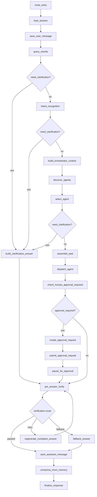

# 企业级 Agent 架构优化审视报告

日期：2026-06-11

审视目标：从企业级多 Agent 架构视角审视当前项目，重点看代码主干，而不是只看文档。重点范围包括 LangGraph 节点、节点流转、规则、fallback、LLM 提示词、Agent/Skill 选择、工具调用、审批、校验、状态持久化和测试治理。

## 1. 总体结论

当前项目已经不是简单 demo。主干已经具备这些企业级雏形：

- `LangGraph` 主流程已经显式拆成 query rewrite、intent recognition、context build、agent selection、task assemble、dispatch、approval、verification、memory commit、finalize 等节点。
- `IntentTaxonomy -> AgentCard -> Skill -> Tool` 的分层方向是正确的，意图、子意图、Agent 能力、Skill 元数据、工具执行基本分开。
- Query Rewrite 已经开始处理 `new_request`、`clarification_reply`、`contextual_follow_up` 等多轮场景。
- Agent 和 Skill 选择都采用了“规则召回/打分 + LLM 候选内重排”的混合模式，且 LLM 只能从候选中选择。
- ToolExecutor 已经有可见性检查、参数校验、权限校验、pre-tool verification、审批、人审恢复、日志和证据落库。
- P3 后的 runtime state 持久化边界明显变清楚，`AgentGraphState` 和 `CheckpointSnapshot` 已经开始分离。

但是，从市场上企业级 Agent 平台的标准看，当前仍处在“高级 MVP / 内部试点可用”阶段，还不算完全生产级。核心短板集中在：

- 图节点输入输出契约没有代码化治理。
- 路由规则和 fallback 策略仍散落在 Python 逻辑里。
- LLM JSON 失败时大量 silent fallback，容易掩盖真实问题。
- prompt 没有 manifest、版本、schema、评测集和灰度治理。
- subagent reasoning prompt 太薄，工具使用策略、证据约束和失败处理不足。
- Skill 未命中时仍会进入 generic execution，这与“不需要默认 skill”的产品语义存在冲突。
- 工具契约还不够中心化，超时、重试、幂等、风险、审批、数据级别没有统一注册治理。
- 缺少面向 LLM 的 golden eval、shadow compare、fallback rate、路由命中率、工具召回准确率等企业级评测与观测。

## 2. 当前主流程快照

当前入口为 `app/main.py`：

```text
/api/chat
  -> RequestAdapter.adapt
  -> AgentOrchestrator.run
  -> graph.ainvoke
  -> ResponseAdapter.adapt
```

当前 LangGraph 正常路径：



审批恢复路径：

```text
route_entry
  -> resume_approved_tool
  -> check_human_approval_required
  -> pre_answer_verify / next approval
```

这个结构方向正确。问题不在“有没有拆节点”，而在“节点契约、路由政策、fallback 政策、LLM 决策质量是否被工程化治理”。

## 3. 主要发现

### 3.1 LangGraph 节点流转

涉及代码：

- `app/runtime/graph.py`
- `app/runtime/graph_state.py`
- `app/runtime/state_projector.py`
- `app/runtime/handlers/*`

做得好的点：

- 节点边界基本清楚，业务理解、路由、执行、审批、校验、记忆提交没有完全混在一起。
- `ApprovalGraphHandler`、`VerificationHandler`、`MessageCommitHandler`、`MemoryCommitHandler` 已经把一部分节点内部细节从 `graph.py` 拆出去。
- `graph_path` 能看到节点执行路径，适合调试。
- P3 后 checkpoint 只保存投影快照，不再直接保存完整 `AgentGraphState`，这是正确方向。

主要问题：

- `graph.py` 仍是一个集中式编排大类，节点注册、路由条件、fallback 文案、retry 次数都写在一个文件里。
- 每个节点没有声明式输入输出契约。例如 `query_rewrite` 产出什么，`intent_recognition` 依赖什么，只有代码和 TypedDict 能间接看出来。
- 条件路由是函数返回字符串，缺少统一 route policy。后续节点一多，容易出现路由分支遗漏。
- `regenerate_compliant_answer` 和 `fallback_answer` 的文案写死在代码里，不适合企业级多业务场景。
- 节点异常没有统一 failure taxonomy，例如 `llm_parse_failed`、`taxonomy_mismatch`、`tool_contract_failed`、`verification_blocked` 应该有稳定错误码。
- `discover_agents` 把完整 card 写入 runtime state，虽然后续不会进 checkpoint，但主状态仍会膨胀。更好的方式是写 agent refs 或 candidate summaries。

优化方向：

- 新增 `app/runtime/node_contracts.py`，每个节点声明 `required_inputs`、`optional_inputs`、`outputs`、`routes`、`failure_codes`。
- 新增 `app/runtime/route_policy.py`，把 clarification、approval、verification 的路由规则配置化或至少集中化。
- `graph.py` 只负责装配，不负责业务策略。
- 每个节点返回 `decision_trace`，包括 source、reason、confidence、fallback_used、llm_status。

### 3.2 Query Rewrite 与多轮上下文

涉及代码：

- `app/query/query_rewrite_node.py`
- `app/prompts/query_rewrite/system.md`
- `app/prompts/query_rewrite/user.md`
- `app/query/entity_patterns.yaml`

做得好的点：

- 已经区分 `clarification_reply`、`contextual_follow_up`、`new_request`、`direct`。
- LLM prompt 明确要求 rewritten query 是独立业务请求。
- pending clarification 优先级是正确的：上一轮 assistant 明确缺参时，本轮优先视为补参。
- 强锚点实体默认开启新请求帧，能避免错误继承历史实体。
- 规则 fallback 能基于 EntityBag 合并当前实体和历史实体。

主要问题：

- 上下文引用信号、弱追问信号、强锚点实体、序数词等都硬编码在 `query_rewrite_node.py`。
- LLM JSON 解析失败时直接返回 `None` 走规则，没有把失败原因写入 state 或 decision trace。
- prompt 没有版本号、schema hash、评测集绑定关系。
- 当前多轮判断仍是“信号规则 + LLM 判断”，还不是完整的 TurnFrame 状态机。
- 对“多实体历史 + 当前弱补参”的歧义处理还偏粗，需要更明确的 frame id、pending task id 或 last_answer_focus。
- 规则 fallback 里的追问重写模板包含业务特化内容，例如 E102 签名，长期看不应该写在通用 query rewrite 节点中。

优化方向：

- 新增 `app/query/context_reference_policy.yaml`，外置强锚点、引用词、弱追问、序数词、短句阈值。
- 引入 `TurnFrame` 概念，至少包含 `frame_id`、`turn_type`、`business_goal`、`anchor_entities`、`pending_missing_entities`、`last_answer_summary`。
- LLM 失败时写入 `rewrite_decision.llm_status = parse_failed/provider_error/disabled`。
- Query Rewrite prompt 加 manifest 版本，例如 `query_rewrite@2026-06-11`.
- 建立 golden cases：澄清补参、普通追问、新强锚点、多历史实体、短句弱追问、实体覆盖历史等。

### 3.3 Intent Recognition

涉及代码：

- `app/query/intent_recognition_node.py`
- `app/query/intent_taxonomy_loader.py`
- `app/config/intent_taxonomy.yaml`
- `app/prompts/intent_recognition/system.md`

做得好的点：

- LLM 的合法 intent/sub_intent 来自 `intent_taxonomy.yaml`，方向正确。
- Intent Recognition 不再选择工具，这个边界正确。
- LLM 返回的 intent 会做 allowed 校验，非法值不会直接进入主流程。
- prompt 明确说明 capabilities、examples、description 只能做证据，不能当合法 intent。

主要问题：

- fallback 关键词仍写死在 `intent_recognition_node.py`，比如 POS 和 troubleshooting 的关键词。
- fallback 置信度是固定值，例如 0.86、0.9、0.42，缺少校准依据。
- LLM JSON parse 失败、非法 intent、非法 sub_intent 都是静默丢弃或置空，缺少可观测原因。
- unknown 的 clarification 文案写死在代码里。
- 缺少 required entity 对 intent/sub_intent 的早期校验策略。现在更多依赖 skill 阶段校验。

优化方向：

- 新增 `app/query/intent_fallback_policy.yaml`，按 taxonomy 定义 fallback keywords、negative keywords、entity hints、clarification templates。
- 引入 `IntentDecisionTrace`，记录 `source=llm/rule`、`taxonomy_version`、`fallback_reason`、`invalid_llm_output_reason`。
- LLM 输出使用 Pydantic strict model 解析，而不是裸 dict 读取。
- 在 taxonomy 中补充可选字段 `required_entities_hint`，用于 intent 阶段提前判断是否需要澄清，但最终仍由 skill required_entities 做强校验。

### 3.4 Agent Selection

涉及代码：

- `app/agents/selection.py`
- `app/agents/card_loader.py`
- `app/agents/llm_router.py`
- `app/prompts/agent_selection/system.md`

做得好的点：

- 先用 AgentCard 做 rule top-K，再让 LLM 在候选内重排，是正确的企业级路线。
- LLM router 只能从候选 agent 中选，避免模型幻觉选不存在的 agent。
- AgentCard 与 taxonomy、skill catalog 有启动时校验。

主要问题：

- `rule_confident_threshold`、`rule_margin_threshold`、`top_k` 是构造参数，未统一进 settings 或 routing policy。
- AgentCard rule score 的权重写在 `card_loader.py` 中，和 skill scoring policy 的 YAML 化不一致。
- `capabilities` 仍参与 keyword matching，虽然只是加分项，但缺少明确的权重治理。
- LLM router 失败时 fallback 到 rule top1，没有把失败细节暴露给上层。
- selected agent 后的鉴权失败被转成 clarification，这在业务上可接受，但企业级上更应该是 `permission_denied` 类型响应，而不是普通澄清。

优化方向：

- 新增 `app/agents/routing_policy.yaml`，外置 AgentCard 评分权重、阈值、margin、top_k。
- `AgentSelectionResult` 增加 `decision_trace`。
- 鉴权失败走独立 route 或标准 error response，而不是复用 clarification。
- 对 LLM router 记录 `llm_status`、`candidate_ids`、`selected_by_rule`、`selected_by_llm`。

### 3.5 Skill Selection

涉及代码：

- `app/skills/selector.py`
- `app/skills/scorer.py`
- `app/skills/reranker.py`
- `app/skills/selection_policy.py`
- `app/skills/scoring_policy.yaml`
- `app/runtime/context/skill_context_resolver.py`

做得好的点：

- Skill 选择不读取完整 SKILL.md，只用 metadata 选择，避免 prompt 过大。
- 规则打分权重已经抽到 `scoring_policy.yaml`，比 Agent 选择更成熟。
- LLM rerank 限定在 Top-K skill 中。
- 低分时可以返回 `selected_skill_id=None`。

主要问题：

- `SkillLLMReranker.should_rerank` 中的 semantic_signal 仍写死在 Python 里。
- `SkillSelector.min_confident_score`、`min_llm_confidence` 是类变量，不是统一配置。
- `SkillContextResolver.generic_skill_content` 会在没有 skill 匹配时继续泛化执行。虽然这不是 `is_default` skill，但行为效果仍接近“默认 skill 兜底”。这和“匹配不到 skill 就不需要 skill，不用 skill 兜底”的架构目标不完全一致。
- `SkillContextResolver.extract_request_id` 仍只识别 `REQ_\d+`，和新的 `entity_patterns.yaml` 中 request_id 规则不完全一致。
- Skill required entity 校验在选中 skill 后才执行。如果没有选中 skill，当前直接跳过 required entity 校验并继续执行。

优化方向：

- 明确 no-skill 策略：`no_skill_policy = clarify | no_skill_answer | generic_agent_execution`。生产建议默认 `clarify` 或 `no_skill_answer`，不要静默 generic execution。
- 删除或受配置控制 `generic_skill_content`。
- 统一使用 EntityExtractor 做 request_id/error_code/interface_name 补充识别，避免 `SkillContextResolver` 内部再写小正则。
- 把 rerank 触发词、阈值、top_k 放入 `app/skills/scoring_policy.yaml` 或单独 `selection_policy.yaml`。

### 3.6 SubAgent Reasoning Prompt

涉及代码：

- `app/subagents/base.py`
- `app/subagents/tool_calling_runner.py`
- `app/prompts/subagent_reasoning/system.md`
- `app/prompts/subagent_reasoning/user.md`

做得好的点：

- 子 agent 使用统一 `BaseSubAgent` 模板。
- selected skill body 会注入 prompt。
- 可见工具来自 AgentCard 和 ToolRegistry，不是直接把所有工具暴露给 LLM。
- ToolCallingRunner 有最大迭代、连续失败、同工具失败、重复调用保护。

主要问题：

- `subagent_reasoning/system.md` 太短，没有企业级工具使用规范。
- 缺少“先查证据，再回答”的强约束。
- 缺少“禁止凭空补工具结果”的约束。
- 缺少工具失败时的恢复策略，例如缺参、权限失败、接口失败、无数据、审批中分别怎么说。
- 缺少最终答案结构规范，例如诊断结论、证据、下一步动作、责任归因、不确定性。
- `BaseSubAgent._diagnosis_from_runner` 等方法里仍有 troubleshooting 的 E102 硬编码诊断文本，这类业务语义不应该放在通用基类。

优化方向：

- 强化 `subagent_reasoning/system.md`：
  - 必须先调用与 skill 匹配的读工具获取证据。
  - 工具结果不足时不得编造结论。
  - 写工具必须等待系统审批机制。
  - final answer 必须引用工具观察摘要，不得原样输出完整 JSON。
  - 如果工具返回失败，要给出失败原因和可恢复动作。
- 把 `_diagnosis_from_runner`、`_recommendation_from_runner`、`_responsibility_from_runner` 从 `BaseSubAgent` 移出，放到具体 agent 或 skill output policy。

### 3.7 Tool Executor 与工具契约

涉及代码：

- `app/tools/registry.py`
- `app/tools/base.py`
- `app/tools/executor.py`
- `app/tools/execution_pipeline.py`
- `app/tools/guards/*`
- `app/tools/agent_tools.py`

做得好的点：

- 工具注册已经有 scope、source、operation、risk_level、required_scopes、resource_type、idempotency_required 等字段。
- ToolExecutionPipeline 明确了检查顺序：存在性、可见性、参数、权限、verification、approval、执行。
- normal tool 和 approved tool 的执行路径都有校验。
- mock/real tool mode 已经收口为 `mock|real`。

主要问题：

- 工具契约还是分散在 `agent_tools.py` 的注册代码中，缺少独立的工具契约清单。
- timeout、retry、circuit breaker、result schema、side_effect_type、idempotency_key_policy 没有成为一等字段。
- POS 和 troubleshooting 的 mock/real mode 虽然已区分，但生产启动仍需要更强 gate，例如禁止 `TOOL_MODE=mock` 同时 `APP_ENV=prod`。
- `ToolExecutor._execute_definition` 捕获所有异常后把异常字符串返回，企业级应映射成稳定错误码。
- 工具结果没有统一 schema validation，LLM 拿到的 observation 可能形态不稳定。
- MCP 工具 risk 默认 medium，缺少按具体 MCP tool 的风险配置。

优化方向：

- 新增 `app/tools/tool_contracts.yaml` 或 `app/tools/contracts/*.yaml`。
- `ToolDefinition` 增加：
  - `timeout_ms`
  - `retry_policy`
  - `circuit_breaker_key`
  - `result_schema`
  - `side_effect_type`
  - `idempotency_key_fields`
  - `approval_policy_id`
  - `data_classification`
- `ToolExecutionPipeline` 增加 timeout、retry、schema validation、stable error mapping。
- 启动时校验：生产模式禁止 mock 工具、禁止 mock approval URL、禁止 body identity fallback。

### 3.8 Approval 与中断恢复

涉及代码：

- `app/runtime/handlers/approval_handler.py`
- `app/approval/*`
- `app/runtime/state_contracts.py`
- `app/runtime/state_projector.py`

做得好的点：

- 已经区分 `CheckpointSnapshot` 和 `AgentResumeState`。
- 人审恢复保存 pending messages、pending tools、pending tool call，能继续工具循环。
- 已经有审批链深度和写工具次数限制。
- approved tool 会校验 approval 状态、agent、tool、arguments。

主要问题：

- 外部审批系统仍是 mock URL 默认值。
- callback 缺少企业级签名校验、幂等 request id、审批人权限校验、过期策略。
- approval resume messages 仍可能较大，长期需要压缩或引用化。
- 审批状态机应独立建模，例如 pending、submitted、approved、rejected、expired、completed、failed。

优化方向：

- 引入 `ApprovalPolicy` 和 `ApprovalStateMachine`。
- callback 必须做签名、来源校验、幂等处理。
- 审批 payload 引用工具执行契约，避免各处拼 payload。

### 3.9 Pre-answer Verification 与 Fallback

涉及代码：

- `app/runtime/handlers/verification_handler.py`
- `app/verification/service.py`
- `app/verification/verifiers/*`
- `app/prompts/verification/final_compliance_system.md`

做得好的点：

- pre-answer verification 是集中节点，所有回答都经过这个节点。
- verification service 支持多 verifier 聚合，异常 fail closed。
- action 支持 allow、patch、block、manual、retry。

主要问题：

- `final_compliance_system.md` 只有一句话，无法支撑企业级合规判断。
- block/manual 文案写死在 `VerificationHandler`。
- retry 只允许一次且写死在 route 里。
- fallback answer 是通用安全话术，缺少业务场景和失败原因。
- verification 结果没有明确映射到对用户可见的错误类型。

优化方向：

- 补齐 final compliance prompt，至少包含敏感信息、权限、原始工具 JSON、内部错误栈、不可外发字段、医疗/保险建议边界。
- 新增 `app/runtime/fallback_policy.yaml`，按 `verification_code`、`intent`、`agent` 定义 fallback 文案。
- verification route 使用 policy 控制 retry 次数和 fallback 类型。

### 3.10 LLM Provider 与 Fallback

涉及代码：

- `app/llm/factory.py`
- `app/llm/internal_provider.py`
- `app/llm/opensdk_provider.py`
- `app/config/settings.py`

做得好的点：

- OpenSDK provider 和 internal provider 已分开。
- scene-specific model override 已支持。
- OpenSDK provider 可以接 DeepSeek 这类 OpenAI-compatible endpoint。

主要问题：

- `InternalLLMProvider` 没有 base_url 时会走 `_local_fallback_response`，这在本地测试方便，但在企业生产语义上容易误用。
- `_local_fallback_response` 中包含大量业务 mock 工具调用策略，长期不应保留在 provider 内。
- Query Rewrite、Intent、Agent Selection、Skill Selection 在 LLM 不可用时都可走规则 fallback，但缺少全链路 `llm_disabled` 标识。
- `ENABLE_REAL_LLM` 和 `ENABLE_OPENSDK_LLM` 的语义需要进一步清晰化：生产到底是否允许 provider fallback。

优化方向：

- 新增 `LLM_MODE=disabled|mock|real`，生产只允许 real。
- 删除或隔离 `InternalLLMProvider._local_fallback_response`，改为 tests fake 或 dev-only fake provider。
- 所有 LLM 节点统一输出 `llm_status`。
- provider error 要进入 metrics，不应只变成业务 fallback。

### 3.11 Prompt 工程治理

涉及代码：

- `app/prompts/*`
- `app/prompts/loader.py`
- `tests/test_prompt_templates.py`

做得好的点：

- query rewrite、intent recognition、agent selection、skill selection 已经做了候选约束。
- prompt 明确禁止 intent 阶段选择工具，agent selection 阶段不看工具细节。

主要问题：

- 缺少 prompt manifest。
- 缺少 prompt version。
- 缺少 prompt 对应的 output schema。
- 缺少 prompt eval cases。
- prompt 改动不会自动跑 LLM golden eval。
- skill body 作为 prompt 注入，缺少长度预算和压缩策略。

优化方向：

- 新增 `app/prompts/manifest.yaml`：

```yaml
query_rewrite:
  version: "2026-06-11.1"
  system: query_rewrite/system.md
  user: query_rewrite/user.md
  output_schema: QueryRewriteResult
  eval_suite: query_rewrite_multiturn_v1
intent_recognition:
  version: "2026-06-11.1"
  output_schema: IntentResult
  eval_suite: intent_taxonomy_v1
```

- CI 中增加 prompt render 校验、schema 校验、golden fake LLM 校验。
- 对真实 LLM 增加离线评测脚本，不阻塞单测，但作为上环境前准入。

### 3.12 测试与评测

当前测试数量较多，覆盖了：

- intent recognition
- query rewrite
- entity extractor
- skill selector
- tool executor
- approval flow
- checkpoint projection
- verification
- LangGraph flow

主要缺口：

- 缺少真实 LLM 或模型录制响应的 golden eval。
- 缺少“路由准确率”指标。
- 缺少“工具召回准确率”指标。
- 缺少“fallback rate”指标。
- 缺少“多轮澄清成功率”指标。
- 缺少 prompt 改动的回归评估。

优化方向：

- 新增 `evals/` 或 `app/evaluation/`：
  - `query_rewrite_cases.yaml`
  - `intent_cases.yaml`
  - `agent_selection_cases.yaml`
  - `skill_selection_cases.yaml`
  - `tool_calling_cases.yaml`
  - `final_answer_cases.yaml`
- 每个 case 记录：
  - input conversation
  - expected rewrite_type
  - expected rewritten_query pattern
  - expected intent/sub_intent
  - expected agent/skill
  - expected tool calls
  - expected clarification
- 上环境前必须看 eval report，而不是只看 pytest。

## 4. 建议的目标架构

建议长期收敛成下面的分层：

```text
IntentTaxonomy
  定义系统认识哪些业务意图和子意图

AgentCard
  定义哪个 agent 能处理哪些 intent/sub_intent
  定义 agent 可见工具、权限域、知识命名空间、记忆策略

Skill
  定义某个 agent 内部如何处理具体 sub_intent
  定义必需实体、工具选择规则、业务步骤、输出要求

ToolContract
  定义工具参数、结果、权限、审批、超时、重试、幂等和风险

PromptManifest
  定义 prompt 版本、schema、适用 scene、评测集和上线状态

RoutePolicy
  定义 LangGraph 分支条件、fallback 策略、retry 策略

NodeContract
  定义每个节点输入、输出、错误码和决策 trace

EvaluationHarness
  定义 rewrite、intent、agent、skill、tool-call、final answer 的回归评测
```

这套结构的重点是：业务规则不应长期散落在节点代码里，LLM prompt 不应没有版本和评测，fallback 不应静默发生。

## 5. 分阶段优化任务

### P0：生产风险收口

目标：避免上线时因为 silent fallback、mock、generic execution 造成误判。

任务：

1. 增加生产模式配置。
   - 新增 `APP_ENV=local|test|staging|prod`。
   - `APP_ENV=prod` 时禁止 `POS_TOOL_MODE=mock`。
   - `APP_ENV=prod` 时禁止 `TROUBLESHOOTING_TOOL_MODE=mock`。
   - `APP_ENV=prod` 时禁止 internal LLM local fallback。
   - `APP_ENV=prod` 时禁止 mock approval URL。

2. 消除 no-skill generic execution 的歧义。
   - 修改 `SkillContextResolver`。
   - 当 `selected_skill_id is None` 时，不默认注入 `generic_skill_content`。
   - 新增明确策略：`NO_SKILL_POLICY=clarify|answer_no_skill|generic_dev_only`。
   - 生产默认 `clarify` 或 `answer_no_skill`。

3. 所有 LLM 节点增加决策状态。
   - Query Rewrite、Intent、Agent Selection、Skill Rerank 都要返回或记录 `llm_status`。
   - 不允许 LLM 失败后无痕变成 rule fallback。

4. 强化 subagent reasoning prompt。
   - 增加工具使用、证据、失败处理、答案格式、禁止编造工具结果等规则。

5. 删除 BaseSubAgent 中通用基类的 E102 troubleshooting 硬编码。
   - 下沉到 skill 或具体 troubleshooting agent。

验收标准：

- `APP_ENV=prod` 且 mock tool mode 时启动失败。
- no skill 命中时不会进入 generic tool loop，除非显式 dev 配置。
- 每次 LLM fallback 都可在日志或 response metadata 中追踪原因。
- subagent prompt 有明确工具策略。

### P1：规则和路由治理

目标：把散落在 Python 里的路由规则、fallback 规则、阈值治理起来。

任务：

1. 新增 `NodeContract`。
   - 每个 LangGraph node 声明输入、输出和错误码。
   - 测试校验节点返回字段不越界。

2. 新增 `RoutePolicy`。
   - clarification、approval、verification route 统一管理。
   - retry 次数从配置读取。

3. 外置 Query Rewrite 上下文引用策略。
   - 强锚点、引用词、弱追问、序数词、短句阈值移到 YAML。

4. 外置 Intent fallback policy。
   - POS/troubleshooting 关键词、negative keywords、clarification 文案移到 YAML。

5. Agent selection scoring policy YAML 化。
   - 与 skill scoring policy 对齐。

验收标准：

- 新增业务关键词不需要改 Python 代码。
- 节点 route 和 fallback 规则可被单测直接加载验证。
- 规则 fallback 输出带 policy version。

### P2：Prompt 生命周期和评测体系

目标：让 prompt 改动可评估、可回滚、可灰度。

任务：

1. 新增 `app/prompts/manifest.yaml`。
2. 所有 LLM 输出使用严格 schema 解析。
3. 新增 `evals/`：
   - query rewrite 多轮 cases
   - intent taxonomy cases
   - agent selection cases
   - skill selection cases
   - tool calling cases
4. 增加 eval runner。
5. 记录 prompt version 到 decision trace。

验收标准：

- prompt 改动能看到 eval diff。
- LLM 输出非法时有明确错误码。
- 真实 LLM 上环境前能跑一份评测报告。

### P3：工具契约和执行治理

目标：工具从“注册函数”升级为“受治理的企业能力”。

任务：

1. 新增 `tool_contracts.yaml`。
2. `ToolDefinition` 增加 timeout、retry、result_schema、approval_policy、idempotency_key_fields。
3. ToolExecutionPipeline 增加 timeout、retry、result schema validation。
4. 异常映射成稳定 error code。
5. MCP 工具按 tool 级别配置 risk 和审批策略。

验收标准：

- 每个工具都有契约。
- 工具结果 shape 不符合 schema 时不会直接给 LLM。
- 写工具必须有审批或明确豁免策略。

### P4：观测、审计和上线准入

目标：让系统不仅能跑，还能解释、监控、回放和治理。

任务：

1. 引入标准 span 模型。
   - request span
   - graph node span
   - llm span
   - tool span
   - verification span
2. 指标：
   - rewrite fallback rate
   - intent unknown rate
   - agent selection clarification rate
   - skill no-match rate
   - tool failure rate
   - verification block rate
   - approval pending/resume success rate
3. 决策回放。
   - 能通过 request_id 查看每个节点的输入摘要、输出摘要和 decision trace。
4. 上线准入清单。
   - 禁 mock
   - eval 通过
   - route coverage 通过
   - tool contracts 通过
   - approval callback 安全通过

验收标准：

- 一个失败请求能在 5 分钟内通过 trace 定位是 rewrite、intent、agent、skill、tool、verification 哪一层失败。
- 有固定发布前检查脚本。

## 6. 优先改动清单

建议近期优先做这些代码改动：

| 优先级 | 改动 | 主要文件 | 原因 |
| --- | --- | --- | --- |
| P0 | 增加 `APP_ENV` 生产启动 gate | `app/config/settings.py`, `app/main.py` | 防止 mock/本地 fallback 上环境 |
| P0 | no-skill 策略显式化 | `app/runtime/context/skill_context_resolver.py` | 避免没有 skill 还泛化执行 |
| P0 | LLM fallback 记录状态 | `app/query/*`, `app/agents/*`, `app/skills/*` | 避免 silent fallback |
| P0 | 强化 subagent prompt | `app/prompts/subagent_reasoning/system.md` | 约束工具调用和回答质量 |
| P1 | Query rewrite rule policy YAML | `app/query/query_rewrite_node.py` | 规则配置化 |
| P1 | Intent fallback policy YAML | `app/query/intent_recognition_node.py` | 避免硬编码业务关键词 |
| P1 | Agent routing policy YAML | `app/agents/card_loader.py`, `app/agents/selection.py` | 评分权重治理 |
| P1 | NodeContract | `app/runtime/*` | 节点契约治理 |
| P2 | Prompt manifest + eval runner | `app/prompts/*`, `evals/*` | prompt 可评测可回滚 |
| P3 | ToolContract registry | `app/tools/*` | 工具生产治理 |

## 7. 具体问题点清单

以下问题建议在后续任务中逐项处理：

1. `app/runtime/context/skill_context_resolver.py` 中 `generic_skill_content` 仍会让无 skill 命中时继续执行，这和“不需要默认 skill”的目标冲突。
2. `app/llm/internal_provider.py` 中 `_local_fallback_response` 把 mock LLM 行为放在真实 provider 内，生产风险较高。
3. `app/query/query_rewrite_node.py` 中引用词、强锚点、弱追问、序数词硬编码。
4. `app/query/intent_recognition_node.py` 中 POS/troubleshooting fallback 关键词硬编码。
5. `app/agents/card_loader.py` 中 AgentCard 打分权重硬编码。
6. `app/skills/reranker.py` 中 LLM rerank 触发信号硬编码。
7. `app/runtime/graph.py` 中 verification retry 次数、fallback 文案、regenerate 文案硬编码。
8. `app/prompts/subagent_reasoning/system.md` 过短，不足以约束企业级工具调用。
9. `app/prompts/verification/final_compliance_system.md` 过短，不足以支撑最终合规判断。
10. `app/subagents/base.py` 中 `_diagnosis_from_runner` 等方法存在具体 troubleshooting 业务硬编码。
11. `ToolDefinition` 虽有基础治理字段，但缺少 timeout、retry、result schema、circuit breaker、side effect policy。
12. 当前 pytest 覆盖较丰富，但缺少真实 LLM 场景的 golden eval 和指标化评估。

## 8. 企业级验收标准

建议把以下标准作为长期验收线：

- 每个 LangGraph node 有 NodeContract。
- 每个 route 有 RoutePolicy。
- 每次 LLM 调用有 prompt version、model、latency、finish_reason、parse_status。
- 每次 fallback 都有明确原因，不允许 silent fallback。
- 每个 intent/sub_intent 都来自 taxonomy。
- 每个 AgentCard route 都被 taxonomy 覆盖校验。
- 每个 skill 都有 metadata、required_entities、tool policy、eval cases。
- 每个工具都有 ToolContract。
- 每个写工具都有审批或明确豁免。
- 每个最终回答都经过 pre-answer verification。
- 每次 prompt 改动都有 eval report。
- 生产环境禁止 mock tool、mock approval、internal provider local fallback。

## 9. 最终判断

当前项目的主干方向是对的：已经从“单 Agent 调工具”升级到了“Taxonomy + AgentCard + Skill + ToolExecutor + Approval + Verification + Checkpoint”的多 Agent 平台雏形。

下一步不建议继续堆业务能力，而应先做治理型优化：

1. 收口生产风险：禁止 silent fallback 和 mock 误用。
2. 明确 no-skill 行为：不要让无 skill 命中时默认泛化执行。
3. 把规则、路由、fallback、阈值从 Python 代码中外置。
4. 给 prompt 加版本、schema 和 eval。
5. 给工具加完整契约。

做完这些后，项目才更接近企业级 Agent 平台，而不只是一个可以跑通主链路的 MVP。
