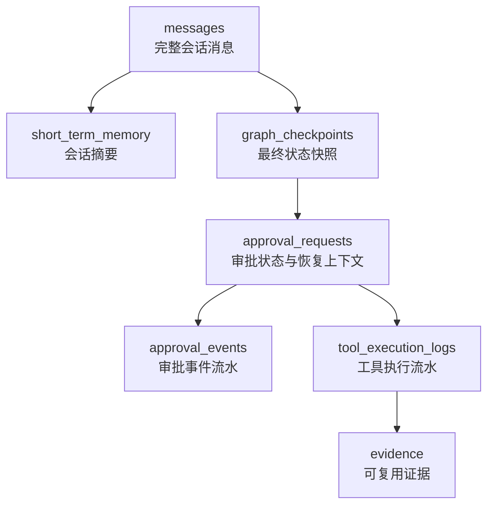

# Agent Runtime Persistence Tables

本文档说明当前项目运行期持久化表的用途、使用时机、字段含义，以及面向 MySQL 的建表语句。

依据代码：

- `app/storage/sqlite.py`
- `app/session/message_store.py`
- `app/memory/short_term_memory_manager.py`
- `app/runtime/checkpoint.py`
- `app/tools/tool_execution_log_store.py`
- `app/approval/store.py`
- `app/evidence/store.py`

## 总览

当前项目启动后会创建或使用以下持久化表：

| 表名 | 作用 |
| --- | --- |
| `messages` | 保存用户和助手的完整对话消息 |
| `short_term_memory` | 保存每个会话的滚动摘要 |
| `graph_checkpoints` | 保存每次 graph 执行后的精简最终状态快照 |
| `tool_execution_logs` | 保存工具调用流水和执行结果 |
| `approval_requests` | 保存人工审批单当前状态和恢复执行所需上下文 |
| `approval_events` | 保存审批单生命周期事件流水 |
| `evidence` | 保存工具、知识库、审批等可信证据，供回答、校验、审计复用 |

说明：

- 当前代码使用 SQLite，时间字段以 ISO-8601 字符串写入，例如 `2026-06-18T03:10:00.123456+00:00`。
- 下方 MySQL DDL 为了贴近当前代码，时间字段使用 `varchar(40)` 保存 ISO 时间字符串。
- JSON 字段在 MySQL 中使用 `json` 类型；应用层仍可按当前方式写入 JSON 字符串。
- 当前 SQLite 代码没有强制外键，MySQL DDL 也不强制外键，避免改变运行语义。上线前如需要强一致性，可再单独设计外键与级联策略。

## 1. messages

### 作用

`messages` 是会话消息表，用于保存每轮用户输入和助手输出。

它是完整对话历史的主记录，短期记忆 `short_term_memory` 只是它的压缩摘要，不替代这张表。

### 什么时候用

- `/api/chat` 收到用户请求后，`save_user_message` 节点会写入用户消息。
- graph 生成最终回复后，`save_assistant_message` 节点会写入助手消息。
- `SessionManager.load_session()` 会读取最近消息，提供给 query rewrite、intent recognition 和上下文构建。

### 字段注释

| 字段 | 类型建议 | 是否必填 | 说明 |
| --- | --- | --- | --- |
| `id` | bigint | 是 | 自增主键 |
| `session_key` | varchar(255) | 是 | 会话唯一键，通常由 tenant、channel、user、session 组合得到 |
| `role` | varchar(32) | 是 | 消息角色，例如 `user`、`assistant`、`system` |
| `content` | longtext | 是 | 消息正文 |
| `metadata_json` | json | 是 | 消息元数据，例如 request_id、trace_id、intent、entities、selected_agent 等 |
| `created_at` | varchar(40) | 是 | 创建时间，当前代码写入 UTC ISO 字符串 |

### MySQL DDL

```sql
CREATE TABLE messages (
    id BIGINT UNSIGNED NOT NULL AUTO_INCREMENT COMMENT '自增主键',
    session_key VARCHAR(255) NOT NULL COMMENT '会话唯一键',
    role VARCHAR(32) NOT NULL COMMENT '消息角色:user/assistant/system',
    content LONGTEXT NOT NULL COMMENT '消息正文',
    metadata_json JSON NOT NULL COMMENT '消息元数据JSON',
    created_at VARCHAR(40) NOT NULL COMMENT '创建时间, ISO-8601 UTC字符串',
    PRIMARY KEY (id),
    KEY idx_messages_session_created (session_key, created_at)
) ENGINE=InnoDB DEFAULT CHARSET=utf8mb4 COLLATE=utf8mb4_unicode_ci COMMENT='会话消息表';
```

## 2. short_term_memory

### 作用

`short_term_memory` 是会话短期记忆表，用于保存每个 `session_key` 的滚动摘要。

它解决的问题是：完整消息越来越长，不能每次都把全部历史塞给 LLM，所以系统在每轮结束后把当前轮和历史摘要压缩成新的摘要。

### 什么时候用

- `load_session` 阶段读取 `short_term_memory.summary`，作为历史上下文补充。
- `compress_short_memory` 阶段在每轮回复后更新摘要。
- query rewrite、intent recognition、context builder 会使用 short summary 帮助判断多轮上下文。

### 字段注释

| 字段 | 类型建议 | 是否必填 | 说明 |
| --- | --- | --- | --- |
| `session_key` | varchar(255) | 是 | 会话唯一键，同时是主键 |
| `summary` | text | 是 | 当前会话滚动摘要 |
| `updated_at` | varchar(40) | 是 | 最后更新时间，当前代码写入 UTC ISO 字符串 |

### MySQL DDL

```sql
CREATE TABLE short_term_memory (
    session_key VARCHAR(255) NOT NULL COMMENT '会话唯一键',
    summary TEXT NOT NULL COMMENT '会话滚动摘要',
    updated_at VARCHAR(40) NOT NULL COMMENT '最后更新时间, ISO-8601 UTC字符串',
    PRIMARY KEY (session_key)
) ENGINE=InnoDB DEFAULT CHARSET=utf8mb4 COLLATE=utf8mb4_unicode_ci COMMENT='短期记忆摘要表';
```

## 3. graph_checkpoints

### 作用

`graph_checkpoints` 保存 graph 执行后的精简最终状态快照。

注意：这张表保存的是项目自己的 `CheckpointSnapshot`，不是 LangGraph 每一步原生 checkpoint。当前默认 LangGraph checkpointer 仍是 `MemorySaver`，这张表主要用于请求级最终状态留存和后续排查。

### 什么时候用

- `AgentOrchestrator.run()` 执行完成后，把最终 state 经 projector 转成 `CheckpointSnapshot` 后保存。
- 需要按 `thread_id` 查询某次请求最终状态时读取。
- 审批中断恢复主要依赖 `approval_requests.resume_state_json`，不是直接依赖这张表。

### 字段注释

| 字段 | 类型建议 | 是否必填 | 说明 |
| --- | --- | --- | --- |
| `thread_id` | varchar(255) | 是 | graph 线程 ID，当前由 session_key 与 request_id 生成 |
| `schema_version` | int | 是 | checkpoint payload 结构版本 |
| `snapshot_json` | json | 是 | 精简后的最终状态快照，包含 request、intent、entities、selected_agent、answer、graph_path 等 |
| `created_at` | varchar(40) | 是 | 首次创建时间 |
| `updated_at` | varchar(40) | 是 | 最近更新时间 |

### MySQL DDL

```sql
CREATE TABLE graph_checkpoints (
    thread_id VARCHAR(255) NOT NULL COMMENT 'graph线程ID',
    schema_version INT NOT NULL COMMENT '快照结构版本',
    snapshot_json JSON NOT NULL COMMENT 'CheckpointSnapshot JSON',
    created_at VARCHAR(40) NOT NULL COMMENT '创建时间, ISO-8601 UTC字符串',
    updated_at VARCHAR(40) NOT NULL COMMENT '更新时间, ISO-8601 UTC字符串',
    PRIMARY KEY (thread_id)
) ENGINE=InnoDB DEFAULT CHARSET=utf8mb4 COLLATE=utf8mb4_unicode_ci COMMENT='graph最终状态快照表';
```

## 4. tool_execution_logs

### 作用

`tool_execution_logs` 是工具执行流水表，用于记录每一次 ToolExecutor 调用事实。

它是工具执行审计的权威流水，记录工具名、参数、结果、耗时、错误码、来源、审批 ID 等。

### 什么时候用

- 子 agent 通过 LLM tool calling 或内部逻辑调用工具时写入。
- 工具成功、失败、超时、schema 校验失败、权限失败等都会记录。
- 审批通过后恢复执行写工具时，会把 `approval_id` 关联到工具执行流水。
- 后续排查“LLM 调了哪个工具、参数是什么、结果是什么”时读取。

### 字段注释

| 字段 | 类型建议 | 是否必填 | 说明 |
| --- | --- | --- | --- |
| `id` | bigint | 是 | 自增主键 |
| `request_id` | varchar(128) | 否 | 请求 ID |
| `trace_id` | varchar(128) | 否 | 链路追踪 ID |
| `session_key` | varchar(255) | 否 | 会话唯一键 |
| `agent_name` | varchar(128) | 是 | 发起工具调用的 agent 名称 |
| `tool_name` | varchar(255) | 是 | 规范化后的工具名称 |
| `arguments_json` | json | 是 | 工具入参 JSON；当前写入前会 mask 常见敏感字段 |
| `success` | tinyint | 是 | 是否执行成功，1 成功，0 失败 |
| `result_json` | json | 否 | 工具返回结果 JSON |
| `error` | varchar(128) | 否 | 稳定错误码，例如 `tool_timeout`、`tool_execution_exception` |
| `started_at` | varchar(40) | 是 | 工具开始时间 |
| `finished_at` | varchar(40) | 是 | 工具结束时间 |
| `duration_ms` | int | 是 | 工具耗时，毫秒 |
| `source` | varchar(64) | 否 | 工具来源，例如 local、mcp |
| `server_name` | varchar(128) | 否 | MCP server 名称 |
| `approval_id` | varchar(128) | 否 | 如果该工具由审批恢复后执行，则记录对应审批 ID |

### MySQL DDL

```sql
CREATE TABLE tool_execution_logs (
    id BIGINT UNSIGNED NOT NULL AUTO_INCREMENT COMMENT '自增主键',
    request_id VARCHAR(128) NULL COMMENT '请求ID',
    trace_id VARCHAR(128) NULL COMMENT '链路追踪ID',
    session_key VARCHAR(255) NULL COMMENT '会话唯一键',
    agent_name VARCHAR(128) NOT NULL COMMENT '调用工具的agent名称',
    tool_name VARCHAR(255) NOT NULL COMMENT '规范化工具名称',
    arguments_json JSON NOT NULL COMMENT '工具入参JSON, 已按规则脱敏常见敏感字段',
    success TINYINT(1) NOT NULL COMMENT '是否成功:1成功,0失败',
    result_json JSON NULL COMMENT '工具结果JSON',
    error VARCHAR(128) NULL COMMENT '稳定错误码',
    started_at VARCHAR(40) NOT NULL COMMENT '开始时间, ISO-8601 UTC字符串',
    finished_at VARCHAR(40) NOT NULL COMMENT '结束时间, ISO-8601 UTC字符串',
    duration_ms INT NOT NULL COMMENT '执行耗时毫秒',
    source VARCHAR(64) NULL COMMENT '工具来源, 如local/mcp',
    server_name VARCHAR(128) NULL COMMENT 'MCP server名称',
    approval_id VARCHAR(128) NULL COMMENT '关联审批ID',
    PRIMARY KEY (id),
    KEY idx_tool_execution_logs_session (session_key, id),
    KEY idx_tool_execution_logs_agent (agent_name),
    KEY idx_tool_execution_logs_request (request_id),
    KEY idx_tool_execution_logs_approval (approval_id)
) ENGINE=InnoDB DEFAULT CHARSET=utf8mb4 COLLATE=utf8mb4_unicode_ci COMMENT='工具执行流水表';
```

## 5. approval_requests

### 作用

`approval_requests` 是人工审批单主表，用于保存写工具执行前的审批状态，以及审批通过后恢复执行所需的最小上下文。

它不是普通日志表，而是审批流程的状态表。当前审批状态、待执行工具、恢复 state、审批结果都在这里。

### 什么时候用

- ToolExecutor 判断写工具需要人工审批时，graph 进入 `create_approval_request` 节点创建审批单。
- 提交外部审批系统后更新为 `pending` 或 `submit_failed`。
- 外部审批回调 `/api/approval/callback` 到达后读取并更新审批单。
- 审批通过后，系统使用 `resume_state_json`、`pending_messages_json`、`pending_tools_json`、`pending_tool_call_json` 恢复被中断的工具调用流程。
- 审批拒绝、审批链超限、审批提交失败等都会更新该表。

### 字段注释

| 字段 | 类型建议 | 是否必填 | 说明 |
| --- | --- | --- | --- |
| `approval_id` | varchar(128) | 是 | 本地审批 ID，主键 |
| `external_approval_id` | varchar(128) | 否 | 外部审批系统返回的审批 ID |
| `session_key` | varchar(255) | 否 | 会话唯一键 |
| `request_id` | varchar(128) | 否 | 请求 ID |
| `trace_id` | varchar(128) | 否 | 链路追踪 ID |
| `thread_id` | varchar(255) | 否 | graph thread ID |
| `checkpoint_id` | varchar(128) | 否 | checkpoint ID，当前保留字段 |
| `parent_approval_id` | varchar(128) | 否 | 父审批 ID，用于审批链 |
| `root_approval_id` | varchar(128) | 否 | 根审批 ID，用于审批链 |
| `approval_depth` | int | 是 | 审批链深度 |
| `next_approval_id` | varchar(128) | 否 | 下一个审批 ID |
| `approval_scope` | varchar(64) | 是 | 审批范围，当前默认 `single_tool_call` |
| `idempotency_key` | varchar(255) | 否 | 写工具幂等键 |
| `tenant_id` | varchar(128) | 否 | 租户 ID |
| `subject` | varchar(255) | 否 | 授权主体 |
| `user_id` | varchar(128) | 否 | 用户 ID |
| `org_id` | varchar(128) | 否 | 组织 ID |
| `org_path_json` | json | 否 | 组织路径 JSON |
| `principal_snapshot_json` | json | 否 | 当前用户身份快照 |
| `auth_context_snapshot_json` | json | 否 | 鉴权上下文快照 |
| `resource_type` | varchar(128) | 否 | 被操作资源类型 |
| `resource_id` | varchar(255) | 否 | 被操作资源 ID |
| `tool_required_scopes_json` | json | 否 | 工具需要的权限范围 |
| `agent_name` | varchar(128) | 是 | 发起审批的 agent |
| `tool_name` | varchar(255) | 是 | 待审批工具名 |
| `operation_type` | varchar(64) | 是 | 操作类型，例如 write、notify |
| `risk_level` | varchar(64) | 是 | 风险等级，例如 high |
| `arguments_json` | json | 是 | 待执行工具参数 |
| `reason` | text | 是 | 需要审批的原因 |
| `status` | varchar(64) | 是 | 审批状态，例如 created、pending、approved、rejected、completed |
| `callback_url` | varchar(512) | 否 | 外部审批系统回调地址 |
| `resume_state_json` | json | 是 | 恢复 graph 所需的最小状态 |
| `pending_messages_json` | json | 是 | 中断时 LLM 对话消息 |
| `pending_tools_json` | json | 是 | 中断时可用工具 schema |
| `pending_tool_call_json` | json | 是 | 待执行工具调用 |
| `result_json` | json | 否 | 审批恢复后的执行结果摘要 |
| `final_answer` | longtext | 否 | 审批流程最终返回用户的答案 |
| `error` | varchar(255) | 否 | 审批流程错误码或错误原因 |
| `approver` | varchar(128) | 否 | 审批人 |
| `comment` | text | 否 | 审批备注 |
| `created_at` | varchar(40) | 是 | 创建时间 |
| `updated_at` | varchar(40) | 是 | 更新时间 |
| `decided_at` | varchar(40) | 否 | 审批决定时间 |

### MySQL DDL

```sql
CREATE TABLE approval_requests (
    approval_id VARCHAR(128) NOT NULL COMMENT '本地审批ID',
    external_approval_id VARCHAR(128) NULL COMMENT '外部审批系统ID',
    session_key VARCHAR(255) NULL COMMENT '会话唯一键',
    request_id VARCHAR(128) NULL COMMENT '请求ID',
    trace_id VARCHAR(128) NULL COMMENT '链路追踪ID',
    thread_id VARCHAR(255) NULL COMMENT 'graph线程ID',
    checkpoint_id VARCHAR(128) NULL COMMENT 'checkpoint ID, 当前保留字段',
    parent_approval_id VARCHAR(128) NULL COMMENT '父审批ID',
    root_approval_id VARCHAR(128) NULL COMMENT '根审批ID',
    approval_depth INT NOT NULL DEFAULT 0 COMMENT '审批链深度',
    next_approval_id VARCHAR(128) NULL COMMENT '下一个审批ID',
    approval_scope VARCHAR(64) NOT NULL DEFAULT 'single_tool_call' COMMENT '审批范围',
    idempotency_key VARCHAR(255) NULL COMMENT '写工具幂等键',
    tenant_id VARCHAR(128) NULL COMMENT '租户ID',
    subject VARCHAR(255) NULL COMMENT '授权主体',
    user_id VARCHAR(128) NULL COMMENT '用户ID',
    org_id VARCHAR(128) NULL COMMENT '组织ID',
    org_path_json JSON NULL COMMENT '组织路径JSON',
    principal_snapshot_json JSON NULL COMMENT '用户身份快照JSON',
    auth_context_snapshot_json JSON NULL COMMENT '鉴权上下文快照JSON',
    resource_type VARCHAR(128) NULL COMMENT '资源类型',
    resource_id VARCHAR(255) NULL COMMENT '资源ID',
    tool_required_scopes_json JSON NULL COMMENT '工具所需权限范围JSON',
    agent_name VARCHAR(128) NOT NULL COMMENT '发起审批的agent',
    tool_name VARCHAR(255) NOT NULL COMMENT '待审批工具名称',
    operation_type VARCHAR(64) NOT NULL COMMENT '操作类型',
    risk_level VARCHAR(64) NOT NULL COMMENT '风险等级',
    arguments_json JSON NOT NULL COMMENT '待执行工具参数JSON',
    reason TEXT NOT NULL COMMENT '审批原因',
    status VARCHAR(64) NOT NULL COMMENT '审批状态',
    callback_url VARCHAR(512) NULL COMMENT '审批回调地址',
    resume_state_json JSON NOT NULL COMMENT '恢复graph所需状态JSON',
    pending_messages_json JSON NOT NULL COMMENT '中断时LLM消息JSON',
    pending_tools_json JSON NOT NULL COMMENT '中断时工具schema JSON',
    pending_tool_call_json JSON NOT NULL COMMENT '待执行工具调用JSON',
    result_json JSON NULL COMMENT '审批恢复后的执行结果摘要JSON',
    final_answer LONGTEXT NULL COMMENT '最终返回用户的答案',
    error VARCHAR(255) NULL COMMENT '错误码或错误原因',
    approver VARCHAR(128) NULL COMMENT '审批人',
    comment TEXT NULL COMMENT '审批备注',
    created_at VARCHAR(40) NOT NULL COMMENT '创建时间, ISO-8601 UTC字符串',
    updated_at VARCHAR(40) NOT NULL COMMENT '更新时间, ISO-8601 UTC字符串',
    decided_at VARCHAR(40) NULL COMMENT '审批决定时间, ISO-8601 UTC字符串',
    PRIMARY KEY (approval_id),
    KEY idx_approval_requests_session (session_key, created_at),
    KEY idx_approval_requests_request (request_id),
    KEY idx_approval_requests_external (external_approval_id),
    KEY idx_approval_requests_root (root_approval_id),
    KEY idx_approval_requests_status (status)
) ENGINE=InnoDB DEFAULT CHARSET=utf8mb4 COLLATE=utf8mb4_unicode_ci COMMENT='人工审批请求主表';
```

## 6. approval_events

### 作用

`approval_events` 是审批事件流水表。

`approval_requests` 记录审批单当前状态，`approval_events` 记录审批单从创建到完成之间发生过的每个关键事件。

### 什么时候用

- 创建审批单后追加 `created`。
- 提交外部审批系统成功后追加 `submitted`。
- 提交失败追加 `submit_failed`。
- 审批回调通过追加 `approved`。
- 审批拒绝追加 `rejected`。
- 审批恢复执行完成追加 `completed`。
- 审批链产生下一审批时追加 `next_approval_created` 或 `completed_with_next_approval`。
- 当前已有 `list_events()` 读取方法，但还没有对外 API 暴露。

### 字段注释

| 字段 | 类型建议 | 是否必填 | 说明 |
| --- | --- | --- | --- |
| `event_id` | bigint | 是 | 自增事件 ID |
| `approval_id` | varchar(128) | 是 | 关联审批 ID |
| `event_type` | varchar(128) | 是 | 事件类型，例如 created、submitted、approved、completed |
| `payload_json` | json | 是 | 事件 payload，保存当时的请求、回调或处理结果 |
| `created_at` | varchar(40) | 是 | 事件创建时间 |

### MySQL DDL

```sql
CREATE TABLE approval_events (
    event_id BIGINT UNSIGNED NOT NULL AUTO_INCREMENT COMMENT '自增事件ID',
    approval_id VARCHAR(128) NOT NULL COMMENT '关联审批ID',
    event_type VARCHAR(128) NOT NULL COMMENT '审批事件类型',
    payload_json JSON NOT NULL COMMENT '事件payload JSON',
    created_at VARCHAR(40) NOT NULL COMMENT '事件创建时间, ISO-8601 UTC字符串',
    PRIMARY KEY (event_id),
    KEY idx_approval_events_approval (approval_id, event_id),
    KEY idx_approval_events_type (event_type)
) ENGINE=InnoDB DEFAULT CHARSET=utf8mb4 COLLATE=utf8mb4_unicode_ci COMMENT='审批事件流水表';
```

## 7. evidence

### 作用

`evidence` 是可信证据表，用于保存工具结果、知识库结果、用户输入、系统判断、审批结果等可以被后续回答、验证、审计引用的证据。

它与 `tool_execution_logs` 的区别：

- `tool_execution_logs` 是工具执行事实流水。
- `evidence` 是可复用的回答证据索引，面向后续回答生成、任务完成度验收和审计。
- 工具类 evidence 不保存完整工具返回；完整事实通过 `tool_log_id` 回查 `tool_execution_logs`。

### 什么时候用

- 工具执行后，ToolExecutor 可把工具日志引用和摘要保存为 evidence。
- 验证服务、最终回答、审计场景可以按 request 或 session 查询 evidence。
- 后续如果接入知识库，也可以把检索到的知识片段保存为 evidence。

### 字段注释

| 字段 | 类型建议 | 是否必填 | 说明 |
| --- | --- | --- | --- |
| `evidence_id` | varchar(128) | 是 | 证据 ID，主键 |
| `request_id` | varchar(128) | 否 | 请求 ID |
| `trace_id` | varchar(128) | 否 | 链路追踪 ID |
| `session_key` | varchar(255) | 是 | 会话唯一键 |
| `source_type` | varchar(64) | 是 | 证据来源类型：tool、knowledge、user、system、approval |
| `source_name` | varchar(255) | 是 | 具体来源名称，例如工具名、知识库名 |
| `tool_log_id` | bigint | 否 | 工具 evidence 对应的 tool_execution_logs.id；非工具证据为空 |
| `summary` | text | 否 | 证据摘要 |
| `citations_json` | json | 是 | 引用信息 JSON |
| `metadata_json` | json | 是 | 扩展元数据 JSON |
| `created_at` | varchar(40) | 是 | 创建时间 |

### MySQL DDL

```sql
CREATE TABLE evidence (
    evidence_id VARCHAR(128) NOT NULL COMMENT '证据ID',
    request_id VARCHAR(128) NULL COMMENT '请求ID',
    trace_id VARCHAR(128) NULL COMMENT '链路追踪ID',
    session_key VARCHAR(255) NOT NULL COMMENT '会话唯一键',
    source_type VARCHAR(64) NOT NULL COMMENT '证据来源类型:tool/knowledge/user/system/approval',
    source_name VARCHAR(255) NOT NULL COMMENT '具体来源名称',
    tool_log_id BIGINT UNSIGNED NULL COMMENT '关联工具执行流水ID',
    summary TEXT NULL COMMENT '证据摘要',
    citations_json JSON NOT NULL COMMENT '引用信息JSON',
    metadata_json JSON NOT NULL COMMENT '扩展元数据JSON',
    created_at VARCHAR(40) NOT NULL COMMENT '创建时间, ISO-8601 UTC字符串',
    PRIMARY KEY (evidence_id),
    KEY idx_evidence_request (request_id),
    KEY idx_evidence_session (session_key),
    KEY idx_evidence_source (source_type, source_name)
) ENGINE=InnoDB DEFAULT CHARSET=utf8mb4 COLLATE=utf8mb4_unicode_ci COMMENT='可信证据表';
```

## 表之间的关系



关系说明：

- `messages` 是对话原始事实。
- `short_term_memory` 是按 `session_key` 聚合后的摘要。
- `graph_checkpoints` 是每次 graph 请求完成后的精简状态。
- `approval_requests` 保存人工审批的当前状态，以及审批通过后恢复执行所需上下文。
- `approval_events` 是审批生命周期流水。
- `tool_execution_logs` 是工具执行事实流水。
- `evidence` 是从工具、知识库、审批等来源沉淀出来的可复用证据。

## 上线建议

1. 如果切换 MySQL，需要新增数据库适配层，不建议让现有 SQLite SQL 直接拼接兼容 MySQL。
2. 如果希望时间字段参与时间范围查询，建议在 MySQL 适配层把 ISO 字符串转换为 `datetime(6)` 或 `timestamp(6)`。
3. `approval_requests`、`tool_execution_logs`、`evidence` 可能包含业务参数和工具结果，上线前需要明确库级访问权限和审计策略。
4. 当前文档没有引入外键；如果未来需要强一致性，可以再补充外键和归档策略。
5. `approval_events`、`tool_execution_logs` 属于流水表，生产环境建议按时间或租户规划归档。
