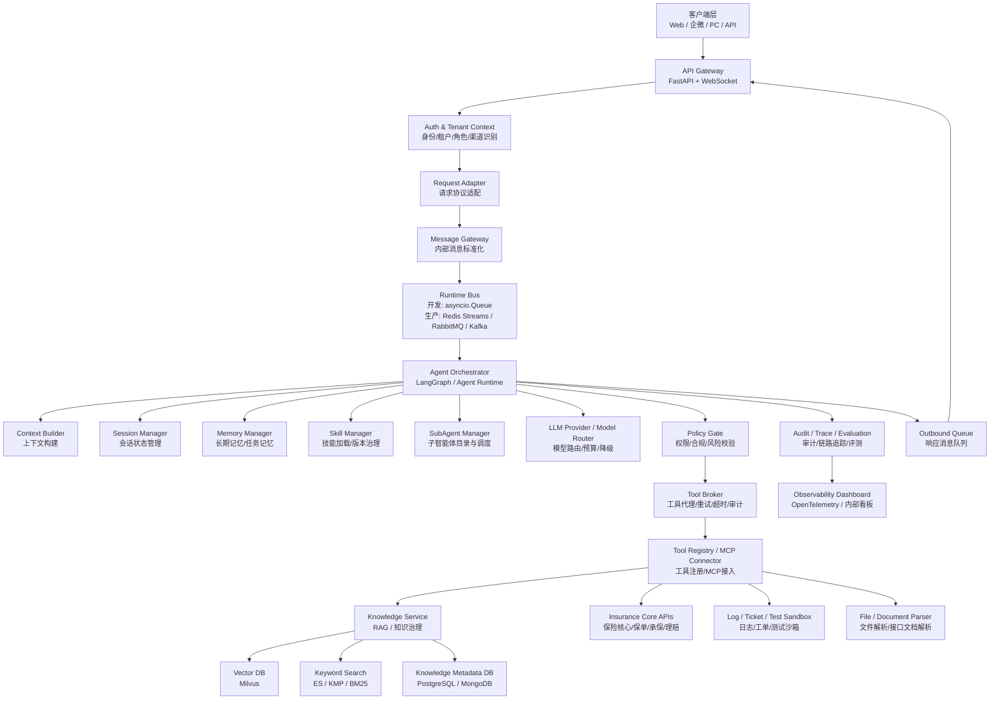
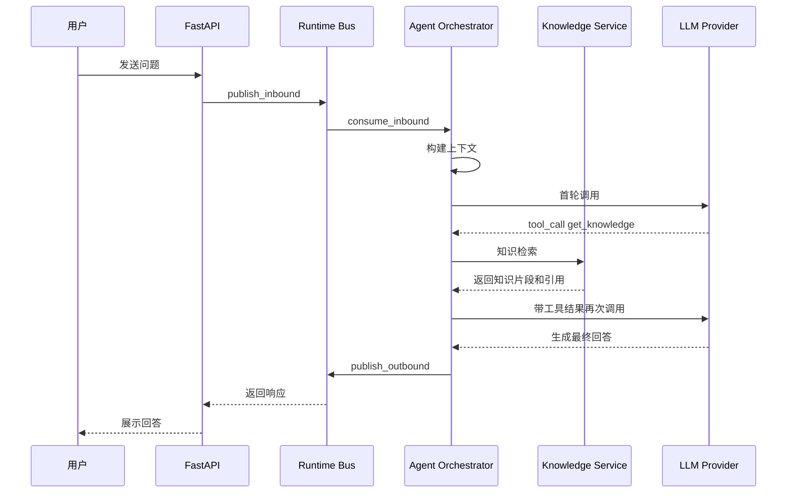
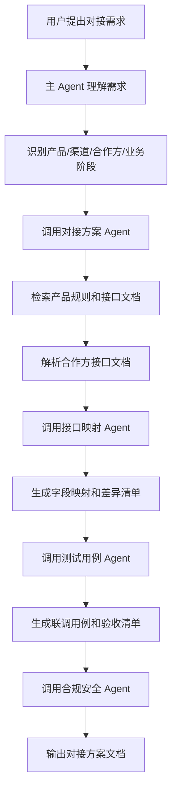
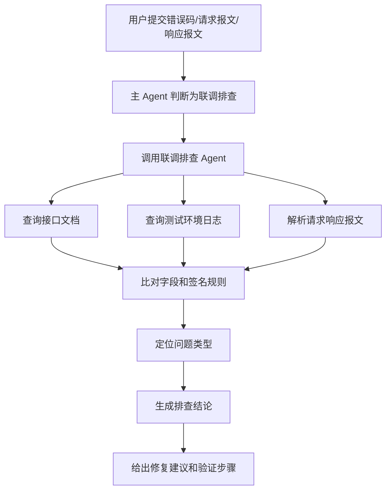

# 企业级健康险个险业务对接 Agent 平台架构设计与实现分析

## 0. 文档定位

本文档基于当前 `agent1.jpg` 架构思路与后续优化建议整理，面向 **健康险行业个险业务对接场景**，目标不是设计一个简单聊天机器人，而是设计一个可在企业内部落地的 **Agent Runtime + 业务治理 + 知识服务 + 工具执行平台**。

本文重点回答以下问题：

1. 整体架构应该如何设计。
2. 为什么要拆成三层。
3. 每个核心节点负责什么。
4. 每个节点如何实现。
5. 核心方法应该有哪些。
6. 关键流程如何用伪代码表达。
7. 健康险企业级场景中需要特别注意哪些安全、合规、审计和治理问题。

---

# 1. 整体架构概览

## 1.1 架构目标

健康险个险业务对接 Agent 平台的目标是：

- 支持 Web、企微、PC、API 等多入口接入。
- 支持健康险个险业务中的方案生成、接口对接、字段映射、联调排查、产品规则咨询、合规审核、测试用例生成等任务。
- 通过主控 Agent 调度多个专业子 Agent。
- 通过工具系统访问知识库、接口文档、日志平台、测试沙箱、工单系统、保险核心系统等外部能力。
- 通过 Policy Gate、Tool Broker、Audit、Trace、Eval、Human Approval 保证企业级可控性。
- 支持多租户、多渠道、多产品、多版本知识隔离。
- 支持可观测、可回放、可灰度、可回滚。

---

## 1.2 推荐整体架构图



---

## 1.3 架构核心思想

本架构建议采用：

```text
入口统一化 + Agent 编排状态化 + 工具调用受控化 + 知识检索治理化 + 记忆管理分级化 + 全链路审计评测化
```

具体来说：

- **入口统一化**：所有外部请求都转成统一内部消息。
- **Agent 编排状态化**：用 LangGraph 或自研状态机管理 Agent 执行过程。
- **工具调用受控化**：所有工具调用都必须经过 Policy Gate 与 Tool Broker。
- **知识检索治理化**：RAG 不是简单向量检索，而是带租户、产品、版本、渠道、生效时间的知识治理系统。
- **记忆管理分级化**：不是所有信息都能写入长期记忆，尤其健康信息、身份信息、保单信息必须严格控制。
- **全链路审计评测化**：Agent 每一步都要可追踪、可回放、可评估。

---

# 2. 三层分层设计

## 2.1 第一层：交互接入层

### 2.1.1 包含节点

- 客户端 Web / 企微 / PC / API
- API Gateway / FastAPI
- WebSocket / HTTP API
- Auth & Tenant Context
- Request Adapter
- Message Gateway

### 2.1.2 核心职责

交互接入层解决的是：

```text
谁在访问？
从哪里访问？
属于哪个租户？
是什么角色？
请求格式如何统一？
是否允许进入 Agent Runtime？
```

### 2.1.3 为什么必须有这一层

健康险企业级系统通常会存在多个接入方：

- 内部运营人员
- 技术对接人员
- 产品经理
- 客服人员
- 外部保险公司
- 经代渠道
- 第三方服务商
- 体检机构
- TPA
- 支付机构

不同用户的权限不同、能访问的数据不同、能调用的工具不同。入口层必须在请求进入 Agent 前完成身份、租户、渠道和角色识别。

---

## 2.2 第二层：Agent 运行时层

### 2.2.1 包含节点

- Runtime Bus
- Agent Orchestrator / AgentLoop
- Context Builder
- Session Manager
- Memory Manager
- Skill Manager
- SubAgent Manager
- LLM Provider / Model Router

### 2.2.2 核心职责

Agent 运行时层解决的是：

```text
如何理解任务？
如何构造上下文？
如何调用模型？
如何选择工具？
如何调用子 Agent？
如何保存会话状态？
如何处理多轮任务？
如何处理异步后台任务？
```

### 2.2.3 为什么 AgentLoop 不能太重

如果把以下所有能力都塞到一个 AgentLoop 类里：

- 消息消费
- 会话读写
- 上下文拼接
- LLM 调用
- 工具执行
- MCP 连接
- 子 Agent 调度
- 记忆整合
- 审计记录
- 异常重试

后期 AgentLoop 会变成一个难以维护的 God Object。

因此建议拆分为：

| 模块 | 职责 |
|---|---|
| AgentOrchestrator | 管理 Agent 状态流转 |
| ContextBuilder | 构建 LLM 输入上下文 |
| SessionManager | 管理会话历史和 checkpoint |
| MemoryManager | 管理长期记忆和任务记忆 |
| SkillManager | 加载技能摘要和完整技能 |
| SubAgentManager | 选择和调用子智能体 |
| ToolExecutor / ToolBroker | 执行工具并处理安全控制 |
| LLMProvider | 调用模型并做路由、降级、预算控制 |

---

## 2.3 第三层：企业治理与业务能力层

### 2.3.1 包含节点

- Policy Gate
- Tool Broker
- Tool Registry
- MCP Connector
- Knowledge Service
- Insurance Core APIs
- Log Query
- Ticket System
- Test Sandbox
- File Parser
- Audit Logger
- Trace Manager
- Eval Service
- Human Approval

### 2.3.2 核心职责

企业治理与业务能力层解决的是：

```text
这个工具能不能调用？
这个用户有没有权限看这份数据？
这个结果能不能返回？
是否涉及敏感信息？
是否需要人工审批？
知识版本是否正确？
行为是否可审计？
结果是否可评测？
```

### 2.3.3 健康险场景为什么必须重视治理层

健康险业务中涉及大量敏感数据：

- 姓名
- 身份证号
- 手机号
- 出生日期
- 地址
- 保单号
- 投保信息
- 健康告知
- 疾病史
- 理赔材料
- 银行卡信息
- 医疗票据
- 体检报告

因此企业级 Agent 不能只追求“会回答”，更要保证：

- 不越权访问
- 不错误引用
- 不泄露隐私
- 不误操作生产系统
- 不把敏感数据写入长期记忆
- 不输出无依据的保险责任解释
- 不绕过人工审批执行高风险操作

---

# 3. 核心节点功能及实现思路

以下部分是本文档的重点，逐个说明每个节点的职责、关键方法、实现思路和伪代码。

---

## 3.1 API Gateway / FastAPI Server

### 3.1.1 节点定位

API Gateway 是外部系统进入 Agent 平台的统一入口，负责接收 HTTP / WebSocket 请求，并将其交给 Request Adapter 转换为内部消息。

典型入口：

- `POST /api/chat`
- `WebSocket /ws`
- `POST /api/task`
- `GET /api/session/{session_id}`
- `POST /api/approval/callback`

### 3.1.2 核心职责

- 接收客户端请求。
- 校验请求格式。
- 提取 request_id、session_id、user_id、channel、tenant_id。
- 支持流式响应。
- 支持异步任务提交。
- 将请求转给 Request Adapter。

### 3.1.3 关键方法

| 方法 | 作用 |
|---|---|
| `chat_api()` | HTTP 问答入口 |
| `ws_endpoint()` | WebSocket 流式对话入口 |
| `submit_task()` | 长任务提交入口 |
| `approval_callback()` | 人工审批结果回调 |
| `health_check()` | 服务健康检查 |

### 3.1.4 伪代码

```python
@app.post('/api/chat')
async def chat_api(req: ChatRequest):
    # 1. 生成或读取 request_id
    request_id = req.request_id or generate_request_id()

    # 2. 构建入口上下文
    entry_context = EntryContext(
        request_id=request_id,
        channel=req.channel,
        user_id=req.user_id,
        tenant_id=req.tenant_id,
        session_id=req.session_id,
        source=req.source,
    )

    # 3. 身份与租户校验
    auth_context = await auth_service.resolve(entry_context)

    # 4. 外部请求转内部消息
    inbound_msg = request_adapter.adapt_chat_request(
        req=req,
        auth_context=auth_context,
    )

    # 5. 发布到运行时消息总线
    await message_bus.publish_inbound(inbound_msg)

    # 6. 等待或订阅响应
    outbound_msg = await outbound_waiter.wait(
        request_id=request_id,
        timeout=60,
    )

    # 7. 内部响应转外部响应
    return response_adapter.to_chat_response(outbound_msg)
```

### 3.1.5 实现要点

- WebSocket 适合长流程、流式输出、工具执行进度展示。
- HTTP 适合普通问答和短任务。
- 所有请求必须带 trace_id 或由系统生成 trace_id。
- API 层不直接调用 LLM，也不直接执行工具。
- API 层只负责接入、鉴权、协议转换和响应返回。

---

## 3.2 Auth & Tenant Context

### 3.2.1 节点定位

该节点负责识别当前请求的身份、租户、角色、渠道和权限边界。

### 3.2.2 核心职责

- 校验 token / cookie / 内部签名。
- 识别用户身份。
- 识别租户，例如内部团队、外部保险公司、经代渠道。
- 识别角色，例如运营、技术、产品、客服、外部合作方。
- 生成权限上下文，供后续 Policy Gate 使用。

### 3.2.3 关键数据结构

```python
class AuthContext:
    request_id: str
    tenant_id: str
    user_id: str
    user_name: str | None
    roles: list[str]
    channel: str
    permissions: list[str]
    data_scope: dict
    auth_level: str
```

### 3.2.4 关键方法

| 方法 | 作用 |
|---|---|
| `resolve()` | 根据请求解析身份上下文 |
| `validate_token()` | 校验访问令牌 |
| `load_user_roles()` | 查询用户角色 |
| `load_data_scope()` | 查询数据权限范围 |
| `build_permission_context()` | 构建权限上下文 |

### 3.2.5 伪代码

```python
async def resolve(entry_context: EntryContext) -> AuthContext:
    token = entry_context.headers.get('Authorization')

    principal = await validate_token(token)
    if principal is None:
        raise UnauthorizedError()

    roles = await role_service.get_roles(principal.user_id, entry_context.tenant_id)
    permissions = await permission_service.get_permissions(roles)
    data_scope = await data_scope_service.get_scope(
        user_id=principal.user_id,
        tenant_id=entry_context.tenant_id,
        channel=entry_context.channel,
    )

    return AuthContext(
        request_id=entry_context.request_id,
        tenant_id=entry_context.tenant_id,
        user_id=principal.user_id,
        user_name=principal.name,
        roles=roles,
        channel=entry_context.channel,
        permissions=permissions,
        data_scope=data_scope,
        auth_level=principal.auth_level,
    )
```

### 3.2.6 健康险场景注意点

不同角色权限必须区分：

| 角色 | 可访问内容 |
|---|---|
| 产品经理 | 产品规则、条款、方案文档 |
| 技术对接人 | 接口文档、字段映射、联调日志 |
| 客服 | 客户咨询、保单基础状态 |
| 理赔人员 | 理赔材料、理赔流程 |
| 外部渠道 | 只允许访问本渠道相关知识和对接状态 |
| 外部保险公司 | 只允许访问双方合作范围内的数据 |

---

## 3.3 Request Adapter

### 3.3.1 节点定位

Request Adapter 负责将不同来源、不同格式的外部请求转换成统一的内部消息格式。

### 3.3.2 核心职责

- 屏蔽 Web、企微、PC、API 的协议差异。
- 标准化 message、session、user、tenant、channel。
- 提取当前用户最后一条输入。
- 生成 `InboundMessage`。
- 不改变用户消息的 role，不把用户消息提升为 system。

### 3.3.3 内部消息结构

```python
class InboundMessage:
    request_id: str
    trace_id: str
    tenant_id: str
    channel: str
    user_id: str
    session_id: str
    session_key: str
    role: str
    content: str
    raw_messages: list[dict]
    metadata: dict
    created_at: datetime
```

### 3.3.4 关键方法

| 方法 | 作用 |
|---|---|
| `adapt_chat_request()` | 普通 HTTP 请求转换 |
| `adapt_ws_message()` | WebSocket 消息转换 |
| `build_session_key()` | 构建内部 session key |
| `extract_current_message()` | 提取当前用户输入 |
| `normalize_metadata()` | 标准化元数据 |

### 3.3.5 伪代码

```python
def adapt_chat_request(req: ChatRequest, auth_context: AuthContext) -> InboundMessage:
    current_message = extract_current_message(req.messages)

    session_key = build_session_key(
        tenant_id=auth_context.tenant_id,
        channel=auth_context.channel,
        user_id=auth_context.user_id,
        session_id=req.session_id,
    )

    return InboundMessage(
        request_id=req.request_id or generate_request_id(),
        trace_id=req.trace_id or generate_trace_id(),
        tenant_id=auth_context.tenant_id,
        channel=auth_context.channel,
        user_id=auth_context.user_id,
        session_id=req.session_id,
        session_key=session_key,
        role=current_message.role,   # 保持 user，不提升为 system
        content=current_message.content,
        raw_messages=req.messages,
        metadata={
            'source': req.source,
            'roles': auth_context.roles,
            'permissions': auth_context.permissions,
            'data_scope': auth_context.data_scope,
        },
        created_at=now(),
    )
```

### 3.3.6 实现要点

- 用户输入永远不能转成 system message。
- 系统提示词只能由服务端 ContextBuilder 生成。
- 外部来源、渠道、租户、角色放入 metadata。
- 每条消息必须带 request_id 和 trace_id。

---

## 3.4 Message Gateway / Runtime Bus

### 3.4.1 节点定位

Runtime Bus 负责在接入层和 Agent Runtime 之间传递消息。

开发阶段可以用 `asyncio.Queue`，生产阶段建议替换为 Redis Streams / RabbitMQ / Kafka。

### 3.4.2 核心职责

- inbound 消息入队。
- Agent 消费 inbound 消息。
- outbound 响应入队。
- 支持消息重试、死信、ACK。
- 支持多实例消费。

### 3.4.3 接口设计

```python
class MessageBus:
    async def publish_inbound(self, msg: InboundMessage): ...
    async def consume_inbound(self) -> InboundMessage: ...
    async def publish_outbound(self, msg: OutboundMessage): ...
    async def consume_outbound(self) -> OutboundMessage: ...
    async def ack(self, msg_id: str): ...
    async def retry(self, msg: InboundMessage, reason: str): ...
    async def dead_letter(self, msg: InboundMessage, reason: str): ...
```

### 3.4.4 开发版 asyncio.Queue 伪代码

```python
class AsyncioMessageBus(MessageBus):
    def __init__(self):
        self.inbound_queue = asyncio.Queue(maxsize=1000)
        self.outbound_queue = asyncio.Queue(maxsize=1000)

    async def publish_inbound(self, msg):
        await self.inbound_queue.put(msg)

    async def consume_inbound(self):
        return await self.inbound_queue.get()

    async def publish_outbound(self, msg):
        await self.outbound_queue.put(msg)

    async def consume_outbound(self):
        return await self.outbound_queue.get()
```

### 3.4.5 生产版 Redis Streams 伪代码

```python
class RedisStreamMessageBus(MessageBus):
    async def publish_inbound(self, msg):
        await redis.xadd(
            name='agent:inbound',
            fields=serialize(msg),
        )

    async def consume_inbound(self):
        records = await redis.xreadgroup(
            groupname='agent-workers',
            consumername=current_worker_id(),
            streams={'agent:inbound': '>'},
            count=1,
            block=5000,
        )
        return deserialize(records[0])

    async def ack(self, msg_id):
        await redis.xack('agent:inbound', 'agent-workers', msg_id)

    async def dead_letter(self, msg, reason):
        await redis.xadd(
            name='agent:dead-letter',
            fields={**serialize(msg), 'reason': reason},
        )
```

### 3.4.6 实现建议

| 阶段 | 方案 |
|---|---|
| 本地开发 | asyncio.Queue |
| 单机测试 | Redis List / Redis Streams |
| 生产初期 | Redis Streams |
| 高吞吐异步任务 | Kafka / RabbitMQ |

---

## 3.5 Agent Orchestrator / AgentLoop

### 3.5.1 节点定位

Agent Orchestrator 是整个系统的运行核心，负责协调 LLM、上下文、会话、记忆、工具、子 Agent 和输出。

它不应该直接承担所有细节，而应该作为调度层，调用其他组件完成具体工作。

### 3.5.2 核心职责

- 消费 Runtime Bus 中的 inbound 消息。
- 加载 session、memory、skill、subagent 信息。
- 调用 ContextBuilder 构造 LLM messages。
- 调用 LLM Provider。
- 解析 tool_calls。
- 通过 Policy Gate 和 Tool Broker 执行工具。
- 调用子智能体。
- 保存 session。
- 触发异步记忆整合。
- 发布 outbound 响应。

### 3.5.3 关键方法

| 方法 | 作用 |
|---|---|
| `run()` | 启动消费循环 |
| `dispatch()` | 分发消息并处理异常 |
| `process_message()` | 单条消息完整处理流程 |
| `run_agent_loop()` | LLM 工具调用循环 |
| `handle_tool_calls()` | 处理模型返回的工具调用 |
| `finalize_response()` | 构造最终响应 |
| `schedule_memory_consolidation()` | 异步触发记忆整合 |
| `connect_mcp()` | 初始化 MCP 连接 |
| `shutdown()` | 清理资源 |

### 3.5.4 主循环伪代码

```python
class AgentOrchestrator:
    async def run(self):
        await self.connect_mcp()

        while True:
            inbound_msg = await self.message_bus.consume_inbound()

            asyncio.create_task(
                self.dispatch(inbound_msg)
            )
```

### 3.5.5 dispatch 伪代码

```python
async def dispatch(self, inbound_msg: InboundMessage):
    try:
        await self.trace.start(inbound_msg.trace_id)
        await self.audit.log_event('message_received', inbound_msg)

        outbound_msg = await self.process_message(inbound_msg)

        await self.message_bus.publish_outbound(outbound_msg)
        await self.message_bus.ack(inbound_msg.request_id)

    except RetryableError as e:
        await self.message_bus.retry(inbound_msg, reason=str(e))
        await self.audit.log_error('message_retry', inbound_msg, e)

    except Exception as e:
        await self.message_bus.dead_letter(inbound_msg, reason=str(e))
        await self.audit.log_error('message_failed', inbound_msg, e)

        fallback = OutboundMessage.from_error(
            request_id=inbound_msg.request_id,
            session_key=inbound_msg.session_key,
            error='当前任务处理失败，已记录异常并进入人工排查。',
        )
        await self.message_bus.publish_outbound(fallback)
```

### 3.5.6 process_message 伪代码

```python
async def process_message(self, inbound_msg: InboundMessage) -> OutboundMessage:
    # 1. 读取会话
    session = await self.session_manager.get_or_create(
        session_key=inbound_msg.session_key,
        tenant_id=inbound_msg.tenant_id,
        user_id=inbound_msg.user_id,
    )

    # 2. 读取长期记忆和任务记忆
    memory_bundle = await self.memory_manager.load_relevant_memory(
        tenant_id=inbound_msg.tenant_id,
        user_id=inbound_msg.user_id,
        session_key=inbound_msg.session_key,
        query=inbound_msg.content,
    )

    # 3. 读取技能摘要
    skill_summary = await self.skill_manager.load_skill_summary(
        tenant_id=inbound_msg.tenant_id,
        channel=inbound_msg.channel,
    )

    # 4. 读取可用子智能体摘要
    subagent_summary = await self.subagent_manager.describe_available_agents(
        tenant_id=inbound_msg.tenant_id,
        permissions=inbound_msg.metadata.get('permissions', []),
    )

    # 5. 构建运行上下文
    runtime_context = RuntimeContext(
        inbound=inbound_msg,
        session=session,
        memory=memory_bundle,
        skills=skill_summary,
        subagents=subagent_summary,
        permissions=inbound_msg.metadata.get('permissions', []),
        data_scope=inbound_msg.metadata.get('data_scope', {}),
    )

    # 6. 进入 Agent 循环
    result = await self.run_agent_loop(runtime_context)

    # 7. 保存会话
    await self.session_manager.save(session)

    # 8. 异步触发记忆整合
    self.schedule_memory_consolidation(runtime_context)

    # 9. 构建响应
    return self.finalize_response(inbound_msg, result)
```

### 3.5.7 run_agent_loop 伪代码

```python
async def run_agent_loop(self, ctx: RuntimeContext) -> AgentResult:
    messages = await self.context_builder.build_messages(ctx)

    for step in range(self.config.max_agent_steps):
        # 1. 调用模型
        llm_response = await self.llm_provider.chat(
            messages=messages,
            tools=await self.tool_registry.available_tool_schemas(ctx),
            model_policy=ctx.model_policy,
        )

        # 2. 记录 assistant 消息
        messages.append(llm_response.to_assistant_message())
        ctx.session.messages.append(llm_response.to_session_message())

        # 3. 没有工具调用，则生成最终回答
        if not llm_response.tool_calls:
            return AgentResult(
                content=llm_response.content,
                finish_reason='final_answer',
                steps=step + 1,
            )

        # 4. 处理工具调用
        tool_results = await self.handle_tool_calls(
            tool_calls=llm_response.tool_calls,
            ctx=ctx,
        )

        # 5. 工具结果追加到上下文
        for tr in tool_results:
            messages.append(tr.to_tool_message())
            ctx.session.messages.append(tr.to_session_message())

    return AgentResult(
        content='当前任务步骤过多，已暂停执行。建议补充明确目标后继续。',
        finish_reason='max_steps_exceeded',
        steps=self.config.max_agent_steps,
    )
```

### 3.5.8 handle_tool_calls 伪代码

```python
async def handle_tool_calls(self, tool_calls: list[ToolCall], ctx: RuntimeContext):
    results = []

    for call in tool_calls:
        # 1. 参数 schema 校验
        validated_call = await self.tool_registry.validate_call(call)

        # 2. Policy Gate 校验
        decision = await self.policy_gate.evaluate(
            tool_call=validated_call,
            runtime_context=ctx,
        )

        if decision.action == 'deny':
            results.append(ToolResult.denied(call.id, decision.reason))
            continue

        if decision.action == 'need_approval':
            approval_result = await self.human_approval.request(
                tool_call=validated_call,
                context=ctx,
                reason=decision.reason,
            )
            if not approval_result.approved:
                results.append(ToolResult.denied(call.id, '人工审批未通过'))
                continue

        # 3. 通过 Tool Broker 执行
        result = await self.tool_broker.execute(
            tool_call=validated_call,
            runtime_context=ctx,
        )

        # 4. 工具结果脱敏
        sanitized = await self.result_sanitizer.sanitize(
            result=result,
            runtime_context=ctx,
        )

        results.append(sanitized)

    return results
```

### 3.5.9 实现要点

- `max_agent_steps` 必须限制，防止无限工具调用。
- 工具执行前必须经过 Policy Gate。
- 工具执行结果必须进入 session，但敏感内容要脱敏或摘要化。
- 生产环境不要让主 Agent 直接拥有 shell exec 权限。
- Agent 状态建议用 LangGraph checkpoint 持久化。

---

## 3.6 Context Builder

### 3.6.1 节点定位

Context Builder 负责将业务上下文、会话历史、长期记忆、技能摘要、子智能体描述、权限信息等构造成 LLM 可理解的 messages。

### 3.6.2 核心职责

- 构建 system prompt。
- 注入运行时上下文。
- 注入长期记忆。
- 注入技能摘要。
- 注入子 Agent 能力列表。
- 注入历史对话。
- 控制 token 预算。
- 防止敏感信息越权进入上下文。

### 3.6.3 关键方法

| 方法 | 作用 |
|---|---|
| `build_messages()` | 构建完整 LLM messages |
| `build_system_prompt()` | 构建系统提示词 |
| `build_runtime_context_block()` | 构建运行时上下文块 |
| `select_history()` | 选择历史消息 |
| `inject_memory()` | 注入可用记忆 |
| `inject_skills()` | 注入技能摘要 |
| `inject_subagents()` | 注入子智能体描述 |
| `enforce_token_budget()` | 控制上下文 token |

### 3.6.4 build_messages 伪代码

```python
async def build_messages(self, ctx: RuntimeContext) -> list[dict]:
    system_prompt = self.build_system_prompt(ctx)

    history = await self.select_history(
        session=ctx.session,
        max_tokens=self.config.history_token_budget,
    )

    memory_block = self.inject_memory(ctx.memory)
    skill_block = self.inject_skills(ctx.skills)
    subagent_block = self.inject_subagents(ctx.subagents)
    runtime_block = self.build_runtime_context_block(ctx)

    messages = [
        {
            'role': 'system',
            'content': system_prompt,
        },
        {
            'role': 'system',
            'content': runtime_block,
        },
        {
            'role': 'system',
            'content': memory_block,
        },
        {
            'role': 'system',
            'content': skill_block,
        },
        {
            'role': 'system',
            'content': subagent_block,
        },
    ]

    messages.extend(history)
    messages.append({
        'role': 'user',
        'content': ctx.inbound.content,
    })

    return self.enforce_token_budget(messages)
```

### 3.6.5 system prompt 示例

```text
你是健康险个险业务对接 Agent 平台的主控智能体。
你的职责是理解用户目标，判断业务场景，选择合适的工具或子智能体完成任务。
你不能直接编造保险责任、核保规则、理赔规则和接口字段。
涉及产品条款、接口文档、合规制度时，必须优先调用知识检索工具获取依据。
涉及生产系统查询或修改时，必须遵守权限控制和人工审批规则。
不得将身份证、手机号、健康告知、疾病史、保单号等敏感信息写入长期记忆。
```

### 3.6.6 Runtime Context 示例

```text
当前运行上下文：
- tenant_id: pingan_health
- channel: enterprise_wechat
- user_role: technical_integration
- business_domain: individual_health_insurance_onboarding
- session_id: xxx
- allowed_tools: get_knowledge, compare_schema, query_sandbox_log
- forbidden_tools: exec, production_write
- data_scope: current_tenant_only
```

### 3.6.7 实现要点

- ContextBuilder 不应该直接访问所有外部系统，只负责组装已经加载好的上下文。
- 敏感数据必须先经过权限过滤再进入上下文。
- 历史消息不能无限拼接，要配合摘要和 token budget。
- 不同渠道可以有不同 prompt 模板，例如企微更简洁，Web 控台更结构化。

---

## 3.7 Session Manager

### 3.7.1 节点定位

Session Manager 管理多轮会话状态，包括消息历史、会话元数据、任务状态、checkpoint、历史摘要等。

### 3.7.2 核心职责

- 创建 session。
- 读取 session。
- 保存 session。
- 控制历史消息长度。
- 生成历史摘要。
- 支持多实例并发。
- 支持 session checkpoint。

### 3.7.3 数据结构

```python
class Session:
    key: str
    tenant_id: str
    user_id: str
    channel: str
    messages: list[dict]
    metadata: dict
    summary: str | None
    last_consolidate_index: int
    created_at: datetime
    updated_at: datetime
```

### 3.7.4 关键方法

| 方法 | 作用 |
|---|---|
| `get_or_create()` | 获取或创建 session |
| `save()` | 保存 session |
| `append_message()` | 追加消息 |
| `get_history()` | 获取截断后的历史 |
| `summarize_history()` | 历史摘要 |
| `lock_session()` | 会话级并发锁 |
| `save_checkpoint()` | 保存执行状态 |
| `load_checkpoint()` | 恢复执行状态 |

### 3.7.5 get_history 截断伪代码

```python
async def get_history(self, session: Session, max_tokens: int) -> list[dict]:
    selected = []
    total_tokens = 0

    # 从新到旧选择消息
    for msg in reversed(session.messages):
        msg_tokens = estimate_tokens(msg['content'])
        if total_tokens + msg_tokens > max_tokens:
            break
        selected.append(msg)
        total_tokens += msg_tokens

    selected.reverse()

    # 对齐到最近的 user 消息边界，避免 assistant/tool 孤立出现
    while selected and selected[0]['role'] not in ('user', 'system'):
        selected.pop(0)

    # 如果存在历史摘要，则放在前面
    if session.summary:
        selected.insert(0, {
            'role': 'system',
            'content': f'历史会话摘要：\n{session.summary}',
        })

    return selected
```

### 3.7.6 保存伪代码

```python
async def save(self, session: Session):
    session.updated_at = now()

    async with self.lock_session(session.key):
        await self.store.upsert(
            key=session.key,
            value=serialize(session),
            ttl=self.config.session_ttl,
        )
```

### 3.7.7 实现建议

| 阶段 | 存储方案 |
|---|---|
| 原型 | 本地 JSON 文件 |
| 开发测试 | Redis |
| 生产 | Redis + PostgreSQL / MongoDB |
| 长期归档 | 对象存储 + 元数据 DB |

---

## 3.8 Memory Manager

### 3.8.1 节点定位

Memory Manager 负责长期记忆、任务记忆、用户偏好记忆、历史摘要的生成、读取、更新、删除和权限控制。

### 3.8.2 核心职责

- 判断哪些信息允许进入长期记忆。
- 对记忆进行分级。
- 存储任务级、用户级、项目级、产品级记忆。
- 防止敏感信息进入长期记忆。
- 异步整合历史对话。
- 支持记忆过期、删除、审计。

### 3.8.3 记忆分级

| 记忆类型 | 是否允许长期保存 | 示例 |
|---|---|---|
| 用户偏好 | 可以 | 用户喜欢 Markdown 输出 |
| 项目上下文 | 可以 | 当前对接 XX 渠道 |
| 接口经验 | 可以，需脱敏 | 某接口签名失败排查经验 |
| 产品规则 | 可以，但要版本化 | 某产品等待期规则 |
| 客户个人信息 | 默认不允许 | 姓名、身份证、手机号 |
| 健康信息 | 默认不允许 | 疾病史、健康告知 |
| 密钥 Token | 禁止 | API Key、Cookie |

### 3.8.4 数据结构

```python
class MemoryItem:
    memory_id: str
    tenant_id: str
    subject_type: str      # user / project / product / interface / case
    subject_id: str
    content: str
    source_session_id: str
    sensitivity_level: str # public / internal / sensitive / restricted
    permissions: list[str]
    expires_at: datetime | None
    reviewed: bool
    created_at: datetime
    updated_at: datetime
```

### 3.8.5 关键方法

| 方法 | 作用 |
|---|---|
| `load_relevant_memory()` | 根据当前问题加载相关记忆 |
| `consolidate_memory()` | 异步整合对话成记忆 |
| `classify_memory_candidate()` | 判断候选记忆类型和敏感级别 |
| `save_memory_item()` | 保存结构化记忆 |
| `redact_sensitive_content()` | 敏感信息脱敏 |
| `delete_memory()` | 删除记忆 |
| `expire_memory()` | 过期处理 |

### 3.8.6 加载记忆伪代码

```python
async def load_relevant_memory(self, tenant_id, user_id, session_key, query):
    candidates = await self.memory_store.search(
        tenant_id=tenant_id,
        subject_ids=[user_id, session_key],
        query=query,
        limit=20,
    )

    allowed = []
    for item in candidates:
        if await self.permission_checker.can_read_memory(user_id, item):
            allowed.append(item)

    return MemoryBundle(items=allowed)
```

### 3.8.7 异步整合伪代码

```python
async def consolidate_memory(self, session: Session):
    # 1. 找出未整合消息
    start = session.last_consolidate_index
    new_messages = session.messages[start:]

    if len(new_messages) < self.config.min_messages_to_consolidate:
        return

    # 2. 构建候选记忆提取 prompt
    prompt = build_memory_extract_prompt(
        existing_summary=session.summary,
        new_messages=new_messages,
    )

    # 3. 调用 LLM 提取候选记忆
    candidates = await self.llm_provider.chat_json(
        messages=[{'role': 'user', 'content': prompt}],
        schema=MemoryCandidateList,
    )

    # 4. 对每条候选记忆进行分类和安全检查
    for candidate in candidates:
        classification = await self.classify_memory_candidate(candidate)

        if classification.action == 'forbid':
            continue

        content = candidate.content
        if classification.need_redaction:
            content = await self.redact_sensitive_content(content)

        await self.save_memory_item(MemoryItem(
            tenant_id=session.tenant_id,
            subject_type=classification.subject_type,
            subject_id=session.user_id,
            content=content,
            source_session_id=session.key,
            sensitivity_level=classification.sensitivity_level,
            permissions=classification.permissions,
            expires_at=classification.expires_at,
            reviewed=classification.need_review is False,
        ))

    # 5. 更新整合位置
    session.last_consolidate_index = len(session.messages)
    await self.session_manager.save(session)
```

### 3.8.8 实现要点

- 不建议生产环境直接使用 `MEMORY.md` 作为底层存储。
- `MEMORY.md` 可以作为导出或展示视图。
- 记忆写入前必须经过敏感信息分类。
- 高敏记忆默认不进入 LLM 上下文。
- 用户级记忆、项目级记忆、产品级记忆要分开。

---

## 3.9 Skill Manager / SkillsLoader

### 3.9.1 节点定位

Skill Manager 负责加载、管理和治理 Agent 技能。技能可以理解为一组经过沉淀的能力说明、提示词模板、工具约束、输入输出格式和业务规则。

### 3.9.2 核心职责

- 扫描技能目录。
- 加载技能元数据。
- 按需加载完整技能内容。
- 管理技能版本。
- 管理技能审批状态。
- 根据当前任务选择可用技能。

### 3.9.3 技能目录结构

```text
skills/
  interface_mapping/
    SKILL.md
    examples/
      case_001.md
    eval_cases/
      eval_001.json
  onboarding_solution/
    SKILL.md
  troubleshooting/
    SKILL.md
```

### 3.9.4 SKILL.md frontmatter 示例

```yaml
name: interface_mapping_skill
version: 1.2.0
owner: health_insurance_arch_team
scope:
  - individual_insurance_onboarding
  - api_mapping
allowed_tools:
  - get_knowledge
  - parse_interface_doc
  - compare_schema
risk_level: medium
approval_status: approved
requires_human_review: true
```

### 3.9.5 关键方法

| 方法 | 作用 |
|---|---|
| `scan_skills()` | 扫描技能目录 |
| `load_metadata()` | 只加载 yaml frontmatter |
| `load_skill_content()` | 按需加载完整技能 |
| `select_skills()` | 根据任务选择技能 |
| `build_skill_summary()` | 构建给主 Agent 的技能摘要 |
| `validate_skill()` | 校验技能格式和权限 |
| `run_skill_eval()` | 技能上线前评测 |

### 3.9.6 渐进式加载伪代码

```python
async def load_skill_summary(self, tenant_id, channel) -> SkillSummary:
    metadata_list = await self.scan_skill_metadata(
        tenant_id=tenant_id,
        channel=channel,
    )

    approved = [
        m for m in metadata_list
        if m.approval_status == 'approved'
    ]

    return SkillSummary(
        skills=[
            {
                'name': m.name,
                'description': m.description,
                'scope': m.scope,
                'allowed_tools': m.allowed_tools,
            }
            for m in approved
        ]
    )
```

### 3.9.7 按需加载伪代码

```python
async def load_skill_content(self, skill_name: str, ctx: RuntimeContext):
    metadata = await self.skill_store.get_metadata(skill_name)

    if metadata.approval_status != 'approved':
        raise PermissionDenied('技能未审批通过')

    if not self.permission_checker.can_use_skill(ctx.user_id, metadata):
        raise PermissionDenied('无权使用该技能')

    content = await self.skill_store.read_skill_md(skill_name)
    return SkillContent(metadata=metadata, content=content)
```

### 3.9.8 实现要点

- 不要一开始把所有技能全文塞进 prompt。
- 主 Agent 只需要看到技能摘要。
- 需要时通过 `load_skill` 工具加载完整技能。
- 技能上线必须有评测集。
- 技能要支持版本回滚。

---

## 3.10 LLM Provider / Model Router

### 3.10.1 节点定位

LLM Provider 负责统一封装模型调用，屏蔽不同模型供应商、不同部署方式、不同接口协议。

### 3.10.2 核心职责

- 调用企业内部大模型或外部 LLM。
- 支持 OpenAI-compatible API。
- 支持 Qwen、GLM、DeepSeek 等模型路由。
- 支持 token 预算控制。
- 支持失败重试和降级。
- 支持结构化输出。

### 3.10.3 关键方法

| 方法 | 作用 |
|---|---|
| `chat()` | 普通对话 / tool calling |
| `chat_json()` | 结构化 JSON 输出 |
| `stream_chat()` | 流式输出 |
| `select_model()` | 根据场景选择模型 |
| `estimate_cost()` | 估算 token 成本 |
| `fallback_model()` | 模型失败时降级 |

### 3.10.4 模型路由伪代码

```python
async def select_model(self, ctx: RuntimeContext, task_type: str) -> ModelConfig:
    if task_type == 'compliance_review':
        return self.models['high_precision_model']

    if task_type == 'simple_faq':
        return self.models['fast_model']

    if ctx.inbound.metadata.get('requires_private_model'):
        return self.models['internal_qwen']

    return self.models['default']
```

### 3.10.5 chat 伪代码

```python
async def chat(self, messages, tools=None, model_policy=None):
    model = await self.select_model_by_policy(model_policy)

    try:
        response = await model_client.chat.completions.create(
            model=model.name,
            messages=messages,
            tools=tools,
            temperature=model.temperature,
            timeout=model.timeout,
        )
        return normalize_llm_response(response)

    except TimeoutError:
        fallback = await self.fallback_model(model)
        response = await fallback.chat(messages=messages, tools=tools)
        return normalize_llm_response(response)
```

### 3.10.6 实现要点

- 模型调用必须记录 token 用量。
- 高风险业务尽量使用内部私有模型。
- 对外部模型调用前必须做脱敏。
- 结构化任务建议使用 JSON schema 约束输出。

---

## 3.11 Policy Gate

### 3.11.1 节点定位

Policy Gate 是工具调用和敏感操作前的安全闸门。

### 3.11.2 核心职责

- 判断当前用户是否有权限调用工具。
- 判断工具参数是否涉及敏感数据。
- 判断是否需要人工审批。
- 判断是否允许访问某类知识。
- 判断是否允许返回某类内容。

### 3.11.3 策略维度

| 维度 | 示例 |
|---|---|
| 用户角色 | 技术、运营、客服、外部渠道 |
| 工具风险 | 只读、查询、写操作、外发操作 |
| 数据敏感级别 | 普通、内部、敏感、受限 |
| 环境 | dev、test、pre、prod |
| 操作对象 | 保单、理赔、日志、接口文档 |
| 业务阶段 | 方案、联调、上线、生产排查 |

### 3.11.4 关键方法

| 方法 | 作用 |
|---|---|
| `evaluate()` | 主策略判断入口 |
| `check_tool_permission()` | 工具权限判断 |
| `check_data_scope()` | 数据范围判断 |
| `check_environment()` | 环境判断 |
| `check_sensitive_params()` | 参数敏感性判断 |
| `need_human_approval()` | 判断是否需要人工审批 |

### 3.11.5 策略返回结构

```python
class PolicyDecision:
    action: str  # allow / deny / need_approval
    reason: str
    risk_level: str
    required_approval_role: str | None
```

### 3.11.6 evaluate 伪代码

```python
async def evaluate(self, tool_call: ToolCall, runtime_context: RuntimeContext) -> PolicyDecision:
    tool_meta = await self.tool_registry.get_metadata(tool_call.name)

    # 1. 工具是否存在
    if tool_meta is None:
        return PolicyDecision('deny', '工具不存在', 'high', None)

    # 2. 用户角色是否允许使用工具
    if not self.check_tool_permission(runtime_context.permissions, tool_meta):
        return PolicyDecision('deny', '当前用户无权调用该工具', 'high', None)

    # 3. 参数是否越权
    if not self.check_data_scope(tool_call.arguments, runtime_context.data_scope):
        return PolicyDecision('deny', '工具参数超出数据权限范围', 'high', None)

    # 4. 是否生产写操作
    if tool_meta.operation_type == 'write' and runtime_context.env == 'prod':
        return PolicyDecision('need_approval', '生产写操作需要人工审批', 'critical', 'ops_manager')

    # 5. 是否涉及健康信息或身份信息
    if self.contains_sensitive_params(tool_call.arguments):
        if not runtime_context.has_permission('sensitive_data:read'):
            return PolicyDecision('deny', '无权访问敏感信息', 'critical', None)

    # 6. 高风险外发操作
    if tool_meta.operation_type == 'external_send':
        return PolicyDecision('need_approval', '外发消息需要人工确认', 'high', 'business_owner')

    return PolicyDecision('allow', '允许调用', tool_meta.risk_level, None)
```

### 3.11.7 健康险场景策略示例

| 操作 | 策略 |
|---|---|
| 查询产品条款 | 允许 |
| 查询接口文档 | 允许 |
| 查询测试环境日志 | 允许，需记录审计 |
| 查询生产保单 | 需要角色权限 |
| 查询健康告知 | 高敏权限 + 审计 |
| 修改保单信息 | 人工审批 |
| 触发生产回调 | 人工审批 |
| 发送外部邮件 | 人工确认 |
| 执行 shell 命令 | 生产禁止 |

---

## 3.12 Tool Broker

### 3.12.1 节点定位

Tool Broker 是所有工具调用的统一代理层。Agent 不应该直接调用具体工具，而应该通过 Tool Broker 执行。

### 3.12.2 核心职责

- 统一工具执行入口。
- 参数校验。
- 超时控制。
- 重试控制。
- 幂等控制。
- 工具调用审计。
- 结果脱敏。
- 错误码统一。

### 3.12.3 关键方法

| 方法 | 作用 |
|---|---|
| `execute()` | 工具执行入口 |
| `validate_args()` | 参数校验 |
| `apply_timeout()` | 超时控制 |
| `apply_retry()` | 重试控制 |
| `build_idempotency_key()` | 构建幂等键 |
| `sanitize_result()` | 工具结果脱敏 |
| `normalize_error()` | 错误标准化 |

### 3.12.4 execute 伪代码

```python
async def execute(self, tool_call: ToolCall, runtime_context: RuntimeContext) -> ToolResult:
    tool = await self.tool_registry.get(tool_call.name)
    tool_meta = await self.tool_registry.get_metadata(tool_call.name)

    await self.audit.log_event('tool_call_start', {
        'tool_name': tool_call.name,
        'arguments': mask_sensitive(tool_call.arguments),
        'request_id': runtime_context.inbound.request_id,
    })

    try:
        validated_args = self.validate_args(tool_meta.schema, tool_call.arguments)

        idempotency_key = self.build_idempotency_key(
            tool_call=tool_call,
            runtime_context=runtime_context,
        )

        result = await asyncio.wait_for(
            tool.execute(**validated_args, context=runtime_context),
            timeout=tool_meta.timeout_seconds,
        )

        sanitized = await self.sanitize_result(result, runtime_context)

        await self.audit.log_event('tool_call_success', {
            'tool_name': tool_call.name,
            'request_id': runtime_context.inbound.request_id,
        })

        return ToolResult.success(
            tool_call_id=tool_call.id,
            name=tool_call.name,
            content=sanitized,
        )

    except Exception as e:
        normalized = self.normalize_error(e)

        await self.audit.log_event('tool_call_failed', {
            'tool_name': tool_call.name,
            'error': normalized.message,
            'request_id': runtime_context.inbound.request_id,
        })

        return ToolResult.error(
            tool_call_id=tool_call.id,
            name=tool_call.name,
            error=normalized.message,
            error_code=normalized.code,
        )
```

### 3.12.5 工具元数据示例

```yaml
name: query_policy_status
description: 查询保单状态
risk_level: high
operation_type: read
allowed_roles:
  - policy_ops
  - customer_service
required_permissions:
  - policy:read
timeout_seconds: 10
retry: 1
sensitive_result: true
```

### 3.12.6 实现要点

- Tool Broker 必须是所有工具执行的唯一入口。
- 所有工具结果都要标准化为 ToolResult。
- 工具异常不能直接抛给 LLM，要转成结构化错误。
- 对生产系统写操作必须支持幂等。

---

## 3.13 Tool Registry / MCP Connector

### 3.13.1 节点定位

Tool Registry 负责注册和发现工具。MCP Connector 负责接入符合 MCP 协议的外部工具服务。

### 3.13.2 核心职责

- 注册本地工具。
- 注册远程工具。
- 暴露 OpenAI-compatible tool schema。
- 管理工具元数据。
- 连接 MCP Server。
- 支持工具懒加载。

### 3.13.3 工具分类

| 工具 | 建议用途 |
|---|---|
| `get_knowledge` | 知识检索 |
| `load_skill` | 加载完整技能 |
| `call_subagent` | 调用固定子智能体 |
| `parse_interface_doc` | 解析接口文档 |
| `compare_schema` | 比较接口字段 |
| `query_log` | 查询联调日志 |
| `query_ticket` | 查询工单 |
| `run_sandbox_test` | 执行测试环境用例 |
| `read_file` | 读取受限目录文件 |
| `exec` | 仅开发环境可用，生产默认禁用 |

### 3.13.4 关键方法

| 方法 | 作用 |
|---|---|
| `register()` | 注册工具 |
| `get()` | 获取工具实现 |
| `get_metadata()` | 获取工具元数据 |
| `available_tool_schemas()` | 获取当前上下文可用工具 schema |
| `validate_call()` | 校验工具调用 |
| `connect_mcp_servers()` | 连接 MCP 服务 |
| `close()` | 清理连接 |

### 3.13.5 MCP 懒加载伪代码

```python
class MCPConnector:
    def __init__(self):
        self.exit_stack = AsyncExitStack()
        self.clients = {}

    async def connect_mcp_servers(self, server_configs):
        for cfg in server_configs:
            if not cfg.enabled:
                continue

            client = await self.exit_stack.enter_async_context(
                create_mcp_client(cfg)
            )
            self.clients[cfg.name] = client

    async def list_tools(self):
        tools = []
        for client in self.clients.values():
            tools.extend(await client.list_tools())
        return tools

    async def close(self):
        await self.exit_stack.aclose()
```

### 3.13.6 available_tool_schemas 伪代码

```python
async def available_tool_schemas(self, ctx: RuntimeContext) -> list[dict]:
    schemas = []

    for tool_meta in self.tools_metadata:
        if not self.permission_checker.can_use_tool(ctx, tool_meta):
            continue

        if tool_meta.env_limited and ctx.env not in tool_meta.allowed_envs:
            continue

        schemas.append(tool_meta.to_openai_tool_schema())

    return schemas
```

### 3.13.7 实现要点

- 工具 schema 给 LLM 看，但真实权限判断必须在 Policy Gate 做。
- LLM 看不到的工具就不会主动调用，可以减少错误调用。
- MCP 连接要支持启动连接和懒加载两种模式。
- MCP 工具也必须经过 Policy Gate 和 Tool Broker。

---

## 3.14 Knowledge Service / RAG

### 3.14.1 节点定位

Knowledge Service 是健康险 Agent 的知识检索与知识治理中台，不能只是简单的向量检索。

### 3.14.2 核心职责

- 管理健康险业务知识。
- 支持向量检索、关键词检索、混合检索。
- 按租户、产品、渠道、版本、时间过滤。
- 支持知识来源、引用和可追溯。
- 支持知识有效期和审批状态。

### 3.14.3 知识类型

| 类型 | 示例 |
|---|---|
| 产品知识 | 条款、责任、免责、等待期 |
| 核保规则 | 健康告知、年龄、职业类别 |
| 理赔规则 | 理赔材料、赔付范围、流程 |
| 保全规则 | 退保、变更、续期 |
| 接口文档 | 投保、支付、承保、回调、保全、理赔 API |
| 字段字典 | 字段含义、枚举、必填规则 |
| 历史联调案例 | 签名失败、字段缺失、回调异常 |
| 合规制度 | 隐私、销售话术、数据安全 |

### 3.14.4 知识元数据

```python
class KnowledgeChunk:
    chunk_id: str
    tenant_id: str
    product_code: str | None
    product_version: str | None
    insurance_company: str | None
    channel: str | None
    business_stage: str | None
    doc_type: str
    title: str
    content: str
    source_uri: str
    effective_date: date | None
    expired_date: date | None
    sensitivity_level: str
    review_status: str
    embedding: list[float]
```

### 3.14.5 关键方法

| 方法 | 作用 |
|---|---|
| `ingest_document()` | 文档入库 |
| `chunk_document()` | 文档切片 |
| `embed_chunks()` | 向量化 |
| `search()` | 知识检索入口 |
| `hybrid_search()` | 混合检索 |
| `metadata_filter()` | 元数据过滤 |
| `rerank()` | 重排序 |
| `build_citation()` | 构建引用来源 |

### 3.14.6 检索伪代码

```python
async def search(self, query: str, ctx: RuntimeContext, filters: dict) -> KnowledgeResult:
    # 1. 构建强制过滤条件
    mandatory_filters = {
        'tenant_id': ctx.inbound.tenant_id,
        'review_status': 'approved',
        'sensitivity_level': {'$in': ctx.allowed_knowledge_levels},
    }

    # 2. 根据业务上下文追加过滤
    if ctx.business_context.product_code:
        mandatory_filters['product_code'] = ctx.business_context.product_code

    if ctx.business_context.channel:
        mandatory_filters['channel'] = {
            '$in': [ctx.business_context.channel, 'common']
        }

    # 3. 过滤有效期
    mandatory_filters['effective_date'] = {'$lte': today()}
    mandatory_filters['expired_date'] = {'$or': [{'$gte': today()}, None]}

    # 4. 向量检索
    vector_hits = await self.vector_db.search(
        query=query,
        filters=mandatory_filters,
        top_k=30,
    )

    # 5. 关键词检索
    keyword_hits = await self.keyword_search.search(
        query=query,
        filters=mandatory_filters,
        top_k=30,
    )

    # 6. 合并去重
    merged = merge_and_deduplicate(vector_hits, keyword_hits)

    # 7. rerank
    ranked = await self.reranker.rerank(query=query, docs=merged, top_k=8)

    # 8. 构建引用
    return KnowledgeResult(
        chunks=ranked,
        citations=[self.build_citation(c) for c in ranked],
    )
```

### 3.14.7 get_knowledge 工具伪代码

```python
async def get_knowledge(query: str, product_code: str | None, doc_type: str | None, context: RuntimeContext):
    result = await knowledge_service.search(
        query=query,
        ctx=context,
        filters={
            'product_code': product_code,
            'doc_type': doc_type,
        },
    )

    return {
        'answer_context': [
            {
                'chunk_id': c.chunk_id,
                'title': c.title,
                'content': c.content,
                'source': c.source_uri,
                'effective_date': c.effective_date,
            }
            for c in result.chunks
        ],
        'citations': result.citations,
    }
```

### 3.14.8 实现要点

- 健康险知识必须有版本和有效期。
- 查询时必须做 metadata filter。
- 不能让 Agent 拿旧条款回答新产品问题。
- 接口文档、产品条款、核保规则、理赔规则要分库或至少分类型。
- 检索结果要带引用，最终回答要能追溯来源。

---

## 3.15 SubAgent Manager

### 3.15.1 节点定位

SubAgent Manager 负责管理固定子智能体目录，并根据主 Agent 的意图调用合适的子 Agent。

### 3.15.2 核心原则

企业级场景不建议让主 Agent 自由 spawn 任意子智能体，而应该使用固定 Agent Catalog。

### 3.15.3 子智能体目录示例

| 子智能体 | 职责 |
|---|---|
| 对接方案 Agent | 生成对接方案、接口清单、上线 checklist |
| 接口映射 Agent | 字段映射、枚举映射、差异分析 |
| 联调排查 Agent | 日志分析、报文分析、错误定位 |
| 产品规则 Agent | 产品责任、投保规则、核保规则 |
| 合规安全 Agent | 隐私、话术、数据边界审查 |
| 测试用例 Agent | 正常、异常、边界、回归用例生成 |
| 文档解析 Agent | 接口文档、PDF、Word、Excel 解析 |
| 变更影响分析 Agent | 分析接口变更、规则变更影响 |

### 3.15.4 子智能体定义结构

```yaml
name: interface_mapping_agent
role: 接口字段映射专家
description: 负责对比我方标准接口和合作方接口字段差异
input_schema:
  - standard_api_doc
  - partner_api_doc
  - product_code
output_schema:
  - field_mapping_table
  - enum_mapping
  - missing_fields
  - risk_points
allowed_tools:
  - get_knowledge
  - parse_interface_doc
  - compare_schema
risk_level: medium
requires_review: true
```

### 3.15.5 关键方法

| 方法 | 作用 |
|---|---|
| `describe_available_agents()` | 给主 Agent 提供可用子 Agent 摘要 |
| `select_agent()` | 根据任务选择子 Agent |
| `call_subagent()` | 调用子 Agent |
| `validate_input()` | 校验输入 |
| `validate_output()` | 校验输出 |
| `merge_results()` | 合并子 Agent 结果 |

### 3.15.6 call_subagent 伪代码

```python
async def call_subagent(self, agent_name: str, task: dict, ctx: RuntimeContext) -> SubAgentResult:
    agent_def = await self.agent_catalog.get(agent_name)

    if agent_def is None:
        raise ValueError('子智能体不存在')

    if not self.permission_checker.can_use_subagent(ctx, agent_def):
        raise PermissionDenied('无权调用该子智能体')

    validated_input = validate_schema(task, agent_def.input_schema)

    sub_ctx = ctx.create_child_context(
        subagent_name=agent_name,
        allowed_tools=agent_def.allowed_tools,
        risk_level=agent_def.risk_level,
    )

    result = await agent_def.runner.run(
        task=validated_input,
        context=sub_ctx,
    )

    validated_output = validate_schema(result, agent_def.output_schema)

    return SubAgentResult(
        agent_name=agent_name,
        content=validated_output,
        requires_review=agent_def.requires_review,
    )
```

### 3.15.7 对接方案 Agent 伪代码

```python
async def onboarding_solution_agent(task, context):
    # 1. 检索产品和接口知识
    product_knowledge = await get_knowledge(
        query=f'{task.product_code} 个险投保 承保 保全 理赔 规则',
        product_code=task.product_code,
        doc_type='product_rule',
        context=context,
    )

    interface_docs = await get_knowledge(
        query=f'{task.partner_name} 接口文档 投保 支付 承保 回调',
        product_code=task.product_code,
        doc_type='api_doc',
        context=context,
    )

    # 2. 建立流程模型
    process_model = build_process_model(
        product_knowledge=product_knowledge,
        interface_docs=interface_docs,
    )

    # 3. 调用接口映射 Agent
    mapping_result = await call_subagent(
        agent_name='interface_mapping_agent',
        task={
            'standard_api_doc': task.standard_api_doc,
            'partner_api_doc': task.partner_api_doc,
            'product_code': task.product_code,
        },
        ctx=context,
    )

    # 4. 生成测试计划
    test_plan = await call_subagent(
        agent_name='test_case_agent',
        task={
            'process_model': process_model,
            'mapping_result': mapping_result,
        },
        ctx=context,
    )

    # 5. 合规审查
    compliance = await call_subagent(
        agent_name='compliance_agent',
        task={
            'solution': process_model,
            'mapping': mapping_result,
            'test_plan': test_plan,
        },
        ctx=context,
    )

    return {
        'solution': process_model,
        'field_mapping': mapping_result,
        'test_plan': test_plan,
        'compliance_review': compliance,
    }
```

### 3.15.8 实现要点

- 子智能体必须固定目录化、版本化、权限化。
- 子智能体不能随便获得所有工具。
- 子智能体结果要结构化。
- 主 Agent 负责结果合并和最终输出。

---

## 3.16 File / Document Parser

### 3.16.1 节点定位

文档解析服务负责解析健康险对接过程中的接口文档、产品条款、字段字典、测试用例、日志文件等。

### 3.16.2 核心职责

- 解析 Word / PDF / Excel / Markdown / OpenAPI / JSON / XML。
- 提取字段表、接口路径、请求响应样例、错误码。
- 输出结构化文档对象。
- 为 Knowledge Service 入库提供切片输入。

### 3.16.3 关键方法

| 方法 | 作用 |
|---|---|
| `parse_file()` | 文件解析入口 |
| `detect_file_type()` | 文件类型识别 |
| `parse_openapi()` | OpenAPI 文档解析 |
| `parse_excel_mapping()` | Excel 字段表解析 |
| `parse_pdf_terms()` | PDF 条款解析 |
| `extract_tables()` | 表格提取 |
| `normalize_schema()` | 接口字段结构标准化 |

### 3.16.4 伪代码

```python
async def parse_file(file_uri: str, context: RuntimeContext) -> ParsedDocument:
    file_type = detect_file_type(file_uri)

    if file_type == 'openapi':
        parsed = await parse_openapi(file_uri)
    elif file_type == 'excel':
        parsed = await parse_excel_mapping(file_uri)
    elif file_type == 'pdf':
        parsed = await parse_pdf_terms(file_uri)
    elif file_type == 'markdown':
        parsed = await parse_markdown(file_uri)
    else:
        raise UnsupportedFileType(file_type)

    return normalize_document(parsed)
```

### 3.16.5 实现要点

- 文档解析要保留页码、章节、表格位置，方便引用。
- 接口文档解析后要结构化为 endpoint、method、request_schema、response_schema、error_codes。
- 字段表解析要识别字段名、类型、必填、枚举、示例、说明。

---

## 3.17 Audit / Trace / Evaluation

### 3.17.1 节点定位

审计、追踪和评测是企业级 Agent 平台的基础能力。

### 3.17.2 核心职责

- 记录用户请求。
- 记录 LLM 输入输出摘要。
- 记录工具调用。
- 记录知识引用。
- 记录权限判断。
- 记录人工审批。
- 支持链路追踪。
- 支持离线评测和回放。

### 3.17.3 审计事件类型

| 事件 | 说明 |
|---|---|
| `message_received` | 收到用户消息 |
| `llm_call_start` | 开始调用模型 |
| `llm_call_end` | 模型调用结束 |
| `tool_call_start` | 开始工具调用 |
| `tool_call_success` | 工具调用成功 |
| `tool_call_failed` | 工具调用失败 |
| `policy_denied` | 策略拒绝 |
| `approval_requested` | 请求人工审批 |
| `approval_passed` | 审批通过 |
| `knowledge_retrieved` | 知识检索 |
| `final_response` | 最终响应 |

### 3.17.4 Audit Logger 伪代码

```python
async def log_event(self, event_type: str, payload: dict):
    event = AuditEvent(
        event_id=generate_id(),
        trace_id=payload.get('trace_id'),
        request_id=payload.get('request_id'),
        tenant_id=payload.get('tenant_id'),
        user_id=payload.get('user_id'),
        event_type=event_type,
        payload=mask_sensitive(payload),
        created_at=now(),
    )

    await self.audit_store.insert(event)
```

### 3.17.5 Eval Service 伪代码

```python
async def run_eval_suite(self, agent_name: str, eval_suite_id: str):
    cases = await self.eval_store.load_cases(eval_suite_id)
    results = []

    for case in cases:
        output = await self.agent_runner.run(
            agent_name=agent_name,
            input=case.input,
            test_mode=True,
        )

        score = await self.evaluator.evaluate(
            expected=case.expected,
            actual=output,
            metrics=case.metrics,
        )

        results.append(score)

    return EvalReport(
        agent_name=agent_name,
        eval_suite_id=eval_suite_id,
        pass_rate=calculate_pass_rate(results),
        details=results,
    )
```

### 3.17.6 实现要点

- 审计日志中不能保存明文敏感数据。
- trace_id 必须贯穿 API、Agent、LLM、Tool、Knowledge 全链路。
- 技能上线、Prompt 更新、模型切换前必须跑评测集。
- 高风险场景要支持人工复核抽样。

---

## 3.18 Human Approval

### 3.18.1 节点定位

Human Approval 负责高风险操作的人审流程。

### 3.18.2 需要审批的典型操作

- 修改生产保单信息。
- 触发生产回调。
- 发送外部正式邮件。
- 查询高敏健康信息。
- 导出大批量客户数据。
- 使用高风险工具。

### 3.18.3 关键方法

| 方法 | 作用 |
|---|---|
| `request()` | 创建审批单 |
| `wait_result()` | 等待审批结果 |
| `callback()` | 接收审批回调 |
| `expire()` | 审批超时处理 |

### 3.18.4 伪代码

```python
async def request(self, tool_call: ToolCall, context: RuntimeContext, reason: str):
    approval = ApprovalRequest(
        approval_id=generate_id(),
        request_id=context.inbound.request_id,
        tenant_id=context.inbound.tenant_id,
        user_id=context.inbound.user_id,
        tool_name=tool_call.name,
        arguments=mask_sensitive(tool_call.arguments),
        reason=reason,
        status='pending',
        created_at=now(),
    )

    await self.approval_store.insert(approval)
    await self.notify_approver(approval)

    return await self.wait_result(
        approval_id=approval.approval_id,
        timeout=self.config.approval_timeout,
    )
```

### 3.18.5 实现要点

- 审批页面必须展示工具名、风险原因、脱敏参数、影响范围。
- 审批通过后仍然要由 Tool Broker 执行，而不是绕过原流程。
- 审批结果要进入审计日志。

---

# 4. 核心业务流程设计

## 4.1 普通问答流程



---

## 4.2 个险对接方案生成流程



---

## 4.3 联调排查流程



---

# 5. 技术栈落地建议

## 5.1 基础技术栈

| 模块 | 建议 |
|---|---|
| Python 环境 | uv + Python 3.12 |
| Web 框架 | FastAPI + uvicorn |
| 异步模型 | asyncio |
| Agent 编排 | LangGraph |
| LLM 工具调用 | LangChain / OpenAI-compatible SDK |
| 开发期消息队列 | asyncio.Queue |
| 生产期消息队列 | Redis Streams / RabbitMQ / Kafka |
| 会话缓存 | Redis |
| 持久化数据库 | PostgreSQL / MongoDB |
| 向量库 | Milvus |
| 关键词检索 | Elasticsearch / OpenSearch / BM25 |
| 配置中心 | Apollo / Nacos / 环境变量 |
| 对象存储 | MinIO / OSS |
| 可观测 | OpenTelemetry + 内部 Dashboard |

---

## 5.2 推荐项目目录

```text
agent-platform/
  pyproject.toml
  app/
    server.py
    adapters/
      request_adapter.py
      response_adapter.py
    auth/
      auth_service.py
      permission_service.py
    bus/
      base.py
      asyncio_bus.py
      redis_stream_bus.py
    runtime/
      orchestrator.py
      context_builder.py
      runtime_context.py
    session/
      session_manager.py
      stores.py
    memory/
      memory_manager.py
      memory_policy.py
    skills/
      skill_manager.py
      skill_store.py
    subagents/
      manager.py
      catalog.py
      agents/
        onboarding_solution_agent.py
        interface_mapping_agent.py
        troubleshooting_agent.py
        compliance_agent.py
    tools/
      registry.py
      broker.py
      policy_gate.py
      builtin_tools.py
      mcp_connector.py
    knowledge/
      service.py
      chunker.py
      embedding.py
      retriever.py
      reranker.py
    llm/
      provider.py
      model_router.py
    audit/
      audit_logger.py
      trace_manager.py
    approval/
      human_approval.py
    config/
      settings.py
```

---

# 6. 生产级风险与控制措施

| 风险 | 说明 | 控制措施 |
|---|---|---|
| Prompt Injection | 用户诱导 Agent 忽略规则 | system prompt 隔离、工具权限后置校验 |
| 工具误调用 | LLM 调错工具或参数 | Tool Schema 校验 + Policy Gate |
| 敏感数据泄露 | 健康信息、身份信息泄露 | 脱敏、权限、审计、禁止长期记忆 |
| 知识引用错误 | 旧条款回答新产品 | metadata filter + 知识版本治理 |
| 生产误操作 | Agent 修改生产数据 | Human Approval + 幂等 + 回滚 |
| 子 Agent 失控 | 自由 spawn 不可控 | 固定 Agent Catalog |
| 会话状态丢失 | 长流程中断 | Session checkpoint |
| 多实例消息丢失 | asyncio.Queue 不持久 | Redis Streams / MQ |
| 评测缺失 | Prompt 或技能更新后效果下降 | Eval Suite + 灰度 + 回滚 |

---

# 7. 分阶段落地路线

## 7.1 第一阶段：可运行原型

目标：跑通基本链路。

建议实现：

- FastAPI + WebSocket
- asyncio.Queue
- AgentLoop
- ContextBuilder
- SessionManager 本地 JSON / Redis
- ToolRegistry
- get_knowledge 简单 RAG
- 固定 2-3 个子 Agent

不建议第一阶段做复杂审批和完整审计，但需要预留接口。

---

## 7.2 第二阶段：企业级运行时

目标：具备多实例、可追踪、可控工具调用能力。

建议实现：

- Runtime Bus 替换为 Redis Streams
- Session 持久化到 Redis + PostgreSQL
- 引入 Policy Gate
- 引入 Tool Broker
- 引入 Audit Logger
- 引入 Knowledge Metadata DB
- 子 Agent Catalog 化
- 禁止生产 exec 工具

---

## 7.3 第三阶段：业务治理增强

目标：适配健康险个险复杂业务。

建议实现：

- 产品规则库
- 接口文档库
- 字段字典库
- 历史联调案例库
- 合规规则库
- 知识版本管理
- Human Approval
- Eval Service
- 技能版本和灰度发布

---

## 7.4 第四阶段：平台化运营

目标：形成企业内部 Agent 平台。

建议实现：

- 技能市场
- 子 Agent 管理台
- 知识运营台
- Prompt 版本管理
- 评测看板
- 成本看板
- 工具调用看板
- 审计回放能力

---

# 8. 最终结论

当前 `agent1.jpg` 架构作为 Agent Runtime 原型是合理的，已经包含核心组件、消息链路、工具系统、知识检索、子智能体、记忆、会话管理、配置和外部依赖。

但如果定位为 **健康险行业企业级个险业务对接 Agent 平台**，需要进一步升级为：

```text
Agent Runtime + 企业治理层 + 业务能力层 + 知识治理层 + 审计评测体系
```

最关键的改造点是：

1. AgentLoop 拆分为 AgentOrchestrator、ContextBuilder、SessionManager、MemoryManager、ToolBroker 等组件。
2. MessageBus 抽象化，开发期用 asyncio.Queue，生产期用 Redis Streams / RabbitMQ / Kafka。
3. 工具调用前必须经过 Policy Gate，工具执行必须走 Tool Broker。
4. RAG 要升级为 Knowledge Service，必须支持租户、产品、版本、渠道、生效时间和权限过滤。
5. Memory 不能简单写入 MEMORY.md，必须进行分级、脱敏、权限控制和过期管理。
6. 子智能体不能自由 spawn，应该固定 Agent Catalog，明确输入输出、工具权限和风险等级。
7. 高风险操作必须进入 Human Approval。
8. 所有 LLM 调用、工具调用、知识检索、审批动作都要进入 Audit 和 Trace。
9. 技能、Prompt、模型、知识库更新前必须有 Eval 和灰度机制。

一句话总结：

```text
这套系统的核心不是让 Agent 更像人，而是让 Agent 在健康险企业场景中可控、可信、可追踪、可复用、可治理。
```
