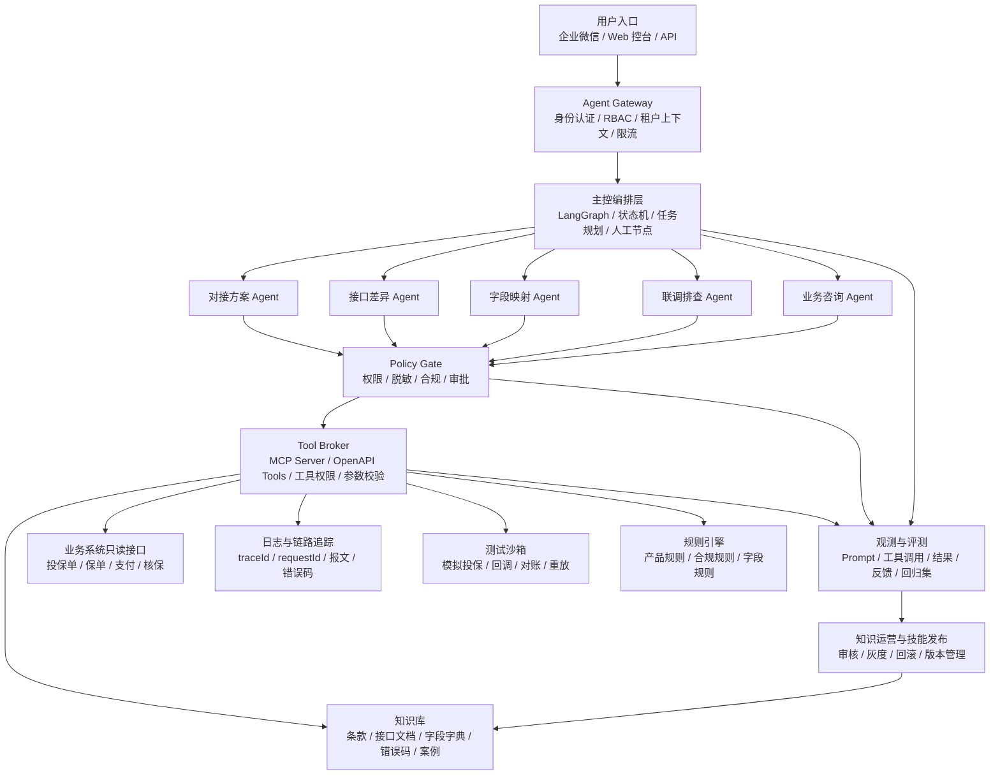
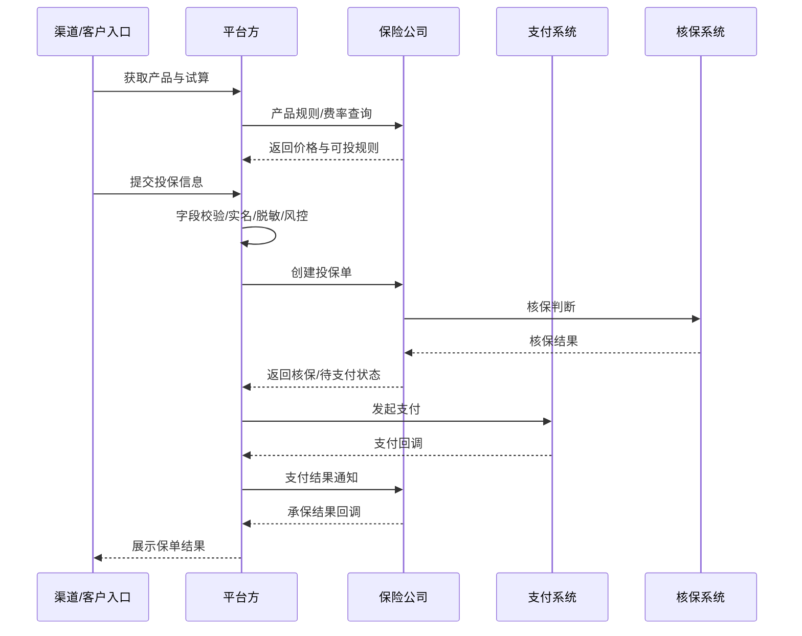

# 健康险个险业务对接 Agent 架构方案评审与优化建议

日期：2026-05-15  
评审对象：`health-insurance-agent-architecture.canvas.tsx`  
评审视角：健康险行业、企业级项目、Agent 架构设计与落地交付

---

## 1. 总体评审结论

原方案的总体方向是合理的。它没有把 Agent 简单理解为“一个聊天机器人”，而是提出了“主控 Agent + 专家 Agent + 工具执行层 + 治理闭环”的复合架构，这个方向适合健康险个险业务中的对接方案生成、联调排查、业务咨询、合规复核和知识沉淀等场景。

但是，如果按企业级项目标准审视，当前方案仍偏“概念架构展示”，距离真正落地还有明显差距。主要问题是：

1. 业务领域模型不够细，尚未把健康险个险核心对象、流程状态、接口契约、字段映射和业务规则沉淀成可执行资产。
2. Agent 角色划分方向正确，但职责边界、状态流转、权限边界、工具调用边界还不够清晰。
3. 对知识库、文档版本、产品规则、接口版本、历史案例的治理设计不足。
4. 对生产系统接入、安全合规、隐私保护、审计、评测、灰度和回滚的企业级要求描述不够具体。
5. 跨公司 Agent 协作方向有前瞻性，但在保险行业不应作为第一阶段重点，应先完成内部标准化、沙箱化和审计化。

综合判断：

| 维度 | 评价 | 成熟度 |
|---|---|---:|
| 总体架构方向 | 基本正确，适合企业级 Agent 平台雏形 | 4/5 |
| 健康险业务贴合度 | 覆盖了投保、核保、支付、承保、保全、理赔，但业务对象和规则颗粒度不足 | 3/5 |
| Agent 角色设计 | 有主控和专家分工，但需要减少“自治幻想”，强化流程编排和工具边界 | 3/5 |
| 技术选型 | LangGraph、RAG、MCP、OpenAPI、OpenTelemetry 方向合理 | 4/5 |
| 数据与知识治理 | 目前较弱，需要补充版本、来源、权限、生命周期、评测机制 | 2/5 |
| 安全合规 | 有意识，但缺少企业级数据分类、字段级权限、脱敏、审批、审计设计 | 2.5/5 |
| 可交付性 | 能作为方案页，但还不能直接指导研发排期和系统建设 | 2.5/5 |

建议将该方案升级为：

> 面向健康险个险对接场景的“受控型 Agent 工作流平台”，而不是“多个 Agent 自由协作的平台”。

核心原则是：

- Agent 负责理解、规划、检索、生成、解释和辅助决策。
- 关键业务动作由确定性工具、规则引擎、审批流和审计系统控制。
- 对生产系统默认只读，写操作必须工单授权、人工审批和二次确认。
- 所有结论必须能追溯到文档、接口、规则、日志或历史案例。

---

## 2. 原方案的合理之处

### 2.1 总体架构方向正确

原方案提出的“主控 Agent + 专家 Agent + 工具执行层 + 治理闭环”是合理的。健康险个险对接不是单轮问答场景，而是多步骤、多角色、多资料、多系统、多约束的企业流程，适合采用状态机式 Agent 编排。

对接方案生成、接口差异分析、字段映射、联调排查、合规复核，本质上都不是单次 LLM 调用能够稳定完成的任务，而应该拆成多个节点，例如：

```text
需求收集 -> 资料解析 -> 知识检索 -> 流程建模 -> 接口比对 -> 字段映射 -> 方案生成 -> 测试设计 -> 合规复核 -> 人工确认
```

因此，原方案推荐 LangGraph 作为核心编排框架是合理的。LangGraph 的优势不是“更会聊天”，而是适合把 Agent 做成有状态、可回放、可中断、可加入人工节点的工作流。

### 2.2 业务场景选择合理

原方案聚焦以下几个场景：

1. 新公司接入。
2. 对接方案生成。
3. 联调问题排查。
4. 业务咨询。
5. 跨公司 Agent 协作。
6. 技能升级。

其中最值得优先落地的是前三个：

- 对接方案生成。
- 接口和字段差异分析。
- 联调排查辅助。

这三个场景有明确输入、明确输出、明确评价标准，适合作为企业级 Agent 的第一阶段试点。

业务咨询和跨公司 Agent 协作也有价值，但建议放在后续阶段。尤其是跨公司 Agent 协作，涉及主体责任、数据边界、认证授权、网络隔离、审计取证和法律协议，不能过早作为核心落地目标。

### 2.3 专家 Agent 的方向合理

原方案中的几个 Agent 角色整体方向正确：

| 原方案 Agent | 合理性 |
|---|---|
| 主控 Agent | 需要保留，负责意图识别、任务拆分和流程调度 |
| 对接方案 Agent | 应作为第一阶段重点建设对象 |
| 对接排查 Agent | 适合第二阶段接入日志、链路追踪和沙箱重放 |
| 业务咨询 Agent | 适合做知识问答和业务口径辅助，但要严格区分内部口径和客户口径 |
| 合规安全 Agent | 必须保留，但不应只是普通专家 Agent，应变成强制执行的 Policy Gate |
| 外部协作 Agent 适配器 | 方向前瞻，但建议后置 |
| 技能学习 Agent | 有必要，但应改造成“知识运营与技能发布流程”，不能让 Agent 自动上线新技能 |

---

## 3. 原方案的主要不足

### 3.1 健康险个险业务领域模型不足

当前方案提到了投保、核保、支付、承保、保全、理赔等流程，但还没有抽象出企业级系统真正需要的“标准业务对象”。

健康险个险对接中，至少需要沉淀以下领域对象：

| 领域对象 | 说明 |
|---|---|
| 渠道 | 直销、经代、互联网平台、企业微信、第三方平台等 |
| 保险公司 | 对接主体、接口规范、签名方式、回调机制、对账机制 |
| 产品 | 产品代码、计划代码、责任、等待期、免赔额、保额、费率版本 |
| 投保单 | proposal/application，承载投保人、被保人、受益人、健康告知等信息 |
| 核保任务 | 标准体、次标体、拒保、延期、人工核保、补充材料 |
| 支付订单 | 支付状态、支付流水、回调、退款、对账 |
| 保单 | policyNo、生效日、终止日、责任状态、电子保单 |
| 回执与回调 | 承保回调、支付回调、核保回调、保全回调、理赔回调 |
| 保全 | 退保、变更、续保、批改、受益人变更等 |
| 理赔 | 报案、材料、审核、赔付、拒赔、补件 |
| 对账 | 保费、佣金、退款、保单状态一致性校验 |

如果没有这些标准对象，Agent 生成的方案容易停留在“文字说明”，难以转化为接口清单、字段映射、测试用例和系统改造任务。

### 3.2 “Agent 自治”边界不清晰

原方案中有多个专家 Agent，但没有明确哪些 Agent 只是生成建议，哪些 Agent 可以调用工具，哪些 Agent 可以接触生产数据，哪些 Agent 可以触发写操作。

企业级健康险项目中，建议把 Agent 权限分成四类：

| 权限等级 | 说明 | 示例 |
|---|---|---|
| L0 纯生成 | 不访问企业系统，只基于上传资料和知识库生成文档 | 生成初版对接方案 |
| L1 只读查询 | 可以查询经过授权的知识库、接口文档、测试日志 | 查询接口规范、历史错误码 |
| L2 沙箱执行 | 可以在沙箱环境调用接口、生成样例、重放测试数据 | 沙箱投保、沙箱支付回调模拟 |
| L3 生产辅助 | 可以读取生产日志或业务状态，但默认不能写 | 查询 traceId、保单状态、投保单状态 |
| L4 生产写操作 | 涉及变更、补偿、重放、状态修复 | 必须人工审批、工单授权、二次确认 |

目前原方案没有把这个边界说清楚。对于健康险项目，这是架构风险。

### 3.3 合规安全 Agent 的定位偏弱

原方案把“合规安全 Agent”放在专家 Agent 中，这个方向有价值，但企业级落地时不够强。

建议把合规安全能力提升为强制性的 Policy Gate，贯穿所有流程：

```text
用户输入 -> 意图识别 -> 权限检查 -> 数据脱敏 -> 工具调用审批 -> 输出合规复核 -> 审计留痕
```

也就是说，合规安全不应该只是“问它一下有没有风险”，而应该是每一次工具调用、每一次数据读取、每一次结果输出之前都必须经过的策略层。

健康险场景中会涉及医疗健康、身份证件、联系方式、金融账户、投保关系、理赔材料等敏感信息。架构中必须明确：

- 哪些字段属于敏感个人信息。
- 哪些字段可以进入模型上下文。
- 哪些字段只能脱敏后进入模型。
- 哪些字段不能进入大模型，只能由确定性工具处理。
- 哪些字段可以出现在最终交付文档中。
- 哪些输出必须经过人工审批。

### 3.4 知识库治理设计不足

原方案提到了产品条款、接口文档、错误码、案例库、监管规则，但没有说明知识库如何治理。

健康险知识库不能只是“把文档切片放进向量库”，而应该具备以下元数据：

| 元数据 | 作用 |
|---|---|
| companyCode | 区分不同保险公司 |
| channelCode | 区分不同渠道 |
| productCode / planCode | 区分产品和计划 |
| docType | 条款、接口文档、字段字典、错误码、案例、监管规则 |
| version | 区分接口版本、产品版本、条款版本 |
| effectiveDate / expiryDate | 判断规则是否生效 |
| visibility | 客户可见、内部可见、合规可见、研发可见 |
| owner | 业务负责人或系统负责人 |
| sourceSystem | 文档来源或系统来源 |
| approvalStatus | 草稿、已审核、已发布、已废弃 |
| evidenceId | 用于输出引用和审计追踪 |

如果没有这些元数据，Agent 很容易引用过期条款、错误接口版本或不适合当前渠道的规则。

### 3.5 缺少对“结构化交付物”的要求

原方案强调生成对接方案、接口清单、字段映射、测试计划，但没有明确这些交付物必须同时具备“人可读”和“机器可读”两种形态。

企业级落地时，Agent 不应该只生成 Markdown 或 Word，而应该同时输出结构化资产：

| 交付物 | 人可读形态 | 机器可读形态 |
|---|---|---|
| 对接方案 | Markdown / Word / Confluence | JSON Schema |
| 接口清单 | 表格 | OpenAPI diff / endpoint manifest |
| 字段映射 | Excel | mapping.json |
| 枚举映射 | Excel | enum_mapping.json |
| 测试计划 | 测试文档 | testcase.json / Postman Collection |
| 风险清单 | 风险表 | risk_register.json |
| 上线检查表 | Checklist | go_live_checklist.json |

只有结构化交付物进入资产库，后续排查 Agent、测试 Agent、知识更新 Agent 才能复用。

### 3.6 缺少评测体系

当前方案提到了质量评估，但没有明确怎么评估。

企业级 Agent 如果没有评测体系，很难上线。建议至少建立以下评测指标：

| 评测维度 | 指标示例 |
|---|---|
| 方案完整性 | 是否覆盖投保、核保、支付、承保、回调、保全、理赔、对账 |
| 接口识别准确率 | 接口清单召回率、接口顺序正确率 |
| 字段映射准确率 | 必填字段覆盖率、枚举映射正确率、默认值规则正确率 |
| 业务规则准确率 | 年龄、职业、社保、等待期、免赔额、责任限制是否正确 |
| 引用可追溯性 | 关键结论是否有文档、日志或规则依据 |
| 工具调用成功率 | 工具调用参数正确率、失败重试成功率 |
| 隐私合规 | 敏感字段泄露率、脱敏命中率、越权拦截率 |
| 幻觉控制 | 无依据结论比例、错误引用比例 |
| 人工采纳率 | 业务、研发、测试、合规对生成结果的采纳比例 |

### 3.7 跨公司 Agent 协作不宜过早落地

原方案中的外部协作 Agent 适配器比较有前瞻性，提到了 capability manifest、task envelope、签名验签和 schema 校验，这个方向是对的。

但在健康险行业，跨公司 Agent 协作会涉及：

- 双方主体责任。
- 客户授权范围。
- 医疗健康数据和金融数据传输边界。
- 外部 Agent 的可信度。
- 外部输出的责任归属。
- 网络区隔和安全审计。
- 异常取证和争议处理。

因此建议第一阶段不要把“跨公司 Agent 协作”作为核心功能，而是先做内部 Agent Gateway。等内部接口、工具、审计、权限和交付物标准成熟后，再考虑对外暴露有限能力。

---

## 4. 建议升级后的目标架构

建议将原方案升级为下面这种企业级架构：



这个架构相比原方案的核心变化是：

1. 增加 Agent Gateway，统一处理身份、租户、权限、限流和会话上下文。
2. 增加 Policy Gate，把合规安全从普通 Agent 提升为强制策略层。
3. 增加 Tool Broker，避免 Agent 直接调用企业核心系统。
4. 增加结构化资产库，保存方案、映射、测试用例、风险项和上线清单。
5. 增加观测与评测平台，形成上线前评测和上线后反馈闭环。
6. 将技能学习改成“知识运营与技能发布”，所有变更必须审批、灰度和回滚。

---

## 5. Agent 角色重构建议

### 5.1 推荐的 Agent 分工

建议把原方案中的 Agent 角色调整为以下结构：

| Agent | 核心职责 | 是否可调用工具 | 是否可接触生产数据 |
|---|---|---|---|
| 主控编排 Agent | 意图识别、任务拆解、节点路由、状态管理 | 可以调用编排工具 | 不直接接触业务数据 |
| 对接方案 Agent | 生成对接范围、流程方案、系统交互、里程碑 | 可以读知识库和文档解析工具 | 默认不接触生产数据 |
| 接口差异 Agent | 比对双方 OpenAPI、报文、签名、回调、幂等机制 | 可以调用 schema diff 工具 | 不需要生产数据 |
| 字段映射 Agent | 生成字段映射、枚举映射、转换规则、脱敏规则 | 可以调用字段字典和映射工具 | 不需要生产数据 |
| 测试设计 Agent | 生成联调、异常、回归、验收、上线检查用例 | 可以调用用例生成和沙箱工具 | 不需要生产数据 |
| 联调排查 Agent | 基于 traceId、requestId、投保单号定位问题 | 可以查询日志、报文、沙箱重放 | 可只读接触授权数据 |
| 业务咨询 Agent | 回答产品规则、核保规则、理赔材料、渠道流程 | 可以读知识库 | 不应直接读取生产数据 |
| Policy Gate | 权限、隐私、合规、输出口径、工具调用审批 | 强制执行 | 控制所有敏感数据流 |
| 知识运营 Agent | 发现知识缺口、生成候选知识、维护评测集 | 可以读反馈和案例 | 只能读脱敏案例 |
| 外部 Agent Gateway | 对外能力暴露、消息签名、schema 校验、回调审计 | 限定工具 | 第一阶段不建议开放生产数据 |

### 5.2 合规安全 Agent 应改为 Policy Gate

原方案把合规安全 Agent 作为一个专家 Agent，这容易导致它变成“可选审查”。企业级项目中，合规安全应该变成系统级拦截器。

建议策略如下：

| 环节 | Policy Gate 动作 |
|---|---|
| 用户提问 | 判断用户身份、角色、数据范围、业务权限 |
| 文档上传 | 判断是否包含敏感信息，自动分类和脱敏 |
| 检索知识 | 根据用户权限过滤知识范围 |
| 工具调用 | 校验工具权限、参数、环境、调用频率和审批状态 |
| 生产查询 | 强制记录理由、工单号、traceId、访问字段 |
| 结果生成 | 检查是否泄露敏感字段、是否越权、是否引用不合规口径 |
| 结果导出 | 加水印、审计编号、版本号、责任人和审批状态 |

### 5.3 技能学习 Agent 应改为受控发布流程

原方案中的“技能学习 Agent”方向正确，但命名容易让人误解为模型可以自动学习、自动上线。

建议改成：

> 知识运营与技能发布 Agent

它只能做以下事情：

1. 从历史工单、人工处理记录、联调失败案例中发现高频问题。
2. 生成候选知识、候选规则、候选工具模板。
3. 自动生成评测用例。
4. 提交给业务、研发、测试、合规进行审核。
5. 通过评测后灰度发布。
6. 监控线上效果，异常时自动回滚。

不能允许它直接修改正式知识库、正式规则库或正式工具权限。

---

## 6. 健康险个险业务落地建议

### 6.1 建立健康险个险标准流程模型

建议先沉淀一个标准流程模型，作为所有对接方案生成和接口差异分析的基线。



标准流程至少要覆盖：

- 产品查询。
- 试算。
- 投保。
- 健康告知。
- 核保。
- 支付。
- 承保。
- 回调。
- 电子保单。
- 保全。
- 理赔。
- 对账。
- 退保。
- 续保。

### 6.2 建立标准接口契约

Agent 生成对接方案时，应基于标准接口契约进行差异分析。

标准接口契约建议包含：

| 类别 | 字段或机制 |
|---|---|
| 请求标识 | requestId、traceId、idempotencyKey |
| 主体信息 | companyCode、channelCode、productCode、planCode |
| 业务标识 | proposalNo、policyNo、paymentNo、claimNo |
| 版本信息 | apiVersion、productVersion、ruleVersion、effectiveDate |
| 安全机制 | signType、signature、timestamp、nonce、tokenScope |
| 状态机制 | proposalStatus、underwritingStatus、paymentStatus、policyStatus |
| 回调机制 | callbackUrl、callbackType、retryPolicy、ackPolicy |
| 错误机制 | errorCode、errorMessage、errorCategory、retryable |
| 审计字段 | operator、sourceSystem、requestTime、responseTime |

### 6.3 字段映射要从文档产物升级为资产库

字段映射不应该只是 Excel 表，而应该进入字段映射资产库。

建议字段映射结构如下：

```json
{
  "mappingId": "MAP-20260515-001",
  "companyCode": "INS001",
  "channelCode": "CH001",
  "productCode": "MEDICAL001",
  "sourceField": "applicant.id_no",
  "targetField": "policyHolder.certNo",
  "dataType": "string",
  "required": true,
  "transformRule": "trim + uppercase",
  "enumMappingId": null,
  "defaultValue": null,
  "privacyLevel": "sensitive_personal_information",
  "maskingRule": "show_last_4",
  "evidenceId": "DOC-API-003#section-4.2",
  "owner": "integration_team",
  "approvalStatus": "approved"
}
```

这个结构化资产后续可以被测试 Agent、排查 Agent、合规 Agent 复用。

### 6.4 联调排查 Agent 应围绕 traceId 和状态机建设

健康险联调问题通常不是一句话能解决，而是链路状态不一致。

常见问题包括：

- 投保成功但核保状态未更新。
- 支付成功但承保失败。
- 保险公司已承保但我方未收到回调。
- 回调重复导致状态异常。
- requestId 重复导致幂等冲突。
- 签名失败。
- 枚举映射错误。
- 字段缺失或格式不符合保险公司要求。
- 产品版本或费率版本不一致。

因此，联调排查 Agent 的核心不应该是“解释错误码”，而应该是围绕 traceId、requestId、proposalNo、policyNo 建立链路诊断。

推荐排查流程：

```text
输入问题 -> 提取关键标识 -> 查询链路日志 -> 查询业务状态 -> 查询报文 -> 对照接口契约 -> 对照字段映射 -> 判断根因 -> 给出修复建议 -> 生成复盘案例
```

---

## 7. 数据、知识与文档治理建议

### 7.1 知识库分层

建议知识库分为五类，不要混放：

| 知识层 | 内容 | 用途 |
|---|---|---|
| L1 标准知识 | 平台标准接口、标准流程、标准字段字典 | 作为所有对接项目基线 |
| L2 公司知识 | 各保险公司的接口文档、签名规则、回调规则 | 做公司级差异分析 |
| L3 产品知识 | 产品条款、责任、费率、核保规则、理赔材料 | 支撑业务咨询和方案生成 |
| L4 项目知识 | 某次对接项目的方案、会议纪要、问题清单 | 支撑项目交付 |
| L5 案例知识 | 历史故障、联调问题、修复记录、复盘 | 支撑排查和技能沉淀 |

### 7.2 文档入库流程

建议文档入库流程如下：

```text
上传文档 -> 文档分类 -> 敏感信息扫描 -> 结构化解析 -> 章节切分 -> 元数据标注 -> 向量化 -> 关键词索引 -> 质量抽检 -> 发布
```

注意：健康险文档切片不能只按固定长度切，必须保留业务结构，例如：

- 产品名称。
- 产品代码。
- 计划代码。
- 责任名称。
- 等待期。
- 免赔额。
- 赔付比例。
- 投保年龄。
- 职业限制。
- 地区限制。
- 接口名称。
- 字段名称。
- 错误码。
- 生效版本。

### 7.3 检索策略

建议采用混合检索：

```text
元数据过滤 -> 关键词召回 -> 向量召回 -> 重排 -> 权限过滤 -> 引用生成
```

不能只依赖向量相似度。因为保险场景中的 companyCode、productCode、apiVersion、effectiveDate、errorCode、fieldName 这些精确字段非常关键。

---

## 8. 安全合规建议

### 8.1 数据分类分级

健康险 Agent 平台至少要区分以下数据等级：

| 等级 | 示例 | 处理要求 |
|---|---|---|
| 公开数据 | 公开产品介绍、公开服务流程 | 可进入普通知识库 |
| 内部数据 | 内部接口文档、内部流程、错误码 | 需要员工权限 |
| 重要业务数据 | 保单状态、投保单状态、支付状态 | 只读、审计、按项目授权 |
| 敏感个人信息 | 身份证、联系方式、医疗健康、金融账户、理赔材料 | 默认脱敏，最小必要，单独授权 |
| 高风险操作数据 | 状态修复、回调重放、退款、保单变更 | 工单审批、二次确认、全链路审计 |

### 8.2 模型上下文最小化

不是所有数据都应该进入大模型上下文。

建议采用：

| 数据类型 | 是否进入模型 | 处理方式 |
|---|---|---|
| 接口文档 | 可以 | 按权限和版本检索 |
| 字段字典 | 可以 | 可带字段说明，不带真实客户值 |
| 真实报文 | 谨慎 | 默认脱敏，只保留结构和错误字段 |
| 身份证号 | 不建议 | 使用 hash、后四位或占位符 |
| 手机号 | 不建议 | 脱敏 |
| 医疗材料 | 高度谨慎 | 优先由规则工具处理，必要时人工审批 |
| 支付账号 | 不应进入 | 只由确定性工具处理 |
| 密钥和 token | 禁止进入 | 由密钥系统管理 |

### 8.3 防止提示词注入和工具滥用

保险公司接口文档、第三方文档、历史工单都可能包含不可信文本。Agent 在解析这些资料时，必须防范提示词注入。

建议：

1. 文档内容只作为数据，不作为系统指令。
2. 工具调用必须由 Tool Broker 校验参数和权限。
3. Agent 不能根据文档中的自然语言指令绕过系统策略。
4. 生产工具必须默认只读。
5. 所有高风险工具调用都需要审批状态。
6. 模型输出不能直接拼接执行 SQL、脚本或生产 API。

---

## 9. 技术选型建议

### 9.1 编排框架

建议保留 LangGraph 作为核心编排框架。理由是对接方案生成和联调排查都属于长链路、多节点、有状态、可中断、需要人工确认的流程。

但需要注意：

- LangGraph 负责 Agent 状态流转，不负责企业权限治理。
- 企业权限、审计、脱敏、限流、工具授权应由外部服务完成。
- 图节点要尽量小而清晰，不要把大段复杂逻辑塞进一个 Agent 节点。

### 9.2 工具协议

MCP 和 OpenAPI Tools 可以保留，但建议加一层企业 Tool Broker。

推荐结构：

```text
Agent -> Tool Broker -> MCP Server / OpenAPI Adapter -> 企业系统
```

Tool Broker 负责：

- 工具注册。
- 工具权限。
- 参数校验。
- 环境隔离。
- 限流熔断。
- 审计记录。
- 敏感字段脱敏。
- 高风险工具审批。

不要让 Agent 直接访问核心系统 API。

### 9.3 RAG 与知识库

建议采用：

- Elasticsearch / OpenSearch：关键词检索、错误码、字段名、接口名检索。
- Milvus / pgvector / 向量数据库：语义检索。
- Reranker：提高相关性。
- 元数据过滤：公司、产品、渠道、版本、生效日期。
- 引用链：每个关键结论都要带 evidenceId。

### 9.4 企业服务层

如果企业核心系统以 Java 为主，建议：

| 模块 | 技术建议 |
|---|---|
| Agent 编排服务 | Python + LangGraph |
| 企业网关、权限、审计、工具代理 | Spring Boot |
| 文档解析服务 | Python |
| 规则服务 | Java / Drools / 自研规则引擎 |
| 异步任务 | Kafka / RocketMQ / Celery，根据企业现有栈选择 |
| 结构化资产库 | PostgreSQL / MySQL |
| 日志与追踪 | OpenTelemetry + 日志平台 |
| 向量检索 | Milvus / pgvector / Elasticsearch 向量检索能力 |

---

## 10. 观测、审计与评测体系

### 10.1 观测对象

Agent 平台必须记录以下内容：

| 类型 | 内容 |
|---|---|
| 会话日志 | 用户、时间、角色、项目、意图 |
| 编排轨迹 | 经过哪些节点、每个节点输入输出摘要 |
| 检索轨迹 | 命中文档、版本、片段、相关性分数 |
| 工具调用 | 工具名、参数摘要、环境、耗时、结果状态 |
| 策略拦截 | 拦截原因、敏感字段、审批状态 |
| 生成结果 | 版本、引用依据、人工修改痕迹 |
| 用户反馈 | 采纳、修改、驳回、原因 |

### 10.2 离线评测集

建议按业务场景建设评测集：

| 评测集 | 样例 |
|---|---|
| 对接方案评测集 | 给定产品条款和接口文档，判断方案是否完整 |
| 接口差异评测集 | 给定双方接口，判断差异识别是否准确 |
| 字段映射评测集 | 给定字段字典，判断 mapping 是否正确 |
| 错误码排查评测集 | 给定 traceId 和日志片段，判断根因是否正确 |
| 合规评测集 | 给定敏感场景，判断是否脱敏和拦截 |
| 口径评测集 | 判断内部口径和客户口径是否混用 |

### 10.3 上线门槛

建议设定上线门槛，例如：

| 指标 | 建议阈值 |
|---|---:|
| 关键字段映射准确率 | ≥ 95% |
| 关键接口召回率 | ≥ 95% |
| 高风险敏感字段泄露率 | 0 |
| 无依据关键结论比例 | ≤ 3% |
| 工具越权调用成功率 | 0 |
| 人工评审通过率 | ≥ 90% |
| 线上问题可追溯率 | ≥ 99% |

---

## 11. 分阶段落地路线

### 阶段 0：业务资产标准化

目标：先建立 Agent 可用的业务资产，而不是直接开发多个 Agent。

交付物：

1. 健康险个险标准流程模型。
2. 标准接口清单。
3. 标准字段字典。
4. 标准错误码体系。
5. 产品规则元数据模型。
6. 对接方案模板。
7. 字段映射模板。
8. 联调用例模板。
9. 数据分类分级规则。
10. Agent 评测样本集。

### 阶段 1：对接方案 Agent

目标：先做离线方案生成，不接生产系统。

能力范围：

- 上传接口文档、产品条款、字段字典。
- 自动解析并生成结构化摘要。
- 生成接口差异分析。
- 生成字段映射草案。
- 生成对接方案。
- 生成联调用例。
- 合规检查。
- 人工确认后导出 Markdown / Word / Excel / JSON。

阶段价值：低风险、高价值、容易评估。

### 阶段 2：沙箱联调与排查 Agent

目标：让 Agent 接入测试环境和日志系统。

能力范围：

- 查询测试环境 traceId。
- 查询请求报文和响应报文。
- 识别错误码。
- 对照接口契约和字段映射。
- 生成根因分析。
- 生成修复建议。
- 沉淀联调案例。

### 阶段 3：生产只读辅助

目标：服务真实项目，但控制生产风险。

能力范围：

- 只读查询生产日志。
- 只读查询投保单、保单、支付、核保状态。
- 自动脱敏。
- 强审计。
- 高风险问题转人工。

明确禁止：

- 自动重放生产回调。
- 自动修改保单状态。
- 自动退款。
- 自动变更客户信息。

### 阶段 4：受控写操作和外部协作

目标：在权限、审批、审计成熟后，再开放更高阶能力。

能力范围：

- 工单驱动的状态修复建议。
- 审批后的沙箱或生产补偿操作。
- 与外部保险公司 Agent 的有限任务协作。
- 对外暴露只读或沙箱能力。

---

## 12. 对原方案的具体修改建议

### 12.1 架构层级修改

原方案已有五层：入口层、编排层、业务能力层、工具与知识层、治理层。建议调整为七层：

| 新层级 | 说明 |
|---|---|
| 入口层 | 企业微信、Web 控台、API、工单系统 |
| Agent Gateway 层 | 认证、授权、租户、项目上下文、限流、会话管理 |
| 编排层 | LangGraph 状态机、任务拆解、人工节点、异常恢复 |
| 业务 Agent 层 | 方案、接口、字段、测试、排查、咨询 |
| Policy Gate 层 | 合规、安全、隐私、权限、审批、输出口径 |
| Tool Broker 层 | MCP、OpenAPI、日志、沙箱、业务系统适配 |
| 资产与治理层 | 知识库、结构化资产库、评测平台、审计平台、技能发布 |

### 12.2 Agent 列表修改

建议把原方案中的 Agent 修改为：

| 原名称 | 建议调整 |
|---|---|
| 主控 Agent | 保留，但强调它是编排器，不是最终业务裁决者 |
| 对接方案 Agent | 保留，并作为第一阶段核心 |
| 对接排查 Agent | 保留，但限定从沙箱和只读日志开始 |
| 业务咨询 Agent | 保留，但必须区分内部、渠道、客户三类口径 |
| 合规安全 Agent | 升级为 Policy Gate，不再只是专家 Agent |
| 外部协作 Agent 适配器 | 后置为第四阶段能力 |
| 技能学习 Agent | 改名为知识运营与技能发布 Agent |
| 新增接口差异 Agent | 专门负责 OpenAPI、报文、签名、回调、幂等差异 |
| 新增字段映射 Agent | 专门负责字段、枚举、默认值、脱敏规则 |
| 新增测试设计 Agent | 专门生成联调用例、异常用例、验收清单 |

### 12.3 增加结构化资产库

建议在原方案中增加“对接资产库”，用于保存：

- 对接项目。
- 公司资料。
- 产品资料。
- 接口版本。
- 字段映射。
- 枚举映射。
- 测试用例。
- 风险清单。
- 上线检查表。
- 历史问题。
- 复盘案例。

这会让 Agent 从“一次性生成文档”升级为“持续积累企业能力”。

---

## 13. 最终建议版本的一句话定位

建议将项目定位为：

> 面向健康险个险业务对接的企业级受控 Agent 平台。以 LangGraph 进行状态化编排，以健康险标准业务模型和对接资产库为核心，以 MCP/OpenAPI Tool Broker 连接企业工具，以 Policy Gate 保障隐私、合规、权限和审计，优先落地对接方案生成、接口差异分析、字段映射和联调排查，再逐步扩展到生产只读辅助和跨公司 Agent 协作。

---

## 14. 参考依据

1. LangGraph 官方文档：强调 durable execution、human-in-the-loop、persistence、streaming 等适合企业 Agent 编排的能力。  
   https://docs.langchain.com/oss/python/langgraph/overview

2. Model Context Protocol 官方规范：MCP 将工具、资源、提示词等能力标准化，适合做 Agent 工具接入协议，但企业权限和审计仍需额外治理。  
   https://modelcontextprotocol.io/specification/2025-11-25

3. Google Agent2Agent Protocol：A2A 提供 Agent Card、能力发现、任务委托等跨 Agent 协作思路，但在保险行业应结合企业网关、安全审计和数据边界谨慎落地。  
   https://developers.googleblog.com/en/a2a-a-new-era-of-agent-interoperability/

4. OpenTelemetry GenAI Semantic Conventions：可用于记录大模型调用、工具调用、token、事件和链路观测。  
   https://opentelemetry.io/docs/specs/semconv/gen-ai/

5. 《中华人民共和国个人信息保护法》：医疗健康、金融账户等属于敏感个人信息，处理时需要特定目的、充分必要性和严格保护措施。  
   https://www.cac.gov.cn/2021-08/20/c_1631050028355286.htm

6. 《银行保险机构数据安全管理办法》：强调银行保险机构数据处理、数据安全治理、分类分级、个人信息保护和风险监测处置。  
   https://www.nfra.gov.cn/cn/view/pages/governmentDetail.html?docId=1192311&generaltype=1&itemId=861

7. OWASP Top 10 for LLM Applications：提示词注入、敏感信息泄露、不安全插件设计等风险对企业 Agent 平台具有直接参考价值。  
   https://owasp.org/www-project-top-10-for-large-language-model-applications/
